OpenCV是一个基于BSD许可（开源）发行的跨平台计算机视觉库，可以运行在Linux、Windows、Android和Mac OS操作系统上。它轻量级而且高效——由一系列 C 函数和少量 C++ 类构成，同时提供了Python、Ruby、MATLAB等语言的接口，实现了图像处理和计算机视觉方面的很多通用算法。

本文将使用python3.6，通过调用OpenCV库来实现图像处理几个方面的功能。

<!-- more -->

# 前期工作

## python3安装

浏览官方网站（ https://www.python.org/downloads/ ）选择合适版本下载。

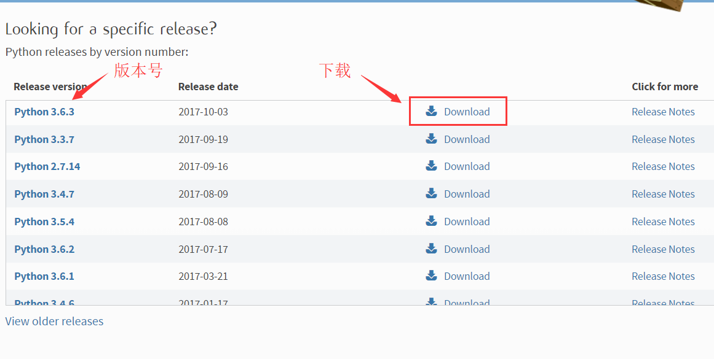

下载完成后运行安装即可。

## OpenCV安装

1. 浏览python扩展库站（ https://www.lfd.uci.edu/~gohlke/pythonlibs/ ）选择合适版本。

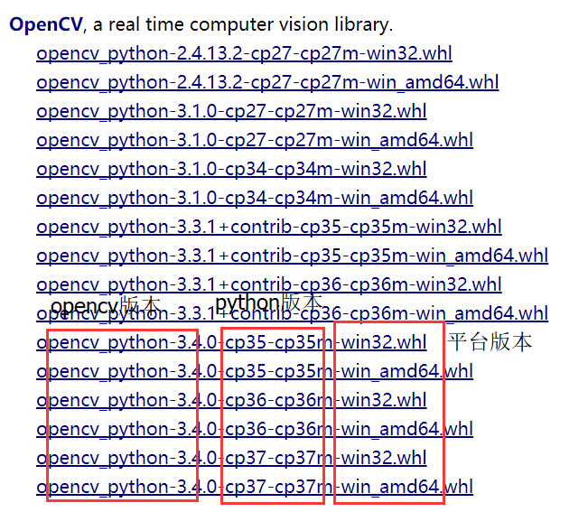

2. 使用__cmd__进入下载好的文件的目录，使用__pip__指令安装：

``` python
pip install opencv_python‑3.4.0‑cp36‑cp36m‑win_amd64.whl
```

在__cmd__中进入python并加载opencv模块验证是否安装成功：

``` python
import cv2
print(cv2.__version__)
```

如下图屏幕输出版本号即说明安装成功。

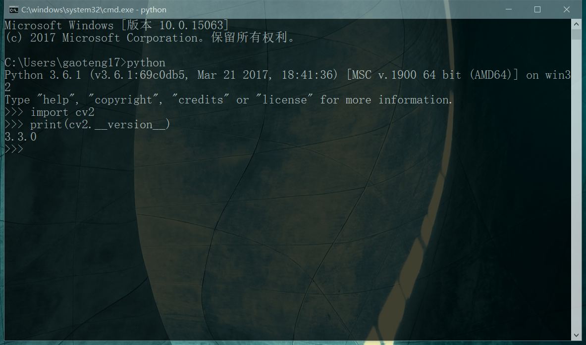

# 原理与实现

## 图像去噪

### 原理

图像去噪主要是由图像平滑（图像模糊）算法来实现的。图像平滑要使用滤波器，图像的滤波可以看成是滤波模板与原始图像对应部分的的卷积运算。

在图像处理中，常见的滤波器包括：

1. 归一化滤波器（Homogeneous blur）

  也是均值滤波器，用输出像素点核窗口内的像素均值代替输出点像素值。

2. 高斯滤波器（Guassian blur）

  是实际中最常用的滤波器，高斯滤波是将输入数组的每一个像素点与高斯内核卷积将卷积和当作输出像素值。高斯核相当于对输出像素的邻域赋予不同的权值，输出像素点所在位置的权值最大（对应高斯函数的均值位置）。

3. 中值滤波器（median blur）

  中值滤波将图像的每个像素用邻域(以当前像素为中心的正方形区域)像素的中值代替。对椒盐噪声最有效的滤波器，去除跳变点非常有效。

4. 双边滤波器（Bilatrial blur）

  为避免滤波器平滑图像去噪的同时使边缘也模糊，这种情况下使用双边滤波器。

这里选择高斯滤波器来实现图像去噪，其它使用方法大致相同。

### 实现

定义图像匹配子函数，提供标准接口，源码及注释如下：

``` python
def img_filt(InputFile,OutputFile,OutputFile2): 
       #接口参数：(输入原图片，输出加噪声图片，输出已去噪图片)
    img = cv2.imread(InputFile,0) #直接读为灰度图像
    for i in range(2000): #添加2000个点噪声
        temp_x = np.random.randint(0,img.shape[0]) #x方向随机坐标
        temp_y = np.random.randint(0,img.shape[1]) #y方向随机坐标
        img[temp_x][temp_y] = 255 #随机点噪声
    blur = cv2.GaussianBlur(img,(5,5),0) #高斯滤波
    cv2.imwrite(OutputFile,img) #输出加噪声图片
    cv2.imwrite(OutputFile2,blur) #输出已去噪图片
```

### 结果

加噪图及滤波图如下所示：

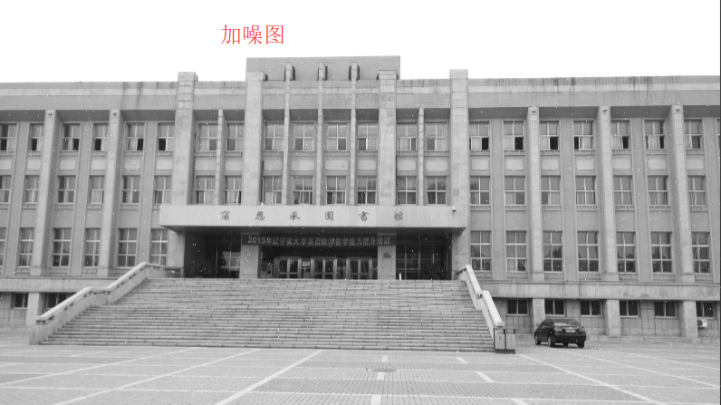

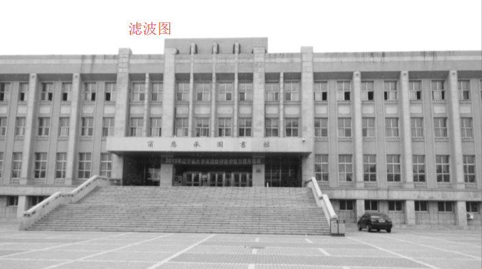

## 图像匹配

### 原理

模板匹配是在图像中寻找和识别模板的一种简单的方法。

通过调用cv2库及numpy库函数，加载原始图像和要搜索的图像模板。OpenCV对原始图像进行处理，创建一个灰度版本，在灰度图像里进行处理和查找匹配。然后使用相同的坐标在原始图像中进行还原并输出。

### 实现

定义图像匹配子函数，提供标准接口，源码及注释如下：

``` python
def img_match(InputFile,InputFile2,OutputFile): 
       #接口参数：(输入原图片，待匹配模板，输出已匹配图片)
    img_rgb = cv2.imread(InputFile) #读原图
    img_gray = cv2.cvtColor(img_rgb, cv2.COLOR_BGR2GRAY) #灰度化处理
    template = cv2.imread(InputFile2,0) #读模板
    w, h = template.shape[::-1] #读模板高度宽度
    res = cv2.matchTemplate(img_gray,template,cv2.TM_CCOEFF_NORMED) #匹配
    threshold = 0.7 #设定匹配阈值
    loc = np.where( res >= threshold) #找标记位置
    color = (0,0,255)       # 设定标记框颜色
    strokeWeight = 1        # 设定标记框粗细
    for pt in zip(*loc[::-1]):
        cv2.rectangle(img_rgb, pt, (pt[0] + w, pt[1] + h), color, strokeWeight)   #在原图中标记
    cv2.imwrite(OutputFile, img_rgb) #输出已匹配图片
```

### 结果

原图、模板图及匹配图如下所示：

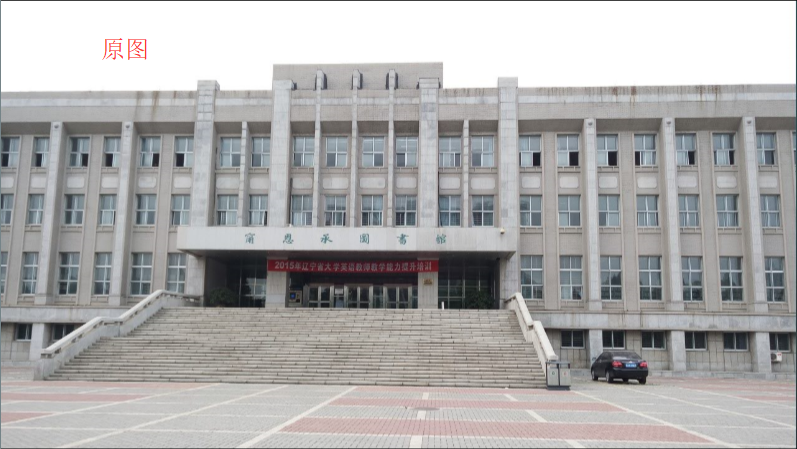


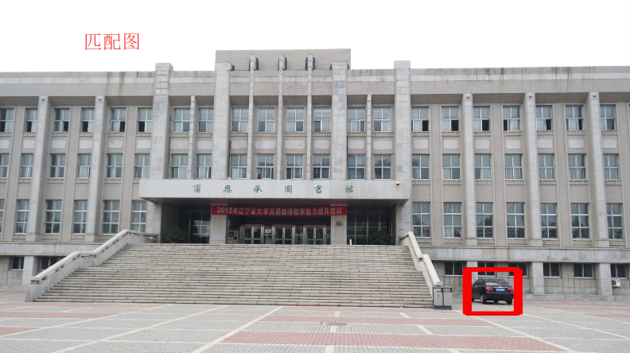

## 图像压缩

### 原理

Opencv中直接用cv2.imwrite()即可保存图像。其中，imwrite()有个可选的第三个参数。

对于JPEG，第三个参数__cv2.IMWRITE_JPEG_QUALITY__表示的是图像的质量，用0-100的整数表示，默认为95。 

对于PNG，第三个参数__cv2.IMWRITE_PNG_COMPRESSION__表示的是压缩级别。从0到9，压缩级别越高，图像尺寸越小。默认级别为3。

需注意的是，第三个参数类型为Long，必须转换成int。

可以通过调整这个可选参数来实现图像的压缩。

### 实现

定义图像匹配子函数，提供标准接口，源码及注释如下：

``` python
def img_zip(InputFile, OutputFile): 
    #接口参数：(输入原图片(jpg版)，输出已压缩图片)
    image = cv2.imread(InputFile) #读原图
    rows, cols, channels = image.shape #读原图尺寸
    res = cv2.resize(image, (cols, rows), interpolation=cv2.INTER_AREA)
    #使用象素关系重采样。当图像缩小时候，该方法可以避免波纹出现
    cv2.imwrite(OutputFile, res,  [int(cv2.IMWRITE_JPEG_QUALITY), 50])
    #输出已压缩图片，调整质量参数为50
```

### 结果

原图、压缩图及文件大小属性图如下所示：


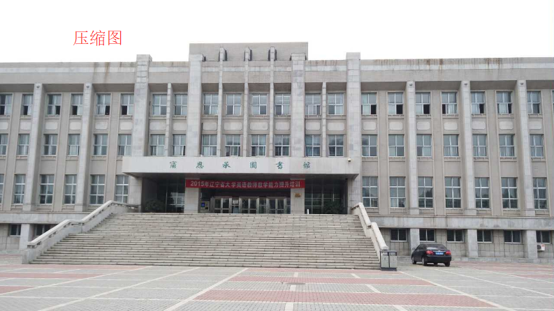

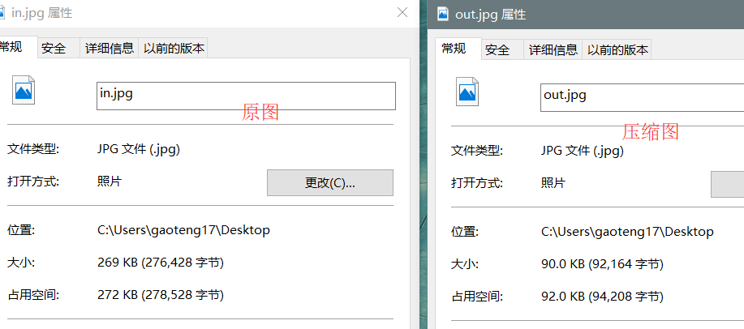

## 边缘检测

### 原理

边缘检测一般由以下三个步骤组成：

1. 滤波：边缘检测的算法主要是基于图像强度的一阶和二阶导数，但导数通常对噪声很敏感，因此必须采用滤波器来改善与噪声有关的边缘检测器的性能。常见的滤波方法主要有高斯滤波等(见3.1)。

2. 增强：增强边缘的基础是确定图像各点邻域强度的变化值。增强算法可以将图像灰度点邻域强度值有显著变化的点凸显出来。在具体编程实现时，可通过计算梯度幅值来确定。

3. 检测：经过增强的图像，往往邻域中有很多点的梯度值比较大，而在特定的应用中，这些点并不是我们要找的边缘点，所以应该采用某种方法来对这些点进行取舍。实际工程中，常用的方法是通过阈值化方法来检测。

Opencv中提供了几种不同的算子来实现边缘检测算法，这里选择了效果最佳的Canny算子来实现图像分割。

Canny 边缘检测的步骤主要有以下几步：

1. 消除噪声。 一般情况下，使用高斯平滑滤波器卷积降噪。
2. 计算梯度幅值和方向。 此处，一般按照Sobel滤波器的步骤。
3. 非极大值抑制。 这一步排除非边缘像素， 仅仅保留了一些细线条(候选边缘)。
4. 滞后阈值。最后一步，Canny 使用了滞后阈值，滞后阈值需要两个阈值(高阈值作为边缘，低阈值排除，中间阈值连接边缘)。

### 实现

定义边缘检测子函数，提供标准接口，源码及注释如下：

``` python
def img_edgedetection(InputFile, OutputFile):
           #接口参数：(输入原图片，输出边缘图片)
    image = cv2.imread(InputFile) #读原图
    gray = cv2.cvtColor(image, cv2.COLOR_BGR2GRAY) #灰度化
    canny = cv2.Canny(gray, 30, 150) #30和150分别是高低阈值
    cv2.imwrite(OutputFile,canny) #输出边缘图片
```

### 结果

原图及边缘检测图如下所示：


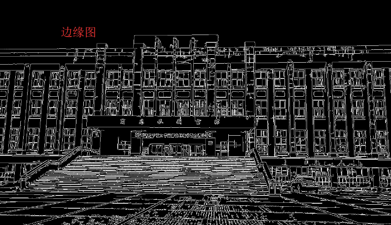

## 图像分割

### 原理

OpenCV中提供了分水岭算法来实现图像的分割。

分水岭算法的原理就是任意的灰度图像可以被看做是地质学表面，高亮度的地方是山峰，低亮度的地方是山谷。给每个孤立的山谷（局部最小值）不同颜色的水（标签），当水涨起来，根据周围的山峰（梯度），不同的山谷也就是不同的颜色会开始合并，要避免这个，可以在水要合并的地方建立障碍，直到所有山峰都被淹没。而这些创建的障碍就是分割结果。

利用OpenCV中的相关函数，我们对图片进行二值化处理，并使用形态学开运算去掉小的白色噪点，用形态学闭运算去除小的洞，腐蚀法去掉边缘的像素，对结果进行膨胀，把目标边缘扩展到背景，剩下的区域利用分水岭算法，以实现图像分割。

### 实现

定义图像分割子函数，提供标准接口，源码及注释如下：

``` python
def img_segmentation(InputFile, OutputFile):
           #接口参数：(输入原图片，输出边缘图片)
    img = cv2.imread(InputFile) #读原图
    gray = cv2.cvtColor(img,cv2.COLOR_BGR2GRAY) #灰度化
    ret, thresh = cv2.threshold(gray,0,255,cv2.THRESH_BINARY_INV+cv2.THRESH_OTSU) #二值化
    
    kernel = np.ones((3,3),np.uint8)
    opening = cv2.morphologyEx(thresh,cv2.MORPH_OPEN,kernel, iterations = 2) #去噪
    
    sure_bg = cv2.dilate(opening,kernel,iterations=3) #背景区域

    dist_transform = cv2.distanceTransform(opening,cv2.DIST_L2,5)
    ret, sure_fg = cv2.threshold(dist_transform,0.7*dist_transform.max(),255,0) #找前景区域

    sure_fg = np.uint8(sure_fg)
    unknown = cv2.subtract(sure_bg,sure_fg) #找未知区域

    ret, markers = cv2.connectedComponents(sure_fg) #标记

    markers = markers+1 #保证确定的背景区不是0是1

    markers[unknown==255]=0 #未知区域标0

    markers = cv2.watershed(img,markers)
    img[markers == -1] = [255,0,0] #分割框颜色

    cv2.imwrite(OutputFile, img) #输出已分割图片
```

### 结果

图片分割部分选择边缘较明显图片，原图及分割图如下所示：


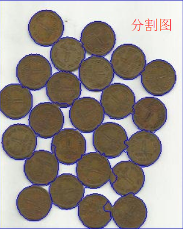

# 总结

OpenCV在图像处理方面功能强大，还有许多技术有待学习。

本文中所有的源码及测试图片均已上传至我的github项目页中，如有需要请访问https://github.com/gaoteng17/ImageProcessing 。

# _参考资料_

1. OpenCV - Wikipedia. https://en.wikipedia.org/wiki/OpenCV
2. OpenCV - API Reference. https://docs.opencv.org/2.4/index.html
3. QianMo - github. https://github.com/QianMo/OpenCV3-Intro-Book-Src
4. jungrea - github. https://github.com/jungrea
5. xxxss - jianshu. https://www.jianshu.com/u/c01fd7356e58 

