Caffe全称是Convolutional Architecture for Fast Feature Embedding（卷积神经网络框架），是一个清晰、高效的深度学习框架。它是开源的，核心语言是C++，支持命令行、Python和Matlab接口，既可以在CPU上运行也可以在GPU上运行。

本文实现在Ubuntu16.04下深度学习框架caffe + cuda8.0 + cudnn5.1 + opencv3.2.0的搭建，并对搭建过程中的诸多问题进行总结。

<!-- more -->


# 1 安装nvidia驱动

**首先注意：UEFI引导的电脑要在BIOS中关闭Secure boot，以避免安装驱动中各种神奇的问题。**

这里介绍两种安装n卡驱动的方式，runfile方式及apt方式。

**据说**如果n卡驱动选择了apt-get方式安装，在后面的cuda模块安装时会有大坑，所以建议使用runfile方式进行安装，如果实在有问题（比如我的情况），再尝试后者。

## 1.1 runfile方式

### 禁用集成的nouveau驱动

Ubuntu系统集成的显卡驱动程序是nouveau，它是第三方为NVIDIA开发的开源驱动，我们通过将其添加至黑名单的方法对其屏蔽禁用。

利用命令创建`blacklist-nouveau.conf`

```bash
sudo apt-get install vim
sudo vim /etc/modprobe.d/blacklist-nouveau.conf
```

输入`i`切换到insert模式，添加如下内容：

```bash
blacklist nouveau
options nouveau modeset=0
```

输入`Esc`退出insert模式，再输入`:wq`保存退出。

更新文件

```bash
sudo update-initramfs -u
```

重启系统，确认nouveau已被屏蔽

```bash
lsmod | grep nouveau
```

终端没有输出即已屏蔽nouveau。

### 下载官方驱动程序

首先去官网上查找适合你GPU的驱动(https://www.geforce.cn/drivers)。

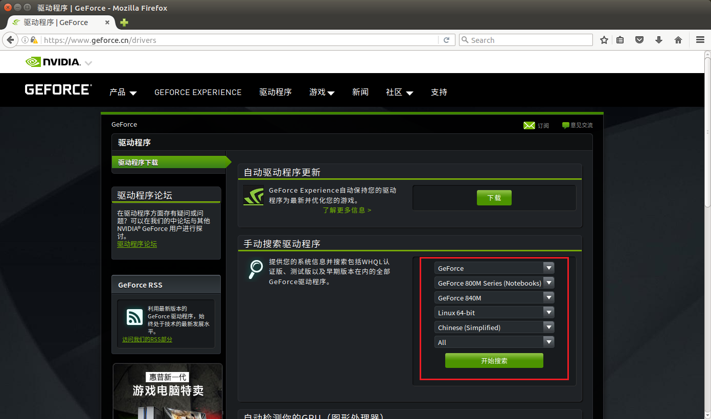

在这个页面输入自己的显卡型号可以搜到历史版本的驱动，由于后面要装的cuda8.0适配的驱动型号是375.26,所以我们找到375.26版本的进行下载。

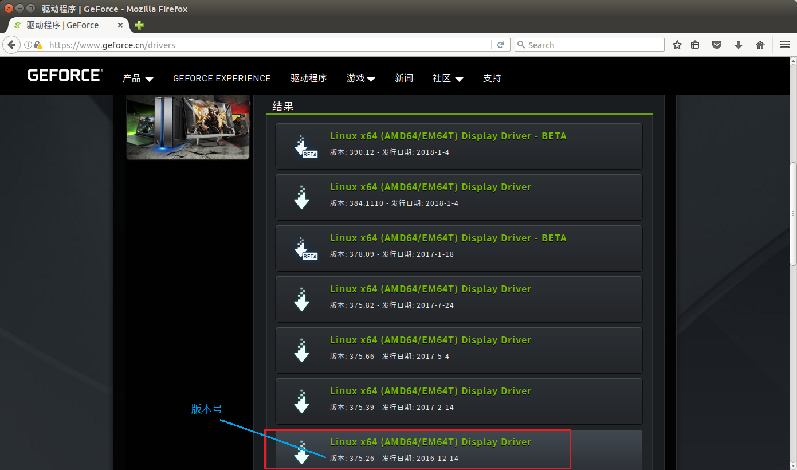

下载得到`NVIDIA-Linux-x86_64-375.26.run`文件。

可以将其移动到你想保存的地方，默认保存位置是`/home/XXXX/Downloads`。

### 安装驱动

按Ctrl + Alt + F1切换到tty1，登录。接下来的安装都在这里进行。

关闭图形界面X-window

```bash
sudo service lightdm stop
```

删除残留NVIDIA驱动文件

```bash
sudo apt-get remove --purge nvidia-*
```

切换到程序目录下并修改权限

```bash
cd /home/XXXX/Downloads #这里切换到你的驱动程序的目录
#记不清目录文件名可以用ls显示当前目录下所有文件，Tab可以补全名字
sudo chmod 777 NVIDIA-Linux-x86_64-375.26.run #修改可执行权限
```

安装，**注意后面的参数**

```bash
sudo sh ./NVIDIA-Linux-x86_64-375.26.run –no-opengl-files 
#只装驱动不装opengl，否则可能会无法进去桌面循环登录
```

安装过程除了开头协议需要选择`accept`，其它按照默认选项即可。

### 测试是否成功

安装完成后重启系统

```bash
reboot
```

验证是否安装成功

```bash
nvidia-smi #出现GPU驱动列表信息即成功
```

也可以查看图形界面信息

```bash
nvidia-settings 
```

UEFI引导系统如果没关secure boot这里可能无法正常显示（但我在Ubuntu17.04下测试显示是正常的），而且会导致后面cuda安装出问题，这里注意一下。

## 1.2 apt-get方式

这个方式似乎只能安装到最新的驱动，我这里即使选择了旧版的也安装上了最新的。

禁用集成的nouveau驱动（同上）

添加三方ppa源，更新

```bash
sudo add-apt-repository ppa:graphics-drivers/ppa
sudo apt-get update
```

新安装的ubuntu16.04在进行 `sudo apt-get update` 时可能会出现下面的错误：

```bash
Reading package lists... Done
E: Problem executing scripts APT::Update::Post-Invoke-Success
'if /usr/bin/test -w /var/cache/app-info -a -e /usr/bin/appstreamcli;
 then appstreamcli refresh > /dev/null;
 fi'
E: Sub-process returned an error code
```

解决方案：

```bash
sudo pkill -KILL appstreamcli
wget -P /tmp https://launchpad.net/ubuntu/+archive/primary/+files/appstream_0.9.4-1ubuntu1_amd64.deb https://launchpad.net/ubuntu/+archive/primary/+files/libappstream3_0.9.4-1ubuntu1_amd64.deb
sudo dpkg -i /tmp/appstream_0.9.4-1ubuntu1_amd64.deb /tmp/libappstream3_0.9.4-1ubuntu1_amd64.deb
```


查找驱动版本并安装

```bash
sudo apt-cache search nvidia-* #可以看到各个驱动版本
sudo apt-get install nvidia-375 #选择安装375版本，但我这里最后还是装上了最新的
```

测试是否成功

```bash
nvidia-smi #出现GPU驱动列表信息即成功
```

也可以查看图形界面信息

```bash
nvidia-settings 
```

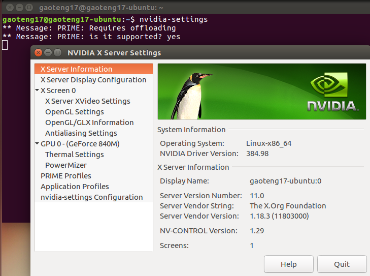

总结：使用较新的n卡驱动是可以安装cuda的，但是在测试cuda的samples时会发现，许多sample会由于nvidia显卡驱动版本的问题出现各种错误，这种情况需要自己改写这些文件的相关源码，这无疑是个艰难的工程。所以，应尽量保证驱动的版本与cuda相一致。


# 2 安装CUDA

cuda是nvidia的编程语言平台，想使用GPU就必须要使用cuda。

虽然cuda9.X已经发布，但很多类库还不支持，而且最关键的是caffe要求的cuda版本是8.0，所以这里安装的是cuda8.0。

到官网下载cuda8.0（https://developer.nvidia.com/cuda-80-ga2-download-archive ）。

按照自己的平台选择`runfile(local)`格式。

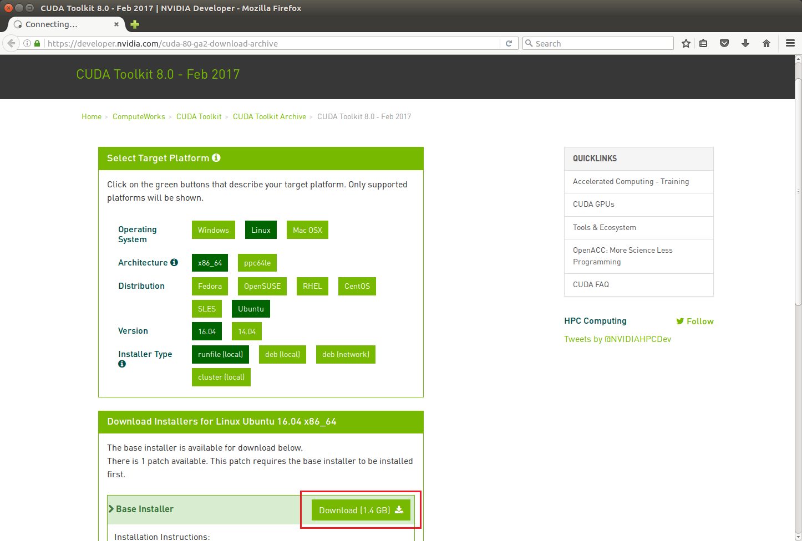

下载得到`cuda_8.0.61_375.26_linux.run`。

终端切换到该目录下，执行如下语句安装

```bash
sudo chmod 777 cuda_8.0.61_375.26_linux.run #修改执行权限
sudo sh ./cuda_8.0.61_375.26_linux.run
```

执行后会有一系列提示让你确认，注意，有个让你选择是否安装nvidia375驱动时，一定要选择否，因为这个驱动是会安装opengl的，有可能会导致无法进入桌面循环登录。

**据说**这里也可以用`-no-opengl-files`命令避免该问题，但我不知道这命令该用到哪，所以并没有尝试。

其余的选项都直接默认或者选择是即可（我这里只把samples的目录改成了cuda的默认安装位置，不建议修改cuda默认安装位置，以免给自己挖坑）。

安装成功后终端会输出如下信息：

```bash
===========
= Summary =
===========
Driver: Not Selected
Toolkit: Installed in /usr/local/cuda-8.0 #cuda安装目录
Samples: Installed in /usr/local/cuda-8.0 #sample目录，我改到了cuda安装目录
Please make sure that
– PATH includes /usr/local/cuda-8.0/bin
– LD_LIBRARY_PATH includes /usr/local/cuda-8.0/lib64, or, add /usr/local/cuda-8.0/lib64 to /etc/ld.so.conf and run ldconfig as root
To uninstall the CUDA Toolkit, run the uninstall script in /usr/local/cuda-8.0/bin
Please see CUDA_Installation_Guide_Linux.pdf in /usr/local/cuda-8.0/doc/pdf for detailed information on setting up CUDA.
***WARNING: Incomplete installation! This installation did not install the CUDA Driver. A driver of version at least 361.00 is required for CUDA 8.0 functionality to work.
To install the driver using this installer, run the following command, replacing with the name of this run file:
sudo .run -silent -driver
Logfile is /opt/temp//cuda_install_****.log
```

安装完毕后，再声明一下环境变量，并将其写入到 ~/.bashrc 的尾部:

```bash
sudo vim  ~/.bashrc #编辑
#以下两行写到~/.bashrc尾部
export PATH=/usr/local/cuda-8.0/bin${PATH:+:${PATH}}
export LD_LIBRARY_PATH=/usr/local/cuda-8.0/lib64${LD_LIBRARY_PATH:+:${LD_LIBRARY_PATH}}
#保存退出 :wq
source ~/.bashrc #更新
```

然后设置环境变量和动态链接库：

```bash
sudo vim /etc/profile
export PATH=/usr/local/cuda/bin:$PATH
#保存退出 :wq
sudo vim /etc/ld.so.conf.d/cuda.conf
/usr/local/cuda/lib64 
#保存退出 :wq
sudo ldconfig #更新
```

测试cuda的samples

```bash
cd /usr/local/cuda-8.0/samples/1_Utilities/deviceQuery #注意自己的samples目录装在了哪
make

#切换到终端提示的生成目录

sudo ./deviceQuery
```

如果显示的是如下图的一些关于GPU的信息，则说明安装成功了。

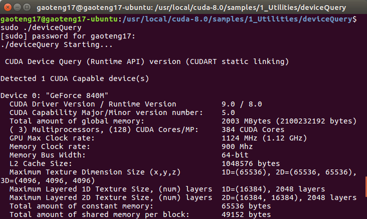


# 3 使用cudnn

cuDNN（CUDA Deep Neural Network）相比标准的cuda，它在一些常用的神经网络操作上进行了性能的优化，比如卷积，pooling，归一化，以及激活层等等。 

cudnn目前（2018.1）已更新到了v7.0.5，针对cuda8.0有v5.1和v6.0两个版本可选，这里选择v5.1版本下载。

首先去官网（https://developer.nvidia.com/rdp/cudnn-download ）下载cudnn，下载的时候需要注册账号，做一个问卷调查。

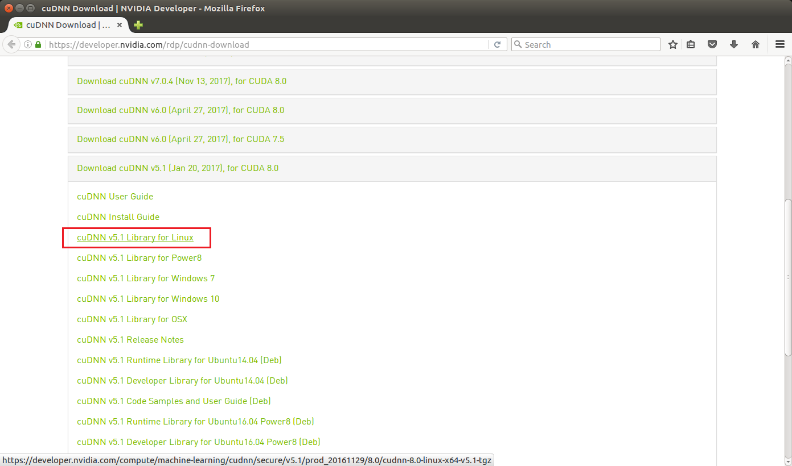

下载完cudnn5.1之后进行解压，cd进入该目录，复制文件：

```bash
cd cuda/ #进入该解压目录
sudo cp include/cudnn.h /usr/local/cuda/include/    #复制头文件
sudo cp lib64/lib* /usr/local/cuda/lib64/    #复制动态链接库
```

重新生成软链接

```bash
cd /usr/local/cuda/lib64/
```

这里可以先`ls`看一下自己的`libcudnn.so.*.*.*`具体版本号

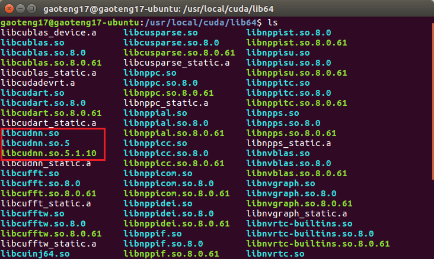

```bash
sudo rm -rf libcudnn.so libcudnn.so.5    #删除原有动态文件
sudo ln -s libcudnn.so.5.1.10 libcudnn.so.5  #生成软链接，注意版本号一致
sudo ln -s libcudnn.so.5 libcudnn.so      #生成软链接
```


# 4 安装opencv

OpenCV是一个基于BSD许可（开源）发行的跨平台计算机视觉库。

在深度学习框架中提供图像处理等功能，目前已更新到了3.4.0版本，caffe对opencv版本无要求，这里选择了3.2.0版本安装。

首先去官网（https://opencv.org/releases.html ）下载opencv，选择`Sources`即可。

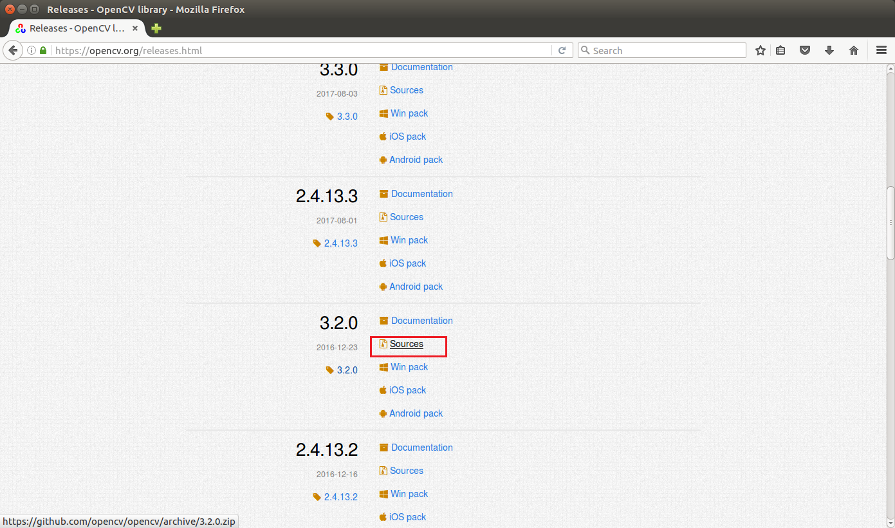

首先安装Ubuntu系统需要的依赖项：

```bash
sudo apt-get install --assume-yes libopencv-dev build-essential cmake git libgtk2.0-dev pkg-config python-dev python-numpy libdc1394-22 libdc1394-22-dev libjpeg-dev libpng12-dev libtiff5-dev libjasper-dev libavcodec-dev libavformat-dev libswscale-dev libxine2-dev libgstreamer0.10-dev libgstreamer-plugins-base0.10-dev libv4l-dev libtbb-dev libqt4-dev libfaac-dev libmp3lame-dev libopencore-amrnb-dev libopencore-amrwb-dev libtheora-dev libvorbis-dev libxvidcore-dev x264 v4l-utils unzip
```

这里注意一下，如果中途有问题中断，终端有提示`update`的话，则输入`sudo apt-get update`，之后再重复执行即可。反复几次，直到出现下图提示信息即安装完毕。

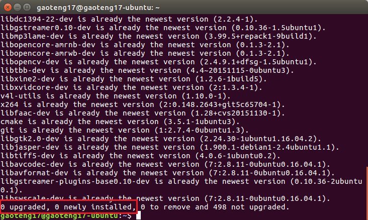

然后安装opencv需要的一些依赖项：

```bash
sudo apt-get install build-essential cmake git
sudo apt-get install ffmpeg libopencv-dev libgtk-3-dev python-numpy python3-numpy libdc1394-22 libdc1394-22-dev libjpeg-dev libpng12-dev libtiff5-dev libjasper-dev libavcodec-dev libavformat-dev libswscale-dev libxine2-dev libgstreamer1.0-dev libgstreamer-plugins-base1.0-dev libv4l-dev libtbb-dev qtbase5-dev libfaac-dev libmp3lame-dev libopencore-amrnb-dev libopencore-amrwb-dev libtheora-dev libvorbis-dev libxvidcore-dev x264 v4l-utils unzip
```

这里同样可能会有和上面相同的问题，方法同上面一致。

解压之前下载好的opencv到你喜欢的位置，`cd`到该文件夹下，然后：

```bash
mkdir build   #新建一个build文件夹，编译的工程都在这个文件夹里
cd build/    
cmake -D CMAKE_BUILD_TYPE=RELEASE -D CMAKE_INSTALL_PREFIX=/usr/local -D WITH_TBB=ON -D WITH_V4L=ON -D WITH_QT=ON -D WITH_OPENGL=ON -DCUDA_NVCC_FLAGS="-D_FORCE_INLINES" ..
```

cmake成功后，会出现如下结果，提示配置和生成成功：

```bash
-- Configuring done
-- Generating done
-- Build files have been written to: /XXXX/opencv-3.2.0/build
```

然后使用make命令编译即可：

```bash
make -j4 #-j后数字设置为cpu核数时可以加快编译速度
```

这里注意一下，在编译opencv时，ffmpeg或ippicv等第三方库可能会由于众所周知的原因下载不成功，一般解决方法是自己到github上下载，之后解压到相关路径。

但这种方式比较麻烦，容易出错，不推荐。

这里推荐挂梯子来下载。访问蓝灯github页面（https://github.com/getlantern/lantern ），下载ubuntu平台的安装包。

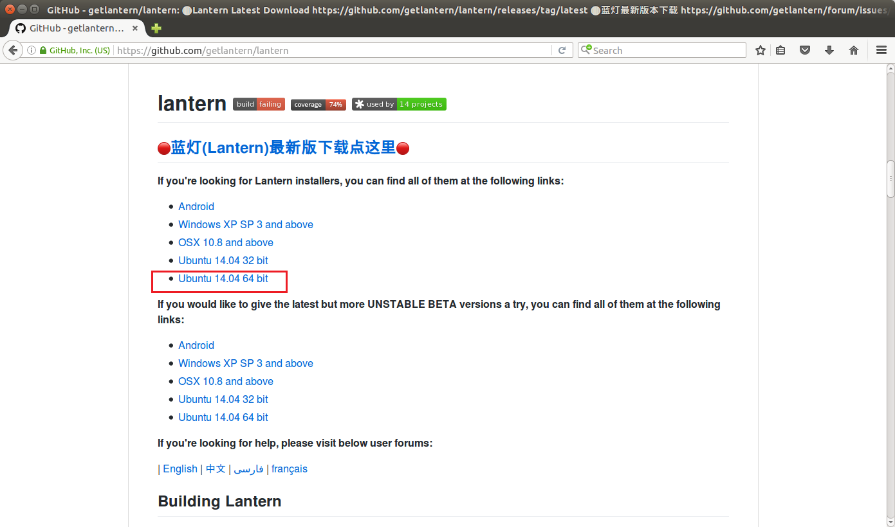

之后使用命令安装即可

```bash
sudo dpkg -i lantern-installer-64-bit.deb
```

使用时在终端输入`lantern`，不用的时候`Ctrl + C`即可。

另外一个可能出现的问题：

```bash
fatal error: LAPACKE_H_PATH-NOTFOUND/lapacke.h: No such file or directory #include "LAPACKE_H_PATH-NOTFOUND/lapacke.h"

LAPACK and BLAS are installed.. Any ideas? Didn't get these errors with 3.1 or previous 2.4.X versions...
```

解决方案：

```bash
sudo apt-get install liblapacke-dev checkinstall
```


opencv编译成功后进行安装，并有将设置写入到系统中：

```bash
sudo make install
sudo /bin/bash -c 'echo "/usr/local/lib" > /etc/ld.so.conf.d/opencv.conf'
sudo ldconfig
```


# 5 安装caffe

Caffe （卷积神经网络框架）是一种应用广泛的深度学习框架，caffe团队在17年初推出了caffe2框架，号称对mobile端有更好的支持，但是目前还是处于初级阶段，这里选择caffe安装配置。

caffe官方网站（http://caffe.berkeleyvision.org/ ）中也给出了全部安装依赖项。

## 安装依赖

```bash
sudo apt-get update 
sudo apt-get install -y build-essential cmake git pkg-config 
sudo apt-get install -y libprotobuf-dev libleveldb-dev libsnappy-dev libhdf5-serial-dev protobuf-compiler 
sudo apt-get install -y libatlas-base-dev 
sudo apt-get install -y libopenblas-dev 
sudo apt-get install -y --no-install-recommends libboost-all-dev 
sudo apt-get install -y libgflags-dev libgoogle-glog-dev liblmdb-dev 
sudo apt-get install -y python-pip 
sudo apt-get install -y python-dev 
sudo apt-get install -y python-numpy python-scipy 
sudo apt-get install libhdf5-dev 
```

将终端`cd`到你要安装caffe的位置，执行如下指令，clone caffe项目。

```bash
git clone https://github.com/BVLC/caffe.git  #从github上git caffe
cd caffe #打开到刚刚git下来的caffe 
```

安装caffe项目中python相关的依赖库

```bash
cat python/requirements.txt | xargs -L 1 sudo pip install  
```

增加符号链接

```bash
sudo ln -s /usr/include/python2.7/ /usr/local/include/python2.7   
sudo ln -s /usr/local/lib/python2.7/dist-packages/numpy/core/include/numpy/ /usr/local/include/python2.7/numpy  
```

修改配置文件

```bash
sudo cp Makefile.config.example Makefile.config
#Makefile.config.example是caffe给出的makefile例子，复制到Makefile.config
sudo gedit Makefile.config #编辑Makefile.config文件 
```

## 编辑Makefile.config文件

这里给出我的加了注释的Makefile.config文件供参考：

```bash
## Refer to http://caffe.berkeleyvision.org/installation.html
# Contributions simplifying and improving our build system are welcome!

# cuDNN acceleration switch (uncomment to build with cuDNN).
 USE_CUDNN := 1
'在有nvidia GPU并且安装CuDNN的情况下取消注释'

# CPU-only switch (uncomment to build without GPU support).
# CPU_ONLY := 1
'如果取消注释则只使用cpu'

# uncomment to disable IO dependencies and corresponding data layers
 USE_OPENCV := 1
 '因为要用到OpenCV库所以要打开，下面这两个选项表示是选择Caffe的数据管理第三方库，两者都不打开Caffe默认用的是LMDB，这两者均是嵌入式数据库管理系统编程库'
# USE_LEVELDB := 0
# USE_LMDB := 0

# uncomment to allow MDB_NOLOCK when reading LMDB files (only if necessary)
#	You should not set this flag if you will be reading LMDBs with any
#	possibility of simultaneous read and write
# ALLOW_LMDB_NOLOCK := 1
'当需要读取LMDB文件时可以取消注释，默认不打开'

# Uncomment if you're using OpenCV 3
 OPENCV_VERSION := 3
'安装的opencv版本，2.X版本的话是2,3.X版本就是3'

# To customize your choice of compiler, uncomment and set the following.
# N.B. the default for Linux is g++ and the default for OSX is clang++
# CUSTOM_CXX := g++
'linux系统默认使用g++编译器，OSX则是clang++'

# CUDA directory contains bin/ and lib/ directories that we need.
CUDA_DIR := /usr/local/cuda
'cuda安装目录，如果前面给自己挖坑了这里改一下'
# On Ubuntu 14.04, if cuda tools are installed via
# "sudo apt-get install nvidia-cuda-toolkit" then use this instead:
# CUDA_DIR := /usr
'如果是在ubuntu14.04版本下通过apt-get方式安装的cuda则在上面这个目录'

# CUDA architecture setting: going with all of them.
# For CUDA < 6.0, comment the *_50 through *_61 lines for compatibility.
# For CUDA < 8.0, comment the *_60 and *_61 lines for compatibility.
# For CUDA >= 9.0, comment the *_20 and *_21 lines for compatibility.
CUDA_ARCH := -gencode arch=compute_20,code=sm_20 \
		-gencode arch=compute_20,code=sm_21 \
		-gencode arch=compute_30,code=sm_30 \
		-gencode arch=compute_35,code=sm_35 \
		-gencode arch=compute_50,code=sm_50 \
		-gencode arch=compute_52,code=sm_52 \
		-gencode arch=compute_60,code=sm_60 \
		-gencode arch=compute_61,code=sm_61 \
		-gencode arch=compute_61,code=compute_61
'这些参数需要根据GPU的计算能力来设置，不做调整（主要是不会。。）。'
'这个网站可以查询自己GPU的算力'
'http://blog.csdn.net/jiajunlee/article/details/52067962'

# BLAS choice:
# atlas for ATLAS (default)
# mkl for MKL
# open for OpenBlas
BLAS := atlas
'如果用的是ATLAS计算库则赋值atlas，MKL计算库则用mkl赋值，OpenBlas则赋值open'
'caffe默认是atlas'

# Custom (MKL/ATLAS/OpenBLAS) include and lib directories.
# Leave commented to accept the defaults for your choice of BLAS
# (which should work)!
# BLAS_INCLUDE := /path/to/your/blas
# BLAS_LIB := /path/to/your/blas
'如果是默认位置安装的atlas（apt-get方式）则保留注释，否则取消注释并输入安装目录'

# Homebrew puts openblas in a directory that is not on the standard search path
# BLAS_INCLUDE := $(shell brew --prefix openblas)/include
# BLAS_LIB := $(shell brew --prefix openblas)/lib
'如果选择了openblas且不是安装在标准路径则要指明'

# This is required only if you will compile the matlab interface.
# MATLAB directory should contain the mex binary in /bin.
# MATLAB_DIR := /usr/local
# MATLAB_DIR := /Applications/MATLAB_R2012b.app
'matlab安装库的目录'

# NOTE: this is required only if you will compile the python interface.
# We need to be able to find Python.h and numpy/arrayobject.h.
PYTHON_INCLUDE := /usr/include/python2.7 \
                /usr/local/lib/python2.7/dist-packages/numpy/core/include
'python安装目录，这里要注意第二行位置，ubuntu16.04对python2.7的安装位置有小改动'
'设置的时候可以先cd到该目录下看python是否安在了那里'

# Anaconda Python distribution is quite popular. Include path:
# Verify anaconda location, sometimes it's in root.
# ANACONDA_HOME := $(HOME)/anaconda
# PYTHON_INCLUDE := $(ANACONDA_HOME)/include \
		# $(ANACONDA_HOME)/include/python2.7 \
		# $(ANACONDA_HOME)/lib/python2.7/site-packages/numpy/core/include
'如果安装了anaconda（一款集成了许多库的python）则需要把python相关目录设置到anaconda目录'

# Uncomment to use Python 3 (default is Python 2)
# PYTHON_LIBRARIES := boost_python3 python3.5m
# PYTHON_INCLUDE := /usr/include/python3.5m \
#                 /usr/lib/python3.5/dist-packages/numpy/core/include
'默认使用python2.7,取消注释则使用python3.5'

# We need to be able to find libpythonX.X.so or .dylib.
PYTHON_LIB := /usr/lib
# PYTHON_LIB := $(ANACONDA_HOME)/lib
'python库的位置，安装了anaconda的话似乎也得改'

# Homebrew installs numpy in a non standard path (keg only)
# PYTHON_INCLUDE += $(dir $(shell python -c 'import numpy.core; print(numpy.core.__file__)'))/include
# PYTHON_LIB += $(shell brew --prefix numpy)/lib

# Uncomment to support layers written in Python (will link against Python libs)
 WITH_PYTHON_LAYER := 1
'如果要用python来写框架中的layer则取消注释'

# Whatever else you find you need goes here.
INCLUDE_DIRS := $(PYTHON_INCLUDE) /usr/local/include /usr/include/hdf5/serial
LIBRARY_DIRS := $(PYTHON_LIB) /usr/local/lib /usr/lib /usr/lib/x86_64-linux-gnu /usr/lib/x86_64-linux-gnu/hdf5/serial
'这里注意要加入hdf5的路径，同样建议加入前先cd到这些目录看看是否前面安装成功了'

# If Homebrew is installed at a non standard location (for example your home directory) and you use it for general dependencies
# INCLUDE_DIRS += $(shell brew --prefix)/include
# LIBRARY_DIRS += $(shell brew --prefix)/lib

# NCCL acceleration switch (uncomment to build with NCCL)
# https://github.com/NVIDIA/nccl (last tested version: v1.2.3-1+cuda8.0)
# USE_NCCL := 1
'nccl是GPU多卡并行中使用的通信框架，穷比瑟瑟发抖'

# Uncomment to use `pkg-config` to specify OpenCV library paths.
# (Usually not necessary -- OpenCV libraries are normally installed in one of the above $LIBRARY_DIRS.)
# USE_PKG_CONFIG := 1
'opencv装好了就不用管'

# N.B. both build and distribute dirs are cleared on `make clean`
BUILD_DIR := build
DISTRIBUTE_DIR := distribute
'build目录，注意如果build中途失败了应该执行 make clean 后再重新build'

# Uncomment for debugging. Does not work on OSX due to https://github.com/BVLC/caffe/issues/171
# DEBUG := 1

# The ID of the GPU that 'make runtest' will use to run unit tests.
TEST_GPUID := 0
'所用的GPU的ID编号，单卡就是0'

# enable pretty build (comment to see full commands)
Q ?= @
```

修改相关文件避免gcc版本问题

- 修改makefile文件

```bash
#181行位置
LIBRARIES += glog gflags protobuf boost_system boost_filesystem m hdf5_hl hdf5
替换为：
LIBRARIES += glog gflags protobuf boost_system boost_filesystem m hdf5_hl hdf5 opencv_core opencv_imgproc opencv_imgcodecs opencv_highgui

#415行位置
NVCCFLAGS +=-ccbin=$(CXX) -Xcompiler-fPIC $(COMMON_FLAGS)
替换为：
NVCCFLAGS += -D_FORCE_INLINES -ccbin=$(CXX) -Xcompiler -fPIC $(COMMON_FLAGS)
```

- 修改/usr/local/cuda/include/host_config.h，注释掉第119行

```bash
#119行位置
#error -- unsupported GNU version! gcc versions later than 5 are not supported!
改为
//#error -- unsupported GNU version! gcc versions later than 5 are not supported!
```

## 编译caffe

在caffe目录下

```bash
make all -j4  
make test -j4  
make runtest  
make pycaffe  
```

编译通过则说明安装正确。

使用MNIST手写数据集测试

mnist是一个手写数字库，训练样本为60000张，测试样本为10000张，每个样本为28x28大小的黑白图片，手写数字为0-9，因此分为10类。

```bash
cd caffe #你的caffe安装目录    
sudo sh ./data/mnist/get_mnist.sh    #下载数据
sudo sh ./examples/mnist/create_mnist.sh #转换成lmdb数据
sudo sh ./examples/mnist/train_lenet.sh #训练模型
#全局参数和网络参数可以在lenet_solver.prototxt与train_lenet.prototxt文件中进行设置
```
gpu+cuda情况下几分钟即可完成训练，训练完成后会生成caffemodel文件，这种训练好的模型也可以用在其它平台的caffe网络中。

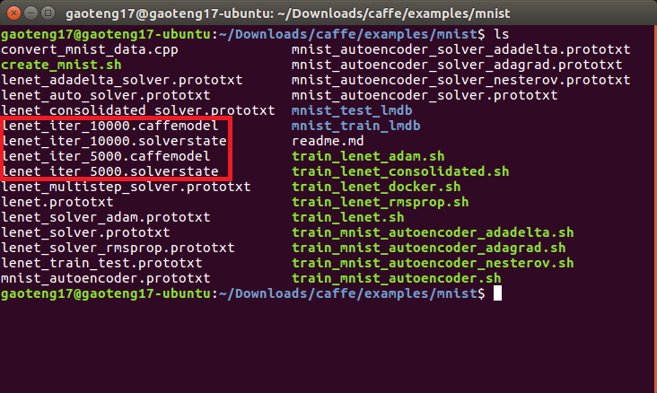

链接python与caffe

``` bash
gedit ~/.bashrc  #打开  

export PYTHONPATH=/你的caffe的目录/python:$PYTHONPATH   
#可以通过在python目录下右键打开终端，输入pwd获取绝对路径

source ~/.bashrc   #生效 
```

测试是否链接成功

```python
python
import caffe
caffe.__version__
```

出现版本信息即成功。

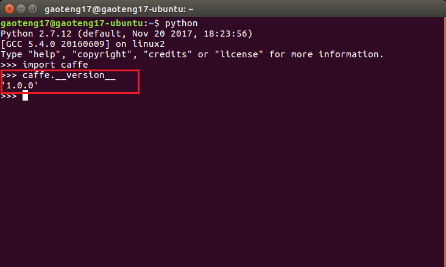