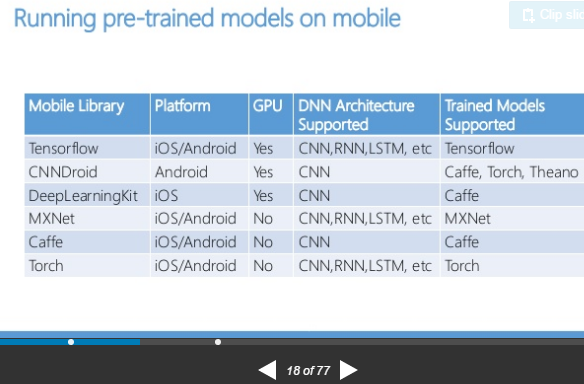
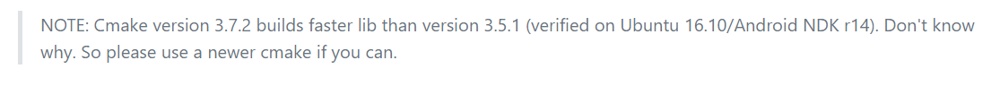
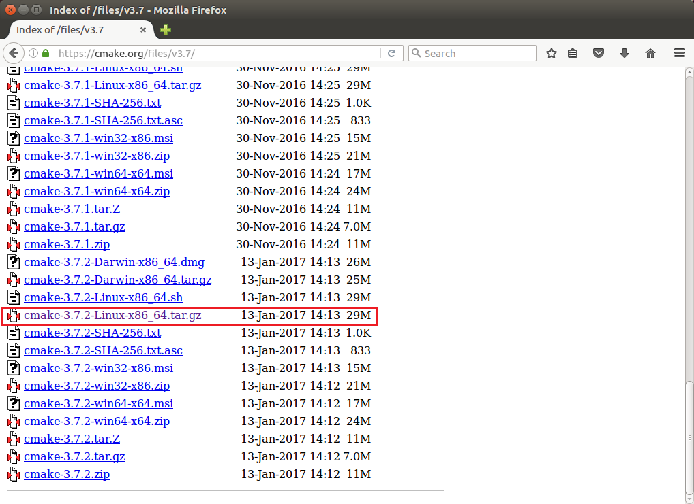
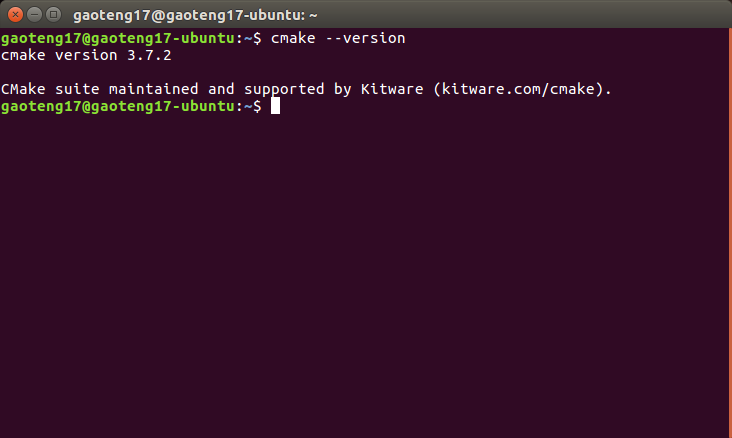
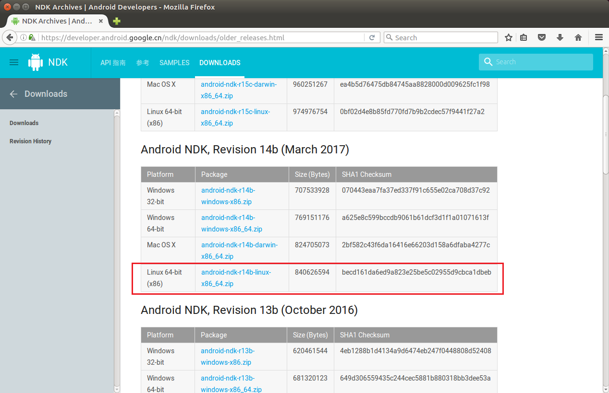
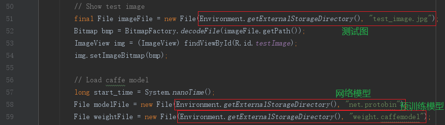
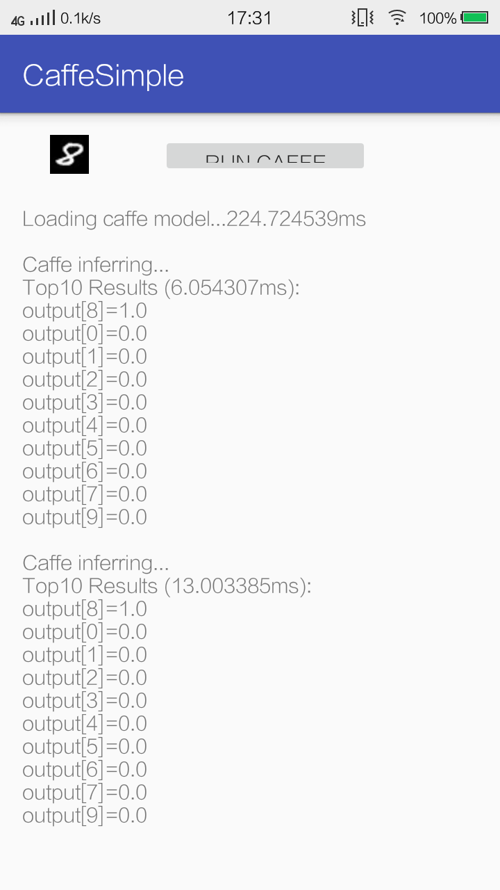

目前来看，深度学习框架在移动端的移植，主要是要实现在移动端跑起来预处理模型（pre-trained models），然后做检测识别等工作。由此可见如何缩小训练的network并且保持performance是这方面的核心点。

而对于模型训练的方面，由于移动端电量及计算能力的限制，即使使用GPU加速也远不及服务器训练效率，所以近期似乎不会有太大的变革。

当然如果移动端能达到较高的训练效率，无疑具有很多优势。比如可以在用户端训练私人数据而不担心隐私泄露问题等等。这样或许能构成通用模型（服务器训练）加上个性化模型（用户端训练）的整体结构。

<!--more-->

这里引用[*Squeezing Deep Learning into Mobile Phones - A Practitioner's guide*](https://www.datasciencecentral.com/profiles/blogs/squeezing-deep-learning-into-mobile-phones-a-practitioner-s-guide)的一张图表，列出几个常用的深度学习移动端框架：



Caffe 基于 C++ 实现，代码结构简洁易读，有着很好的可移植性。[**solrex**](https://github.com/solrex)在17年初在 github 上启动了一个 Caffe-Mobile 项目，将 Caffe 移植到 Android/iOS 上，并移除后向传播，缩减依赖，精简和修改部分代码，达到了编译速度快，生成体积小的效果。

这篇文章将在Android平台实现[**Caffe-Mobile项目**](https://github.com/solrex/caffe-mobile)的移植。作者在项目页的`README.md`文件中已经给出了详细步骤及注意事项，只需依次执行即可。


# 1 安装cmke及ndk

ubuntu16.04自带了3.5.1版本的cmake，但作者标注cmake版本会影响build速度。



这里选择3.7.2版本进行安装。

访问cmake官网（https://cmake.org/files/ ），找到3.7.2版本的下载得到`cmake-3.7.2-Linux-x86_64.tar.gz`



解压

```bash
tar zxvf cmake-3.7.2-Linux-x86_64.tar.gz
```

创建软链接

```bash
mv cmake-3.7.2-Linux-x86_64.tar.gz /usr/local/cmake-3.7.2 #目录可自选
ln -sf /usr/local/cmake-3.7.2/bin/* /usr/bin/
```

最后执行命令测试



现在cmke已经安装了3.7.2版本。

ndk的话到Android NDK官网（https://developer.android.google.cn/ndk/downloads/index.html ）下载，这里选择`android-ndk-r14b-linux-x86_64`版本下载。



下载完成后解压即可。

# 2 使用cmake生成caffe-mobile的lib库

作者给出了win平台下的编译步骤，无奈测试编译时总会报找不到gfortran的错误，导致openblas不能正常编译。尝试多种方法无效，于是选择在Ubuntu下编译。

`cd`到想要存放项目的位置，执行

```bash
git clone --recursive https://github.com/solrex/caffe-mobile.git

cd caffe-mobile

export NDK_HOME=/path/to/your/ndk  # C:/path/to/your/ndk on MinGW64 (/c/path/to/your/ndk not work for OpenBLAS)
./tools/build_android.sh
```

编译成功后可以看到在`caffe-mobile/examples/android/CaffeSimple/app`目录下出现了`libs`文件夹，其中含有三种arm平台的so文件，在后面android项目编译时可以自由选择。


# 3 使用Android Studio 编译 CaffeSimple

作者在项目中还提供了 Android/iOS 平台上的APP 实现示例 CaffeSimple，展示了在手机上使用 Caffe example 里的 MNIST 示例（深度学习领域的 Hello World）训练出来的 LeNet 模型预测一个手写字符 “8” 图片的过程和结果。

在Android Studio中导入`caffe-mobile/examples/android/CaffeSimple`项目，打开`app/src/main/java/com/yangwenbo/caffesimple`目录下的`MainActivity.java`，可以看到有关文件路径设置的代码。



这里可以自由修改路径，默认是在外置sd卡根目录。

将`caffe-mobile/examples/ios/simple/CaffeSimple/data`目录下的`net.protobin`及`test_image.jpg`，和已经训练好的模型文件`lenet_iter_10000.caffemodel`（由caffe框架训练得到）三个文件放置到手机相应目录。

如果你还没有搭建caffe框架，可以参考官方教程 [**Training LeNet on MNIST with Caffe**](http://caffe.berkeleyvision.org/gathered/examples/mnist.html)或者我的另一篇博客[**Ubuntu16.04+CUDA8.0+Cudnn5.1+Opencv3.2.0+Caffe框架的搭建**](http://gaoteng17.top/caffe/)。

最后`Build&Run`，就可以体会Caffe在Android利用预训练模型预测手写字符 “8” 图片的过程和结果了。



作者同时提供了ios平台的编译步骤，感兴趣的读者可以自行测试实现。