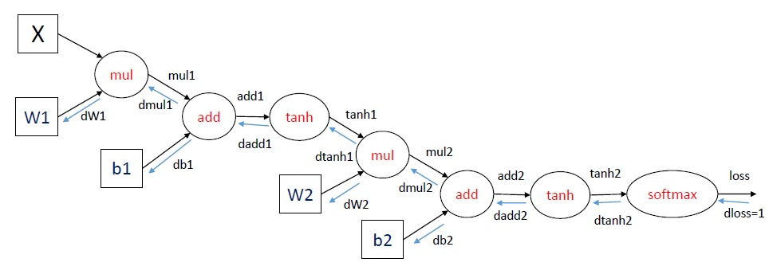

本文转自[如何直观地解释 back propagation 算法？ - 龚禹pangolulu的回答 - 知乎](https://www.zhihu.com/question/27239198/answer/95253534)。

BackPropagation算法是多层神经网络的训练中举足轻重的算法。

简单的理解，它的确就是复合函数的链式法则，但其在实际运算中的意义比链式法则要大的多。

而理解BP算法原理最直接与清晰的就是根据computation graph了，话不多说，直接上图。



<!--more-->

这里举了一个三层神经网络（一个输入层、一个隐层和一个输出层）的例子，使用了softmax输出层，损失函数使用交叉熵。训练神经网络可以使用梯度下降的方法，重点是计算梯度，也就是损失函数对参数的导数，在图中可以表示为`dloss/dW1`，`dloss/dW2`，`dloss/db1`和`dloss/db2`。如何计算这些梯度，使用的就是BP算法，其实也就是求导的链式法则。

在每一轮迭代中，首先进行forward propagation，也就是计算computation graph中每个节点的状态：

```python
mul1 = X * W1
add1 = mul1 + b1
tanh1 = tanh(add1)
mul2 = tanh1 * W2
add2 = mul2 + b2
tanh2 = tanh(add2)
loss = softmax_loss(tanh2)
```

之后进行back propagation，也就是计算computation graph中每个节点相对于损失函数（这里表示为loss）的导数，这里面应用了链式法则。对于`dloss/dtanh2`, `dloss/dadd2`等导数，下面省略分子直接表示为`dtanh2`等。

```python
dloss = 1
dtanh2 = softmax_loss_diff(tanh2) * dloss 
dadd2 = tanh_diff(add2) * dtanh2 
db2 = 1 * dadd2
dmul2 = 1 * dadd2
dW2 = tanh1 * dmul2
dtanh1 = W2 * dmul2
dadd1 = tanh_diff(add1) * dtanh1
db1 = 1 * dadd1
dmul1 = 1 * dadd1
dW1 = X * dmul1
```

上面的变量都可以用矩阵表示，直接进行矩阵运算。其中dW1，dW2，db1和db2就是我们需要求的参数的梯度。

在编程实现上，每一个计算节点都可以定义两个函数，一个是forward，用于给定输入计算输出；一个是backward，用于给定反向梯度，计算整个表达式（相当于损失函数）相对于这个节点的输入的梯度，应用链式法则就是：这个节点相对于其输入的梯度（直接对输入求导）乘以这个节点接受的反向梯度。