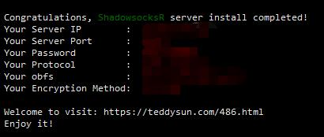

之前搭在台湾机房的服务器莫名其妙被迁移到了香港，囧。。。

因为香港的服务器有个致命的问题，PAC模式下有较高几率无法正常访问谷歌。。。

因此只能重新搭建一个台湾机房的服务器，本文使用了teddysun的一键搭建命令，这里感谢这位大佬的全自动脚本，节省了大量的时间精力，10分钟畅游youtube！

<!-- more -->

# GCP账号申请

官网(https://cloud.google.com/free/) 注册即可，注意地区现在不能选择中国大陆了，原因似乎是大量大陆ip注册新账号薅谷歌赠金羊毛，逼着谷歌关掉大陆地区的申请。

不过也没关系，地区选择香港，绑定paypal，按要求把身份证照片上传，一般一天之内审核就会通过。

# 修改防火墙规则

访问https://console.cloud.google.com/networking/firewalls/list ，选择创建防火墙规则，按图中设置将所有ip、端口均放行即可。


# 创建VM实例

访问 https://console.cloud.google.com/compute/instances ,选择创建实例，按图填写设置。


* 名称随便填
* 区域选台湾，地区据说是asia-east1-c更快，我没测试选了默认
* 机器类型选微型够用，有0.6G内存和1.7G内存可选，一般0.6G就够用了
* 启动磁盘选CentOS 7
* 防火墙允许HTTP、HTTPS流量，不过前面做了防火墙全局设置，这个不勾也没关系

# 安装BBR脚本

实例创建好之后选择SSH连接，首先切换root用户：

``` bash
sudo -i
```

依次运行以下命令：

``` bash
yum install -y wget

wget --no-check-certificate https://github.com/teddysun/across/raw/master/bbr.sh

chmod +x bbr.sh

./bbr.sh
```

安装完成后，脚本会提示需要重启VPS，输入 y 并回车后重启。

重启完成后，验证是否成功安装最新内核并开启 TCP BBR，输入以下命令：

``` bash
uname -r
```

查看内核版本，含有版本号（2019.5.6版本号为`5.0.13-1.el7.elrepo.x86_64`）就成功了。

输入下面的命令：

``` bash
sysctl net.ipv4.tcp_available_congestion_control
```

返回值一般为：` net.ipv4.tcp_available_congestion_control = cubic reno bbr`

# 一键安装SSR

依次运行以下命令：

``` bash
wget --no-check-certificate -O shadowsocks-all.sh https://raw.githubusercontent.com/teddysun/shadowsocks_install/master/shadowsocks-all.sh

chmod +x shadowsocks-all.sh

./shadowsocks-all.sh 2>&1 | tee shadowsocks-all.log
```

出现提示信息，选择要安装的版本。推荐选`ShadowsocksR`，输入`2`， 回车


设置密码


设置端口，可选范围1-65535，建议4位以上， 注意避免常用端口22，80，443等


选择加密方式，一般默认`aes-256-cfb`即可


选择协议，同样默认`origin`即可


选择混淆方式，依旧默认`plain`


然后按任意键开始安装


安装完成后提示成功，同时显示SSR的IP、端口、密码等相关配置



之后使用PC或手机端按照配置连接即可。

# 后记

Google云服务平台对新用户赠送300美元(香港地区是2,354.99港币)，可以免费使用1年，而搭建一台只是用来翻墙的VPS实际上每个月花销都不到20港币，这个赠金都足以新建很多台VPS了。这个活动似乎长期有效，只是新用户注册流程相比以前更严格一些。

同时GCP还有`速度快`、`低延迟`的优势，毕竟台湾机房就在厦门正对面的台湾省彰化县，TTL值要远低于Vultr、Linode等服务商。

综合来看，如果GCP羊毛每年都能稳定薅的话，那这个性价比就太高了。