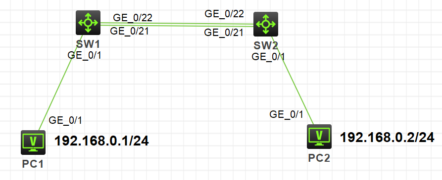
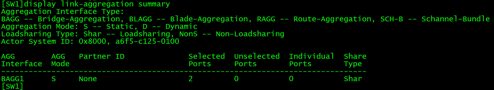

H3C模拟器上配置链路聚合。

系统版本v7。

<!-- more -->

# 拓扑

两台PC，两台交换机。



# 配置

```
[SW1]int Bridge-Aggregation 1
[SW1]quit
[SW1]int range g1/0/21 to g1/0/22
[SW1-if-range]port link-aggregation group 1

[SW2]int Bridge-Aggregation 1
[SW2]quit
[SW2]int range g1/0/21 to g1/0/22
[SW2-if-range]port link-aggregation group 1
```

# 验证

```
[SW1]display link-aggregation summary

[SW2]display link-aggregation summary
```

显示信息：




# 总结

v5版本与v7版本的命令大致一致，但是在创建链路组的时候命令有区别。

实在不想练v5版本的了，都快淘汰的版本了。弃了弃了。

# 补充

----------------------------------2019.9.4更新---------------------------------------

这篇只做了一个静态聚合的实验，下文补充了动态聚合和边缘端口的实验：

[【信息网络学习 H3C设备配置链路聚合（补充）】](http://gaoteng17.xyz/1038/)