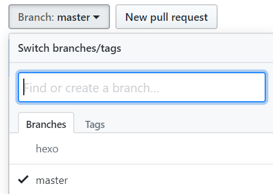

使用hexo+github搭建好静态博客后发现，只有一台电脑上有源文件，这样换了电脑就不能正常更新博客内容，总不能天天带着U盘到处拷贝吧。

查询后得到一个解决方法，思路是：在github静态博客项目中添加hexo分支存放博客的源文件，在正常编译部署网站前先pull下来源文件，部署好之后再push上去源文件。

<!-- more -->

# 前期

首先假定已有一台可以正常部署的pc，与一个已搭建完成的静态博客。

在新pc上分别安装`nodejs`、`git`、`hexo`。

安装hexo这里其实可以偷懒，直接u盘把源文件先都拷过来，这样省下了配置主题。

# 源文件同步

在已可以正常部署的电脑上，在博客根目录右键打开`git bash`，执行以下命令：

``` bash
git init  //初始化本地仓库
git add . //添加源文件至暂存区
git commit -m "Blog Source Hexo"
git branch hexo  //新建hexo分支
git checkout hexo  //切换到hexo分支上
git remote add origin git@github.com:yourname/yourname.github.io.git  //将本地与Github项目对接
git push origin hexo  //push到Github项目的hexo分支上
```

如图hexo分支建立成功：



# 配置git

1. 在新电脑中打开`git bash`，配置个人信息：

``` bash
git config --global user.name "yourname"
git config --global user.email "your@email"
```

2. 生成密钥：

``` bash
ssh-keygen -t rsa -C "your@email"
```
按三次回车（密码为空），生成密匙。 

在**C:\Users\用户名\.ssh**中，得到两个文件，分别为`id_rsa`和`id_rsa.pub`。 

打开`id_rsa.pub`，全选复制。粘贴到GitHub用户设置的SSH设置中。

3. 测试连接：

``` bash
ssh git@github.com
The authenticity of host 'github.com (52.74.223.119)' can't be established.
RSA key fingerprint is SHA256:*****************************.
Are you sure you want to continue connecting (yes/no)? yes //打全yes
Warning: Permanently added 'github.com,52.74.223.119' (RSA) to the list of known hosts.
PTY allocation request failed on channel 0
Hi ******! You've successfully authenticated, but GitHub does not provide shell access.
Connection to github.com closed.
```

# 源文件克隆

在新电脑上将源文件分支clone下来，进行初次配置：

``` bash
git clone -b hexo git@github.com:yourname/yourname.github.io.git  //hexo分支clone到本地
cd  yourname.github.io  //切换到刚刚clone的文件夹内
npm install    //安装必要的所需组件
```

# 更新博文

之后每次在不同的设备进行更新，都按以下流程操作：

``` bash
git pull origin hexo  //先pull完成本地与远端的融合

hexo g  //编译
hexo s  //本地测试
hexo d  //部署

git add .
git commit -m "添加博文xxx"
git push origin hexo
```