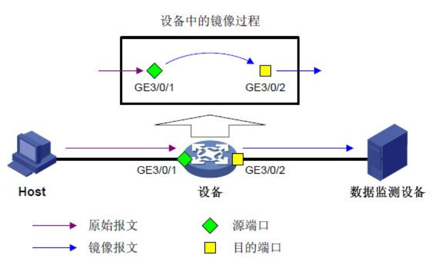
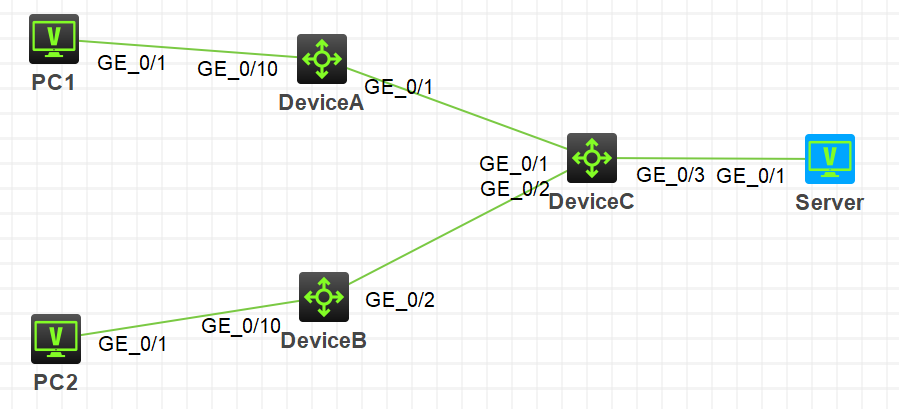
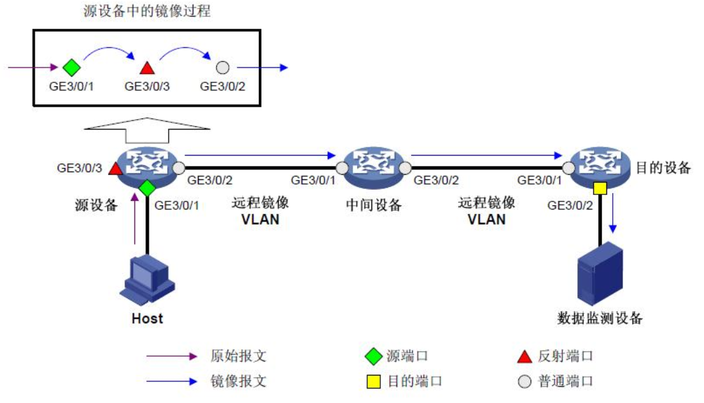
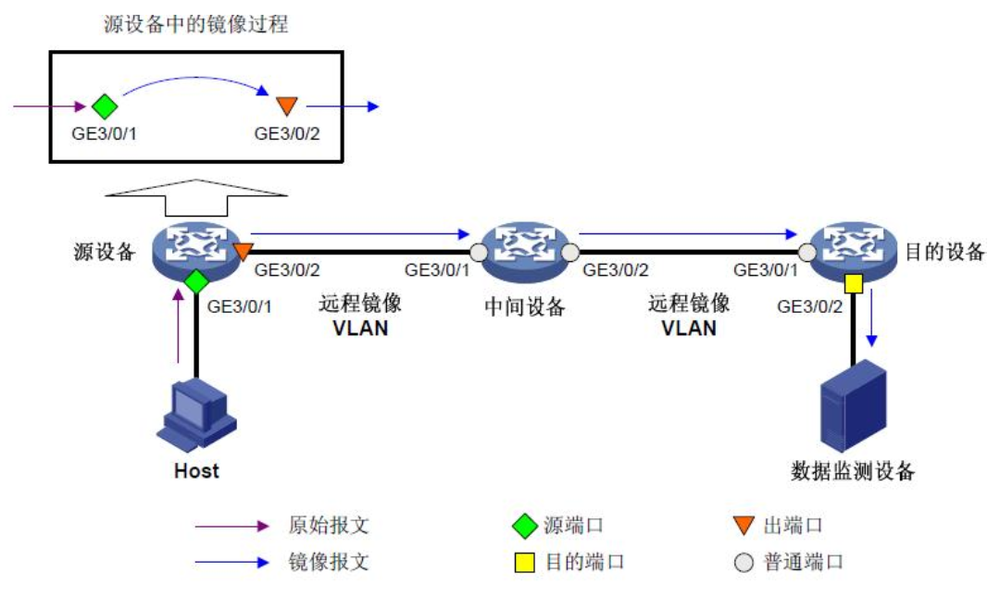
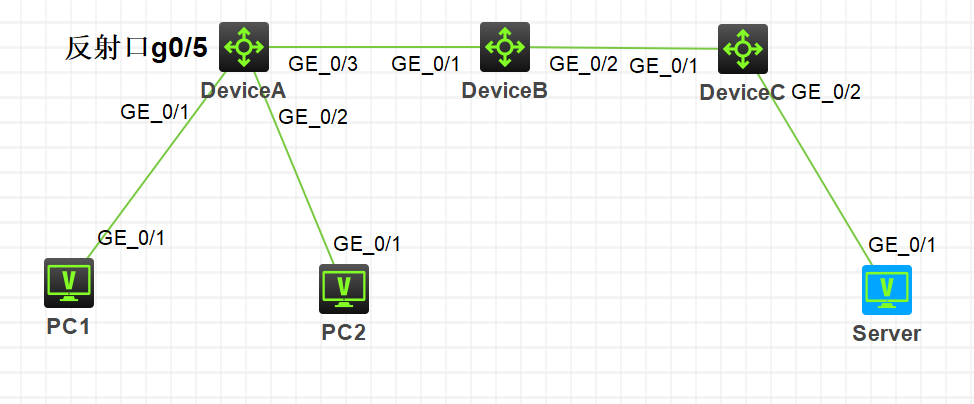
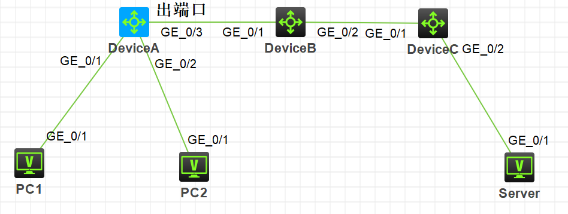

H3C以太网交换机中支持本地端口镜像、二层远程端口镜像和三层远程端口镜像三种。

其中二层远程端口镜像的实现方式包括：固定反射端口方式、非固定反射端口方式和出端口方式。

在H3C模拟器上配置本地端口镜像、以及二层远程端口镜像。

系统版本v7。

<!-- more -->

# 本地端口镜像

## 原理

本地端口镜像通过本地镜像组的方式实现，即源端口和目的端口在同一个本地镜像组中，设备将源端口的报文复制一份并转发到目的端口。

如图所示，源端口（GE3/0/1）的报文被镜像到目的端口（GE3/0/2），这样连接在目的端口上的数据监测设备就可以对这些报文进行监控和分析。



## 拓扑

这里按照下面的组网图进行配置，其中DeviceC的**G1/0/1**、**G1/0/2**作为镜像源端口，**G1/0/3**作为镜像目的端口：



## 配置

``` 
<DeviceC>system-view

[DeviceC]mirroring-group 1 local //建立本地镜像组
[DeviceC]mirroring-group 1 mirroring-port  g1/0/1 g1/0/2 both 
//配置源端口。可选inbound入流量、outbound出流量、both双向流量
[DeviceC]mirroring-group 1 monitor-port g1/0/3 //配置目的端口

[DeviceC]display mirroring-group all
Mirroring group 1:
    Type: Local
    Status: Active
    Mirroring port:
        GigabitEthernet1/0/1  Both
        GigabitEthernet1/0/2  Both
    Monitor port: GigabitEthernet1/0/3

```

# 二层远程端口镜像

## 原理

二层远程端口镜像通过远程源镜像组和远程目的镜像组互相配合的方式实现。

二层远程端口镜像的实现方式包括：固定反射端口方式、非固定反射端口方式和出端口方式。

其中，固定反射端口方式和非固定反射端口方式也统称为反射端口方式，其区别在于：固定反射端口方式无需人工配置反射端口；而非固定反射端口方式需人工配置反射端口。

如图所示是反射端口方式的二层远程端口镜像示例。此时源设备将进入源端口GE3/0/1的报文复制一份给反射端口GE3/0/3，再由该反射端口将镜像报文在远程镜像VLAN中广播，最终镜像报文经由中间设备转发至目的设备。目的设备收到该报文后判别其VLAN ID，如果与远程镜像VLAN的VLAN ID相同，就将其转发至目的端口GE3/0/2，最后由该端口将镜像报文转发给数据监测设备。



如图所示的是出端口方式的二层远程端口镜像示例。此时源设备将进入源端口GE3/0/1的报文复制一份给出端口GE3/0/2，该端口将镜像报文转发给中间设备，再由中间设备在远程镜像VLAN中广播，最终到达目的设备。目的设备收到该报文后判别其VLAN ID，如果与远程镜像VLAN的VLAN ID相同，就将其转发至目的端口GE3/0/2，最后由该端口将镜像报文转发给数据监测设备。



## 反射端口方式

### 拓扑

这里按照下面的组网图进行配置，并定义：
1. VLAN2为远程镜像VLAN，其中DeviceA的**G1/0/1**、**G1/0/2**作为镜像源端口，**G1/0/5**作为反射口，DeviceC的**G1/0/2**作为镜像目的端口。
2. 配置DeviceA的**G1/0/3**、DeviceB的**G1/0/1**与**G1/0/2**、DeviceC的**G1/0/1**为TRUNK口，并允许VLAN2通过。



### 配置

1. DeviceA

```
<DeviceA>system-view

[DeviceA]vlan 2
[DeviceA-vlan2]quit

[DeviceA]mirroring-group 1 remote-source //创建远程源镜像组
[DeviceA]mirroring-group 1 remote-probe vlan 2 //配置远程镜像vlan
[DeviceA]mirroring-group 1 mirroring-port g1/0/1 g1/0/2 both //源端口
[DeviceA]mirroring-group 1 reflector-port g1/0/5 //反射端口

[DeviceA]int g1/0/3
[DeviceA-GigabitEthernet1/0/3]port link-type trunk
[DeviceA-GigabitEthernet1/0/3]port trunk permit vlan 2

[DeviceA]dis mirroring-group all
Mirroring group 1:
    Type: Remote source
    Status: Active
    Mirroring port:
        GigabitEthernet1/0/1  Both
        GigabitEthernet1/0/2  Both
    Reflector port: GigabitEthernet1/0/5
    Remote probe VLAN: 2
```

2. DeviceB

```
<DeviceB>system-view

[DeviceB]int range g1/0/1 g1/0/2
[DeviceB-if-range]port link-type trunk
[DeviceB-if-range]port trunk permit vlan 2
```

3. DeviceC

```
<DeviceC>system-view

[DeviceC]vlan 2
[DeviceC-vlan2]quit

[DeviceC]int g1/0/1
[DeviceC-GigabitEthernet1/0/1]port link-type trunk
[DeviceC-GigabitEthernet1/0/1]port trunk permit vlan 2
[DeviceC-GigabitEthernet1/0/1]quit

[DeviceC]mirroring-group 1 remote-destination //创建远程目的镜像组
[DeviceC]mirroring-group 1 remote-probe vlan 2 //配置远程镜像vlan
[DeviceC]mirroring-group 1 monitor-port g1/0/2 //目的端口

[DeviceC]int g1/0/2
[DeviceC-GigabitEthernet1/0/2]port access vlan 2 //目的端口改vlan

[DeviceC]dis mirroring-group all
Mirroring group 1:
    Type: Remote destination
    Status: Active
    Monitor port: GigabitEthernet1/0/2
    Remote probe VLAN: 2
```

## 出端口方式

### 拓扑

这里按照下面的组网图进行配置，并定义：
1. VLAN2为远程镜像VLAN，其中DeviceA的**G1/0/1**、**G1/0/2**作为镜像源端口，**G1/0/3**作为出端口，DeviceC的**G1/0/2**作为镜像目的端口。
2. 配置DeviceA的**G1/0/3**、DeviceB的**G1/0/1**与**G1/0/2**、DeviceC的**G1/0/1**为TRUNK口，并允许VLAN2通过。



### 配置

1. DeviceA

```
<DeviceA>system-view

[DeviceA]vlan 2
[DeviceA-vlan2]quit

[DeviceA]mirroring-group 1 remote-source //创建远程源镜像组
[DeviceA]mirroring-group 1 remote-probe vlan 2 //配置远程镜像vlan
[DeviceA]mirroring-group 1 mirroring-port g1/0/1 g1/0/2 both //源端口
[DeviceA]mirroring-group 1 monitor-egress g1/0/3 //出端口

[DeviceA]int g1/0/3
[DeviceA-GigabitEthernet1/0/3]port link-type trunk
[DeviceA-GigabitEthernet1/0/3]port trunk permit vlan 2

[DeviceA]dis mirroring-group all
Mirroring group 1:
    Type: Remote source
    Status: Active
    Mirroring port:
        GigabitEthernet1/0/1  Both
        GigabitEthernet1/0/2  Both
    Monitor egress port: GigabitEthernet1/0/3
    Remote probe VLAN: 2
```

2. DeviceB

```
<DeviceB>system-view

[DeviceB]int range g1/0/1 g1/0/2
[DeviceB-if-range]port link-type trunk
[DeviceB-if-range]port trunk permit vlan 2
```

3. DeviceC

```
<DeviceC>system-view

[DeviceC]vlan 2
[DeviceC-vlan2]quit

[DeviceC]int g1/0/1
[DeviceC-GigabitEthernet1/0/1]port link-type trunk
[DeviceC-GigabitEthernet1/0/1]port trunk permit vlan 2
[DeviceC-GigabitEthernet1/0/1]quit

[DeviceC]mirroring-group 1 remote-destination //创建远程目的镜像组
[DeviceC]mirroring-group 1 remote-probe vlan 2 //配置远程镜像vlan
[DeviceC]mirroring-group 1 monitor-port g1/0/2 //目的端口

[DeviceC]int g1/0/2
[DeviceC-GigabitEthernet1/0/2]port access vlan 2 //目的端口改vlan

[DeviceC]dis mirroring-group all
Mirroring group 1:
    Type: Remote destination
    Status: Active
    Monitor port: GigabitEthernet1/0/2
    Remote probe VLAN: 2
```

# 注意

交换机的镜像配置非常消耗交换机资源，如无需求一般不进行设置。

同时设置为镜像目的端口的交换机端口只能用于流量监控，不能用于通讯。

# 参考

1. H3C交换机端口镜像原理.茶乡浪子(https://blog.csdn.net/lycb_gz/article/details/7773834 )
2. H3C端口镜像配置手册