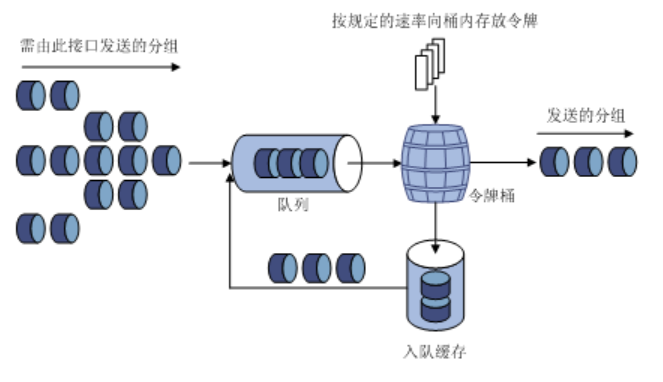

QoS（Quality of Service）即服务质量。对于网络业务，服务质量包括传输的带宽、传送的时延、数据的丢包率等。在网络中可以通过保证传输的带宽、降低传送的时延、降低数据的丢包率以及时延抖动等措施来提高服务质量。

QoS技术包括流分类、流量监管、流量整形、接口限速、拥塞管理、拥塞避免等。其中有些只能通过配置QoS策略来实现QoS功能，有些则可以不通过QoS策略来进行配置。例如，端口限速功能可以通过直接在接口上配置来实现。在实际应用中，两种配置方式也可以结合起来使用。

在H3C模拟器上进行Qos的配置，系统版本v7。

<!-- more -->

# 非Qos策略配置方式

## 端口限速

### 原理

用LR（Line Rate，物理接口限速）可以在一个物理接口上限制发送报文（包括紧急报文）的总速率。

LR也是采用令牌桶进行流量控制。如果在设备的某个接口上配置了LR，所有经由该接口发送的报文首先要经过LR的令牌桶进行处理。如果令牌桶中有足够的令牌，则报文可以发送；否则，报文将进入QoS队列进行拥塞管理。这样，就可以对通过该物理接口的报文流量进行控制。



由于采用了令牌桶控制流量，当令牌桶中存有令牌时，可以允许报文的突发性传输；当令牌桶中没有令牌时，报文必须等到桶中生成了新的令牌后才可以继续发送。这就限制了报文的流量不能大于令牌生成的速度，达到了限制流量，同时允许突发流量通过的目的。

与流量监管相比，物理接口限速能够限制在物理接口上通过的所有报文。当用户只要求对所有报文限速时，使用物理接口限速比较简单。

### 配置

```
<H3C>system-view
[H3C]int g1/0/1

//入口限速1000kbps，出口限速600kbps（突发8000kbps）
[H3C-GigabitEthernet1/0/1]qos lr inbound cir 1000
[H3C-GigabitEthernet1/0/1]qos lr outbound cir 600 cbs 8000

[H3C-GigabitEthernet1/0/1]dis this
#
interface GigabitEthernet1/0/1
 port link-mode bridge
 combo enable fiber
 qos lr inbound cir 1000 cbs 62500 //cbs默认是cir的62.5倍
 qos lr outbound cir 600 cbs 8000
#
return
```

# Qos策略配置方式

QoS策略包含了三个要素：类、流行为、策略。用户可以通过QoS策略将指定的类和流行为绑定起来，灵活地进行QoS配置。

1. 类

类的要素包括：类的名称和类的规则。

用户可以通过命令定义一系列的规则来对报文进行分类。同时用户可以指定规则之间的关系：and或者or。

* and：报文只有匹配了所有的规则，设备才认为报文属于这个类。
* or：报文只要匹配了类中的任何一个规则，设备就认为报文属于这个类。

2. 流行为

流行为用来定义针对报文所做的QoS动作。

流行为的要素包括：流行为的名称和流行为中定义的动作。

用户可以通过命令在一个流行为中定义多个动作。

3. 策略

策略用来将指定的类和流行为绑定起来，对分类后的报文执行流行为中定义的动作。

策略的要素包括：策略名称、绑定在一起的类和流行为的名称。

用户可以在一个策略中定义多个类与流行为的绑定关系。

## 流量监管

## 流量整形

## 拥塞管理

***Qos策略配置之后补充***

# 参考

1. QoS技术介绍.H3C(http://www.h3c.com/cn/d_200805/605881_30003_0.htm )