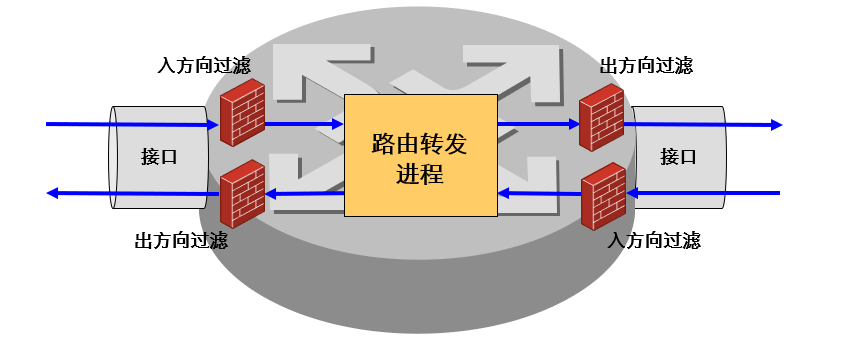
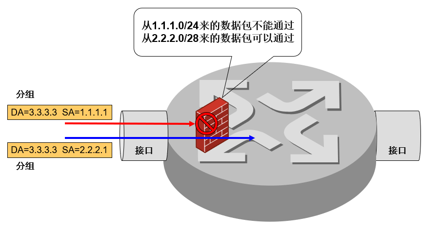
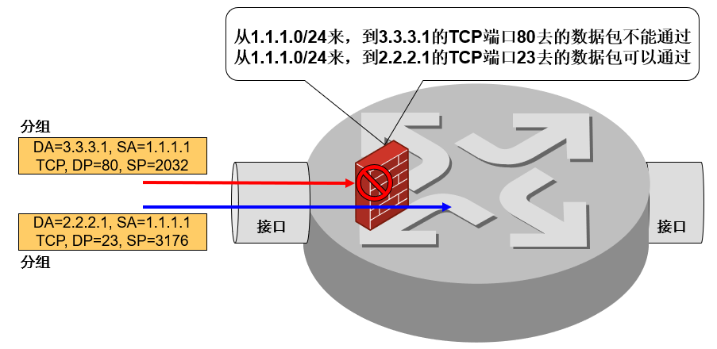
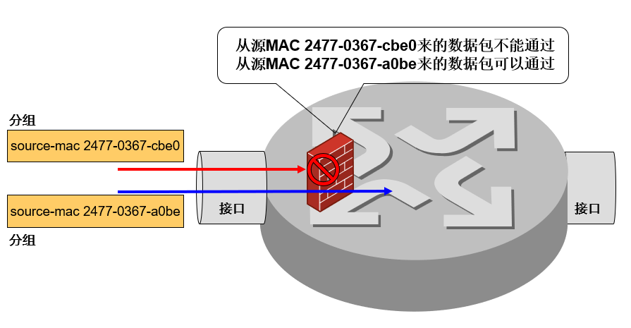
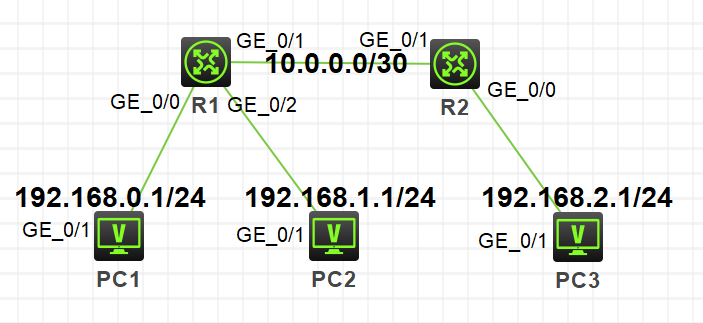
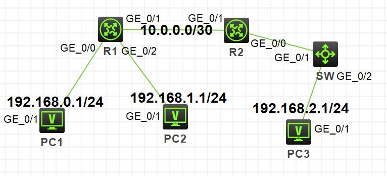
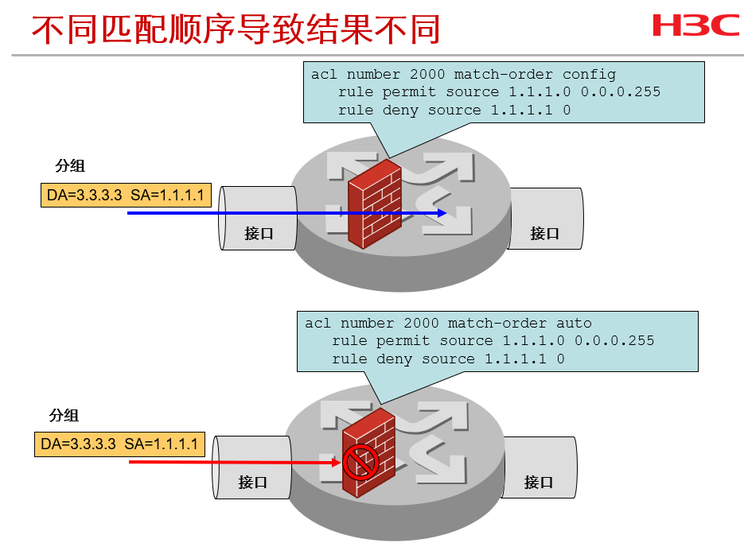

要增强网络安全性，网络设备需要具备控制某些访问或某些数据的能力。

ACL包过滤是一种被广泛使用的网络安全技术。它使用ACL来实现数据识别，并决定是转发还是丢弃这些数据包。

由ACL定义的报文匹配规则，还可以被其它需要对数据进行区分的场合引用。例如**包过滤防火墙功能**、**NAT（Network Address Translation，网络地址转换）**、**QoS（Quality of Service，服务质量）的数据分类**、**路由策略和过滤**、**按需拨号**等几个方面。

在H3C模拟器上进行访问控制列表（ACL）的配置，系统版本v7。

<!-- more -->

# 原理



* 对进出的数据包逐个过滤，丢弃或允许通过；
* ACL应用于**接口**上，每个接口的出入双向分别过滤；
* 仅当数据包经过一个接口时，才能被此接口的此方向的ACL过滤。

ACL的配置步骤如下：

1. 设置包过滤功能的默认过滤规则 
2. 根据需要选择合适的ACL分类
3. 创建正确的规则
* 设置匹配条件
* 设置合适的动作（Permit/Deny)
4. 在路由器的接口上应用ACL，并指明过滤报文的方向（入站/出站）


# 分类

ACL利用数字序号标识访问控制列表：

|访问控制列表的类型|数字序号的范围|
| ---- | ---- |
|基本访问控制列表|2000～2999|
|高级访问控制列表|3000～3999|
|基于二层的访问控制列表|4000～4999|

同时也可以给访问控制列表指定名称，便于维护。

## 基本ACL

基本访问控制列表只根据报文的源IP地址信息制定规则。



## 高级ACL

高级访问控制列表根据报文的源IP地址、目的IP地址、IP承载的协议类型、协议特性等三、四层信息制定规则。



## 二层ACL

二层ACL根据报文的源MAC地址、目的MAC地址、802.1p优先级、二层协议类型等二层信息制定匹配规则。



# 配置

使用下面的拓扑图进行连接配置：



## 基本ACL

配置基本ACL，禁止PC1的网络：

```
[R1]acl basic 2000
[R1-acl-ipv4-basic-2000]description denyPC1
[R1-acl-ipv4-basic-2000]rule deny source 192.168.0.1 0 //rule编号不指定则从0开始，默认步长为5
[R1-acl-ipv4-basic-2000]quit

[R1]int g0/0
[R1-GigabitEthernet0/0]packet-filter 2000 inbound //选择离源最近的端口，减少不必要的流量转发

[R1]dis acl 2000
Basic IPv4 ACL 2000, 1 rule,
denyPC1
ACL's step is 5
 rule 0 deny source 192.168.0.1 0 (2 times matched)
```

## 高级ACL

配置高级ACL，禁止PC2对PC1的ping流量，允许PC2对PC3的ping流量：

```
[R1]acl advanced 3000
[R1-acl-ipv4-adv-3000]description PC2icmpMANAGE
[R1-acl-ipv4-adv-3000]rule deny icmp source 192.168.1.1 0 destination 192.168.0.1 0 //rule编号不指定则从0开始，默认步长为5
[R1-acl-ipv4-adv-3000]rule permit icmp source 192.168.1.1 0 destination 192.168.2.1 0
[R1-acl-ipv4-adv-3000]quit

[R1]int g0/2
[R1-GigabitEthernet0/2]packet-filter 3000 inbound //选择在匹配高级acl中所有规则情况下离源最近的端口，减少不必要的流量转发

[R1]dis acl 3000
Advanced IPv4 ACL 3000, 2 rules,
PC2icmpMANAGE
ACL's step is 5
 rule 0 deny icmp source 192.168.1.1 0 destination 192.168.0.1 0 (3 times matched)
 rule 5 permit icmp source 192.168.1.1 0 destination 192.168.2.1 0 (1 times matched)
```

## 二层ACL

在拓扑图中串入交换机作为PC3的接入交换机：



配置二层ACL，禁止PC3(0884-8ef1-0a06)的流量：

```
[SW]acl mac 4000
[SW-acl-mac-4000]rule deny source-mac 0884-8ef1-0a06 ffff-ffff-ffff
[SW-acl-mac-4000]quit

[SW]int g1/0/2
[SW-GigabitEthernet1/0/2]packet-filter mac 4000 inbound

[SW]dis acl mac 4000
MAC ACL 4000, 1 rule,
ACL's step is 5
 rule 0 deny source-mac 0884-8ef1-0a06 ffff-ffff-ffff (2 times matched)
```

## ACL包过滤显示与调试

|操作|命令|
|-|-|
|查看包过滤的统计信息|**display packet-filter statistics { interface [ interface-type** *interface-number* **] { inbound \ outbound } {** *acl-number* **\ name** *acl-name* **} }**|
|清除包过滤的统计信息|**reset packet-filter statistics { interface [ interface-type** *interface-number* **] { inbound \ outbound } {** *acl-number* **\ name** *acl-name* **} }**|
|显示配置的**IPv4 ACL**信息|**display acl {** *acl-number* **\ all }**|
|清除**IPv4  ACL**统计信息|**reset acl counter {** *acl-number* **\ all \ name** *acl-name* **}**|


# 注意

1. 包过滤功能默认是开启的，且**系统默认的过滤方式是permit，即允许未匹配上ACL规则的报文通过**，也可以配置包过滤的缺省动作为deny：

```
[H3C] packet-filter default deny
```

2. ACL支持两种匹配顺序：
* 配置顺序（config）：按照用户配置规则的先后顺序进行规则匹配；
* 自动排序（auto）：按照“深度优先”的顺序进行规则匹配，即地址范围小的规则被优先进行匹配。

```
[H3C] acl {basic|advanced} acl-number [ match-order { auto | config } ]
```

由图可以看出不同的匹配顺序会导致不同的匹配结果：



3. 可以通过建立时间范围，使acl应用在限定的时间范围内：

* 建立时间范围：

```
[H3C]time-range work 9:00 to 17:30 working-day //工作日
[H3C]time-range breakfast from 08:00 08/02/2019 to 9:00 08/02/2019 //单次
```

* 应用acl在时间范围内：

```
[H3C-acl-ipv4-basic-2000]rule deny source 192.168.0.1 0 time-range work

[H3C-acl-ipv4-basic-2000]dis this
#
acl basic 2000
 rule 0 deny source 192.168.0.1 0 time-range work
#
return
```

4. 尽可能在靠近数据源的路由器接口上配置ACL，以减少不必要的流量转发。

5. ACL包过滤是根据数据包头中的二、三、四层信息来进行报文过滤的，对应用层的信息无法识别。

# 参考

1. H3C X00060100 第27章 用访问控制列表实现包过滤