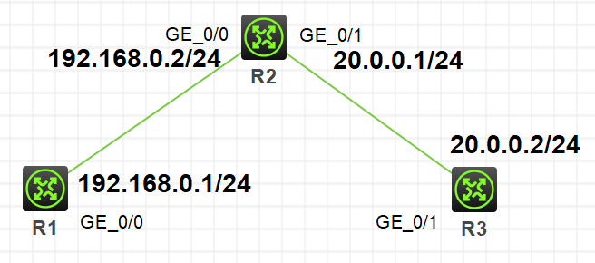
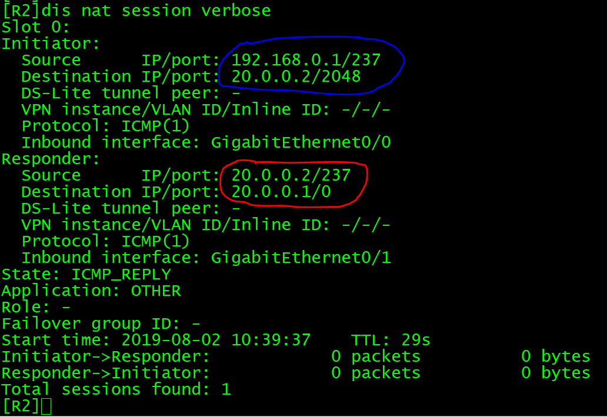
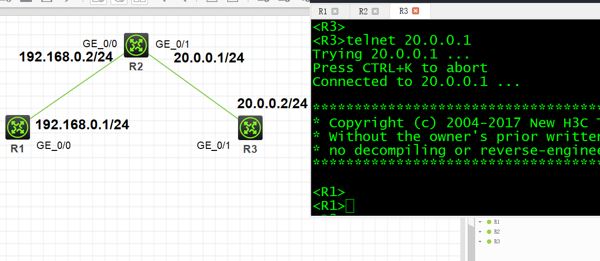
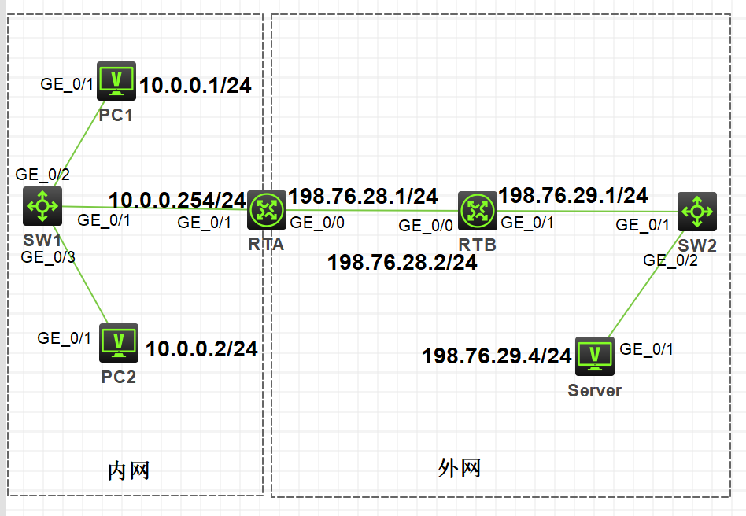
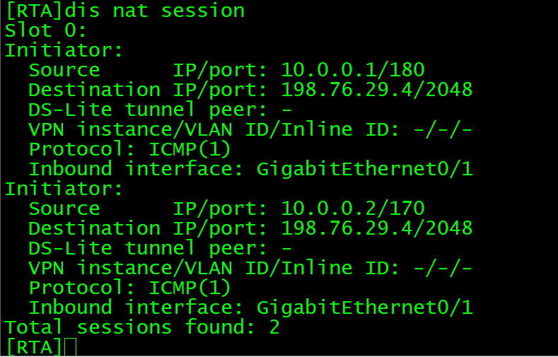
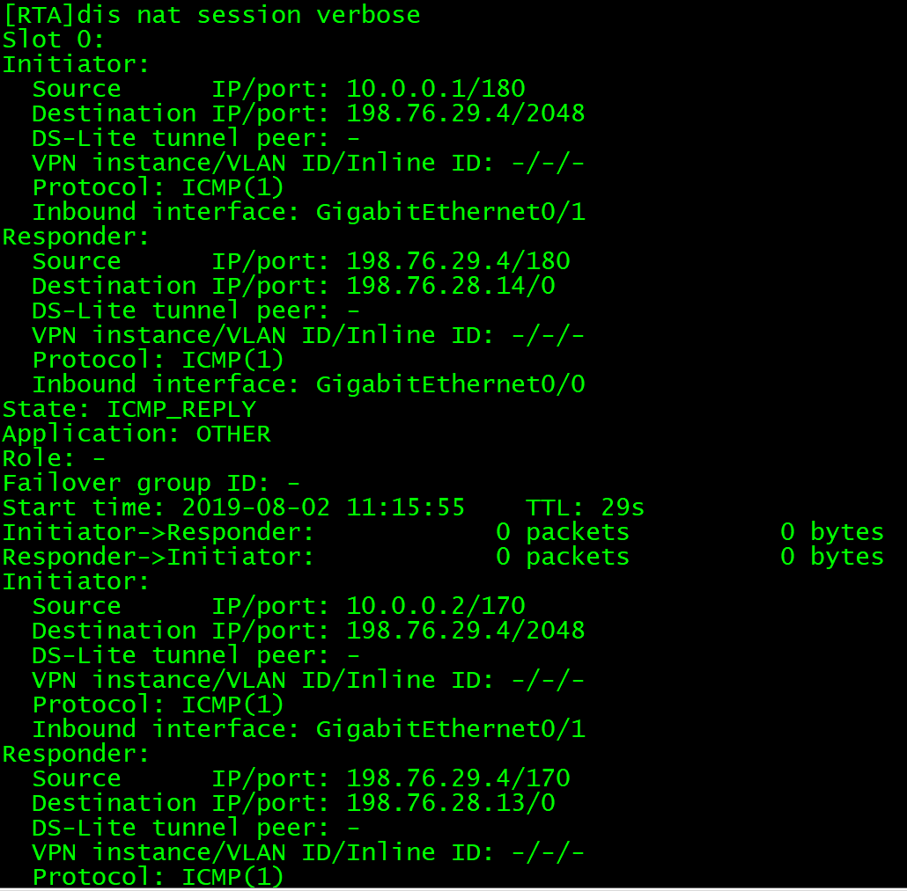
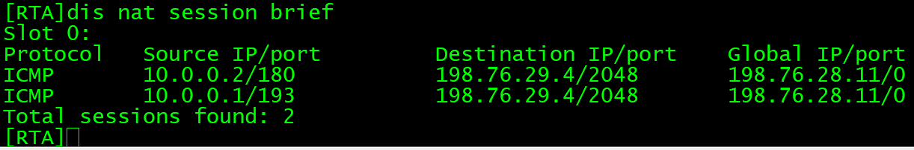
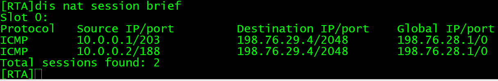
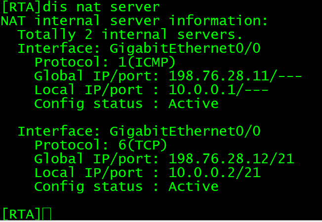

网络迅速发展， IPv4地址不敷使用，同时由于IPv4地址分配不均，当私有地址用户需要访问Internet时，需要通过NAT提供私有地址到公有地址的转换。

NAT大体分为以下几个方面：**静态NAT（一对一双向）**、**Basic NAT（多对多）**、**NAPT（多对一）**、**Easy IP（多对一，NAPT特例）**、**NAT Server（一对一，内部服务器）**。

在H3C模拟器上进行地址转换（NAT）的配置，系统版本v7。

<!-- more -->

# 静态NAT

## 拓扑



按照图中拓扑图，将R1、R2间网络定义为内网段（**192.168.0.0/24**），R2、R3间网络定义为外网段（**20.0.0.0/24**）。

启用ospf协议，使全网互通。并开启R1的telnet服务，以便后面验证nat转换的**双向性**。

## 配置

```
[R2]nat static outbound 192.168.0.1 20.0.0.1 //若选择inbound方式则反写内外网ip

[R2]int g0/1
[R2-GigabitEthernet0/1]nat static enable     //outbound方式选择出端口开启
```

## 验证

从R1 ping R3，在R2查看转换表项：



可以看出，R3回复R1时，回复地址是**20.0.0.1**，可知R2将R1的内网ip**192.168.0.1**转换为了外网ip**20.0.0.1**。

下面从R3 telnet R2的g0/1口，可以看到telnet到了R1上面：



# Basic NAT

## 拓扑



按照上图连接，并在内网出口路由器RTA上配置一条缺省路由：

```
[RTA]ip route-static 0.0.0.0 0 198.76.28.2
```

此时在PC1、PC2上ping公网Server是不通的，因为在公网路由器上不可能有私网的路由，从Server回应的ping响应报文到RTB的路由表上无法找到**10.0.0.0**网段的路由。

## 配置

```
[RTA]acl basic 2000 //配置需转换地址的列表，permit
[RTA-acl-ipv4-basic-2000]description BasicNAT
[RTA-acl-ipv4-basic-2000]rule 0 permit source 10.0.0.0 0.0.0.255
[RTA-acl-ipv4-basic-2000]quit

[RTA]nat address-group 1  //配置转换后的地址池
[RTA-address-group-1]address 198.76.28.11 198.76.28.20
[RTA-address-group-1]quit

[RTA]int g0/0
[RTA-GigabitEthernet0/0]nat outbound 2000 address-group 1 no-pat //出端口启用，模式no-pat
```

## 验证

此时在PC1、PC2上可以ping通公网Server。

在RTA上查看NAT转换表项，总计两条：



使用`verbose`可以查看详细信息：



# NAPT

## 拓扑

拓扑同上。

## 配置

```
[RTA]acl basic 2000 //配置需转换地址的列表，permit
[RTA-acl-ipv4-basic-2000]description BasicNAT
[RTA-acl-ipv4-basic-2000]rule 0 permit source 10.0.0.0 0.0.0.255
[RTA-acl-ipv4-basic-2000]quit

[RTA]nat address-group 1  //配置转换后的地址池
[RTA-address-group-1]address 198.76.28.11 198.76.28.11
[RTA-address-group-1]quit

[RTA]int g0/0
[RTA-GigabitEthernet0/0]nat outbound 2000 address-group 1 //出端口启用，不带no-pat，表明NAT要对数据包进行端口转发
```

## 验证

此时在PC1、PC2上可以ping通公网Server。

在RTA上查看NAT转换表项，总计两条：



可以看出，PC1、PC2地址转换后的公网IP地址均是**198.76.28.11**，不同的是端口号（这里出了点问题，不知道为啥端口号只显示0）。

# Easy IP

## 拓扑

拓扑同上。

## 配置

```
[RTA]acl basic 2000 //配置需转换地址的列表，permit
[RTA-acl-ipv4-basic-2000]description BasicNAT
[RTA-acl-ipv4-basic-2000]rule 0 permit source 10.0.0.0 0.0.0.255
[RTA-acl-ipv4-basic-2000]quit

[RTA]int g0/0
[RTA-GigabitEthernet0/0]nat outbound 2000  //出端口启用，直接转换为出端口地址
```

## 验证

此时在PC1、PC2上可以ping通公网Server。

在RTA上查看NAT转换表项，总计两条：



可以看出，PC1、PC2地址转换后的公网IP地址均是出端口地址**198.76.28.1**。

# NAT Server（一对一，内部服务器）

## 拓扑

拓扑同上。

## 配置

```
[RTA]int g0/0
[RTA-GigabitEthernet0/0]nat server protocol icmp global 198.76.28.11 inside 10.0.0.1 //PC1提供icmp服务
[RTA-GigabitEthernet0/0]nat server protocol tcp global 198.76.28.12 ftp inside 10.0.0.2 //PC2提供ftp服务
```

## 验证

此时在Server上可以ping通PC1的公网IP**198.76.28.11**。

在RTA上查看NAT server表项，总计两条：



# NAT的信息显示和调试命令

|**操作**|**命令**|
|-|-|
|显示地址转换信息|**display nat { address-group** *group-number* **/ all /outbound** *port-block-group* **/ server / statistics / session }**|
|调试地址转换过程|**debugging nat { alg / config / event / packet** *acl number* **}**|
|清除地址转换连接|**reset nat session**|

# 参考

1. H3C X00060201 第28章 网络地址转换