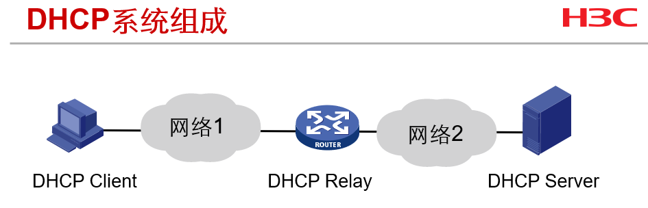
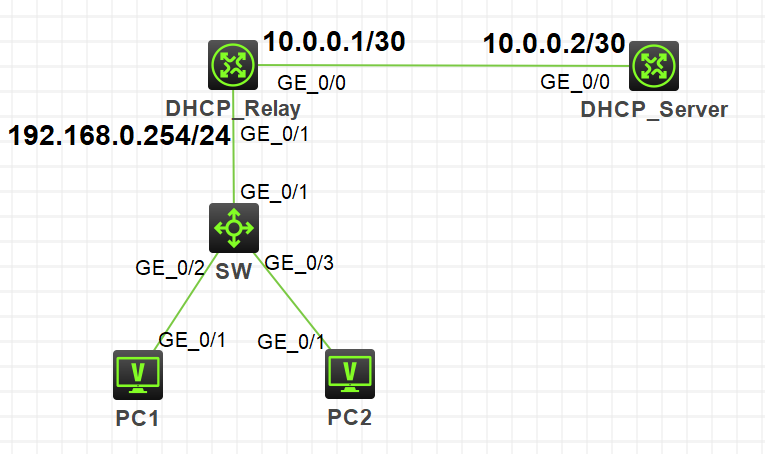
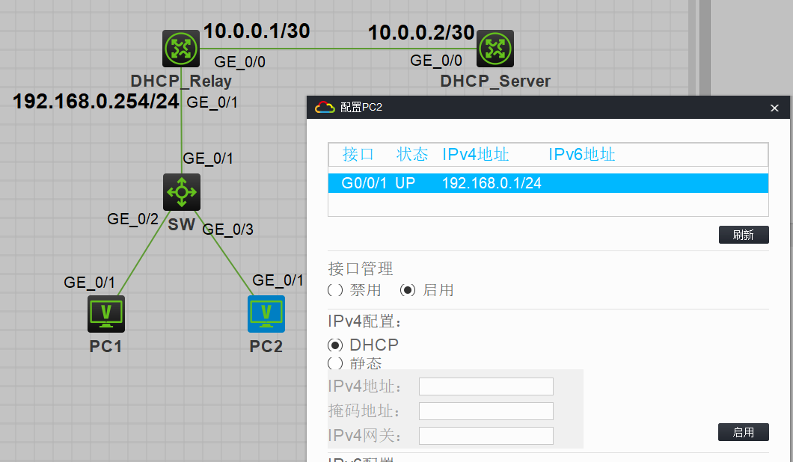
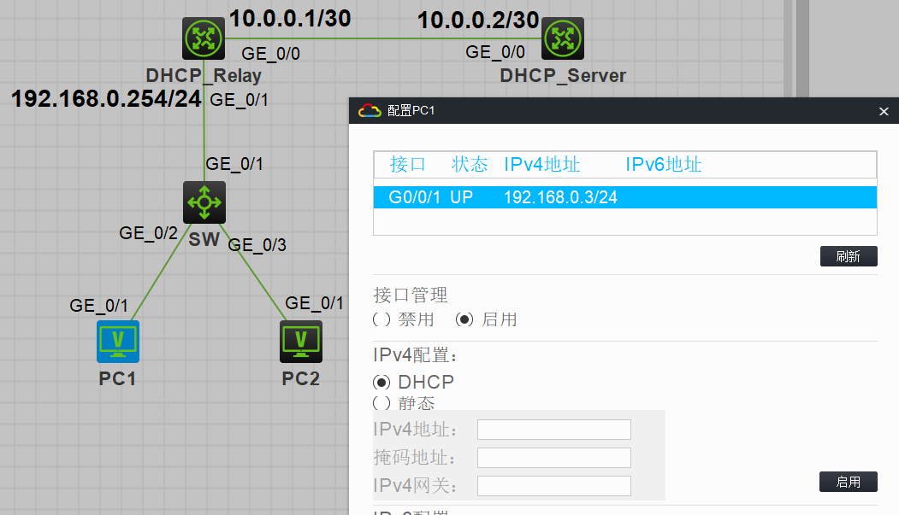

DHCP 是动态主机配置协议的英文缩写，从BOOTP（Bootstrap Protocol）协议发展而来，其作用向主机动态分配IP地址及其他相关信息。

DHCP可以自动为局域网中主机完成TCP/IP协议配置，使用DHCP自动配置避免了IP地址冲突的问题。

在H3C模拟器上进行DHCP的配置，系统版本v7。

<!-- more -->

# 原理

DHCP采用客户端/服务器模式，服务器负责集中管理，客户端向服务器提出配置申请，服务器根据策略返回相应配置信息。

DHCP具有**即插即用性**、**统一管理**、**使用效率高**、**可跨网段实现**等特点。

如下图，DHCP系统由三部分组成：

* DHCP服务器：能提供DHCP功能的服务器或具有DHCP功能的网络设备
* DHCP中继（可选）：一般为路由器或三层交换机等网络设备
* DHCP客户端：需要动态获得IP地址的主机



DHCP的地址分配方式有三种：

1. 手工分配
* 根据需求，网络管理员为少数特定主机（如DNS服务器、打印机）绑定固定的IP地址，其地址不会过期。
2. 自动分配
* 为连接到网络的某些主机分配IP地址，该地址将长期由该主机使用。
3. 动态分配
* 主机申请IP地址最常用的方法。DHCP服务器为客户端指定一个IP地址，同时为此地址规定了一个租用期限，如果租用时间到期，客户端必须重新申请IP地址。


# 配置

按照下图拓扑连接，配置基本配置，使拓扑网络互通，同时不配置PC机的IP地址：



在**DHCP_Server**上配置dhcp服务：

```
[DHCP_Server]dhcp server ip-pool pool1
[DHCP_Server-dhcp-pool-pool1]gateway-list 192.168.0.254 //网关地址
[DHCP_Server-dhcp-pool-pool1]network 192.168.0.0 mask 255.255.255.0 //dhcp地址池
[DHCP_Server-dhcp-pool-pool1]dns-list 192.168.0.200 //dns地址
[DHCP_Server-dhcp-pool-pool1]forbidden-ip 192.168.0.2 //禁止下发地址
[DHCP_Server-dhcp-pool-pool1]expired day 5 hour 12 //租约有效期
[DHCP_Server-dhcp-pool-pool1]quit

[DHCP_Server]dhcp enable
```

在**DHCP_Relay**上配置dhcp中继服务：

```
[DHCP_Relay]dhcp enable

[DHCP_Relay]int g0/1  //选择离client近的端口
[DHCP_Relay-GigabitEthernet0/1]dhcp select relay
[DHCP_Relay-GigabitEthernet0/1]dhcp relay server-address 10.0.0.2

```

# 验证

PC1、PC2配置IPv4为DHCP方式，可以看到PC2获取到了**192.168.0.1/24**，PC1获取到了**192.168.0.3/24**，而**192.168.0.2/24**由于配置了禁止下发，因此dhcp的分配跳过了该ip。





# DHCP相关显示维护命令

| **操作** | **命令** |
| - | - |
| 显示DHCP地址池的可用地址信息 | **display dhcp server free-ip** |
| 显示DHCP服务器的统计信息 | **display dhcp server statistics** |
| 显示DHCP地址池中不参与自动分配的IP地址 | **display dhcp server forbidden-ip** |
| 显示DHCP中继的相关报文统计信息 | **display dhcp relay statistics [ server-group {** *group-id* **/ all } ]** |

# 参考

1. H3C X00040005 第19章 DHCP