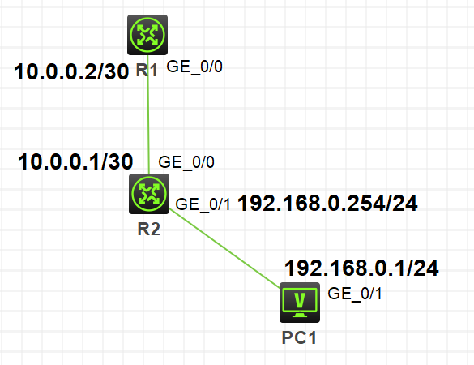
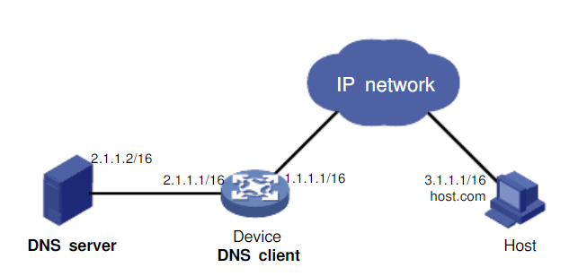
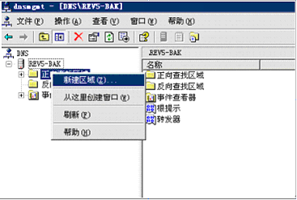
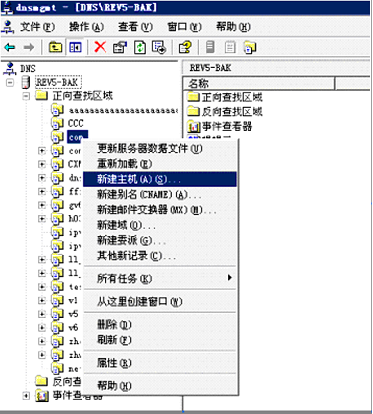
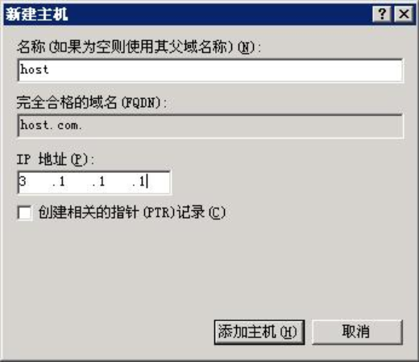

DNS （Domain Name System，域名系统）能够提供主机名和IP地址之间的映射。

DNS系统采用客户端/服务器模式，是一个具有树状层次结构的，联机分布式数据库系统。

在H3C模拟器上进行DNS的配置，系统版本v7。

<!-- more -->

# 原理

* DNS系统采用客户机/服务器架构，使用的传输层协议为TCP或UDP，服务器端口号53
* 域名解析工作是通过调用服务器上的解析器软件完成的
* DNS域名解析按照域名空间的分层树状结构自顶至下进行

H3C设备DNS功能的实现主要是下面三种方式：

1. 静态域名解析
* 手工建立域名和IP地址之间的对应关系 
2. 动态域名解析
* 由DNS域名服务器完成解析 
3. DNS代理
* 设备对DNS解析进行中继

# 静态域名解析

按照下图拓扑连接，配置基本配置，使拓扑网络互通：



在**R1**上配置静态域名解析，通过访问`PC1`来访问pc1的ip地址：

```
[R1]ip host PC1 192.168.0.1

[R1]ping PC1
Ping PC1 (192.168.0.1): 56 data bytes, press CTRL_C to break
56 bytes from 192.168.0.1: icmp_seq=0 ttl=254 time=3.000 ms
56 bytes from 192.168.0.1: icmp_seq=1 ttl=254 time=1.000 ms
56 bytes from 192.168.0.1: icmp_seq=2 ttl=254 time=1.000 ms
56 bytes from 192.168.0.1: icmp_seq=3 ttl=254 time=3.000 ms
56 bytes from 192.168.0.1: icmp_seq=4 ttl=254 time=1.000 ms

--- Ping statistics for PC1 ---
5 packet(s) transmitted, 5 packet(s) received, 0.0% packet loss
round-trip min/avg/max/std-dev = 1.000/1.800/3.000/0.980 ms
[R1]%Aug  3 09:31:47:247 2019 R1 PING/6/PING_STATISTICS: Ping statistics for PC1: 5 packet(s) transmitted, 5 packet(s) received, 0.0% packet loss, round-trip min/avg/max/std-dev = 1.000/1.800/3.000/0.980 ms.
```

# 动态域名解析

## 拓扑

按照下图拓扑连接，配置基本配置，使拓扑网络互通：



组网需求：

* 域名服务器的IP地址是2.1.1.2/16，配置域名后缀为com，且com域中包含域名“host”和IP地址3.1.1.1/16的对应关系。
* Device作为DNS客户端，使用动态域名解析和域名后缀列表功能，实现通过输入host来访问域名为host.com、IP地址为3.1.1.1/16的主机Host。

## 配置

### 配置域名服务器

1. 进入域名服务器配置界面。

在开始菜单中，选择[程序/管理工具/DNS]。

2. 创建区域com。

如下图所示，右键点击[正向查找区域]，选择[新建区域]，按照提示创建新的区域com。



3. 添加域名和IP地址的映射。

如下图所示，右键点击区域com。



4. 选择[新建主机]，弹出如下图的对话框。按照下图输入域名host和IP地址3.1.1.1。



### 配置DNS客户端Device

```
# 开启动态域名解析功能。
<Sysname> system-view
[Sysname] dns resolve

# 配置域名服务器的IP地址为2.1.1.2。
[Sysname] dns server 2.1.1.2

# 配置域名后缀com。
[Sysname] dns domain com
```

### 测试

```
# 在设备上执行ping host命令，可以ping通主机，且对应的目的地址为3.1.1.1。
[Sysname] ping host
 Trying DNS resolve, press CTRL_C to break
 Trying DNS server (2.1.1.2)
  PING host.com (3.1.1.1):
  56  data bytes, press CTRL_C to break
    Reply from 3.1.1.1: bytes=56 Sequence=1 ttl=126 time=3 ms
    Reply from 3.1.1.1: bytes=56 Sequence=2 ttl=126 time=1 ms
    Reply from 3.1.1.1: bytes=56 Sequence=3 ttl=126 time=1 ms
    Reply from 3.1.1.1: bytes=56 Sequence=4 ttl=126 time=1 ms
    Reply from 3.1.1.1: bytes=56 Sequence=5 ttl=126 time=1 ms
    
  --- host.com ping statistics ---
    5 packet(s) transmitted
    5 packet(s) received
    0.00% packet loss
    round-trip min/avg/max = 1/1/3 ms
```

# DNS代理

| **操作** | **命令** |
| - | - |
| 使能DNS代理功能 | **dns proxy enable** |
| 配置指定域名服务器 | **dns server** *ip-address* |

# 域名解析显示维护相关命令

| **操作** | **命令** |
| - | - |
| 显示静态域名解析表 | **display ip host** |
| 显示域名服务器信息 | **display dns server [ dynamic ]** |
| 显示动态域名缓存区的信息 | **display dns dynamic-host** |
| 显示DNS代理信息 | **display dns proxy table** |

# 参考

1. H3C X00040003 第17章 DNS
2. H3C 04-三层技术-IP业务配置指导 (http://www.h3c.com/cn/d_201101/707267_30005_0.htm#_Toc280606366 )

