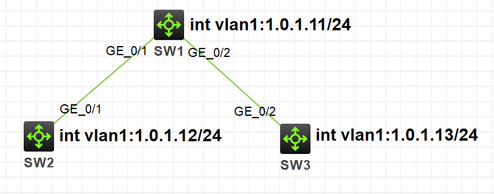
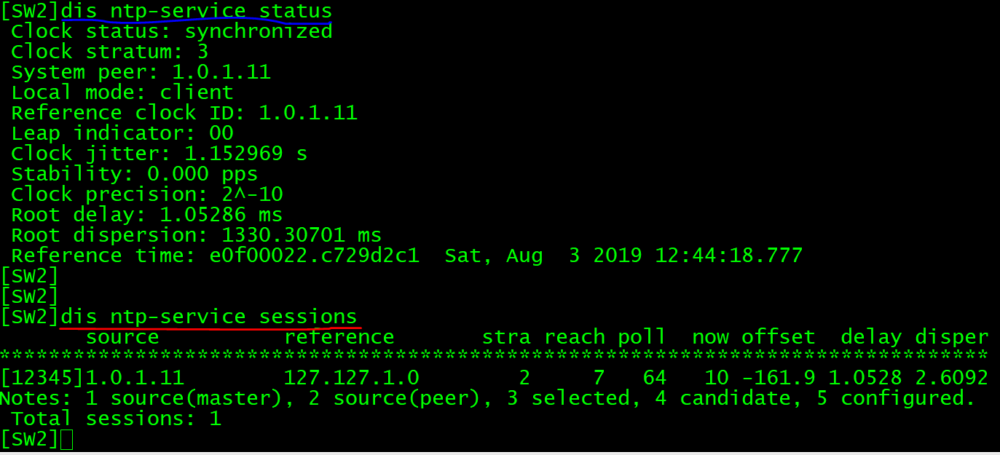
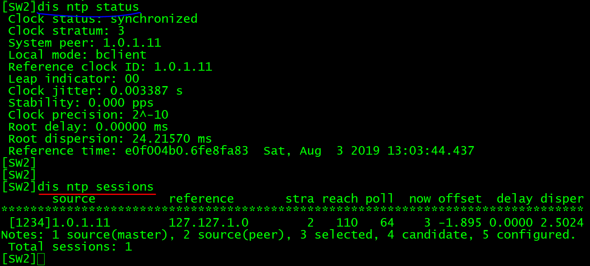

NTP全称网络时间协议(Network Time Protocol)，它是用来同步网络中各个计算机的时间的协议。

NTP 只考虑 UTC 时间，不考虑时区，不考虑夏令时等。

NTP使用UDP，端口123。

在H3C模拟器上进行DNS的配置，系统版本v7。

<!-- more -->

# 分类

设备可以采用多种NTP工作模式进行时间同步：

* 服务器/客户端模式
* 对等体模式
* 广播模式
* 组播模式

同时也可在同步模式中加入身份验证等，这里只对服务器/客户端模式、广播模式进行模拟验证。

# NTP服务器/客户端模式

## 拓扑

按照下图拓扑连接，配置基本配置，使拓扑网络互通：



其中SW1作为ntp服务器，SW2、SW3作为ntp客户端。

## 配置

首先在**SW1**上修改默认时间：

```
[SW1]clock protocol none
[SW1]quit
<SW1>clock datetime 12:00:00 8/3/2019
```

此时SW1时间与SW2、SW3时间不同：

```
<SW1>dis clock
12:03:17 UTC Sat 08/03/2019

<SW2>dis clock
11:51:28 UTC Sat 08/03/2019

<SW3>dis clock
11:51:28 UTC Sat 08/03/2019
```

开启ntp服务：

```
[SW1]clock protocol ntp

# 开启NTP功能。
[SW1]ntp-service enable
# 设置本地时钟作为参考时钟，层数为2。
[SW1]ntp-service refclock-master 2


[SW2]ntp-service enable
# 设置NTP Server为Switch B的时间服务器。
[SW2]ntp-service unicast-server 1.0.1.11


[SW3]ntp-service enable
# 设置NTP Server为Switch B的时间服务器。
[SW3]ntp-service unicast-server 1.0.1.11
```

## 验证

配置完成后，SW2和SW3向SW1进行时间同步。

在SW2上查看NTP的运行状态及会话信息如下图：



此时SW2已经与SW1同步，层数比SW1的层数大1，为3。

# NTP广播模式

## 拓扑

拓扑同上。

## 配置

```
# 开启NTP功能。
[SW1]ntp-service enable
# 设置本地时钟作为参考时钟，层数为2。
[SW1]ntp-service refclock-master 2
# 配置从Vlan-interface1向网络中发送NTP广播报文。
[SW1]int vlan 1
[SwitchC-Vlan-interface1] ntp-service broadcast-server

[SW2]ntp-service enable
# 设置为广播客户端，从Vlan-interface1监听广播消息。
[SW2]interface vlan-interface 1
[SW2-Vlan-interface1] ntp-service broadcast-client


[SW3]ntp-service enable
# 设置为广播客户端，从Vlan-interface1监听广播消息。
[SW3]interface vlan-interface 1
[SW3-Vlan-interface1] ntp-service broadcast-client
```

## 验证

配置完成后，等待一段时间（我的拓扑大约等了2分钟），SW2和SW3自动向SW1进行时间同步。

在SW2上查看NTP的运行状态及会话信息如下图：



此时SW2已经与SW1同步，层数比SW1的层数大1，为3。

# 域名解析显示维护相关命令

| **操作** | **命令** |
| - | - |
| 显示NTP的运行状态 | **display ntp-service status** |
| 显示NTP会话信息 | **display ntp-service sessions [ verbose ]** |
| 显示从本地设备沿着时间同步NTP服务器链，回溯到主参考时钟源的各个NTP时间服务器的简要信息 | **display ntp-service trace** |
| 打开NTP各项信息的调试开关 | **debugging ntp-service { access / adjustment / all / authentication / event / filter / packet / parameter / refclock / selection / synchronization / validity }** |

# 参考

1. H3C B00900060 NTP