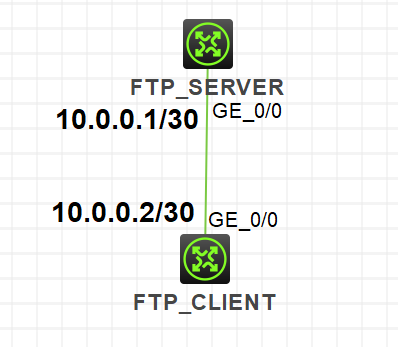

文件传输协议是能够提供在远端主机和本地服务器之间传输文件的服务，其中FTP 和TFTP 是最常用的文件传输协议。

在H3C模拟器上进行FTP、TFTP的配置，系统版本v7。

<!-- more -->

# 原理

## FTP

1. FTP协议是互联网上广泛使用的文件传输协议。

2. 采用客户端/服务器模式，基于TCP。

3. FTP采用双TCP连接方式：

* 控制连接（TCP/21）：用于在FTP客户端和FTP服务器之间传输FTP控制命令及命令执行信息。控制连接在整个FTP会话期间一直保持打开。

* 数据连接（TCP/20）：用于传输数据，包括数据上传、下载、文件列表发送等。数据传输结束后数据连接将终止。

4. FTP有两种文件传输模式：

* ASCII模式（默认）：本地文件转换成标准的ASCII码再传输，适用于传输文本文件。

* 二进制流模式（图像文件传输模式）：文件按照比特流的方式进行传输，适用于传送程序文件。

5. FTP采用两种数据传输方式：

* 主动方式（PORT）：FTP客户端向FTP服务器告知用于传输数据的临时端口号。当需要传送数据时，服务器主动发起连接。

* 被动方式（PASV）：FTP客户端向FTP服务器告知处于被动方式，服务器选择临时端口号并告知客户端。当需要传送数据时，客户器主动发起连接。

## TFTP

1. TFTP（简单文件传输协议）也是采用客户机/服务器模式的文件传输协议。

2. TFTP适用于客户端和服务器之间不需要复杂交互的环境。

3. TFTP承载在UDP之上，端口号69。

4. TFTP仅提供简单的文件传输功能（上传、下载）。

5. TFTP没有存取授权与认证机制，不提供目录列表功能。

6. TFTP协议传输是由客户端发起的。

# 配置

## FTP

按照下图拓扑连接，配置IP，使网络互通：



在**FTP_SERVER**上配置：

```
[FTP_SERVER]ftp server enable
[FTP_SERVER]local-user ftp_manage
[FTP_SERVER-luser-manage-ftp_manage]password simple 123456
[FTP_SERVER-luser-manage-ftp_manage]service-type ftp
[FTP_SERVER-luser-manage-ftp_manage]authorization-attribute user-role network-admin
```

在**FTP_CLIENT**上验证：

```
<FTP_CLIENT>ftp 10.0.0.1
Press CTRL+C to abort.
Connected to 10.0.0.1 (10.0.0.1).
220 FTP service ready.
User (10.0.0.1:(none)): ftp_manager
331 Password required for ftp_manager.
Password:123456
230 User logged in.
Remote system type is UNIX.
Using binary mode to transfer files.
ftp>
```

之后即可在客户端执行下列常见操作：

```
ftp> pwd  //查看当前所在目录名
257 "/" is your current location

ftp> ls  //查看当前目录下文件列表
227 Entering Passive Mode (10,0,0,1,236,68)
150 Accepted data connection
drwxrwxrwx    2 0          0                4096 Aug  4 11:07 diagfile
-rwxrwxrwx    1 0          0                   0 Aug  4 11:35 lauth.dat
-rwxrwxrwx    1 0          0               43136 Aug  4 11:07 licbackup
drwxrwxrwx    3 0          0                4096 Aug  4 11:07 license
-rwxrwxrwx    1 0          0               43136 Aug  4 11:07 licnormal
drwxrwxrwx    2 0          0                4096 Aug  4 11:07 logfile
-rwxrwxrwx    1 0          0                   0 Aug  4 11:07 msr36-cmw710-boot-a7514.bin
-rwxrwxrwx    1 0          0                   0 Aug  4 11:07 msr36-cmw710-system-a7514.bin
drwxrwxrwx    2 0          0                4096 Aug  4 11:07 pki
drwxrwxrwx    2 0          0                4096 Aug  4 11:07 seclog
226 10 matches total

ftp> cd pki  //切换当前所在目录
250 OK. Current directory is /pki

ftp> ls
227 Entering Passive Mode (10,0,0,1,227,79)
150 Accepted data connection
-rwxrwxrwx    1 0          0                2398 Aug  4 11:07 https-server.p12
226 1 matches total

ftp> get https-server.p12  //下载FTP服务器上的文件
227 Entering Passive Mode (10,0,0,1,34,49)
150 Accepted data connection
.
226 File successfully transferred
2398 bytes received in 0.003 seconds (780.60 Kbytes/s)

ftp> cd /
250 OK. Current directory is /

ftp> put https-server.p12 //上传文件到FTP服务器上
227 Entering Passive Mode (10,0,0,1,93,201)
150 Accepted data connection
.
226 File successfully transferred
2398 bytes sent in 0.000 seconds (2.34 Kbytes/s)

ftp> bye  //断开ftp连接
221-Goodbye. You uploaded 3 and downloaded 3 kbytes.
221 Logout.
```

## TFTP

```
<Router> tftp server-address { get | put | sget } source-filename [ destination-filename ] [ source { ip source-ip-address | interface interface-type interface-number } ] 
```

* 在用户视图下使用
* 此命令用于使路由器作为TFTP客户端登录远程TFTP服务器
* server-address：TFTP服务器的IP地址或主机名。
* source-filename：源文件名。
* destination-filename：目标文件名。
* get：表示普通下载文件操作。
* put：表示上传文件操作。
* sget：表示安全下载文件操作。

# 参考

1. H3C X00040004 第18章 文件传输协议