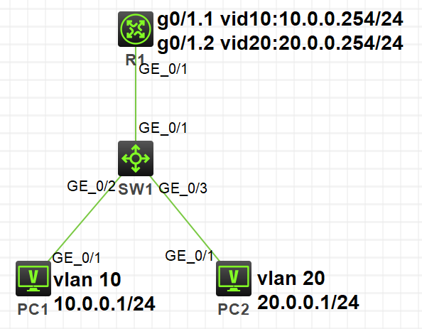

vlan间路由的实现方法一般有两种：

1. 单臂路由器802.1Q和子接口实现VLAN间路由
2. 三层交换机启用内置三层路由转发引擎执行VLAN间路由

在H3C模拟器上进行vlan间路由的配置，系统版本v7。

<!-- more -->

# 单臂路由

## 拓扑

按照下图拓扑连接，并配置pc端IP地址：



## 配置

`SW1`上配置vlan10、vlan20，将上联路由器口设为trunk，允许vlan10、vlan20通过：

```
[SW1]vlan 10
[SW1-vlan10]port g1/0/2
[SW1-vlan10]vlan 20
[SW1-vlan20]port g1/0/3
[SW1-vlan20]int g1/0/1
[SW1-GigabitEthernet1/0/1]port link-type trunk
[SW1-GigabitEthernet1/0/1]port trunk permit vlan 10 20
```

`R1`上配置子接口，封装dot1q协议：

```
[R1]int g0/1.1
[R1-GigabitEthernet0/1.1]ip add 10.0.0.254 24
[R1-GigabitEthernet0/1.1]vlan-type dot1q vid 10
[R1-GigabitEthernet0/1.1]int g0/1.2
[R1-GigabitEthernet0/1.2]ip add 20.0.0.254 24
[R1-GigabitEthernet0/1.2]vlan-type dot1q vid 20
```

# 三层交换机

## 拓扑

拓扑同上，但是不需要路由器`R1`，直接在`SW1`上配置vlan虚接口的ip地址即可，H3C交换机默认启用三层路由功能。

## 配置

```
[SW1]int vlan 10
[SW1-Vlan-interface10]ip add 10.0.0.254 24
[SW1-Vlan-interface10]int vlan 20
[SW1-Vlan-interface20]ip add 20.0.0.254 24
```

# 参考

1. H3C X00050002 第22章 直连路由和静态路由