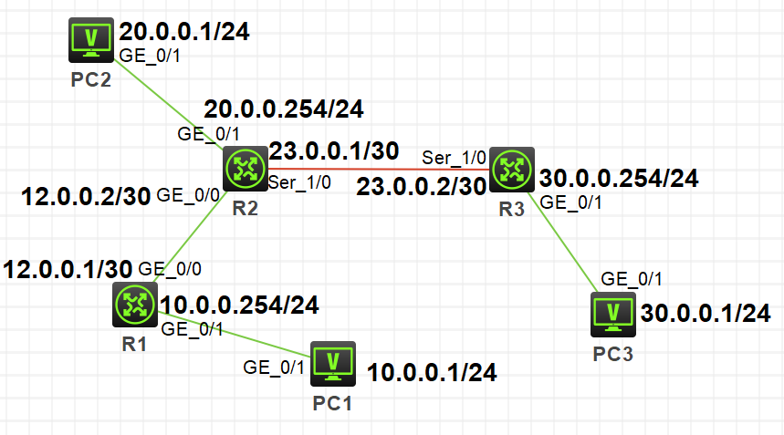
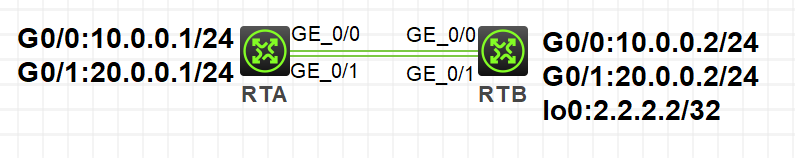
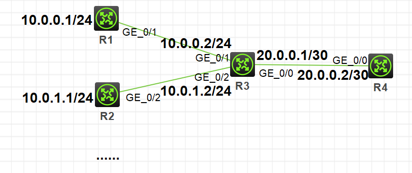

在网络中，路由器负责将数据报文在逻辑网段间进行转发，其中路由是指导路由器如何进行数据报文发送的路径信息。

每台路由器都有路由表，路由存储在路由表中。

由手工配置的静态路由，无开销，配置简单，需人工维护，适合简单拓扑结构的网络。

在H3C模拟器上进行静态路由的配置，系统版本v7。

<!-- more -->

# 静态路由

## 拓扑

按照下图拓扑连接，并配置各端口IP地址：



一般在拓扑网络内部配置**静态路由**，在网络边界为了省事配置**默认路由**，即目的网段为**0.0.0.0/0**的静态路由。

## 配置

在`R1`、`R2`上配置默认路由，指向下一跳IP地址：

```
[R1]ip route-static 0.0.0.0 0 12.0.0.2
[R3]ip route-static 0.0.0.0 0 23.0.0.1
```

在`R2`上配置非直连的两个网段**10.0.0.0/24**、**30.0.0.0/24**的静态路由，前者指向下一跳IP地址，***后者可以指定下一跳IP地址或者出接口***，这里按照出接口配置：

```
[R2]ip route-static 10.0.0.0 24 12.0.0.1
[R2]ip route-static 30.0.0.0 24 s1/0
```

# 路由备份与负载分担

1. 路由备份：
* 到相同目的地址的下一跳和优先级都不同
* 优先级高的为主，低的为备
2. 负载分担：
* 到相同目的地址的下一跳不同，但优先级相同
* 到目的地的流量将均匀分布

## 拓扑

按照下图拓扑连接，并配置各端口IP地址：



## 配置

在`RTA`上配置到`RTB`的lo0端口的两条静态路由：

优先级一致时为负载分担：

```
[RTA]ip route-static 2.2.2.2 32 10.0.0.2 preference 60
[RTA]ip route-static 2.2.2.2 32 20.0.0.2 preference 60
```

优先级不一致时为路由备份：

```
[RTA]ip route-static 2.2.2.2 32 10.0.0.2 preference 50 //主
[RTA]ip route-static 2.2.2.2 32 20.0.0.2 preference 100 //备
```

# 黑洞路由

正确的应用黑洞路由可以消除环路。

## 拓扑

按照下图拓扑连接，并配置各端口IP地址：



当**10.0.0.0/16**网段中掩码24位的子网段很多时（图中只放了两个示例），配置多条静态路由显然很麻烦。这时可在`R3`上配置一条默认路由作为出口路由，同时搭配一条黑洞路由，避免子网段间访问出现环路。

## 配置

`R4`上配置到静态路由：

```
[R4]ip route-static 10.0.0.0 16 20.0.0.1
```

`R1`、`R2`上配置缺省路由指向`R3`：

```
[R1]ip route-static 0.0.0.0 0 10.0.0.2
[R2]ip route-static 0.0.0.0 0 10.0.1.2
```

`R3`上配置出口缺省路由搭配内部网段黑洞路由：

```
[R3]ip route-static 0.0.0.0 0 20.0.0.2
[R3]ip route-static 10.0.0.0 16 NULL 0
```

## 验证

```
# 若不配置黑洞路由，例如当R2与R3断路后，R1到R2的包会按照缺省路由发往R4，R4又会发回R3，造成环路

[R1]tracert 10.0.1.1
traceroute to 10.0.1.1 (10.0.1.1), 30 hops at most, 40 bytes each packet, press CTRL_C to break
 1  10.0.0.2 (10.0.0.2)  1.000 ms  0.000 ms  1.000 ms
 2  20.0.0.2 (20.0.0.2)  1.000 ms  1.000 ms  1.000 ms
 3  20.0.0.1 (20.0.0.1)  1.000 ms  1.000 ms  1.000 ms
 4  20.0.0.2 (20.0.0.2)  1.000 ms  0.000 ms  2.000 ms
 5  20.0.0.1 (20.0.0.1)  0.000 ms  1.000 ms  1.000 ms
 6  20.0.0.2 (20.0.0.2)  1.000 ms  1.000 ms  1.000 ms
 7  20.0.0.1 (20.0.0.1)  2.000 ms  3.000 ms  2.000 ms
 8  20.0.0.2 (20.0.0.2)  2.000 ms  2.000 ms *
 9

# 若配置黑洞路由，当R2与R3断路后，R1到R2的包会直接丢弃

[R1]tracert 10.0.1.1
traceroute to 10.0.1.1 (10.0.1.1), 30 hops at most, 40 bytes each packet, press CTRL_C to break
 1  10.0.0.2 (10.0.0.2)  1.000 ms  1.000 ms  0.000 ms
 2

```

# 参考

1. H3C X00050001 第21章 IP路由原理
2. H3C X00050002 第22章 直连路由和静态路由