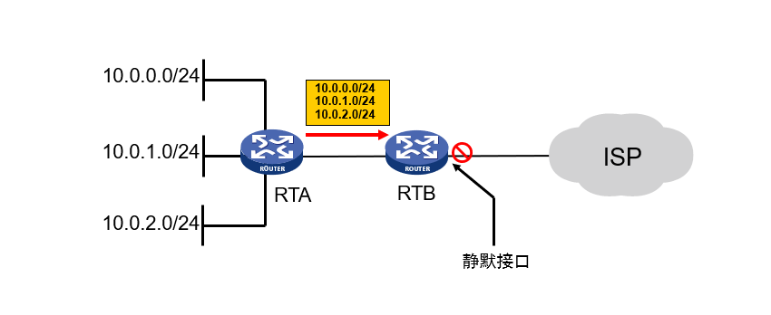

路由器在发布与接收路由信息时，可能需要对路由信息进行过滤。

其中常用的路由过滤工具有ACL、地址前缀列表等。

在H3C模拟器上进行路由过滤的配置，包括静默端口、地址前缀列表、filter-policy、Route-policy等，系统版本v7。

<!-- more -->

# 路由过滤

## 原理


如图在`RTB`实施路由过滤后，转发向外部的路由条目减少。

路由过滤控制路由的传播与生成，节省设备和链路资源消耗，保护网络安全。

路由过滤常见的方法有以下几点：

* 过滤路由协议报文
* 过滤路由协议报文中携带的路由信息
* 对LSDB计算出的路由信息进行过滤 


## 分类

常用路由过滤工具有以下几种：

1. 静默端口

2. 过滤器

* 访问控制列表

* 地址前缀列表

* filter-policy

* Route-policy 

# 静默端口



如上图，在`RTB`出接口配置静默端口，则过滤全部路由。

需注意rip和ospf中配置静默端口的区别：

* RIP协议中，静默接口不发送路由更新

* OSPF协议中，静默接口不发送HELLO报文

配置命令基本一致：

``` 
# rip下配置静默端口
[RTB]rip 1
[RTB-rip-1]silent-interface g0/2

# ospf下配置静默端口
[RTB]ospf 1
[RTB-ospf-1]silent-interface g0/2
```

# 地址前缀列表

## 原理

地址前缀列表匹配流程：


如果所有表项都是deny模式，则任何路由都不能通过该过滤列表。这种情况下，需要在多条deny模式的表项后定义一条**permit 0.0.0.0 0 less-equal 32**表项，允许其它所有IPv4路由信息通过。

配置命令是：

```
[H3C] ip prefix-list prefix-list-name [ index index-number ] { deny | permit } ip-address mask-length [ greater-equal min-mask-length ] [ less-equal max-mask-length ]
```

需要注意的是：

* **Permit 0.0.0.0 0** 仅匹配缺省路由
* **Permit 0.0.0.0 0 less-equal 32** 匹配所有路由

# filter-policy

通过与ACL、地址前缀列表结合使用，filter-policy可对路由信息进行过滤。

## 拓扑

按照下图拓扑，连接并配置各端口ip：


在各路由器启用rip协议，版本`ver 2`，并关闭自动聚合功能`undo summary`。

## 配置

两种方式，前缀地址列表、ACL均可以实现。

### filter-policy搭配前缀地址列表过滤接收路由

```
[R4]ip prefix-list denyR1 index 10 deny 10.0.1.0 24
[R4]ip prefix-list denyR1 index 100 permit 0.0.0.0 0 less-equal 32

[R4]rip 1
[R4-rip-1]filter-policy prefix-list denyR1 import //入口方向，配到出口也生效
```

### filter-policy搭配访问控制列表过滤发送路由

```
[R4]acl basic 2000
[R4-acl-ipv4-basic-2000]rule 10 deny source 10.0.1.0 0.0.0.255
[R4-acl-ipv4-basic-2000]rule 100 permit source any
[R4-acl-ipv4-basic-2000]quit

[R4]rip 1
[R4-rip-1]filter-policy 2000 export //出口方向，配到入口也生效
```

## 验证

配置前查看`R5`路由表：

```
[R5]dis ip ro

Destinations : 15       Routes : 15

Destination/Mask   Proto   Pre Cost        NextHop         Interface
... ...
10.0.1.0/24        RIP     100 2           12.0.0.1        GE0/0 //R1网段
10.0.2.0/24        RIP     100 2           12.0.0.1        GE0/0
11.0.0.0/24        RIP     100 1           12.0.0.1        GE0/0
... ...
```

配置后查看`R5`路由表：

```
[R5]dis ip ro

Destinations : 14       Routes : 14

Destination/Mask   Proto   Pre Cost        NextHop         Interface
... ...
10.0.2.0/24        RIP     100 2           12.0.0.1        GE0/0
11.0.0.0/24        RIP     100 1           12.0.0.1        GE0/0
//R1网段已被过滤
... ...
```

## 其他

用filter-policy过滤OSPF和IS-IS路由的命令与上面类似，但要注意：**filter-policy过滤掉的是计算出的路由，而非LSA。**对OSPF或IS-IS计算出来的路由进行过滤，只有通过过滤的路由才被添加到路由表中。


# Route-policy 

## 原理

路由策略（Routing Policy）是为了改变网络流量所经过的途径而修改路由信息的技术 。

Route-policy是实现路由策略的工具，其作用包括：

1. **路由过滤**
2. **改变路由信息属性**

Route-policy匹配流程如下：


* 节点之间的过滤关系是“**或**”的关系，如果通过了其中一个节点，就意味着通过该路由策略，不再对其他节点进行匹配（配置了continue子句的情况除外）。

* 节点的if-match子句之间的过滤关系是“**与**”的关系。

Route-policy命令的组成如下图：


节点匹配规则与执行动作如下表：

| 匹配规则（if-match） | 描述 |
|-|-|
| ACL | 路由信息的目的IP地址范围的匹配条件 |
| prefix-list | 路由信息的目的IP地址范围的匹配条件 |
| ip next-hop | 路由信息的下一跳地址的匹配条件 |
| interface | 路由信息的出接口的匹配条件 |
| route-type | 路由信息类型的匹配条件 |
| tag | RIP、OSPF、IS-IS路由信息的标记域的匹配条件 |
| cost | 路由信息的路由开销的匹配条件 |

| 动作（apply）| 描述 |
|-|-|
| ip-address  next-hop | 设定通过过滤后路由信息的下一跳地址 |
| preference | 设定通过过滤后路由协议的优先级 |
| tag | 设定通过过滤后RIP、OSPF、IS-IS路由信息的标记域 |
| cost | 设定通过过滤后路由信息的路由开销 |
| cost-type | 设定通过过滤后路由信息的路由开销类型 |

## 拓扑

按照下图拓扑，连接并配置各端口ip：


在路由器`RTA`、`RTB`、`RTC`启用rip协议，版本`ver 2`，并关闭自动聚合功能`undo summary`。在路由器`RTB`、`RTC`、`RTD`启用ospf协议，区域`area 0`。

## 配置

### 选择性引入静态路由

在`RTA`上配置静态路由并引入rip中：

```
[RTA]ip route-static 10.1.0.0 24 10.0.1.2
[RTA]ip route-static 10.1.1.0 24 10.0.1.2
[RTA]rip 1
[RTA-rip-1]import-route static
[RTA-rip-1]default cost 2
```

配置完成后在`RTB`、`RTC`上查看路由表：

```
[RTB]dis ip routing-table

Destinations : 20       Routes : 20

Destination/Mask   Proto   Pre Cost        NextHop         Interface
... ...
10.0.1.0/24        RIP     100 1           192.168.1.1     GE5/0
10.1.0.0/24        RIP     100 3           192.168.1.1     GE5/0
10.1.1.0/24        RIP     100 3           192.168.1.1     GE5/0
192.168.1.4/30     RIP     100 1           192.168.1.1     GE5/0
... ...


[RTC]dis ip routing-table

Destinations : 20       Routes : 20

Destination/Mask   Proto   Pre Cost        NextHop         Interface
... ...
10.0.1.0/24        RIP     100 1           192.168.1.5     GE5/0
10.1.0.0/24        RIP     100 3           192.168.1.5     GE5/0
10.1.1.0/24        RIP     100 3           192.168.1.5     GE5/0
192.168.1.0/30     RIP     100 1           192.168.1.5     GE5/0
... ...
```

可见，`RTA`将引入的路由**10.1.0.0/24**、**10.1.1.0/24**发布给`RTB`、`RTC`，度量值为3（缺省值加1）。

在`RTA`上配置route-policy，仅引入路由**10.1.0.0/24**：

```
[RTA]ip prefix-list pre1 index 10 permit 10.1.0.0 24
[RTA]route-policy rou1 permit node 10
[RTA-route-policy-rou1-10]if-match ip address prefix-list pre1
[RTA-route-policy-rou1-10]quit

[RTA]rip 1
[RTA-rip-1]import-route static route-policy rou1
```

配置完成后在`RTB`、`RTC`上查看路由表：

```
[RTB]dis ip routing-table

Destinations : 19       Routes : 19

Destination/Mask   Proto   Pre Cost        NextHop         Interface
... ...
10.0.1.0/24        RIP     100 1           192.168.1.1     GE5/0
10.1.0.0/24        RIP     100 3           192.168.1.1     GE5/0
192.168.1.4/30     RIP     100 1           192.168.1.1     GE5/0
... ...


[RTC]dis ip routing-table

Destinations : 19       Routes : 19

Destination/Mask   Proto   Pre Cost        NextHop         Interface
... ...
10.0.1.0/24        RIP     100 1           192.168.1.5     GE5/0
10.1.0.0/24        RIP     100 3           192.168.1.5     GE5/0
192.168.1.0/30     RIP     100 1           192.168.1.5     GE5/0
... ...
```

可见，`RTA`只将路由**10.1.0.0/24**发布给`RTB`、`RTC`，而路由**10.1.1.0/24**在引入时被过滤掉。

### 路由重分发

在`RTB`、`RTC`上配置双边引入：

```
# RTB的rip中引入ospf
[RTB-rip-1]import-route ospf

# RTC的ospf中引入rip
[RTC-ospf-1]import-route rip
```

配置完成后在`RTA`、`RTD`上查看路由表：

```
[RTA]dis ip routing-table

Destinations : 24       Routes : 24

Destination/Mask   Proto   Pre Cost        NextHop         Interface
... ...
10.0.2.0/24        RIP     100 1           192.168.1.2     GE5/0
... ...


[RTD]dis ip routing-table

Destinations : 23       Routes : 23

Destination/Mask   Proto   Pre Cost        NextHop         Interface
... ...
10.0.1.0/24        O_ASE2  150 1           192.168.2.5     GE5/1
10.1.0.0/24        O_ASE2  150 1           192.168.2.5     GE5/1
... ...
```

可见`RTA`学到了**10.0.2.0/24**网段，`RTD`也学到了**10.0.1.0/24**和**10.1.0.0/24**网段。

### 制造环路

配置了路由边界引入后，在某些情况下可能会导致路由环路或错误。下面人为制造环路：

```
# 在RTA上将静态路由的优先级设置为120
[RTA]ip route-static 10.1.0.0 24 10.0.1.2 preference 120
# 在RTB上将rip优先级设置为200，使RTB能将RTD学到的10.1.0.0/24路由向rip域发布
[RTB-rip-1]preference 200
```

配置完成后在`RTA`上查看路由表：

```
[RTA]dis ip routing-table

Destinations : 24       Routes : 24

Destination/Mask   Proto   Pre Cost        NextHop         Interface
... ...
10.1.0.0/24        RIP     100 1           192.168.1.2     GE5/0
... ...
```

可见`RTA`上优先级100的rip路由更新掉了优先级120的静态路由。此时，`RTA`认为通过`RTB`可以到达**10.1.0.0/24**网段，`RTB`又认为可以通过`RTD`可以到达，同时`RTD`认为可以通过`RTC`可以到达，`RTC`又认为可以通过`RTA`可以到达，于是环路产生了。

此时在`RTA`上查看到达**10.1.0.0/24**网段的路径：

```
<RTA>tracert 10.1.0.1
traceroute to 10.1.0.1 (10.1.0.1), 30 hops at most, 40 bytes each packet, press CTRL_C to break
 1  192.168.1.2 (192.168.1.2)  1.000 ms  1.000 ms  2.000 ms
 2  192.168.2.2 (192.168.2.2)  3.000 ms  2.000 ms  2.000 ms
 3  192.168.2.5 (192.168.2.5)  3.000 ms  2.000 ms  2.000 ms
 4  192.168.1.5 (192.168.1.5)  2.000 ms  3.000 ms  2.000 ms
 5  192.168.1.2 (192.168.1.2)  3.000 ms  3.000 ms  3.000 ms
 6  192.168.2.2 (192.168.2.2)  5.000 ms  4.000 ms  4.000 ms
 7  192.168.2.5 (192.168.2.5)  5.000 ms  3.000 ms  4.000 ms
 8  192.168.1.5 (192.168.1.5)  5.000 ms  5.000 ms  4.000 ms
 9  192.168.1.2 (192.168.1.2)  5.000 ms  5.000 ms  5.000 ms
10  192.168.2.2 (192.168.2.2)  8.000 ms  5.000 ms  5.000 ms
11  192.168.2.5 (192.168.2.5)  7.000 ms  7.000 ms  7.000 ms
12  192.168.1.5 (192.168.1.5)  6.000 ms  6.000 ms  8.000 ms
13  192.168.1.2 (192.168.1.2)  7.000 ms  9.000 ms *
14  192.168.2.2 (192.168.2.2)  18.000 ms  17.000 ms  17.000 ms
15  192.168.2.5 (192.168.2.5)  19.000 ms  18.000 ms  17.000 ms
16  192.168.1.5 (192.168.1.5)  17.000 ms  17.000 ms  16.000 ms
17  * 192.168.1.2 (192.168.1.2)  20.000 ms  19.000 ms
18  192.168.2.2 (192.168.2.2)  24.000 ms  26.000 ms  21.000 ms
19  192.168.2.5 (192.168.2.5)  9.000 ms  8.000 ms  6.000 ms
20  192.168.1.5 (192.168.1.5)  8.000 ms  9.000 ms  5.000 ms
21  192.168.1.2 (192.168.1.2)  9.000 ms  11.000 ms  11.000 ms
22  192.168.2.2 (192.168.2.2)  15.000 ms  13.000 ms  13.000 ms
23  192.168.2.5 (192.168.2.5)  14.000 ms  12.000 ms  10.000 ms
24  192.168.1.5 (192.168.1.5)  13.000 ms  14.000 ms  12.000 ms
25  192.168.1.2 (192.168.1.2)  12.000 ms  14.000 ms  12.000 ms
26  192.168.2.2 (192.168.2.2)  12.000 ms  13.000 ms  13.000 ms
27  192.168.2.5 (192.168.2.5)  14.000 ms  15.000 ms  14.000 ms
28  192.168.1.5 (192.168.1.5)  15.000 ms  15.000 ms  14.000 ms
29  192.168.1.2 (192.168.1.2)  15.000 ms  16.000 ms  16.000 ms
30  192.168.2.2 (192.168.2.2)  17.000 ms  18.000 ms  18.000 ms
!Destination not found inside Max Hop Count.
```

### 避免环路

由于`RTB`在引入OSPF路由时不加任何选择，因此出现了上面的环路错误。

可以通过配置route-policy对引入的路由加以选择，避免环路的产生：

```
# 在RTC配置引入的ospf路由条目打上tag10
[RTC-rip-1]import-route ospf tag 10

# 在RTB配置不引入tag为10的ospf路由条目
[RTB]route-policy rou2 deny node 10
[RTB-route-policy-rou2-10]if-match tag 10
[RTB]route-policy rou2 permit node 20

[RTB]rip 1
[RTB-rip-1]import-route ospf route-policy rou2

```

此时再从`RTA`上查看路由表：

```
<RTA>dis ip ro

Destinations : 24       Routes : 24

Destination/Mask   Proto   Pre Cost        NextHop         Interface
... ...
10.1.0.0/24        Static  120 0           10.0.1.2        GE0/0
... ...
```

可以看到，优先级为120的**10.1.0.0/24**网段静态路由又出现在了路由表中。

# 参考

1. H3C A00500010 路由过滤
2. H3C A00500020 路由策略