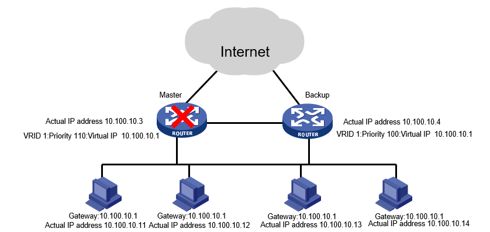

通常，同一网段内的所有主机都设置一条相同的以网关为下一跳的缺省路由。当网关发生故障时，本网段内所有以网关为缺省路由的主机将无法与外部网络通信。

通过VRRP可以避免由于局域网网关单点故障而导致的网络中断。

在H3C模拟器上进行VRRP的配置，包括**单备份组配置**、**监视接口配置**、**双备份组配置**，系统版本v7。

<!-- more -->

# 原理

## VRRP概念

* RFC 3768定义的VRRPv2是一种容错协议，在提高可靠性的同时，简化了主机的配置。

* VRRP协议报文使用固定的组播地址224.0.0.18进行发送。

* 虚拟路由器由LAN上唯一的Virtual Router ID标识。并具有虚MAC地址：00-00-5E-00-01-{vrid}。

## VRRP主备备份



* VRRP将可以将多个路由器加入到备份组中，形成一台虚拟路由器，承担网关功能。

* 只要备份组中仍有一台路由正常工作，虚拟路由器就仍然正常工作。

## VRRP负载分担


* VRRP将多台路由器同时承担业务，形成多台虚拟路由器，分担内网与外网之间的流量。

## VRRP选举


当路由器使能VRRP功能后，会根据优先级确定自己在备份组中的角色。当优先级变化后，根据VRRP模式确认VRRP状态。

* 在非抢占模式下。即使配置backup更高的优先级，也不会迁移master。

* 抢占模式下，谁大谁优先。

## VRRP监视接口功能


* 当Master路由器连接上行链路的接口处于Down状态时，路由器主动降低自己的优先级，使得备份组内重新选择Master，承担转发任务。

# 单备份组配置

## 拓扑

按下图拓扑连接，配置各端口ip，并启用rip协议，版本号`ver 2`，并关闭自动汇总`undo summary`，并在`SWA`、`SWB`的rip进程中将vlan10设置为静默端口。


## 配置

在`SWA`上配置VRRP单备份组1虚拟IP，优先级120，抢占模式：

```
[SWA]int vlan 10
[SWA-Vlan-interface10]vrrp vrid 1 virtual-ip 192.168.0.254
[SWA-Vlan-interface10]vrrp vrid 1 priority 120
[SWA-Vlan-interface10]vrrp vrid 1 preempt-mode
```

在`SWB`上配置VRRP单备份组1虚拟IP，优先级100，抢占模式：

```
[SWB]int vlan 10
[SWB-Vlan-interface10]vrrp vrid 1 virtual-ip 192.168.0.254
[SWB-Vlan-interface10]vrrp vrid 1 priority 100
[SWB-Vlan-interface10]vrrp vrid 1 preempt-mode
```

## 验证

在`PCA`上tracert`PCC`，可以看出报文通过**SWA**转发：

```
[PCA]tracert 10.0.0.1
traceroute to 10.0.0.1 (10.0.0.1), 30 hops at most, 40 bytes each packet, press CTRL_C to break
 1  192.168.0.252 (192.168.0.252)  2.000 ms  3.000 ms  2.000 ms
 2  192.168.255.2 (192.168.255.2)  3.000 ms  3.000 ms  4.000 ms
 3  10.0.0.1 (10.0.0.1)  4.000 ms  4.000 ms  5.000 ms
```

此时`SWA`、`SWB`的VRRP端口表项如下：

```
[SWA]dis vrrp verbose
IPv4 virtual router information:
 Running mode : Standard
 Total number of virtual routers : 1
   Interface Vlan-interface10
     VRID             : 1                   Adver timer  : 100 centiseconds
     Admin status     : Up                  State        : Master
     Config pri       : 120                 Running pri  : 120
     Preempt mode     : Yes                 Delay time   : 0 centiseconds
     Auth type        : None
     Virtual IP       : 192.168.0.254
     Virtual MAC      : 0000-5e00-0101
     Master IP        : 192.168.0.252


[SWB]dis vrrp verbose
IPv4 virtual router information:
 Running mode : Standard
 Total number of virtual routers : 1
   Interface Vlan-interface10
     VRID             : 1                   Adver timer  : 100 centiseconds
     Admin status     : Up                  State        : Backup
     Config pri       : 100                 Running pri  : 100
     Preempt mode     : Yes                 Delay time   : 0 centiseconds
     Become master    : 2930 millisecond left
     Auth type        : None
     Virtual IP       : 192.168.0.254
     Master IP        : 192.168.0.252
```

即`SWA`为主，`SWB`为备。

接下来在`SWA`上关闭与`SWC`相连的g1/0/2端口：

```
[SWA]int g1/0/2
[SWA-GigabitEthernet1/0/2]shutdown
```

此时再从`PCA`上tracert`PCC`，可以看出报文转由**SWB**转发：

```
[PCA]tracert 10.0.0.1
traceroute to 10.0.0.1 (10.0.0.1), 30 hops at most, 40 bytes each packet, press CTRL_C to break
 1  192.168.0.253 (192.168.0.253)  2.000 ms  2.000 ms  1.000 ms
 2  192.168.255.6 (192.168.255.6)  4.000 ms  3.000 ms  4.000 ms
 3  10.0.0.1 (10.0.0.1)  4.000 ms  4.000 ms  5.000 ms
```

此时`SWA`、`SWB`的VRRP端口表项如下：

```
[SWA]dis vrrp verbose
IPv4 virtual router information:
 Running mode : Standard
 Total number of virtual routers : 1
   Interface Vlan-interface10
     VRID             : 1                   Adver timer  : 100 centiseconds
     Admin status     : Up                  State        : Initialize
     Config pri       : 120                 Running pri  : 120
     Preempt mode     : Yes                 Delay time   : 0 centiseconds
     Auth type        : None
     Virtual IP       : 192.168.0.254
     Master IP        : 0.0.0.0


[SWB]dis vrrp verbose
IPv4 virtual router information:
 Running mode : Standard
 Total number of virtual routers : 1
   Interface Vlan-interface10
     VRID             : 1                   Adver timer  : 100 centiseconds
     Admin status     : Up                  State        : Master
     Config pri       : 100                 Running pri  : 100
     Preempt mode     : Yes                 Delay time   : 0 centiseconds
     Auth type        : None
     Virtual IP       : 192.168.0.254
     Virtual MAC      : 0000-5e00-0101
     Master IP        : 192.168.0.253
```

即`SWA`为Initialize状态不参与转发，`SWB`为主。

# 监视接口配置

## 拓扑

按下图拓扑连接，配置各端口ip，并启用rip协议，版本号`ver 2`，并关闭自动汇总`undo summary`，并在`SWA`、`SWB`的rip进程中将vlan10、vlan20设置为静默端口。


## 配置

在`SWA`上配置VRRP单备份组1虚拟IP，优先级120，抢占模式：

```
[SWA]int vlan 10
[SWA-Vlan-interface10]vrrp vrid 1 virtual-ip 192.168.0.254
[SWA-Vlan-interface10]vrrp vrid 1 priority 120
[SWA-Vlan-interface10]vrrp vrid 1 preempt-mode
```

在`SWB`上配置VRRP单备份组1虚拟IP，优先级100，抢占模式：

```
[SWB]int vlan 10
[SWB-Vlan-interface10]vrrp vrid 1 virtual-ip 192.168.0.254
[SWB-Vlan-interface10]vrrp vrid 1 priority 100
[SWB-Vlan-interface10]vrrp vrid 1 preempt-mode
```

在`SWA`上配置VRRP监视端口：

```
[SWA]track 1 interface Vlan-interface 100

[SWA]int vlan 10
[SWA-Vlan-interface10]vrrp vrid 1 track 1 priority reduced 30
```

## 验证

配置VRRP监视端口前，断掉vlan100，`PCA`tracert`PCC`不通：

```
<PCA>tracert 10.0.0.1
traceroute to 10.0.0.1 (10.0.0.1), 30 hops at most, 40 bytes each packet, press CTRL_C to break
 1  192.168.0.252 (192.168.0.252)  3.000 ms  2.000 ms  1.000 ms
 2  192.168.0.252 (192.168.0.252)  2.000 ms !N  3.000 ms !N  2.000 ms !N
```

此时`SWA`、`SWB`的VRRP端口表项如下：

```
[SWA]dis vrrp verbose
IPv4 virtual router information:
 Running mode : Standard
 Total number of virtual routers : 1
   Interface Vlan-interface10
     VRID             : 1                   Adver timer  : 100 centiseconds
     Admin status     : Up                  State        : Master
     Config pri       : 120                 Running pri  : 120
     Preempt mode     : Yes                 Delay time   : 0 centiseconds
     Auth type        : None
     Virtual IP       : 192.168.0.254
     Virtual MAC      : 0000-5e00-0101
     Master IP        : 192.168.0.252
   VRRP track information:
     Track object   : 1                   State : Positive   Pri reduced : 30


[SWB]dis vrrp verbose
IPv4 virtual router information:
 Running mode : Standard
 Total number of virtual routers : 1
   Interface Vlan-interface10
     VRID             : 1                   Adver timer  : 100 centiseconds
     Admin status     : Up                  State        : Backup
     Config pri       : 100                 Running pri  : 100
     Preempt mode     : Yes                 Delay time   : 0 centiseconds
     Become master    : 2930 millisecond left
     Auth type        : None
     Virtual IP       : 192.168.0.254
     Master IP        : 192.168.0.252
```

即`SWA`仍为主，优先级120；`SWB`为备，优先级100。

配置监视端口后，断掉vlan100，此时再从`PCA`上tracert`PCC`，可以看出报文转由**SWB**转发：

```
[PCA]tracert 10.0.0.1
traceroute to 10.0.0.1 (10.0.0.1), 30 hops at most, 40 bytes each packet, press CTRL_C to break
 1  192.168.0.253 (192.168.0.253)  2.000 ms  2.000 ms  1.000 ms
 2  192.168.255.6 (192.168.255.6)  4.000 ms  3.000 ms  4.000 ms
 3  10.0.0.1 (10.0.0.1)  4.000 ms  4.000 ms  5.000 ms
```

此时`SWA`、`SWB`的VRRP端口表项如下：

```
[SWA]dis vrrp verbose
IPv4 virtual router information:
 Running mode : Standard
 Total number of virtual routers : 1
   Interface Vlan-interface10
     VRID             : 1                   Adver timer  : 100 centiseconds
     Admin status     : Up                  State        : Backup
     Config pri       : 120                 Running pri  : 90
     Preempt mode     : Yes                 Delay time   : 0 centiseconds
     Become master    : 3090 millisecond left
     Auth type        : None
     Virtual IP       : 192.168.0.254
     Master IP        : 192.168.0.253
   VRRP track information:
     Track object   : 1                   State : Negative   Pri reduced : 30


[SWB]dis vrrp verbose
IPv4 virtual router information:
 Running mode : Standard
 Total number of virtual routers : 1
   Interface Vlan-interface10
     VRID             : 1                   Adver timer  : 100 centiseconds
     Admin status     : Up                  State        : Master
     Config pri       : 100                 Running pri  : 100
     Preempt mode     : Yes                 Delay time   : 0 centiseconds
     Auth type        : None
     Virtual IP       : 192.168.0.254
     Virtual MAC      : 0000-5e00-0101
     Master IP        : 192.168.0.253
```

可见VRRP状态发生了迁移，`SWA`的优先级减了30，变成了备；`SWB`为主，优先级100。

# 双备份组配置

## 拓扑

按下图拓扑连接，配置各端口ip，并启用rip协议，版本号`ver 2`，并关闭自动汇总`undo summary`，并在`SWA`、`SWB`的rip进程中将vlan10、vlan20设置为静默端口。


## 配置

在`SWA`上配置VRRP备份组1虚拟IP，优先级120，备份组2虚拟IP，优先级100，均为抢占模式：

```
[SWA]int vlan 10
[SWA-Vlan-interface10]vrrp vrid 1 virtual-ip 192.168.0.254
[SWA-Vlan-interface10]vrrp vrid 1 priority 120
[SWA-Vlan-interface10]vrrp vrid 1 preempt-mode

[SWA]int vlan 20
[SWA-Vlan-interface10]vrrp vrid 2 virtual-ip 192.168.1.254
[SWA-Vlan-interface10]vrrp vrid 2 priority 100
[SWA-Vlan-interface10]vrrp vrid 2 preempt-mode
```

在`SWB`上配置VRRP备份组1虚拟IP，优先级100，备份组2虚拟IP，优先级120，均为抢占模式：

```
[SWB]int vlan 10
[SWB-Vlan-interface10]vrrp vrid 1 virtual-ip 192.168.0.254
[SWB-Vlan-interface10]vrrp vrid 1 priority 100
[SWB-Vlan-interface10]vrrp vrid 1 preempt-mode

[SWB]int vlan 20
[SWB-Vlan-interface10]vrrp vrid 2 virtual-ip 192.168.1.254
[SWB-Vlan-interface10]vrrp vrid 2 priority 120
[SWB-Vlan-interface10]vrrp vrid 2 preempt-mode
```

## 验证

配置没问题，死活不通。

老子不玩了 操


**-----------------------2019.8.8更新----------------------------**

找到问题了，实验三中新加的PCB**192.168.1.0/24**网段，在rip中发布网段**192.168.0.0**其实不包含的，所以要在`SWA`、`SWB`中再发布一次。

其实看一下路由表就行了，主要昨天坑太多心态崩了。

另外，每次逻辑链路（int vlan 100）通断切换主备时，都可能会导致能ping通但是tracert中间某一跳回不来。原因是rip更新路由表实在太慢了，tracert中间某一跳可能对应的路由条目刚好是中断链路对应的那一条，而这个路由条目要等好久才能消失（我这里>=3分钟）。

# 注意

要使用H3C设备的tracert功能，需在设备上开启相应功能：

```
# Enable sending of ICMP Time Exceeded packets
[H3C]ip ttl-expires enable

# Enable sending of ICMP Destination Unreachable packets
[H3C]ip unreachables enable
```

# 参考

1. H3C B00500050 VRRP