在win10电脑上开启ftp服务，创建ftp站点，使局域网内其它pc可以访问。

<!-- more -->

# 开启IIS服务

在**控制面板->程序与功能**中点击**启用或关闭windows功能**：

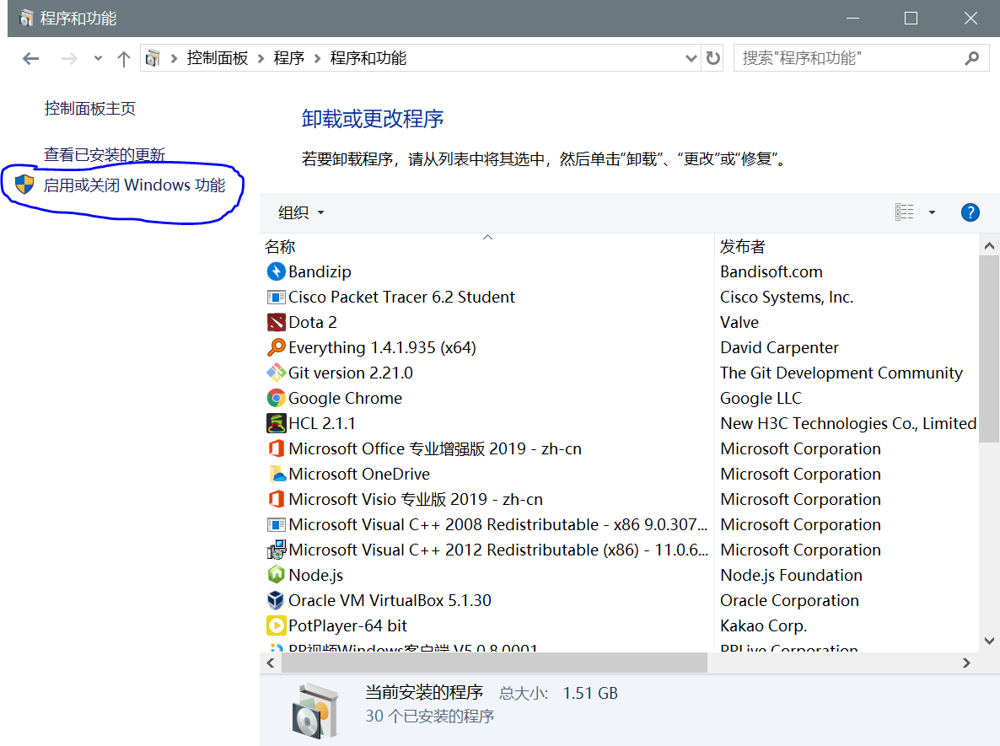

开启IIS中的**FTP服务**与**IIS管理控制台**：

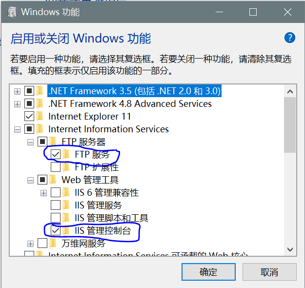

# 创建FTP站点

搜索框搜索`IIS`：

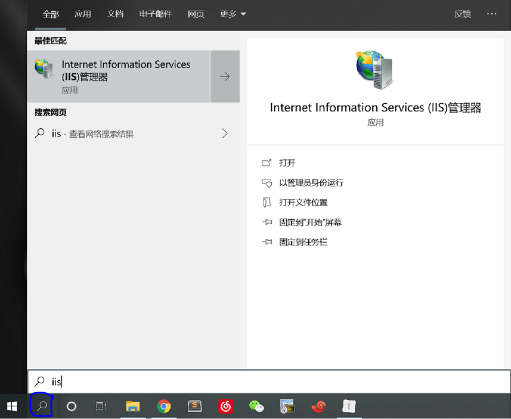

打开，用户名上右键创建FTP站点：

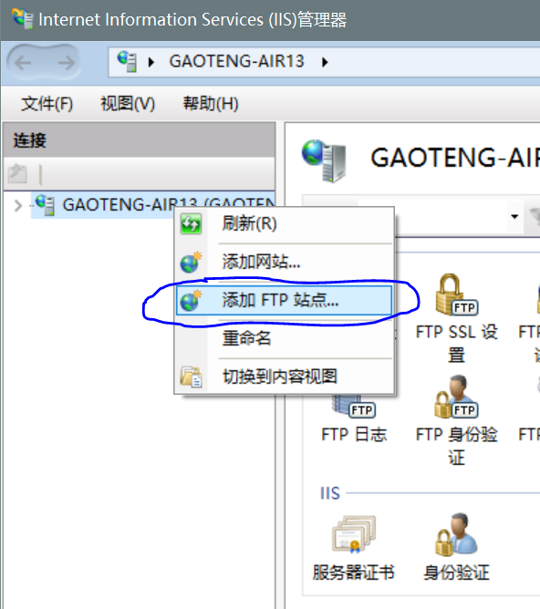

填写站点名字、挂载物理目录：

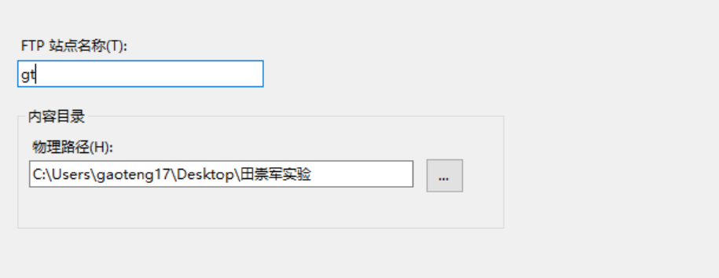

绑定和SSL设置中填写本机IP、无SSL：

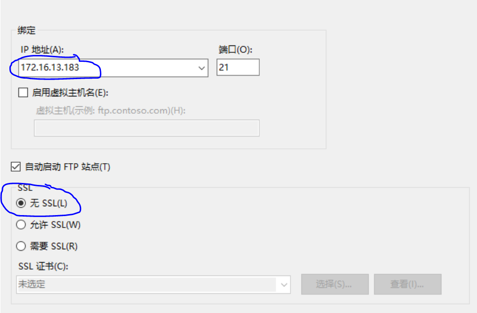

身份验证和授权信息中选择允许匿名登录、授权所有用户，并给予权限：

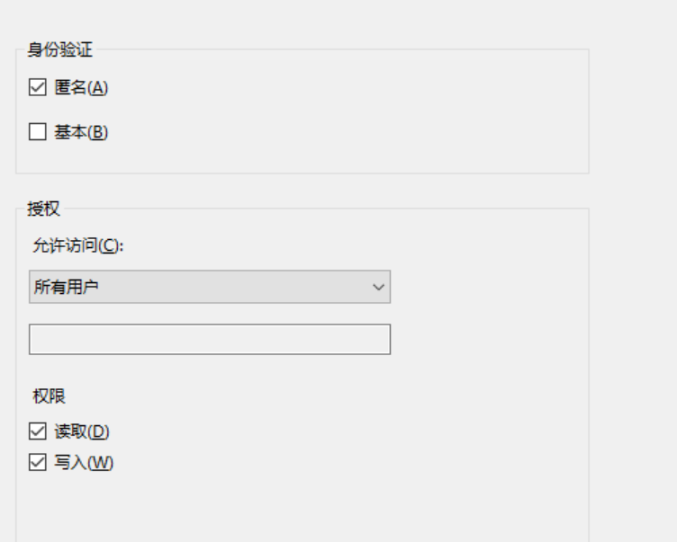

**注意：确保挂载物理目录拥有较低权限，右键查看该文件夹属性->安全，如没有users等用户组时，新建一个everyone用户组，否则无法匿名登录。**

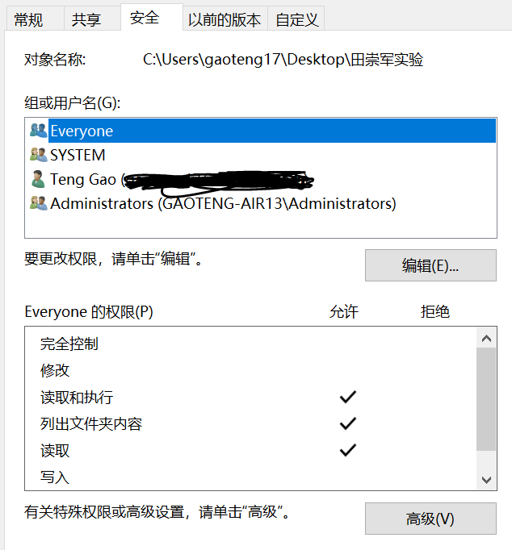

# 防火墙设置

搜索框搜防火墙，打开**允许应用通过Windows防火墙**：

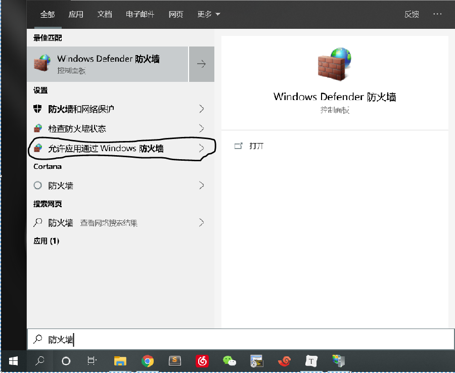

勾选**FTP服务**的专用和公用框：

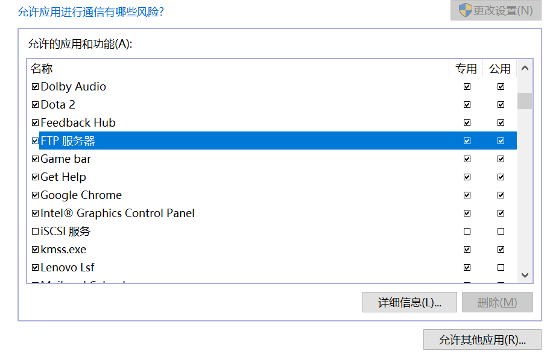

在**允许其他应用**里添加`C:\Windows\System32\svchost.exe`：

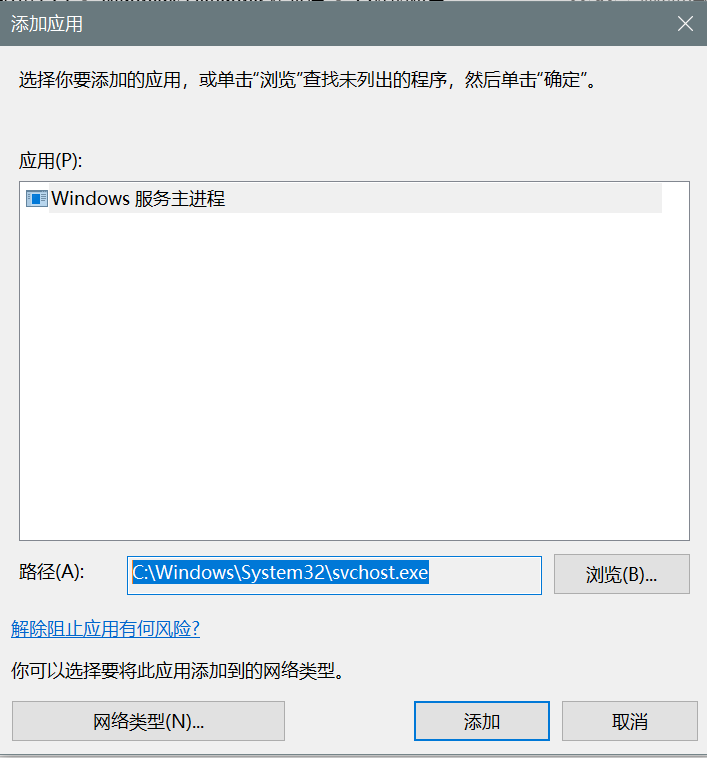

保存关闭即可。

# 测试

现在本机可以通过任何一个本地ip访问ftp站点，局域网内其它机器可以通过我的ip访问ftp站点。

打开浏览器，输入`ftp://172.16.13.183`：

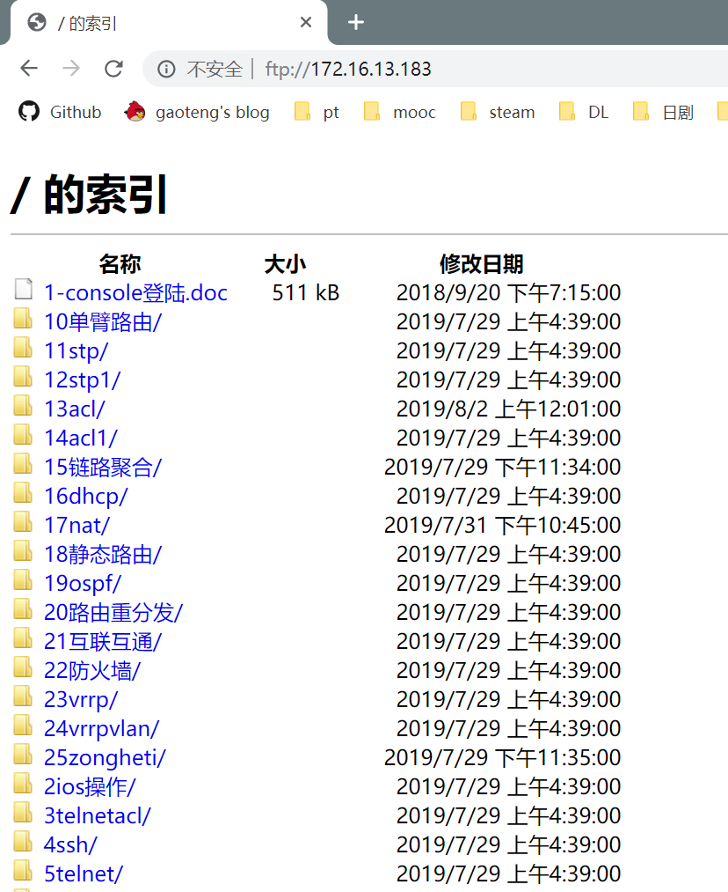