STP（Spanning Tree Protocol，生成树协议）是用于在局域网中消除数据链路层物理环路的协议。

STP 通过阻断冗余链路来消除桥接网络中可能存在的路径回环；而且在当前路径发生故障时，激活冗余备份链路，恢复网络连通性。

在H3C模拟器上进行STP等协议的配置，包括**STP配置**、**RSTP配置**、**MSTP配置**，系统版本v7。

<!-- more -->

# 原理

## STP

### STP（生成树协议）

* STP（Spanning Tree Protocol，生成树协议）是用于在局域网中消除数据链路层物理环路的协议。

* 通过在桥之间交换BPDU（Bridge Protocol Data Unit，桥协议数据单元），来保证设备完成生成树的计算过程 。

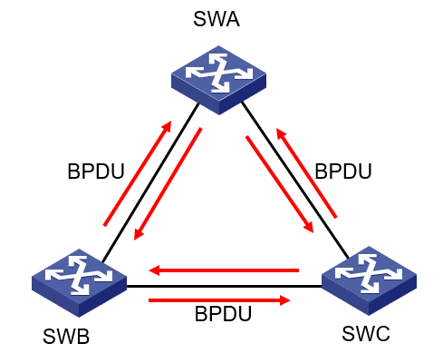

### BPDU（桥协议数据单元）

* 配置BPDU包含以下重要信息，完成生成树计算：

1. 根桥ID（RootID）
2. 根路径开销（RootPathCost）
3. 指定桥ID（DesignatedBridgeID）
4. 指定端口ID（ DesignatedPortID ）

* 各台设备的各个端口在初始时生成以自己为根桥（Root Bridge）的配置消息，向外发送自己的配置消息。

* 网络收敛后，根桥向外发送配置BPDU，其他的设备对该配置BPDU进行转发。

### 根桥的选举

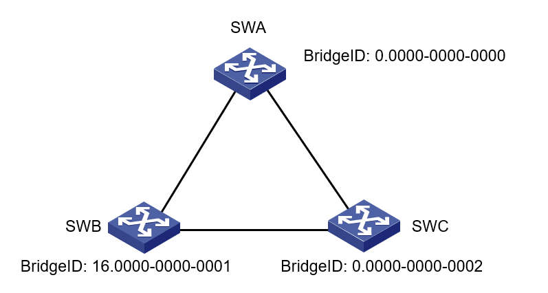

* 桥ID由桥优先级（BridgePriority）和桥MAC地址（BridgeMacAddress）组成。

* 桥ID小的桥被选举为根桥。

### 端口角色的确定

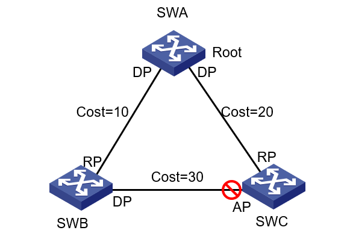

* 根桥上的所有端口为指定端口（ Designated Port ）

* 在非根桥上选举根路径开销（ RootPathCost）最小的端口为根端口（Root Port）

* 每个物理段选出根路径开销最小的桥作为指定桥（ Designated Bridge），连接指定桥的端口为指定端口

* 不是根端口和指定端口的其余端口被STP置为阻塞状态

#### 通过桥ID决定端口角色

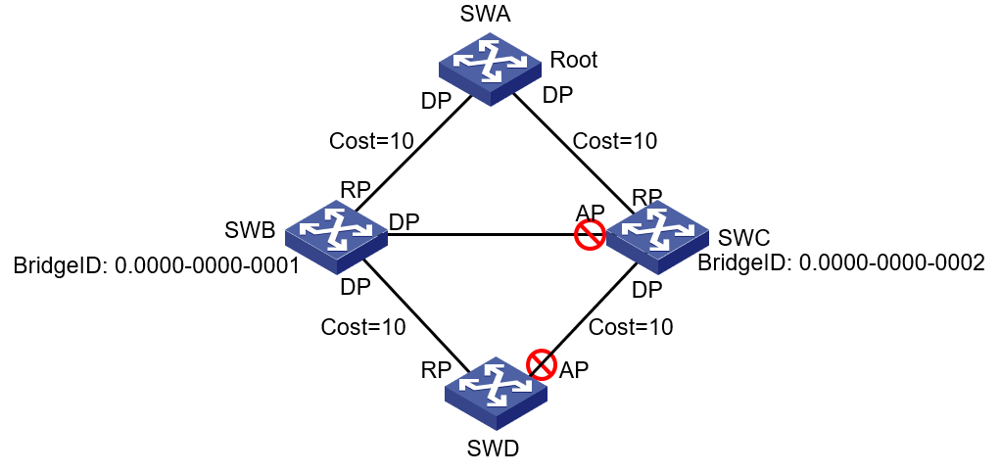

* 在根路径开销相同时，所连网段指定桥ID最小的端口为根端口

* 在根路径开销相同时，桥ID最小的桥被选举为物理段上的指定桥，连接指定桥的端口为指定端口

#### 通过端口ID决定端口角色

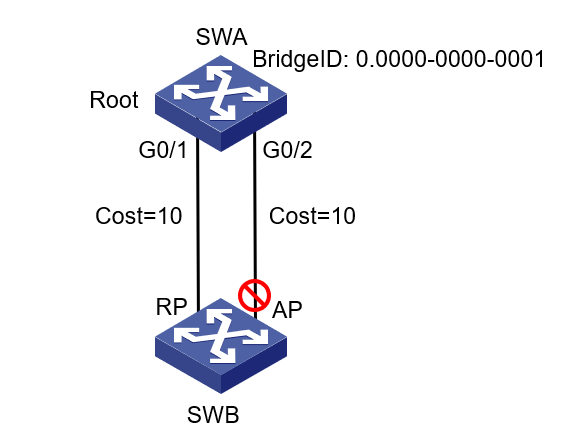

* 在根路径开销、指定桥ID都相同的情况下，所连指定端口ID小的端口为根端口

### 根路径开销

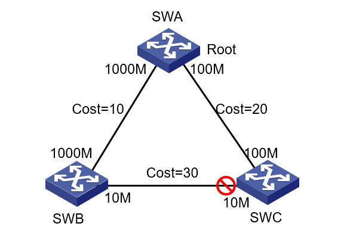

* 根路径开销（ RootPathCost）是到达根的路径上所有链路开销（Cost）的代数和

* 非根桥进行根端口选举时，根路径开销最小的端口为根端口

* 物理段进行指定桥选举时，路径开销最小的桥为指定桥

### 端口状态

| 端口角色 | 端口状态 | 端口行为 |
| - | - | - |
| 未启用STP功能的端口 | Disabled | 不收发BPDU报文，接收或转发数据 |
| 非指定端口或根端口 | Blocking | 接收但不发送BPDU，不接收或转发数据 |
| -- | Listening | 接收并发送BPDU，不接收或转发数据 |
| -- | Learning | 接收并发送BPDU，不接收或转发数据 |
| 指定端口或根端口 | Forwarding | 接收并发送BPDU，接收并转发数据 |

### 端口状态迁移

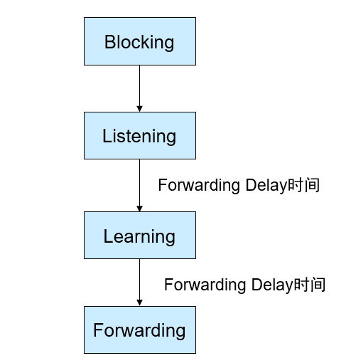

* 端口被选为指定端口或根端口后，需要从Blocking状态经Listening和Learning才能到Forwarding状态。

* 默认的Forwarding Delay时间是15秒。

### 生成树的不足

* 端口从阻塞状态进入转发状态必须经历两倍的Forwarding Delay时间。

* 如果网络中的拓扑结构变化频繁，网络会频繁地失去连通性。

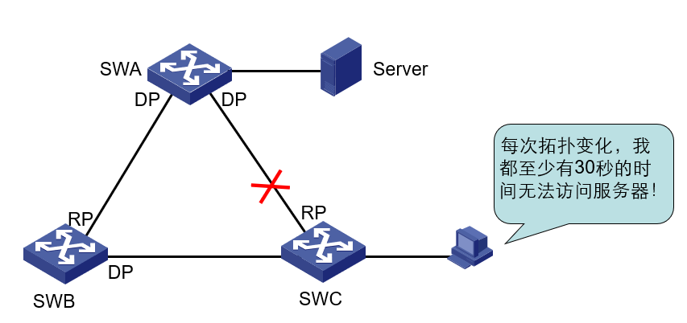

## RSTP

* RSTP（Rapid Spanning Tree Protocol，快速生成树协议）是STP协议的优化版

* RSTP具备STP的所有功能

* RSTP可以实现快速收敛

* 在某些情况下，端口进入转发状态的延时大大缩短，从而缩短了网络最终达到拓扑稳定所需要的时间。 

RSTP的改进：

|  | STP行为 | RSTP行为 |
| - | - | - |
| 端口被选为根端口 | 默认情况下，2倍的Forwarding Delay的时间延迟。 | 存在阻塞的备份根端口情况下，仅有数毫秒延迟。 |
| 端口被选为指定端口 | 默认情况下，2倍的Forwarding Delay的时间延迟。 | 1.在指定端口是非边缘端口的情况下，延迟取决因素较多。2.在指定端口是边缘端口的情况下，指定端口可以直接进入转发状态，没有延迟。 |

## MSTP

### STP、RSTP的问题

* Trunk链路上实际上运行着多个VLAN

* 所有VLAN共用一棵生成树

* 无法实现不同VLAN在多条Trunk链路上的负载分担

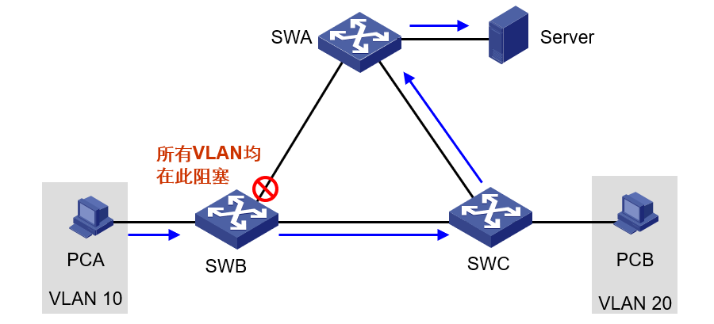

### 多生成树协议

* MSTP（Multiple Spanning Tree Protocol，多生成树协议）

* 将多个VLAN捆绑到一个实例，每个实例生成独立的生成树

* 在多条Trunk链路上实现VLAN级负载分担

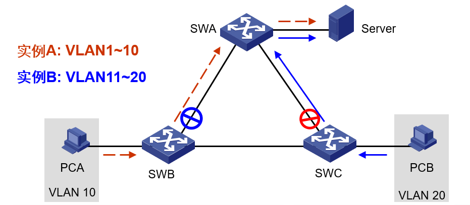

## 比较

### 协议特性比较

| 特性列表 | STP | RSTP | MSTP |
| - | - | - | - |
| 解决环路故障并实现冗余备份 | Y | Y | Y |
| 快速收敛 |  | Y | Y |
| 形成多棵生成树实现负载分担 |  |  | Y |

* MSTP具有RSTP的快速收敛，同时又具有负载分担机制

* MSTP兼容STP和RSTP

### 端口状态对比

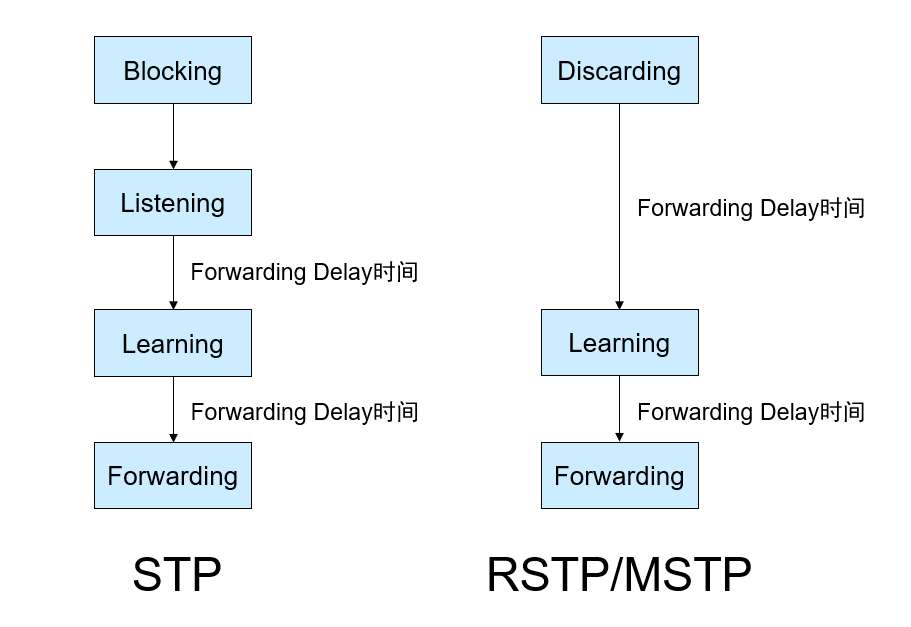

# 实验

## STP

### 拓扑

按照下图拓扑连线，并配置各PC机的IP：

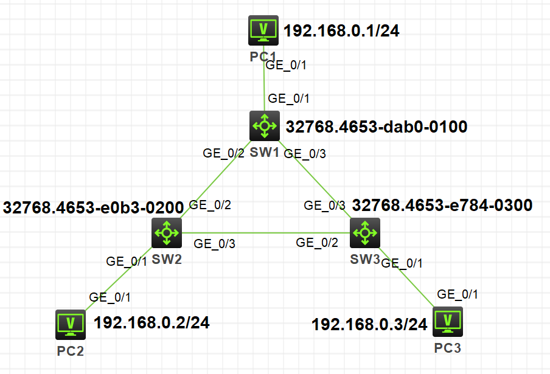

### 配置

分别在各交换机上启用stp：

```
[SW1]stp mode stp
[SW1]stp global enable

[SW2]stp mode stp
[SW2]stp global enable

[SW3]stp mode stp
[SW3]stp global enable
```

配置完成后，稍等一会，查看各交换机的stp状态信息：

```
[SW1]dis stp brief
 MST ID   Port                                Role  STP State   Protection
 0        GigabitEthernet1/0/1                DESI  FORWARDING  NONE
 0        GigabitEthernet1/0/2                DESI  FORWARDING  NONE
 0        GigabitEthernet1/0/3                DESI  FORWARDING  NONE
[SW1]dis stp
-------[CIST Global Info][Mode STP]-------
 Bridge ID           : 32768.4653-dab0-0100
 Bridge times        : Hello 2s MaxAge 20s FwdDelay 15s MaxHops 20
 Root ID/ERPC        : 32768.4653-dab0-0100, 0
 RegRoot ID/IRPC     : 32768.4653-dab0-0100, 0
 RootPort ID         : 0.0
 BPDU-Protection     : Disabled
 Bridge Config-
 Digest-Snooping     : Disabled
 TC or TCN received  : 7
 Time since last TC  : 0 days 0h:5m:25s


[SW2]dis stp brief
 MST ID   Port                                Role  STP State   Protection
 0        GigabitEthernet1/0/1                DESI  FORWARDING  NONE
 0        GigabitEthernet1/0/2                ROOT  FORWARDING  NONE
 0        GigabitEthernet1/0/3                DESI  FORWARDING  NONE
[SW2]dis stp
-------[CIST Global Info][Mode STP]-------
 Bridge ID           : 32768.4653-e0b3-0200
 Bridge times        : Hello 2s MaxAge 20s FwdDelay 15s MaxHops 20
 Root ID/ERPC        : 32768.4653-dab0-0100, 20
 RegRoot ID/IRPC     : 32768.4653-e0b3-0200, 0
 RootPort ID         : 128.3
 BPDU-Protection     : Disabled
 Bridge Config-
 Digest-Snooping     : Disabled
 TC or TCN received  : 9
 Time since last TC  : 0 days 0h:8m:0s


[SW3]dis stp brief
 MST ID   Port                                Role  STP State   Protection
 0        GigabitEthernet1/0/1                DESI  FORWARDING  NONE
 0        GigabitEthernet1/0/2                ALTE  DISCARDING  NONE
 0        GigabitEthernet1/0/3                ROOT  FORWARDING  NONE
[SW3]dis stp
-------[CIST Global Info][Mode STP]-------
 Bridge ID           : 32768.4653-e784-0300
 Bridge times        : Hello 2s MaxAge 20s FwdDelay 15s MaxHops 20
 Root ID/ERPC        : 32768.4653-dab0-0100, 20
 RegRoot ID/IRPC     : 32768.4653-e784-0300, 0
 RootPort ID         : 128.4
 BPDU-Protection     : Disabled
 Bridge Config-
 Digest-Snooping     : Disabled
 TC or TCN received  : 18
 Time since last TC  : 0 days 0h:7m:22s
```

可见STP运行模式为**STP**，`SW3`的**G1/0/2**口被阻塞为备用端口。

### 验证

模拟网络连线中断，将`SW1`与`SW2`所连线路删掉，刚断线时PC1ping不通PC2。

查看stp状态：

```
[SW1]dis stp brief
 MST ID   Port                                Role  STP State   Protection
 0        GigabitEthernet1/0/1                DESI  FORWARDING  NONE
 0        GigabitEthernet1/0/3                DESI  FORWARDING  NONE


[SW2]dis stp brief
 MST ID   Port                                Role  STP State   Protection
 0        GigabitEthernet1/0/1                DESI  FORWARDING  NONE
 0        GigabitEthernet1/0/3                DESI  FORWARDING  NONE


[SW3]dis stp brief
 MST ID   Port                                Role  STP State   Protection
 0        GigabitEthernet1/0/1                DESI  FORWARDING  NONE
 0        GigabitEthernet1/0/2                DESI  DISCARDING  NONE
 0        GigabitEthernet1/0/3                ROOT  FORWARDING  NONE
```

大约30秒左右后，PC1可以ping通PC2。

## RSTP

### 拓扑

拓扑图同上。

### 配置

分别在各交换机上启用rstp：

```
[SW1]stp mode rstp
[SW1]stp global enable

[SW2]stp mode rstp
[SW2]stp global enable

[SW3]stp mode rstp
[SW3]stp global enable
```

配置完成后，稍等一会，查看各交换机的stp状态信息：

```
[SW1]dis stp brief
 MST ID   Port                                Role  STP State   Protection
 0        GigabitEthernet1/0/1                DESI  FORWARDING  NONE
 0        GigabitEthernet1/0/2                DESI  FORWARDING  NONE
 0        GigabitEthernet1/0/3                DESI  FORWARDING  NONE
[SW1]dis stp
-------[CIST Global Info][Mode RSTP]-------
 Bridge ID           : 32768.4653-dab0-0100
 Bridge times        : Hello 2s MaxAge 20s FwdDelay 15s MaxHops 20
 Root ID/ERPC        : 32768.4653-dab0-0100, 0
 RegRoot ID/IRPC     : 32768.4653-dab0-0100, 0
 RootPort ID         : 0.0
 BPDU-Protection     : Disabled
 Bridge Config-
 Digest-Snooping     : Disabled
 TC or TCN received  : 10
 Time since last TC  : 0 days 0h:1m:5s


[SW2]dis stp brief
 MST ID   Port                                Role  STP State   Protection
 0        GigabitEthernet1/0/1                DESI  FORWARDING  NONE
 0        GigabitEthernet1/0/2                ROOT  FORWARDING  NONE
 0        GigabitEthernet1/0/3                DESI  FORWARDING  NONE
[SW2]dis stp
-------[CIST Global Info][Mode RSTP]-------
 Bridge ID           : 32768.4653-e0b3-0200
 Bridge times        : Hello 2s MaxAge 20s FwdDelay 15s MaxHops 20
 Root ID/ERPC        : 32768.4653-dab0-0100, 20
 RegRoot ID/IRPC     : 32768.4653-e0b3-0200, 0
 RootPort ID         : 128.3
 BPDU-Protection     : Disabled
 Bridge Config-
 Digest-Snooping     : Disabled
 TC or TCN received  : 62
 Time since last TC  : 0 days 0h:0m:46s


[SW3]dis stp brief
 MST ID   Port                                Role  STP State   Protection
 0        GigabitEthernet1/0/1                DESI  FORWARDING  NONE
 0        GigabitEthernet1/0/2                ALTE  DISCARDING  NONE
 0        GigabitEthernet1/0/3                ROOT  FORWARDING  NONE
[SW3]dis stp
-------[CIST Global Info][Mode RSTP]-------
 Bridge ID           : 32768.4653-e784-0300
 Bridge times        : Hello 2s MaxAge 20s FwdDelay 15s MaxHops 20
 Root ID/ERPC        : 32768.4653-dab0-0100, 20
 RegRoot ID/IRPC     : 32768.4653-e784-0300, 0
 RootPort ID         : 128.4
 BPDU-Protection     : Disabled
 Bridge Config-
 Digest-Snooping     : Disabled
 TC or TCN received  : 77
 Time since last TC  : 0 days 0h:0m:50s
```

可见STP运行模式为**RSTP**，`SW3`的**G1/0/2**口被阻塞为备用端口。

### 验证

模拟网络连线中断，将`SW1`与`SW2`所连线路删掉，刚断线时PC1ping不通PC2。

经测试：

* 断SW1与SW2线，PC1ping通PC2所用时间较STP模式稍快一些，区别不是很大；
* 重连SW1与SW2线，RSTP模式下几乎感受不到网络中断。

## MSTP

### 拓扑

按照下图拓扑连线，并创建相应vlan、设置trunk端口属性：

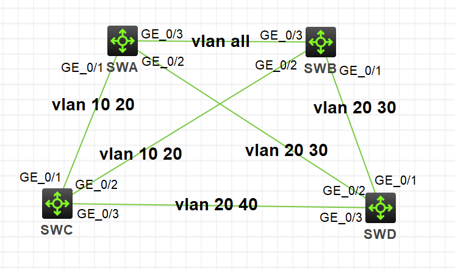

组网需求：

1. 网络中所有设备都属于同一个MST域。SWA和SWB为汇聚层设备，SWC和SWD为接入层设备。
2. 通过配置使不同VLAN的报文按照不同的MSTI转发：VLAN 10的报文沿MSTI 1转发，VLAN 30沿MSTI 3转发，VLAN 40沿MSTI 4转发，VLAN 20沿MSTI 0转发。
3. 由于VLAN 10和VLAN 30在汇聚层设备终结、VLAN 40在接入层设备终结，因此配置MSTI 1和MSTI 3的根桥分别为SWA和SWB，MSTI 4的根桥为SWC。

### 配置

在各交换机配置MST域并应用：

```
# SWA配置MST域的域名为example，将VLAN 10、30、40分别映射到MSTI 1、3、4上，并配置MSTP的修订级别为0。
[SWA]stp region-configuration
[SWA-mst-region]region-name example
[SWA-mst-region]instance 1 vlan 10
[SWA-mst-region]instance 3 vlan 30
[SWA-mst-region]instance 4 vlan 40
[SWA-mst-region]active region-configuration
[SWA-mst-region]quit
# 配置本设备为MSTI 1的根桥
[SWA]stp instance 1 root primary
[SWA]stp global enable


# SWB配置MST域的域名为example，将VLAN 10、30、40分别映射到MSTI 1、3、4上，并配置MSTP的修订级别为0。
[SWB]stp region-configuration
[SWB-mst-region]region-name example
[SWB-mst-region]instance 1 vlan 10
[SWB-mst-region]instance 3 vlan 30
[SWB-mst-region]instance 4 vlan 40
[SWB-mst-region]active region-configuration
[SWB-mst-region]quit
# 配置本设备为MSTI 0及MSTI 3的根桥
[SWB]stp instance 0 root primary
[SWB]stp instance 3 root primary
[SWB]stp global enable


# SWC配置MST域的域名为example，将VLAN 10、30、40分别映射到MSTI 1、3、4上，并配置MSTP的修订级别为0。
[SWC]stp region-configuration
[SWC-mst-region]region-name example
[SWC-mst-region]instance 1 vlan 10
[SWC-mst-region]instance 3 vlan 30
[SWC-mst-region]instance 4 vlan 40
[SWC-mst-region]active region-configuration
[SWC-mst-region]quit
# 配置本设备为MSTI 4的根桥
[SWC]stp instance 4 root primary
[SWC]stp global enable


# SWD配置MST域的域名为example，将VLAN 10、30、40分别映射到MSTI 1、3、4上，并配置MSTP的修订级别为0。
[SWD]stp region-configuration
[SWD-mst-region]region-name example
[SWD-mst-region]instance 1 vlan 10
[SWD-mst-region]instance 3 vlan 30
[SWD-mst-region]instance 4 vlan 40
[SWD-mst-region]active region-configuration
[SWD-mst-region]quit

[SWD]stp global enable
```

### 验证

当网络拓扑稳定后，查看各设备上生成树的简要信息：

```
[SWA]dis stp brief
 MST ID   Port                                Role  STP State   Protection
 0        GigabitEthernet1/0/1                DESI  FORWARDING  NONE
 0        GigabitEthernet1/0/2                DESI  FORWARDING  NONE
 0        GigabitEthernet1/0/3                ROOT  FORWARDING  NONE
 1        GigabitEthernet1/0/1                DESI  FORWARDING  NONE
 1        GigabitEthernet1/0/3                DESI  FORWARDING  NONE
 3        GigabitEthernet1/0/2                DESI  FORWARDING  NONE
 3        GigabitEthernet1/0/3                ROOT  FORWARDING  NONE


[SWB]dis stp brief
 MST ID   Port                                Role  STP State   Protection
 0        GigabitEthernet1/0/1                DESI  FORWARDING  NONE
 0        GigabitEthernet1/0/2                DESI  FORWARDING  NONE
 0        GigabitEthernet1/0/3                DESI  FORWARDING  NONE
 1        GigabitEthernet1/0/2                DESI  FORWARDING  NONE
 1        GigabitEthernet1/0/3                ROOT  FORWARDING  NONE
 3        GigabitEthernet1/0/1                DESI  FORWARDING  NONE
 3        GigabitEthernet1/0/3                DESI  FORWARDING  NONE


[SWC]dis stp brief
 MST ID   Port                                Role  STP State   Protection
 0        GigabitEthernet1/0/1                ALTE  DISCARDING  NONE
 0        GigabitEthernet1/0/2                ROOT  FORWARDING  NONE
 0        GigabitEthernet1/0/3                DESI  FORWARDING  NONE
 1        GigabitEthernet1/0/1                ROOT  FORWARDING  NONE
 1        GigabitEthernet1/0/2                ALTE  DISCARDING  NONE
 4        GigabitEthernet1/0/3                DESI  FORWARDING  NONE


[SWD]dis stp brief
 MST ID   Port                                Role  STP State   Protection
 0        GigabitEthernet1/0/1                ROOT  FORWARDING  NONE
 0        GigabitEthernet1/0/2                ALTE  DISCARDING  NONE
 0        GigabitEthernet1/0/3                ALTE  DISCARDING  NONE
 3        GigabitEthernet1/0/1                ROOT  FORWARDING  NONE
 3        GigabitEthernet1/0/2                ALTE  DISCARDING  NONE
 4        GigabitEthernet1/0/3                ROOT  FORWARDING  NONE
```

根据上述显示信息，可以绘出各VLAN所对应的MSTI，如下图所示。

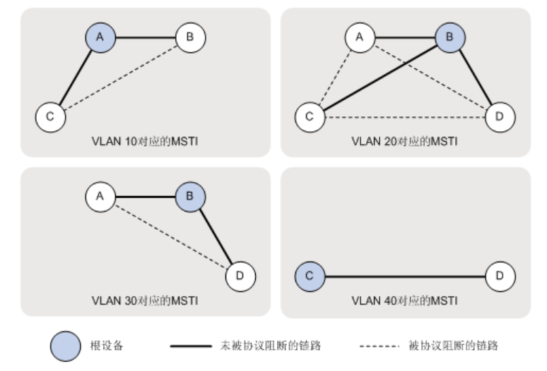

# 参考

1. H3C X00030003 第13章 生成树协议
2. H3C S5820X[S5800]系列以太网交换机 配置指导-Release 1211-6W100 二层技术-以太网交换配置指导 MSTP配置-新华三集团-H3C(http://www.h3c.com/cn/d_201109/724938_30005_0.htm)