IRF（Intelligent Resilient Framework，智能弹性架构）是H3C自主研发的软件虚拟化技术。它的核心思想是将多台设备连接在一起，进行必要的配置后，虚拟化成一台设备。使用这种虚拟化技术可以集合多台设备的硬件资源和软件处理能力，实现多台设备的协同工作、统一管理和不间断维护。

在H3C模拟器上配置IRF2，并搭配**LACP MAD检测**、**BFD MAD检测**实验，系统版本v7。

<!-- more -->

# 原理

## IRF2介绍

1. IRF2（Intelligent Resilient Framework II，第二代智能弹性架构）是H3C研发的软件虚拟化技术。

2. IRF2允许将多台设备连接在一起，形成一个IRF2堆叠：

* 一个IRF2堆叠相当于一台“虚拟设备”
* IRF2堆叠中的主设备和从设备保持配置和运行状态同步，实现1:N备份，保证高可靠性
* 可实现多台设备的协同工作、统一管理和不间断维护

## IRF2堆叠

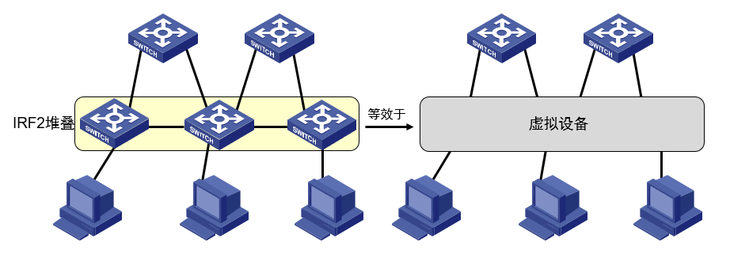

一个IRF2堆叠的功能等效于一台虚拟的逻辑设备。

其优点包括：

* 简化管理
* 提高性能
* 弹性扩展
* 高可靠性

IRF2堆叠拓扑有两种——链形拓扑和环形拓扑：

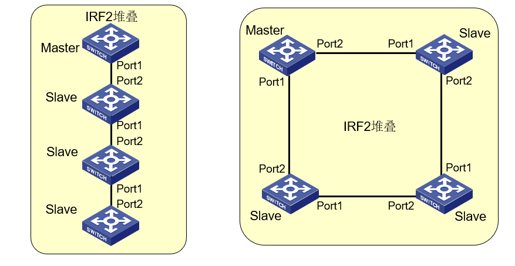

一个IRF2堆叠由一组相同型号的成员设备组成，成员设备分为Master和Slave两种角色。

## IRF2 Domain ID

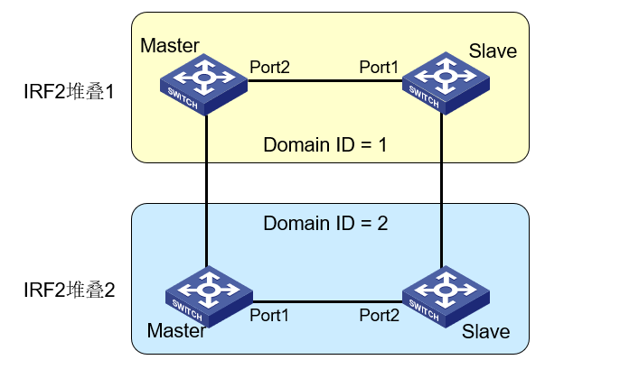

* IRF2以Domain ID（域编号）来区分不同的IRF2堆叠
* 只有Domain ID相同的设备才可能加入同一IRF2堆叠

## IRF2成员编号（Member ID） 

* 在IRF2中以成员编号（Member ID）标识设备：

1. 各设备成员编号必须唯一
2. 在配置IRF2前，需要规划好每台设备的成员编号，并分别在设备上进行配置

* 配置IRF端口和优先级也是根据设备的成员编号来进行的，修改后的成员编号需要重启才能生效

* 修改设备成员编号可能导致设备配置发生变化或丢失

* Master的Member ID也称为Active ID 

## IRF2 Master选举规则

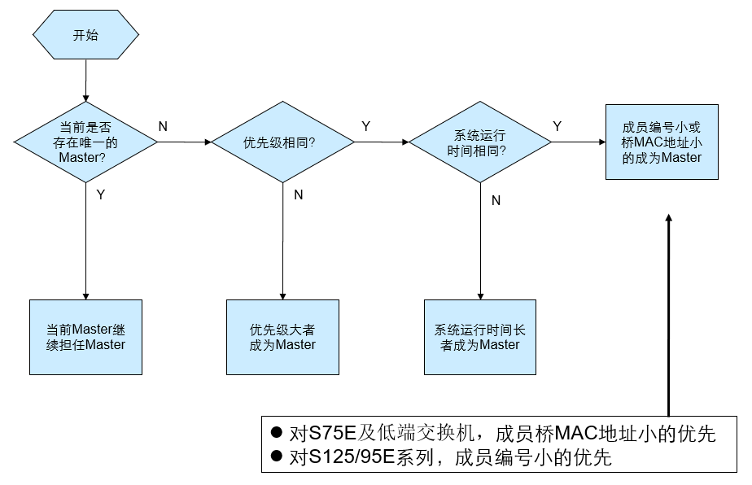

## IRF2 MAD检测

* IRF2采用MAD（Multi-Active Detection，多Active检测）解决分裂后的冲突问题：

1. 使Master成员编号最小的堆叠维持Active状态（正常工作状态）
2. 使其它堆叠迁移到Recovery 状态（禁用状态），并关闭其成员设备上除保留端口以外的其它所有物理端口（通常为业务接口）

* MAD检测的方法：

1. **基于LACP的MAD检测**
2. **基于BFD的MAD检测**

### 基于LACP的MAD检测

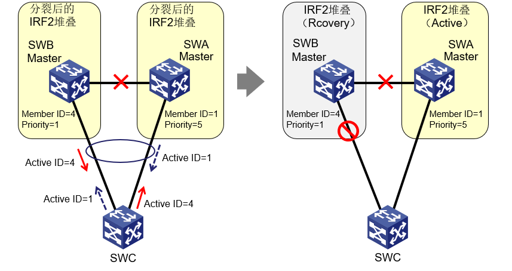

* 扩展LACP消息携带Active ID
* Active ID大的一方竞争失败，迁移到Recovery 状态
* 要求相邻的交换机必须为支持此检测特性的H3C设备

### 基于BFD的MAD检测

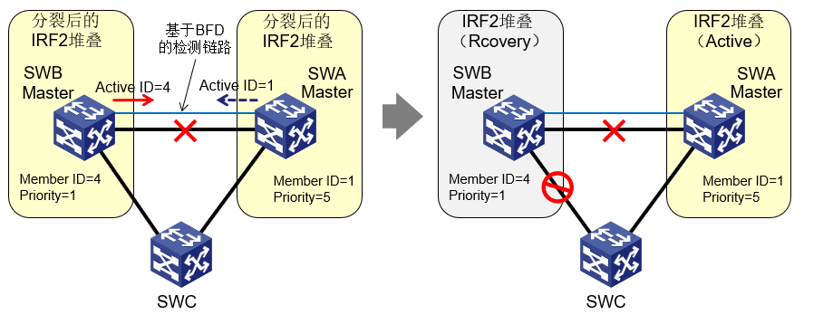

* IRF2堆叠内的成员设备通过三层口连接，并分别配置一个BFD检测地址，使能BFD MAD检测
* 正常工作时，BFD主设备地址生效，备设备地址不生效，BFD会话DOWN
* IRF2堆叠分裂时，两个地址同时生效，BFD会话UP，BFD MAD检测生效后，会话再次DOWN
* Active ID大的一方竞争失败，迁移到Recovery 状态
* BFD检测单独占用一对端口和一个VLAN

### 两种Active检测方式的对比

| 方式 | 优点 | 适用性要求 |
| - | - | - |
| LACP方式 | 1.在相邻的IRF2堆叠上同时启动此检测方式，堆叠之间可互相检测分裂；2.不需要占用专门检测端口 | IRF2堆叠和接入交换机均需支持该特性 |
| BFD方式 | 1.可以独立检测本IRF2堆叠分裂情况；2.对上下游设备无要求；3.检测速度快 | 需要专用端口和VLAN |

### MAD故障恢复

1. IRF链路修复：

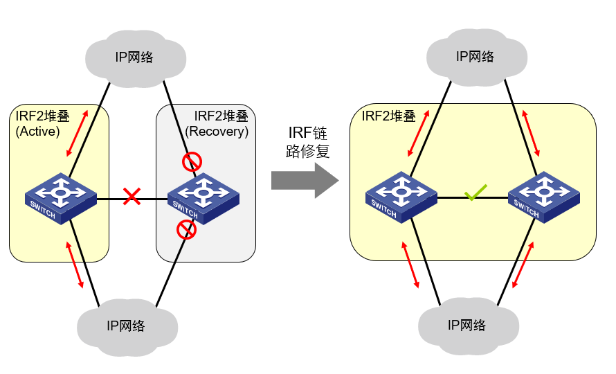

2. IRF链路故障修复前，正常工作状态的IRF故障使用`mad restore`命令恢复：

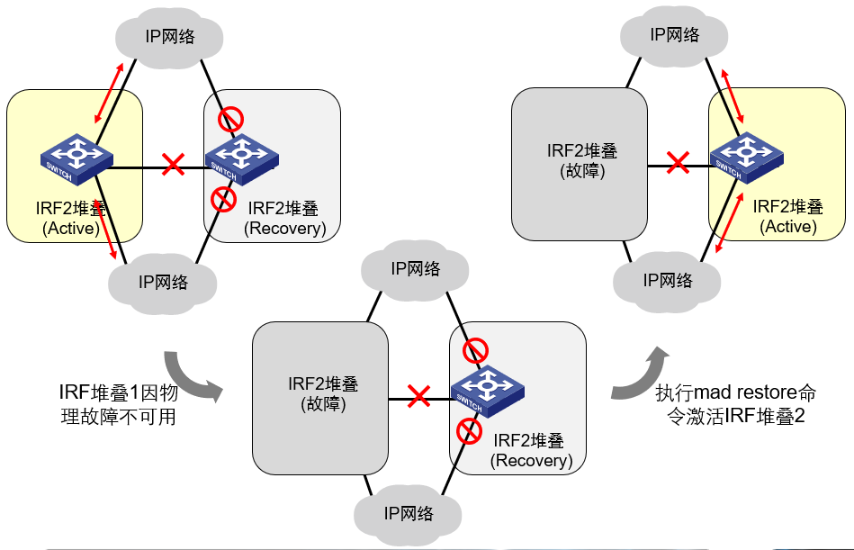

# 配置

| 方式 | 配置 | 说明 |
| - | - | - |
| **BFD MAD** | **[Switch-Vlan-interface3] mad bfd enable** | 1.缺省情况下，没有使能BFD MAD检测功能，也未配置MAD IP地址。 |
|  | **[Switch-Vlan-interface3] mad ip address** *ip-address { mask / mask-length }* **member** *member-id* | 2.MAD IP不能与其他接口IP地址相同。3.不能在Vlan-interface1接口下使能BFD MAD检测功能。 |
| **LACP MAD** | **[Switch-Bridge-Aggregation1] mad enable** | 1.缺省情况下，LACP MAD检测未使能。2.由于LACP MAD检测依赖于LACP协议，因此需要配置聚合组工作在动态聚合模式下。3.LACP对端设备必须能够识别、处理携带了ActiveID值的LACP PDU协议报文。 |

# 实验

## IRF2

### 拓扑

按照下图拓扑连线：

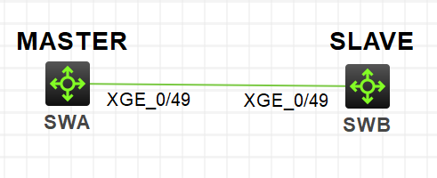

### 配置

首先在`SWA`上进行配置：

```
# 先关闭使用的堆叠口
[SWA]interface Ten-GigabitEthernet 1/0/49
[SWA-Ten-GigabitEthernet1/0/49]shutdown
[SWA-Ten-GigabitEthernet1/0/49]quit

# 创建IRF端口
[SWA]irf-port 1/1
[SWA-irf-port1/1]port group interface Ten-GigabitEthernet 1/0/49
You must perform the following tasks for a successful IRF setup:
Save the configuration after completing IRF configuration.
Execute the "irf-port-configuration active" command to activate the IRF ports.
[SWA-irf-port1/1]quit

# 配置优先级
[SWA]irf member 1 priority  30

# 再开启使用的堆叠口
[SWA]interface Ten-GigabitEthernet 1/0/49
[SWA-Ten-GigabitEthernet1/0/49]undo shutdown
[SWA-Ten-GigabitEthernet1/0/49]quit

# 激活irf配置
[SWA]save
[SWA]irf-port-configuration active
```

然后在`SWB`上进行配置：

```
# 重命名member号为2
[SWB]irf member 1 renumber 2
Renumbering the member ID may result in configuration change or loss. Continue?[Y/N]:y
[SWB]quit
<SWB>reboot

# 先关闭使用的堆叠口，此时口的member号已修改成2
[SWB]interface Ten-GigabitEthernet 2/0/49
[SWB-Ten-GigabitEthernet2/0/49]shutdown
[SWB-Ten-GigabitEthernet2/0/49]quit

# 创建IRF端口，注意做堆叠时port-number不能相同，故只能是2/2，不能是2/1
[SWB]irf-port 2/2
[SWB-irf-port2/2]port group interface Ten-GigabitEthernet 2/0/49
[SWB-irf-port2/2]quit

# 再开启使用的堆叠口
[SWB]interface Ten-GigabitEthernet 2/0/49
[SWB-Ten-GigabitEthernet2/0/49]undo shutdown
[SWB-Ten-GigabitEthernet2/0/49]quit

# 激活irf配置
[SWB]save
[SWB]irf-port-configuration active
```

### 验证

配置完成后`SWB`自动重启，重启之后是`SWA`的界面。

在`SWA`上查看irf相关信息：

```
[SWA]dis irf
MemberID    Role    Priority  CPU-Mac         Description
 *+1        Master  30        7490-4d85-0104  ---
   2        Standby 1         7490-51eb-0204  ---
--------------------------------------------------
 * indicates the device is the master.
 + indicates the device through which the user logs in.

 The bridge MAC of the IRF is: 7490-4d85-0100
 Auto upgrade                : yes
 Mac persistent              : 6 min
 Domain ID                   : 0

[SWA]dis irf configuration
 MemberID NewID    IRF-Port1                     IRF-Port2
 1        1        Ten-GigabitEthernet1/0/49     disable
 2        2        disable                       Ten-GigabitEthernet2/0/49

[SWA]dis irf topology
                              Topology Info
 -------------------------------------------------------------------------
               IRF-Port1                IRF-Port2
 MemberID    Link       neighbor      Link       neighbor    Belong To
 2           DIS        ---           UP         1           7490-4d85-0104
 1           UP         2             DIS        ---         7490-4d85-0104
```

在`SWB`上查看irf相关信息：

```
[SWA]dis irf
MemberID    Role    Priority  CPU-Mac         Description
  *1        Master  30        7490-4d85-0104  ---
  +2        Standby 1         7490-51eb-0204  ---
--------------------------------------------------
 * indicates the device is the master.
 + indicates the device through which the user logs in.

 The bridge MAC of the IRF is: 7490-4d85-0100
 Auto upgrade                : yes
 Mac persistent              : 6 min
 Domain ID                   : 0

[SWA]dis irf configuration
 MemberID NewID    IRF-Port1                     IRF-Port2
 1        1        Ten-GigabitEthernet1/0/49     disable
 2        2        disable                       Ten-GigabitEthernet2/0/49

[SWA]dis irf topology
                              Topology Info
 -------------------------------------------------------------------------
               IRF-Port1                IRF-Port2
 MemberID    Link       neighbor      Link       neighbor    Belong To
 2           DIS        ---           UP         1           7490-4d85-0104
 1           UP         2             DIS        ---         7490-4d85-0104
```

## IRF2 上配置 BFD MAD

### 拓扑

按照下图拓扑连线：

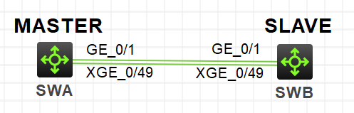

### 配置

使用上面实验中的IRF2配置，配置BFD MAD：

```
[SWA]vlan 3
[SWA-vlan3]port GigabitEthernet 1/0/1 GigabitEthernet 2/0/1

# 在vlan3虚接口中开启bfd mad
[SWA]interface  vlan 3
[SWA-Vlan-interface3]mad bfd enable
[SWA-Vlan-interface3]mad ip address 192.168.2.1 24 member 1
[SWA-Vlan-interface3]mad ip address 192.168.2.2 24 member 2
[SWA-Vlan-interface3]quit

# 关闭端口stp协议
[SWA]interface GigabitEthernet 1/0/1
[SWA-GigabitEthernet1/0/1]undo stp enable
[SWA-GigabitEthernet1/0/1]quit
[SWA]int GigabitEthernet 2/0/1
[SWA-GigabitEthernet2/0/1]undo stp enable
[SWA-GigabitEthernet2/0/1]quit
[SWA]save
```

### 验证

配置完成后查看MAD信息：

```
[SWA]dis mad
MAD ARP disabled.
MAD ND disabled.
MAD LACP disabled.
MAD BFD enabled.

[SWA]dis mad verbose
Multi-active recovery state: No
Excluded ports (user-configured):
Excluded ports (system-configured):
  Ten-GigabitEthernet1/0/49
  Ten-GigabitEthernet2/0/49
MAD ARP disabled.
MAD ND disabled.
MAD LACP disabled.
MAD BFD enabled interface: Vlan-interface3
  MAD status                 : Faulty
  Member ID   MAD IP address       Neighbor   MAD status
  1           192.168.2.1/24       2          Faulty
  2           192.168.2.2/24       1          Faulty
```

此时在`SWA`上断掉**Ten1/0/49**口模拟线缆中断，再从`SWA`查看MAD信息：

```
[SWA]int Ten-GigabitEthernet 1/0/49
[SWA-Ten-GigabitEthernet1/0/49]shutdown
[SWA-Ten-GigabitEthernet1/0/49]quit

[SWA]dis mad verbose
Multi-active recovery state: No
Excluded ports (user-configured):
Excluded ports (system-configured):
  Ten-GigabitEthernet1/0/49
MAD ARP disabled.
MAD ND disabled.
MAD LACP disabled.
MAD BFD enabled interface: Vlan-interface3
  MAD status                 : Faulty
  Member ID   MAD IP address       Neighbor   MAD status
  1           192.168.2.1/24       2          Faulty
```

再到`SWB`上查看MAD信息：

```
<SWA>dis mad verbose
Multi-active recovery state: Yes
Excluded ports (user-configured):
Excluded ports (system-configured):
  Ten-GigabitEthernet2/0/49
MAD ARP disabled.
MAD ND disabled.
MAD LACP disabled.
MAD BFD enabled interface: Vlan-interface3
  MAD status                 : Faulty
  Member ID   MAD IP address       Neighbor   MAD status
  2           192.168.2.2/24       1          Faulty
```

可以看到此时`SWB`是**recovery**模式。

回到`SWA`将线缆恢复，可以看到`SWA`和`SWB`又重新堆叠在了一起。

## IRF2 上配置 LACP MAD

### 拓扑

按照下图拓扑连线：

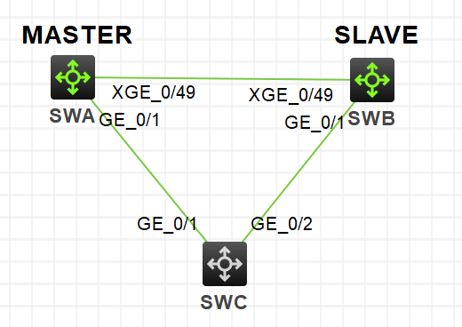

### 配置

使用上面实验中的IRF2配置，配置LACP MAD：

```
# SWA上配置LACP
[SWA]interface Bridge-Aggregation 2
[SWA-Bridge-Aggregation2]link-aggregation mode dynamic
[SWA-Bridge-Aggregation2]mad enable
You need to assign a domain ID (range: 0-4294967295)
[Current domain is: 0]: 0
The assigned domain ID is: 0
[SWA-Bridge-Aggregation2]quit

[SWA]int range g1/0/1 g2/0/1
[SWA-if-range]port link-aggregation group 2
[SWA-if-range]quit

# SWC上配置LACP
[SWC]interface Bridge-Aggregation 2
[SWC-Bridge-Aggregation2]link-aggregation mode dynamic
[SWC-Bridge-Aggregation2]quit

[SWC]int range g1/0/1 g1/0/2
[SWC-if-range]port link-aggregation group 2
[SWC-if-range]quit
```

### 验证

配置完成后，在`SWA`上查看MAD信息：

```
[SWA]dis mad
MAD ARP disabled.
MAD ND disabled.
MAD LACP enabled.
MAD BFD enabled.
[SWA]dis mad verbose
Multi-active recovery state: No
Excluded ports (user-configured):
Excluded ports (system-configured):
  Ten-GigabitEthernet1/0/49
  Ten-GigabitEthernet2/0/49
MAD ARP disabled.
MAD ND disabled.
MAD LACP enabled interface: Bridge-Aggregation2
  MAD status                : Normal
  Member ID    Port                                    MAD status
  1            GigabitEthernet1/0/1                    Normal
  2            GigabitEthernet2/0/1                    Normal
MAD BFD enabled interface: Vlan-interface3
  MAD status                 : Faulty
  Member ID   MAD IP address       Neighbor   MAD status
  1           192.168.2.1/24       2          Faulty
  2           192.168.2.2/24       1          Faulty

```

此时在`SWA`上断掉**Ten1/0/49**口模拟线缆中断，再从`SWA`查看MAD信息：

```
[SWA]dis mad verbose
Multi-active recovery state: No
Excluded ports (user-configured):
Excluded ports (system-configured):
  Ten-GigabitEthernet1/0/49
MAD ARP disabled.
MAD ND disabled.
MAD LACP enabled interface: Bridge-Aggregation2
  MAD status                : Normal
  Member ID    Port                                    MAD status
  1            GigabitEthernet1/0/1                    Normal
MAD BFD enabled interface: Vlan-interface3
  MAD status                 : Faulty
  Member ID   MAD IP address       Neighbor   MAD status
  1           192.168.2.1/24       2          Faulty
```

再到`SWB`上查看MAD信息：

```
[SWA]dis mad verbose
Multi-active recovery state: Yes
Excluded ports (user-configured):
Excluded ports (system-configured):
  Ten-GigabitEthernet2/0/49
MAD ARP disabled.
MAD ND disabled.
MAD LACP enabled interface: Bridge-Aggregation2
  MAD status                : Faulty
  Member ID    Port                                    MAD status
  2            GigabitEthernet2/0/1                    Faulty
MAD BFD enabled interface: Vlan-interface3
  MAD status                 : Faulty
  Member ID   MAD IP address       Neighbor   MAD status
  2           192.168.2.2/24       1          Faulty
```

可以看到此时`SWB`是**recovery**模式。

回到`SWA`将线缆恢复，可以看到`SWA`和`SWB`又重新堆叠在了一起。

# 参考

1. H3C B00500060 IRF.pptx
2. H3C IRF2技术原理与应用实践.pptx
3. H3C S5500V2-EI系列以太网交换机 配置指导-Release 1118-6W100 虚拟化技术配置指导 IRF配置-新华三集团-H3C(http://www.h3c.com/cn/d_201809/1108188_30005_0.htm)