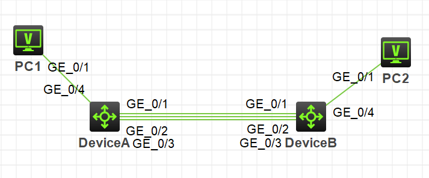
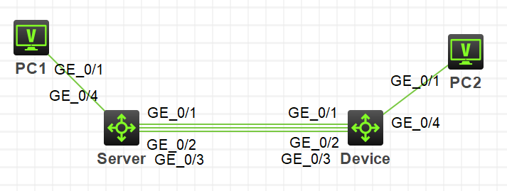
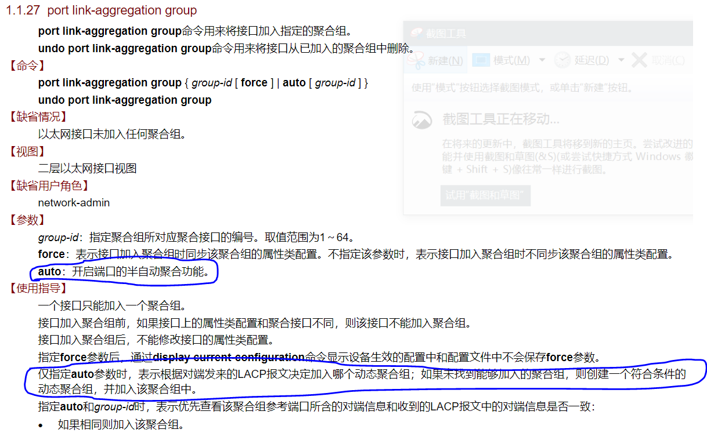

补充几个链路聚合的实验。

原文：[【信息网络学习day5 H3C设备配置链路聚合】](http://gaoteng17.xyz/1016/)

<!-- more -->

# 二层动态聚合

## 组网需求

* Device A与Device B通过各自的二层以太网接口GigabitEthernet1/0/1～GigabitEthernet1/0/3相互连接。

* 在Device A和Device B上分别配置二层动态链路聚合组，并实现设备间VLAN 10和VLAN 20分别互通。

## 组网图



## 配置步骤

```
# 创建VLAN 10，并将端口GigabitEthernet1/0/4加入到该VLAN中。
<DeviceA> system-view
[DeviceA] vlan 10
[DeviceA-vlan10] port gigabitethernet 1/0/4
[DeviceA-vlan10] quit

# 创建VLAN 20，并将端口GigabitEthernet1/0/5加入到该VLAN中。
[DeviceA] vlan 20
[DeviceA-vlan20] port gigabitethernet 1/0/5
[DeviceA-vlan20] quit

# 创建二层聚合接口1，并配置该接口为动态聚合模式。
[DeviceA] interface bridge-aggregation 1
[DeviceA-Bridge-Aggregation1] link-aggregation mode dynamic
[DeviceA-Bridge-Aggregation1] quit

# 分别将端口GigabitEthernet1/0/1至GigabitEthernet1/0/3加入到聚合组1中。
[DeviceA] interface gigabitethernet 1/0/1
[DeviceA-GigabitEthernet1/0/1] port link-aggregation group 1
[DeviceA-GigabitEthernet1/0/1] quit
[DeviceA] interface gigabitethernet 1/0/2
[DeviceA-GigabitEthernet1/0/2] port link-aggregation group 1
[DeviceA-GigabitEthernet1/0/2] quit
[DeviceA] interface gigabitethernet 1/0/3
[DeviceA-GigabitEthernet1/0/3] port link-aggregation group 1
[DeviceA-GigabitEthernet1/0/3] quit

# 配置二层聚合接口1为Trunk端口，并允许VLAN 10和20的报文通过。
[DeviceA] interface bridge-aggregation 1
[DeviceA-Bridge-Aggregation1] port link-type trunk
[DeviceA-Bridge-Aggregation1] port trunk permit vlan 10 20
[DeviceA-Bridge-Aggregation1] quit
```

`DeviceB`的配置与`DeviceA`的配置一样。

## 验证

```
[DeviceA-Bridge-Aggregation1] display link-aggregation verbose
Loadsharing Type: Shar -- Loadsharing, NonS -- Non-Loadsharing
Port: A -- Auto
Port Status: S -- Selected, U -- Unselected, I -- Individual
Flags:  A -- LACP_Activity, B -- LACP_Timeout, C -- Aggregation,
        D -- Synchronization, E -- Collecting, F -- Distributing,
        G -- Defaulted, H -- Expired

Aggregate Interface: Bridge-Aggregation1
Aggregation Mode: Dynamic
Loadsharing Type: Shar
System ID: 0x8000, 1839-9e73-0300
Local:
  Port                Status  Priority Oper-Key  Flag
--------------------------------------------------------------------------------
  GE1/0/1             S       32768    1         {ACDEF}
  GE1/0/2             S       32768    1         {ACDEF}
  GE1/0/3             S       32768    1         {ACDEF}
Remote:
  Actor               Partner Priority Oper-Key  SystemID               Flag
--------------------------------------------------------------------------------
  GE1/0/1             2       32768    1         0x8000, 1839-a4ca-0400 {ACDEF}
  GE1/0/2             3       32768    1         0x8000, 1839-a4ca-0400 {ACDEF}
  GE1/0/3             4       32768    1         0x8000, 1839-a4ca-0400 {ACDEF}
```

即：聚合组1为负载分担类型的二层动态聚合组，包含有三个选中端口。

## 总结

这里需要注意几个点：

1. 两互连端口只有配置完全相同时，才能建立聚合关系（Status变成**S**）。
2. 新加入端口的话，如果新端口配置与聚合组配置相同则可直接建立聚合关系，否则需要重新配置一遍聚合组的属性。
3. 聚合组中删除物理端口后，在聚合组中配置的属性依然在物理端口上保留。

# 二层聚合边缘接口

## 组网需求

* 服务器Server与客户端Device通过端口GigabitEthernet1/0/1~GigabitEthernet1/0/3相互连接。

* 在Device上配置一个二层动态链路聚合组。

* 在Device上配置二层聚合接口为聚合边缘接口，以便当服务器Server上未配置动态聚合组时，Device上聚合组成员端口都能做为普通端口正常转发报文。

## 组网图

同上一实验：



## 配置步骤

```
# 创建二层聚合接口1，配置该接口为动态聚合模式。
<Device> system-view
[Device] interface bridge-aggregation 1
[Device-Bridge-Aggregation1] link-aggregation mode dynamic

# 配置二层聚合接口1为聚合边缘接口。
[Device-Bridge-Aggregation1] lacp edge-port
[Device-Bridge-Aggregation1] quit

# 分别将端口GigabitEthernet1/0/1~GigabitEthernet1/0/2加入到聚合组1中。
[Device] interface gigabitethernet 1/0/1
[Device-GigabitEthernet1/0/1] port link-aggregation group 1
[Device-GigabitEthernet1/0/1] quit
[Device] interface gigabitethernet 1/0/2
[Device-GigabitEthernet1/0/2] port link-aggregation group 1
[Device-GigabitEthernet1/0/2] quit
[Device] interface gigabitethernet 1/0/3
[Device-GigabitEthernet1/0/3] port link-aggregation group 1
[Device-GigabitEthernet1/0/3] quit
```

## 验证

```
[Device] display link-aggregation verbose
Loadsharing Type: Shar -- Loadsharing, NonS -- Non-Loadsharing
Port: A -- Auto
Port Status: S -- Selected, U -- Unselected, I -- Individual
Flags:  A -- LACP_Activity, B -- LACP_Timeout, C -- Aggregation,
        D -- Synchronization, E -- Collecting, F -- Distributing,
        G -- Defaulted, H -- Expired

Aggregate Interface: Bridge-Aggregation1
Aggregation Mode: Dynamic
Loadsharing Type: Shar
System ID: 0x8000, 1839-a4ca-0400
Local:
  Port                Status  Priority Oper-Key  Flag
--------------------------------------------------------------------------------
  GE1/0/1             I       32768    1         {AG}
  GE1/0/2             I       32768    1         {AG}
  GE1/0/3             I       32768    1         {AG}
Remote:
  Actor               Partner Priority Oper-Key  SystemID               Flag
--------------------------------------------------------------------------------
  GE1/0/1             0       32768    0         0x8000, 0000-0000-0000 {DEF}
  GE1/0/2             0       32768    0         0x8000, 0000-0000-0000 {DEF}
  GE1/0/3             0       32768    0         0x8000, 0000-0000-0000 {DEF}
```

即：当Device未收到Server的LACP报文时，Device的聚合成员端口都工作在Individual状态，该状态下所有聚合成员端口可以作为普通物理口转发报文，以保证此时Server与Device间的链路都可以正常转发报文，且相互形成备份。

# 三层链路聚合

三层链路聚合也分为动态与静态两种方式。

配置命令与二层几乎一致。只有两个不同的地方：

1. 创建二层聚合组命令是`int Bridge-Aggregation 1`；三层则是`int Route-Aggregation 1`。
2. 在三层聚合组中需配置聚合组ip地址。

# 比较

我感觉动态聚合模式与静态聚合模式最主要的区别在于是否用到协议上。

静态聚合只需两端物理配置相同，配置好之后聚合状态是不会变化的；动态聚合则还会根据LACP报文来改变聚合状态。

另外在S7500的[命令手册](http://www.h3c.com/cn/d_201806/1087511_30005_0.htm)中，有提到可以开启端口的半自动聚合功能，这样只需要配置一端，另一端自动聚合。不过模拟器型号是S5800，我这里实机只有S5130和S5500，并没有这条命令供我测试。



# 参考

1. H3C S5500V2-EI系列以太网交换机 配置指导-Release 1118-6W100 二层技术-以太网交换配置指导 以太网链路聚合配置-新华三集团-H3C(http://www.h3c.com/cn/d_201809/1108195_30005_0.htm)

2. H3C S7500X-G系列以太网交换机 命令参考-Release 7724-6W100 二层技术-以太网交换命令参考 以太网链路聚合命令-新华三集团-H3C(http://www.h3c.com/cn/d_201806/1087511_30005_0.htm)