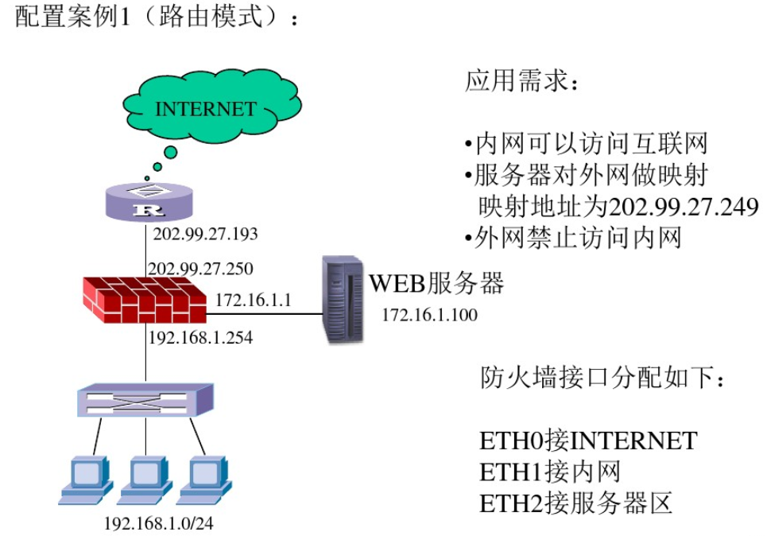

天融信防火墙厂家培训

<!-- more -->

# 通讯模式

1. 透明模式（提供桥接功能）：交换模式，并非全透明
2. 路由模式（静态路由功能）
3. 综合模式（透明+路由模式）
*4. 虚拟线模式：全透明，A口进B口出*

# 安装前需要搞清楚的几个问题

1. 路由走向
2. IP地址的分配
3. 数据应用和数据流向
4. 要达到的安全目的（访问控制）
* 规则顺序
* 第一匹配规则
* 规则的一致性和逻辑性

## 防火墙长连接和短连接的概念

1. 长连接的概念

长连接功能用于设置特定数据流的超长保持时间，让数据流的会话连接保持时间不受全局老化时间限制。其实这项特殊业务与目前业界的状态防火墙的实现机制是存在矛盾的。

为保证内部网络的安全，防火墙上的各会话缺省保持时间都相对较短，例如：缺省情况下，TCP的保持时间为1200s，UDP的保持时间为120s。

正常情况下，当一个TCP会话的两个连续报文到达防火墙的时间间隔大于该会话的保持时间时，为保证网络的安全性，防火墙将从会话表中删除相应会话信息。后续报文到达防火墙后，防火墙根据自身的转发机制，丢弃该报文，导致连接中断。在实际应用中，用户需要查询服务器上的数据，这些查询时间间隔远大于TCP/UDP默认的会话保持时间。此时需要在防火墙上保持TCP连接一段相对较长的时间。当某会话的报文长时间没有到达防火墙后再次到达时，仍然能够通过防火墙。这种技术就是长连接。

2. 短连接的概念

某些应用频繁发起连接，如果不缩短其会话保持时间，则会使防火墙的会话数爆涨，进而拖垮防火墙。保持太多的会话对防火墙没有必要，相反，当系统资源过多地用在会话保持的话，会相应损害每秒生成会话的能力，这是一个同样重要的性能指标。设定过高的会话数量，却降低了每秒生成会话的能力，其结果，只能是保留一些永远用不到的会话虚数而已。

因此，我们可以根据网络应用环境的实际需求，缩短某些会话的保持时间，从而减少防火墙的工作负荷，提高网络性能。

**长连接的配置在访问控制中。**

# 管理方式

* console
* telent
* ssh
* webui

管理地址**192.168.1.254**
缺省用户**superman**、缺省密码**talent**

# 配置案例1

步骤：

1. 配置物理接口IP
2. 配置区域对象权限
3. 设置防火墙缺省网关
4. 定义对象 - 定义主机对象 （WEB服务器内外网地址）
5. 定义对象 - 定义子网对象（内网子网）
6. 制定访问规则（1.内网可以访问互联网；2.外网只能访问WEB服务器80端口）
7. 定义地址转换（1.内网easy IP；2.WEB服务器目的转换）
8. 保存
