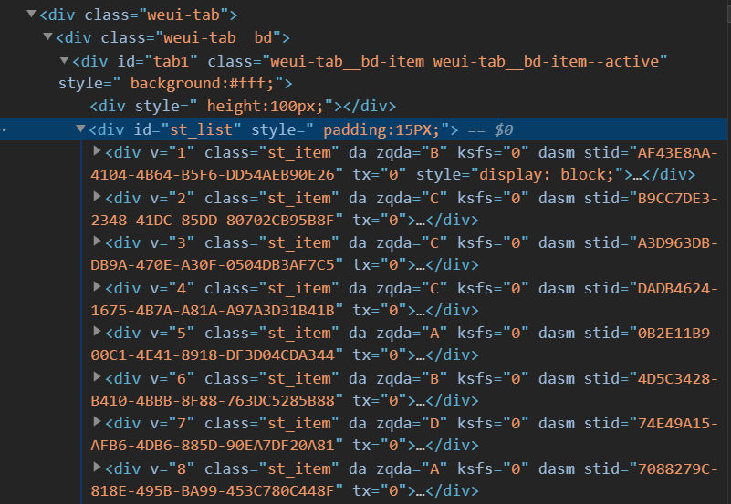
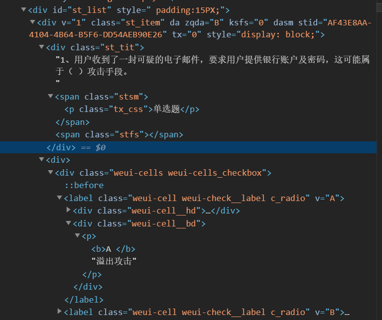
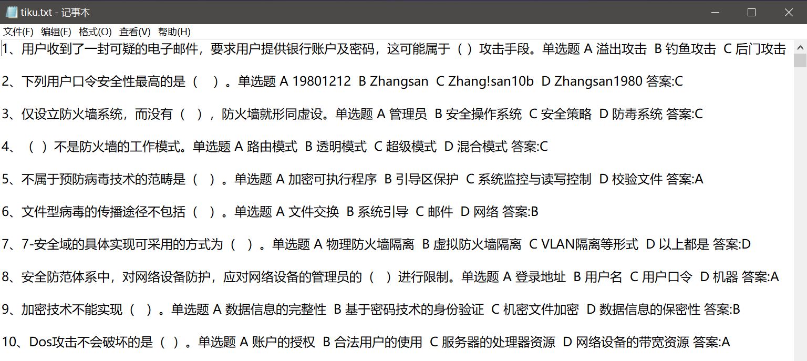
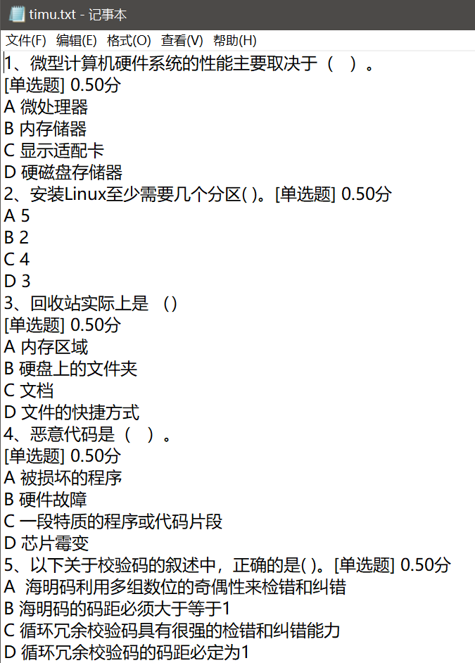
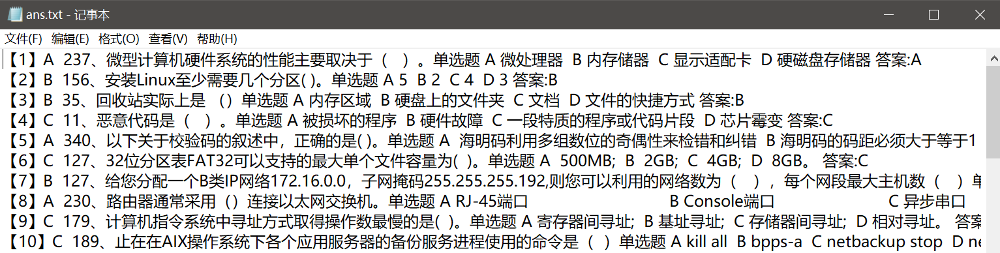

返工了公司又开始整考试了，不能线下聚众就线上考。考也就算了，题库几千道，分低于85%还得通报批评重考写检讨，怕了怕了。

研究了一下，写个脚本爬在线试题，再从本地题库搜答案。本地题库是预处理过的。

主要工具是爬考试页面用了beautifulsoup，其他也就简单io操作，考虑过网络编程直接提交post，一个是试卷网址生成编号不太有规律，另一个是作答手工操作也不复杂，万一程序调试不好交了白卷彻底凉凉，好吧，主要还是菜。

<!-- more -->

# 思路

1. 爬取在线练习题库。
2. 本地预处理题库。
3. 考试时爬取考试试题。
4. 处理考试试题格式，从本地题库搜索答案。

# 爬取题库

考试是在企业微信平台，但是微信也能进，公众号的形式，进入考试/练习的时候会跳转到web页面，说明这个考试系统本质还是个web。

转成浏览器先打开题库，想着先看看源码，再合计合计怎么从数据库爬，结果一看源码惊了，哪特么有数据库啊，所有的题目、选项、答案都在源码里一个id为``st_list``的div里：



每道题的结构又是这样的：



这直接把难度降到了最低，直接上beautifulsoup搞之：

``` python
from bs4 import BeautifulSoup

def html2txt(file_in, file_out):  #file_in：题目html file_out：题目txt

	f_in = open(file_in, 'rb')

	html = f_in.read()

	bs = BeautifulSoup(html,"html.parser")

	s = bs.find(id="st_list").get_text().split('\n')

	f_out = open (file_out,'w')

	for item in s :
		item = item.strip('\n').strip('\r').strip('\n').strip('\r').strip(' ')

		#print(item)
		if item == '解析:':
			print('\n', file = f_out)
		elif item != '':
			print(item, end = ' ', file = f_out)

	f_in.close()
	f_out.close()
```

这里只有一个小坑，源题库太多字符问题，比如每道题目后面带着各种编码的换行，有``\n``的，有``\r``的，还有两种混合的，偶尔还来个前面夹杂空格的，服了。

想了半天，只能这样来一下：

``` python
item = item.strip('\n').strip('\r').strip('\n').strip('\r').strip(' ')
```

``strip``有前后顺序，前面四个可以保证``\n``、``\r``什么顺序都清掉，最后清空格。

这样把每道题的解析去掉，只留题目选项和答案，一道换一次行，出来是这样的：



# 爬取试题

方法一样，我还想着考试源码要是连答案也有，都不用写脚本了，结果想得美，果然没答案，不过源码结构和题库是一样的，稍作修改即可：

``` python
def html2txt(file_in, file_out):  #file_in：题目html file_out：题目txt

	f_in = open(file_in, 'rb')

	html = f_in.read()

	bs = BeautifulSoup(html,"html.parser")

	s = bs.find(id="st_list").get_text().split('\n')

	f_out = open (file_out,'w')

	for item in s :
		item = item.strip('\n').strip('\r').strip('\n').strip('\r').strip(' ')

		#print(item)
		
		if item != '':
			print(item, file = f_out)

	f_in.close()
	f_out.close()
```

试题处理完是这样的：



# 搜索答案

两个文件都处理好，接下来就是喜闻乐见的for循环查找了，简单操作一下完事：

``` python
def serch(file_timu, file_tiku, file_ans):  #file_timu：题目txt file_tiku：题库txt file_ans：输出答案txt

	f_timu = open(file_timu, 'r')

	f_tiku = open(file_tiku, 'r')

	f_out = open (file_ans,'w')

	s = f_timu.read()

	s_tiku = f_tiku.read()

	s = s.split('\n')

	s_tiku = s_tiku.split('\n')

	i = 1

	for item in s :

		#item = item.strip('\n').strip('\r')
		
		if item != '' :
			
			#print(item)

			if item.find('、') != -1:
				item = item.split('、', 1)[1]

			#print(item)

			if item == '[单选题] 0.50分' or item == '[多选题] 1.00分' or item == '[判断题] 0.50分':
				for it2 in s_tiku :
					if it2.find(pre) != -1 :
						#print("【%d】 " %i)
						ans = it2.split('答案:')[1]
						if ans == '1' :
							ans = '正确'
						elif ans == '-1' :
							ans = '错误'
						print("【%d】%s " %(i, ans), it2, file = f_out)
						i = i + 1
						break
			elif (item.find('[单选题] 0.50分') != -1) or (item.find('[多选题] 1.00分') != -1) or (item.find('[判断题] 0.50分') != -1):
				for it2 in s_tiku :
					if it2.find(item[:-12]) != -1 :
						#print("【%d】 " %i)
						ans = it2.split('答案:')[1]
						if ans == '1' :
							ans = '正确'
						elif ans == '-1' :
							ans = '错误'
						print("【%d】%s " %(i, ans), it2, file = f_out)
						i = i + 1
						break
	
		pre = item.split('、')[-1]

	f_timu.close()
	f_tiku.close()
	f_out.close()
```

脚本本身不难，关键是数据本身太多需要清洗的地方，脚本改了好几次。

搜索完是这样的：



保留了源题库内容的输出，方便再修bug。