使用hexo+github搭建好静态博客后发现，github在国内访问较慢，时不时还要被墙一下，而且GitHub封锁了百度爬虫，官方表示禁用百度爬虫这一举措可能会一直持续下去。这导致百度按**site: url**搜索是没有结果的，只有谷歌能收录到。

网上搜索了一下，得到一个解决方案：可以通过将博客搭建在国内的Coding上，然后通过域名分流解析，国内用户访问解析到Coding上，海外用户访问解析到GitHub。修改hexo的``_config.yml``文件，每次部署的时候自动往两个地方部署。

**另外一点，coding在2020年进行了较大改动，之前的挺多教程已经不太适用了，一边百度，一边摸索，总算是搭建成功，做个记录以便查看。**

<!-- more -->

# 创建项目

新建一个名为yourname的项目，**其中这里的yourname最好是coding注册时的username，这样项目部署成功后博客的访问地址相对比较好记。**如下所示coding可以创建私有仓库，GitHub中是要收费的。

**注：现在项目地址还是yourname.coding.net/p /yourname， 但是博客地址已经成了随机名称的coding-pages.com的二级域名了**

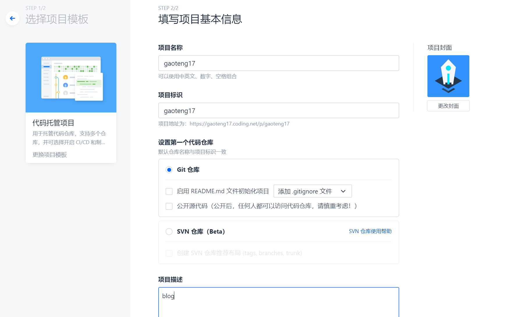

# 添加 SSH key

打开个人设置，SSH公钥，点击新增公钥。

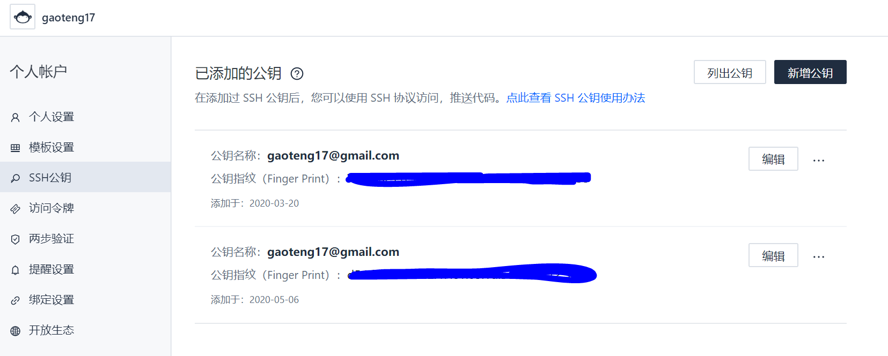

公钥位置在**C:\Users\yourname\.ssh\id_rsa.pub**

添加后可以在git bash里测试是否成功：

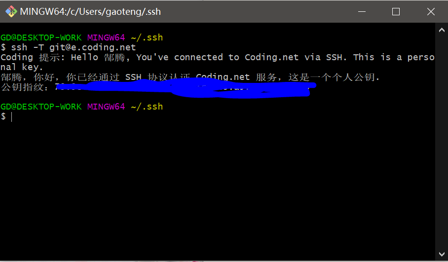

我已经添加过了，所以这样显示。第一次添加会有一个警告，yes回车就行。

**这里一定要注意，coding已经改了coding.net地址，新测试命令是``ssh -T git@e.coding.net``**

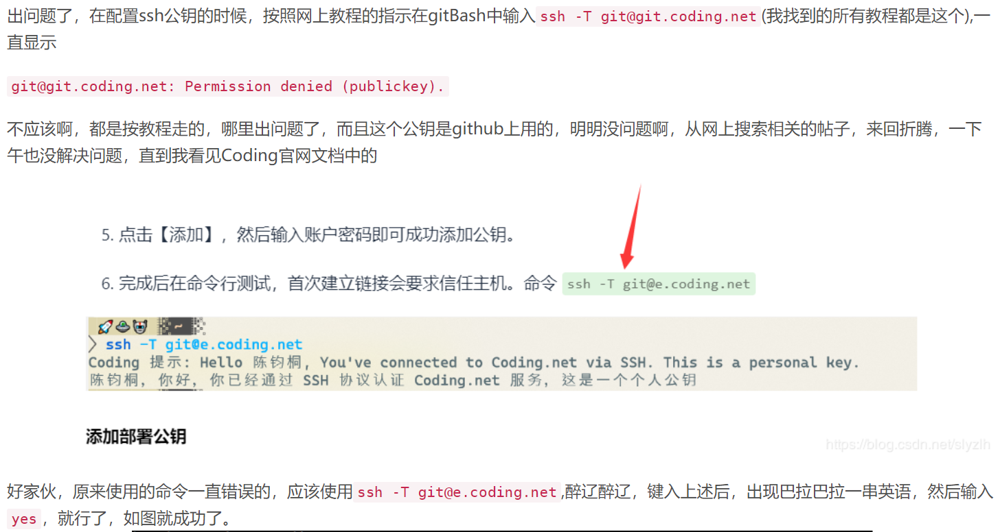

# 配置git

打开新建的项目概览，右侧可以看到项目的git地址：

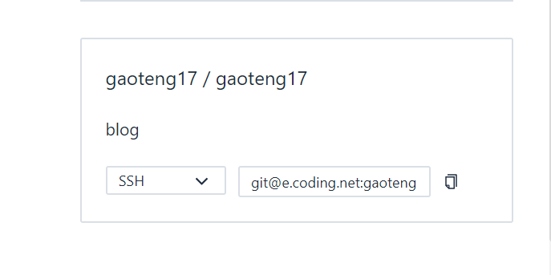

复制这个地址，然后编辑本地博客目录下的``_config.yml``文件如下：

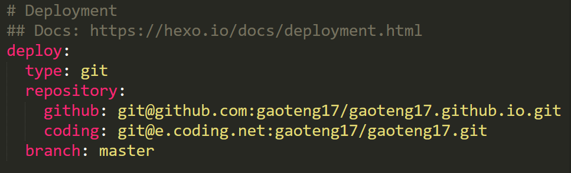

现在就可以实现``hexo d``命令自动在github和coding同时部署了。

# 配置静态网站

在项目中持续部署里有静态网站选项，coding上配置静态网站需要先实名认证，然后新建即可。

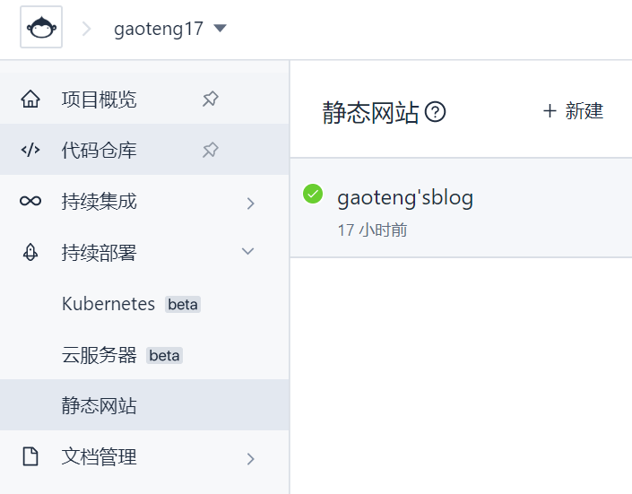

**注：新版在项目中直接找不到静态网站了，需要从项目设置->功能开关中打开持续部署功能：**

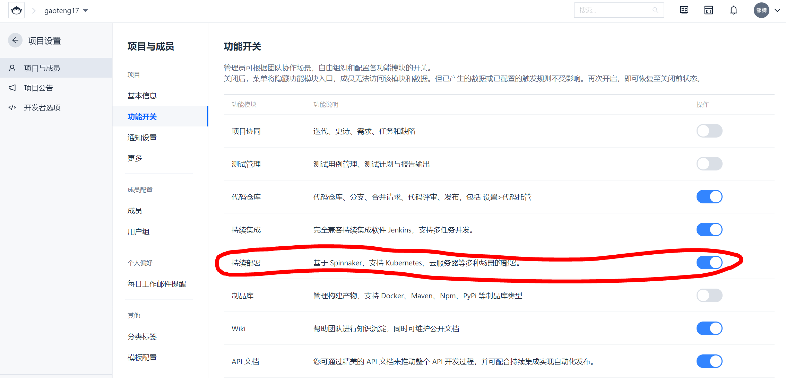

网站设置中可以把域名绑定，替换掉自带的随机coding-pages.com二级域名。**记着去域名提供商控制台添加解析。**

也能开启强制HTTPS。

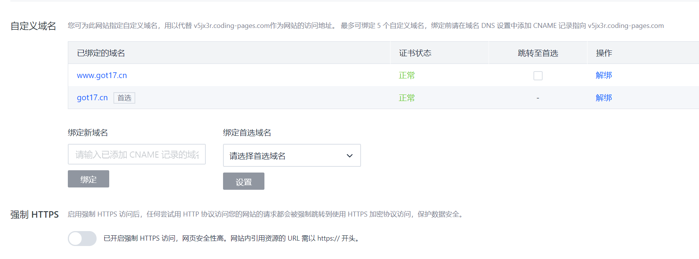

# 提交百度收录

上百度按照**site: url**搜索，没有结果：

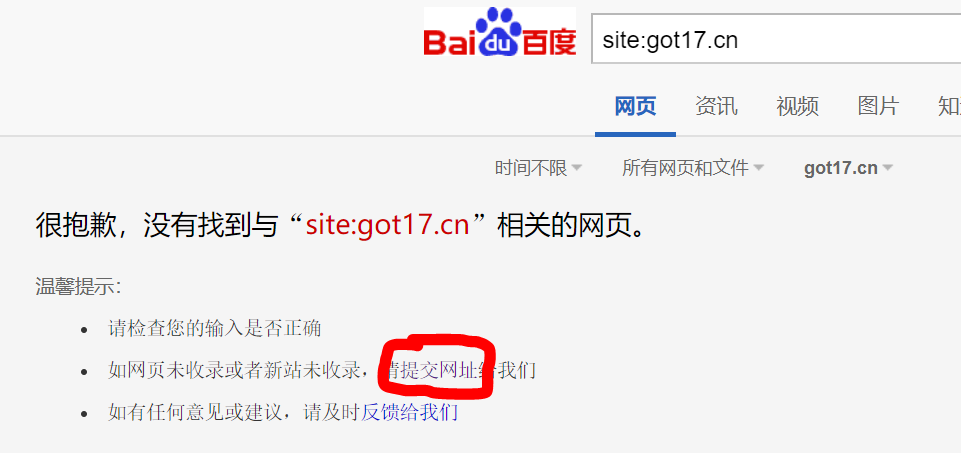

点击**提交网址**，登录并提交网站，然后选择**资源提交->链接提交**：

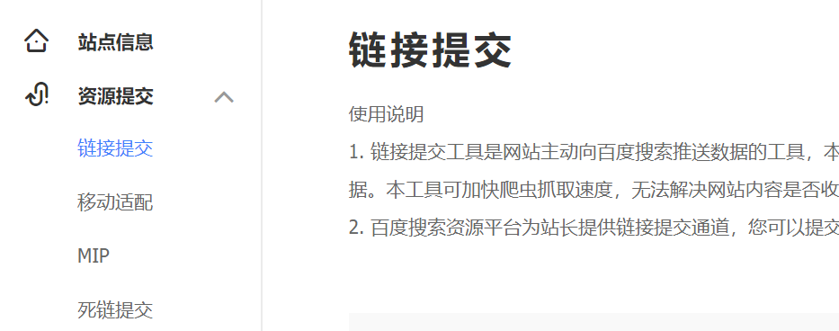

选择**自动提交->sitemap提交**，输入地址``yoursite/sitemap.xml``、``yoursite/baidusitemap.xml``即可：

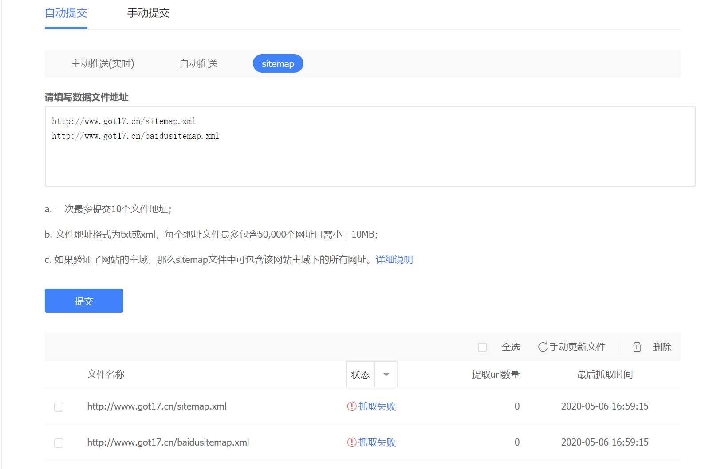

理论上是没问题的，sitemap也能打开，但是百度爬虫却爬取失败了，改天再研究研究。

# 参考资料

1. [Hexo博客同时部署到GitHub和Coding](https://blog.csdn.net/tsvico/article/details/80629452)
2. [基于hexo和coding免费搭建个人博客网站](https://blog.csdn.net/qq_33619378/article/details/81191564)
3. [解决coding配置ssh出现的Permission Denied (publickey)的问题](https://blog.csdn.net/slyzlh/article/details/105565975)