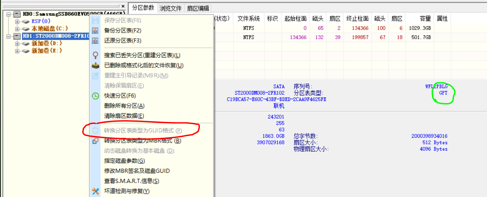
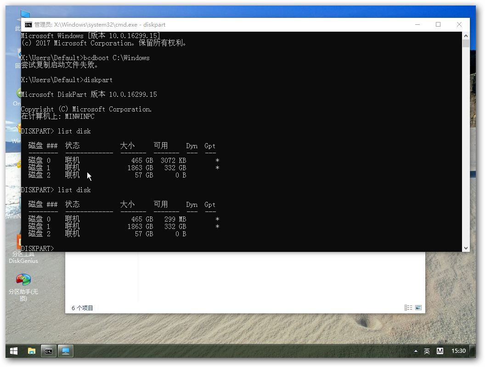
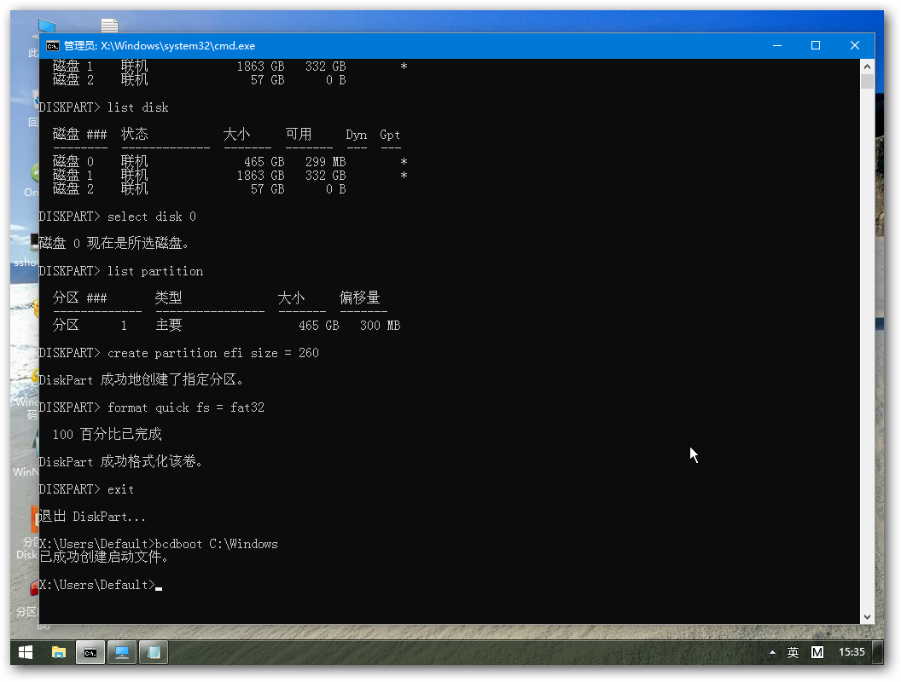

今天装deepin的时候发现办公室的新台式机磁盘竟然是mbr的，不是gpt+uefi，没办法，只能先把磁盘转成gpt。结果转完之后发现进不了win10了，进pe一看，缺少esp引导分区。搜了教程，新建分区，复制引导文件，修复成功。这里记个笔记，以便查阅。

<!-- more -->

# 磁盘转换

在pe或者win10（**管理员身份**）中运行DiskGenius，找到系统盘符，右键选择`转换分区类型为GUID格式`，转换完成后可以看到分区表类型变成**gpt**：



# 新建esp分区

进入PE，打开命令行界面，如果EFI分区还在的话，直接使用如下命令：

```  bash
bcdboot C:\Windows
```

其中‘C’是系统所在的盘符，在PE系统中系统盘符可能发生变化，请点开目录自行查看。



由图可见EFI分区已被删除或者根本就没有，则需要重新建立一个EFI分区。

使用PE中的diskgenius工具，在磁盘上分配一部分空余空间（我分配了300M）。

然后，使用如下命令建立EFI分区并建立引导。

``` bash
diskpart 
list disk 
select disk *                       // 选择你要重建EFI分区的盘的编号，以数字代替*
list partition 
create partition efi size = 260     // 260M，分配给EFI分区的容量
format quick fs = fat32 
exit 
 
bcdboot C:\Windows                  // 注意盘符
```



然后就可以通过windows boot manager引导进入win10。

另外efi分区应该默认是给了`z盘`的盘符。

# 参考资料

1. [Windows下误删EFI分区重建引导简单教程](https://blog.csdn.net/Rookie_tong/article/details/84455527)