51CTO的网课，本篇通过探测服务器敏感文件获取普通用户SSH秘钥，登录后代码审计，利用溢出提权，最终获取flag。

本篇使用工具netdiscover、nmap、dirb、ssh2john。

<!-- more -->

# 渗透记录

1. 首先使用netdiscover扫描网段，找到靶机ip地址：

``` bash
netdiscover -r 192.168.1.0/24
```

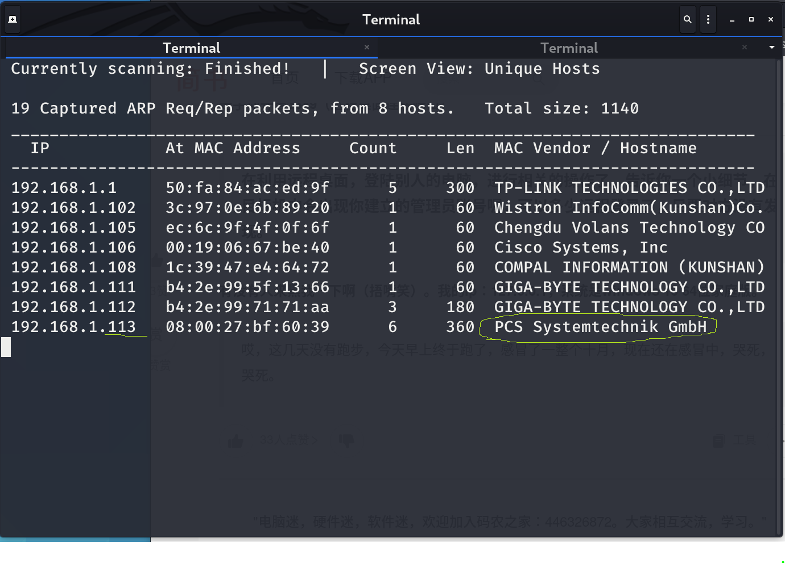

2. 使用nmap扫描靶机ip地址，找出开放端口：

``` bash
nmap -sV 192.168.1.113
```

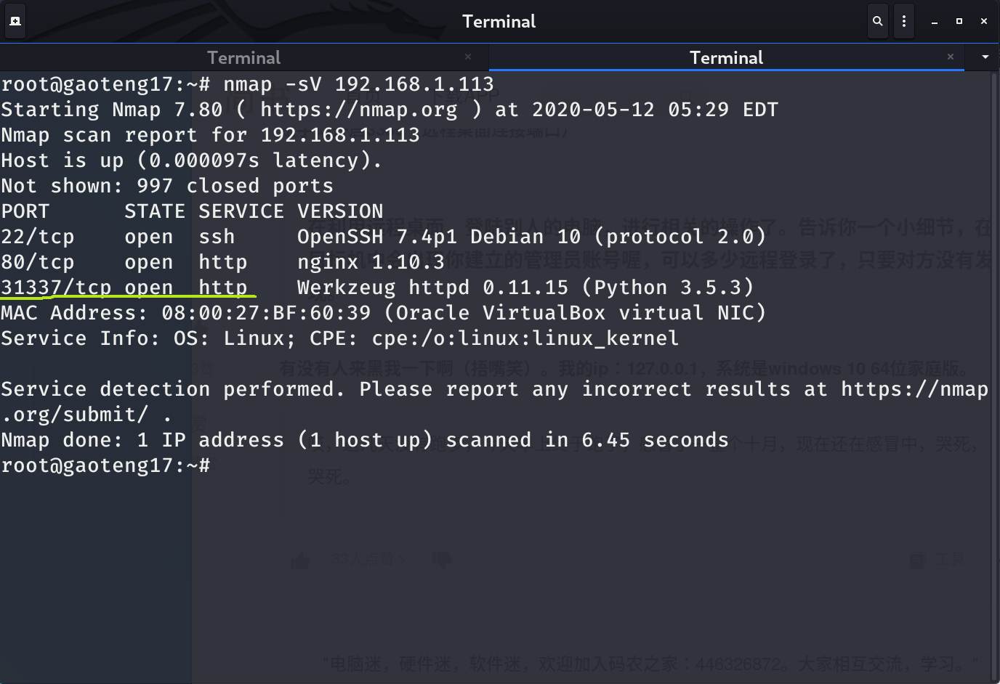

可以看到31337端口开启了http服务，大于1024的端口一般是用户可自行支配的端口，属于敏感端口。

3. 访问31337端口的http服务，查看页面和源码均没有什么有用的信息：

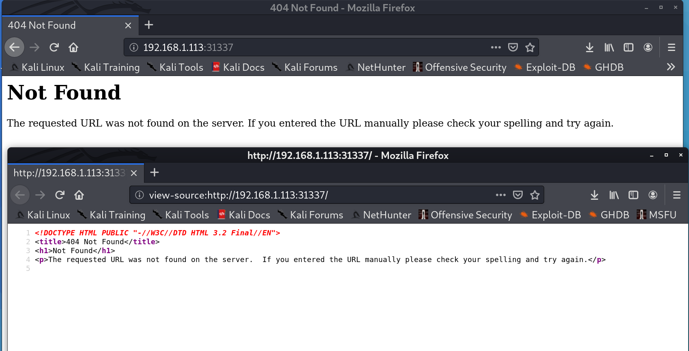

4. 使用dirb挖掘网站目录：

``` bash
dirb http://192.168.1.113:31337/
```

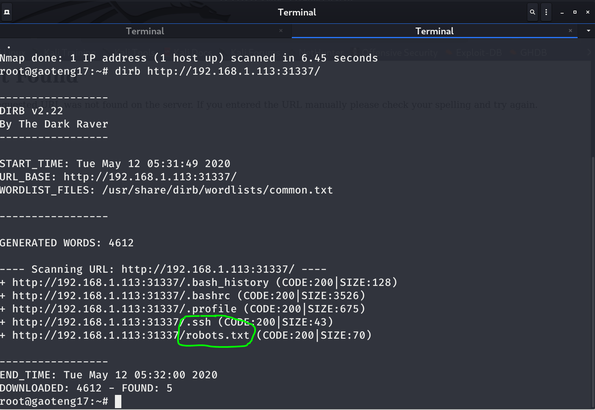

其中`robots.txt`提供给搜索引擎爬虫，告知网站中哪些资源不可爬取，一般这里会有敏感信息。

另外一个`/.ssh`也很有意思，有可能会有SSH秘钥。

5. 访问`robots.txt`，看到一个不被允许访问的敏感目录`/taxes`，访问得到第一个flag：

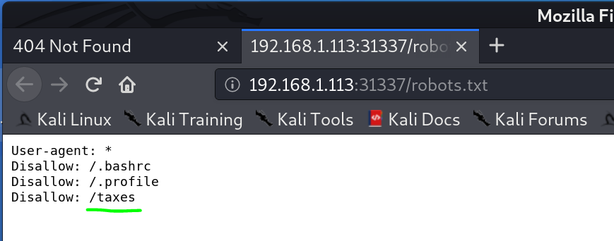

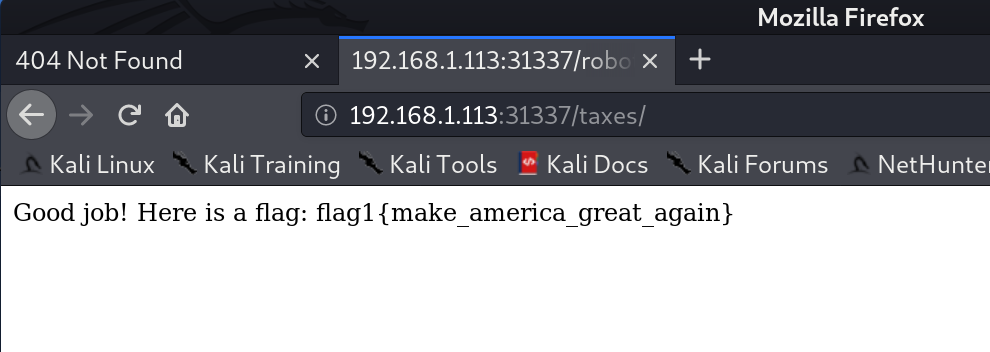

6. 再回过头访问`/.ssh`目录，可以看到SSH秘钥对，将私钥和公钥都下载到本地：

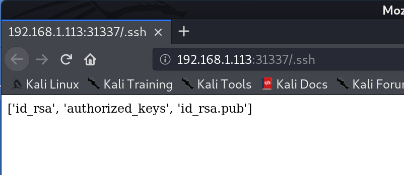

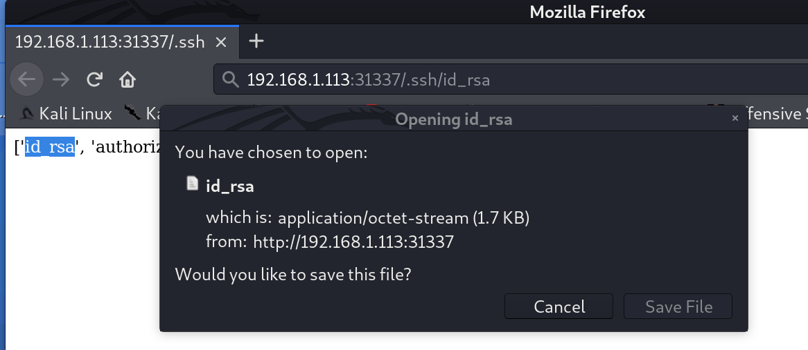

7. 修改私钥`id_rsa`权限为600，即只允许root用户的读写操作，否则ssh登录会因为权限太多被拒绝：

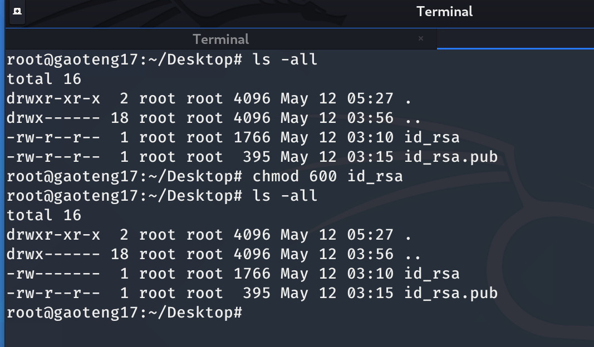

8. 使用ssh2john对私钥进行破解：

``` bash
python /usr/share/john/ssh2john.py id_rsa > crack
zcat /usr/share/wordlists/rockyou.txt.gz | john crack
```

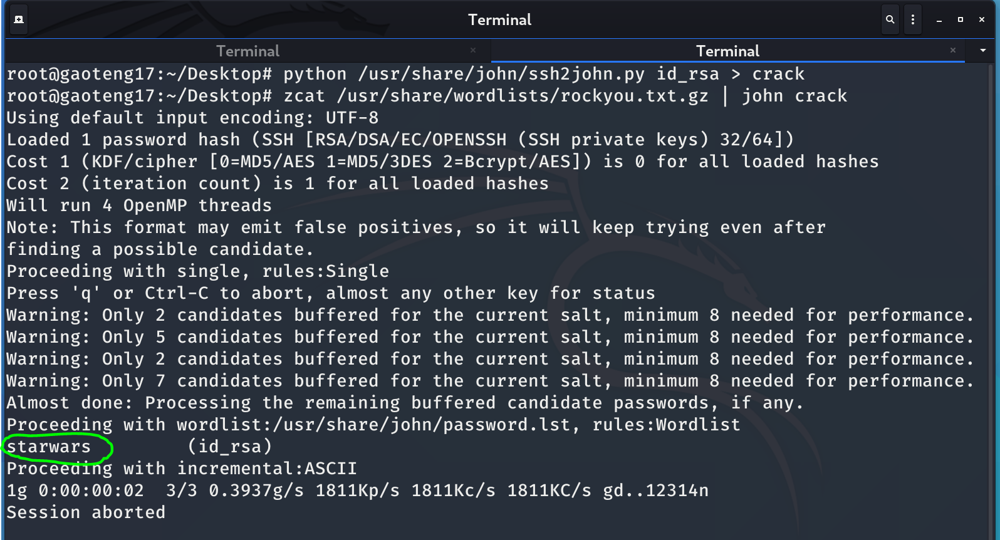

可以看到已破解出passphrase是starwars。

9. cat公钥得到用户名，配合私钥以及破解出来的密码，ssh登录靶机：

``` bash
root@gaoteng17:~/Desktop# cat id_rsa.pub
root@gaoteng17:~/Desktop# ssh -i id_rsa simon@192.168.1.113
Enter passphrase for key 'id_rsa':starwars
```

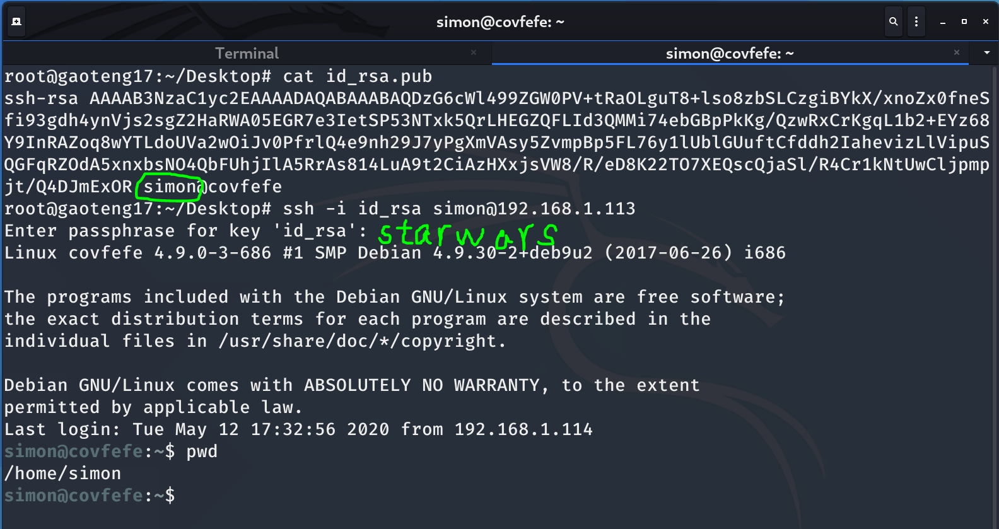

10. 切换到`/root`目录下，查看敏感文件，找到flag，但是权限不够：

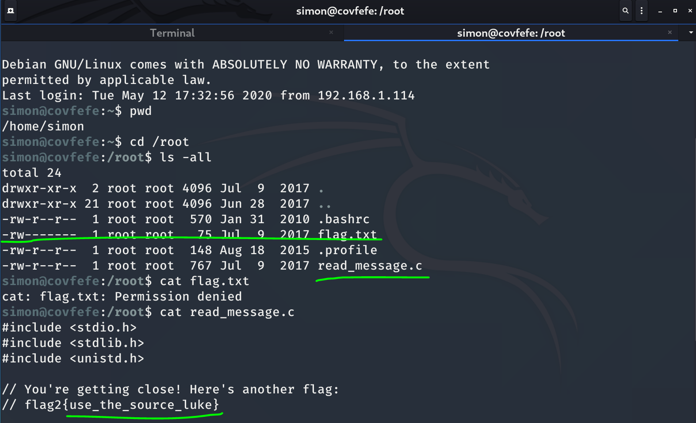

11. 查看`/root`目录下的`read_message.c`文件，得到第2个flag：

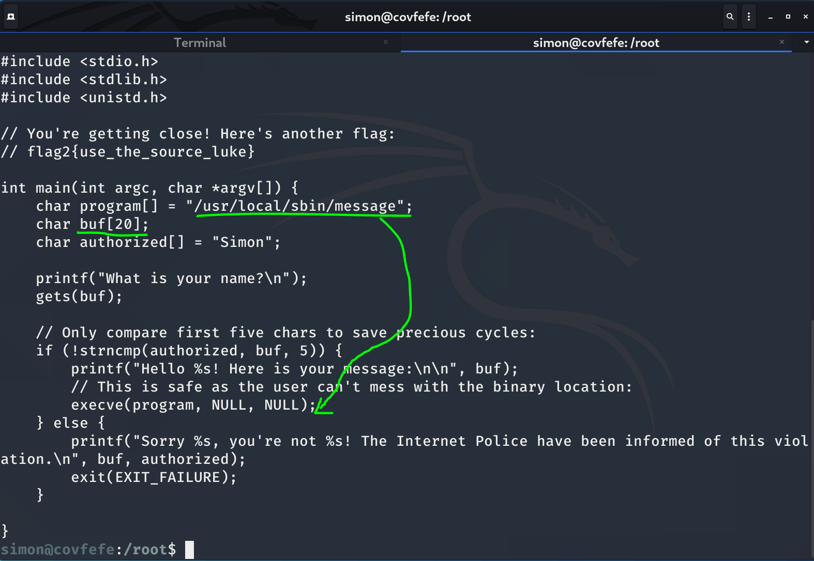

审计代码，发现有溢出漏洞。

12. 查找有权限执行的文件，这步其实没怎么搞明白：

``` bash
find / -perm -4000 2>/dev/null
```

/是从根目录开始查找，最后的2>/dev/null是将stderr信息转向到这个特殊null文件中，这样屏幕不会被权限不够这些错误信息刷屏从而找不到有用信息，0对应stdin，1对应stdout，但是中间的-perm -4000参数没怎么搞明白，网上也没搜到，以后再补充吧。

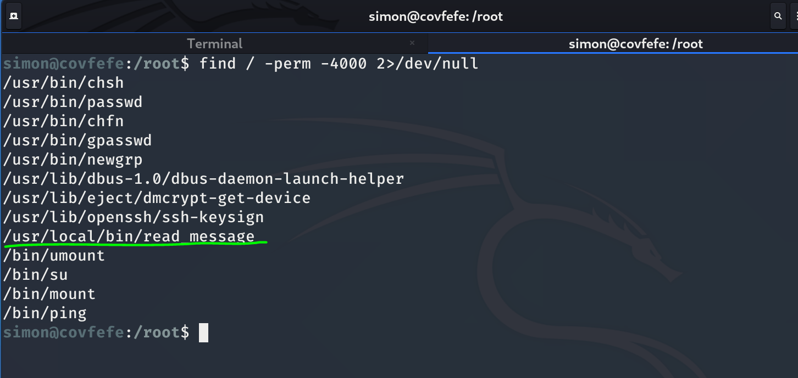

13. 利用代码的溢出，输20位以Simon打头的字符，后面接上`/bin/sh`，实现提权，获得最后一个flag：

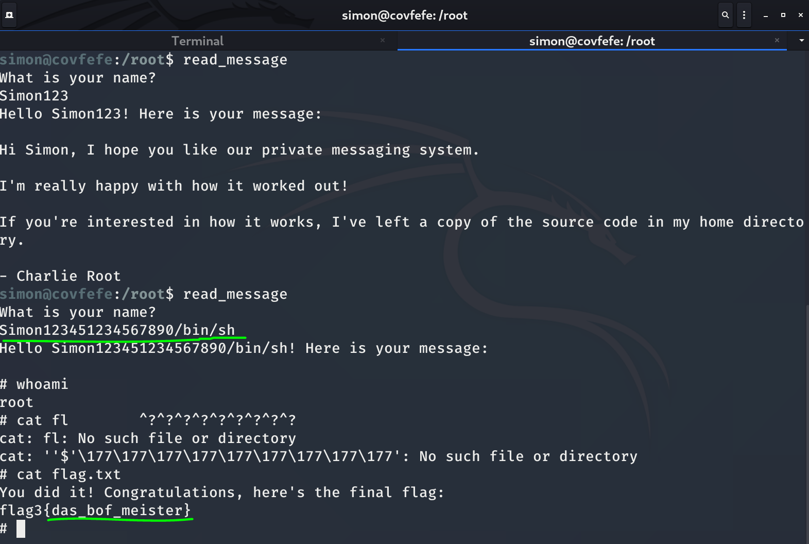

这个也没怎么搞明白，为什么后面接`/bin/sh`就能提权，也没搜到，以后再补充吧。

# 命令总结

## netdiscover

专用的二层发现工具。拥有主动和被动发现两种方式。

参数|意义
-|-
-i:网卡|选择你监控的网卡。比如eth0
-r:range|指定IP段。比如192.168.0.0/24
-l:filename|从文件读取range列表
-p|被动模式。默默的侦听指定的网卡以发现别的二层主机
-t|ARP包发送间隔。单位毫秒。这个可以用来规避检测系统的告警。
-c|发包数量

举例：

``` bash
netdiscover  -i eth0 -r 192.168.43.0/24   主动发现：-i指定所要侦听的网卡，-r指定ip段。
netdiscover -p                            被动发现
```

## nmap

十条nmap常用的扫描命令:

1. 获取远程主机的系统类型及开放端口

``` bash
nmap -sS -P0 -sV -O <target>
这里的 < target > 可以是单一 IP, 或主机名，或域名，或子网
```

* -sS TCP SYN 扫描 (又称半开放,或隐身扫描)
* -P0 允许你关闭 ICMP pings.
* -sV 打开系统版本检测
* -O 尝试识别远程操作系统

其它选项:

* -A 同时打开操作系统指纹和版本检测
* -v 详细输出扫描情况.

2. 列出开放了指定端口的主机列表

``` bash
nmap -sT -p 80 -oG – 192.168.1.* | grep open
```

3. 在网络寻找所有在线主机

``` bash
nmap -sP 192.168.0.*
```

或者也可用以下命令:

``` bash
nmap -sP 192.168.0.0/24
指定 subnet
```

4. Ping 指定范围内的 IP 地址

``` bash
nmap -sP 192.168.1.100-254
```

5. 在某段子网上查找未占用的 IP

``` bash
nmap -T4 -sP 192.168.2.0/24 && egrep “00:00:00:00:00:00″ /proc/net/arp
```

6. 在局域网上扫找 Conficker 蠕虫病毒

``` bash
nmap -PN -T4 -p139,445 -n -v –script=smb-check-vulns –script-args safe=1 192.168.0.1-254
```

7. 扫描网络上的恶意接入点 （rogue APs）.

``` bash
nmap -A -p1-85,113,443,8080-8100 -T4 –min-hostgroup 50 –max-rtt-timeout
2000 –initial-rtt-timeout 300 –max-retries 3 –host-timeout 20m
–max-scan-delay 1000 -oA wapscan 10.0.0.0/8
```

8. 使用诱饵扫描方法来扫描主机端口

``` bash
sudo nmap -sS 192.168.0.10 -D 192.168.0.2
```

9. 为一个子网列出反向DNS记录

``` bash
nmap -R -sL 209.85.229.99/27 | awk ‘{if($3==”not”)print”(“$2″) no PTR”;else print$3″ is “$2}’ | grep ‘(‘
```

10. 显示网络上共有多少台 Linux 及 Win 设备?

``` bash
sudo nmap -F -O 192.168.0.1-255 | grep “Running: ” > /tmp/os; echo “$(cat /tmp/os | grep Linux \
| wc -l) Linux device(s)”; echo “$(cat /tmp/os | grep Windows | wc -l) Window(s) device”
```

## dirb

dirb是一个类似windows下御剑这些目录扫描工具，下面是几个常用的参数：

参数|作用
-|-
-a |设置ua
-c |设置cookie带cookie扫描
-N |忽略某些响应码
-o |输出结果
-p |使用代理
-X |在每个测试目录上附加后缀
-z |设置毫秒延迟

举例：

``` bash
一、正常扫描
dirb 目标 字典路径

二、设置 ua 和 cookie
dirb 目标 字典路径 -a "ua"  -c "cookie"

三、使用代理和输出结果
dirb 目标 字典路径 -p ip:port -o result.txt

四、设置附加后缀
dirb dirb 目标 字典路径 -X test(这样每个被测试的字典都附加了test)

五、设置毫秒延迟
如果目标存在一些安全程序爬扫描太快被屏蔽的话可以设置-z参数单位是毫秒
dirb dirb 目标 字典路径 -z 1000 (1秒)
现在只能1秒访问一次了
```

## ssh2john

John the Ripper可以破解在RSA加密中创建的SSH私钥。

首先利用自带的ssh2john工具改变SSH私钥的格式变成john能处理的格式，然后跑字典进行破解：

``` bash
chmod 600 id_rsa
ssh2john id_rsa > crack
john --wordlist=/usr/share/wordlists/rockyou.txt crack
john crack --show

字典是gz包的话：
zcat /usr/share/wordlists/rockyou.txt.gz | john crack
```

# 参考资料

1. [2020发布 CTF基础入门/CTF教程零基础 渗透测试/web安全/CTF夺旗【整套教程】](https://www.bilibili.com/video/BV1SJ411h7VW)
2.  [Netdiscover使用](https://blog.csdn.net/qq_30247635/article/details/86257968)
2. [十条nmap常用的扫描命令](https://www.linuxprobe.com/10-nmap.html)
3. [(每日一工具)dirb目录扫描工具](https://zhuanlan.zhihu.com/p/26549845)
4. [SSH passphrase的破解](https://www.cnblogs.com/zlgxzswjy/p/10081873.html)