51CTO的网课，本篇利用nmap搜索开放端口，逐一对ftp、ssh、https等端口进行安全测试，探测敏感信息，获取flag。

本篇使用工具nmap，dirb。

<!-- more -->

# 使用命令

## nmap

* 快速扫描靶场全部开放端口信息

``` bash
-- nmap -p- -T4 靶场IP地址
```

* 探测靶场全部信息

``` bash
-- nmap -A -v -T4 靶场IP地址
```

## dirb

* 挖掘靶场网站敏感信息

``` bash
dirb 靶场IP地址:端口号
```

## nc

**语法：**

``` bash
nc [-hlnruz][-g<网关...>][-G<指向器数目>][-i<延迟秒数>][-o<输出文件>][-p<通信端口>][-s<来源位址>][-v...][-w<超时秒数>][主机名称][通信端口...]
```

**参数说明：**

* -g<网关> 设置路由器跃程通信网关，最多可设置8个。
* -G<指向器数目> 设置来源路由指向器，其数值为4的倍数。
* -h 在线帮助。
* -i<延迟秒数> 设置时间间隔，以便传送信息及扫描通信端口。
* -l 使用监听模式，管控传入的资料。
* -n 直接使用IP地址，而不通过域名服务器。
* -o<输出文件> 指定文件名称，把往来传输的数据以16进制字码倾倒成该文件保存。
* -p<通信端口> 设置本地主机使用的通信端口。
* -r 乱数指定本地与远端主机的通信端口。
* -s<来源位址> 设置本地主机送出数据包的IP地址。
* -u 使用UDP传输协议。
* -v 显示指令执行过程。
* -w<超时秒数> 设置等待连线的时间。
* -z 使用0输入/输出模式，只在扫描通信端口时使用。

**实例：**

1. 扫描192.168.0.3 的端口 范围是 1-100:

``` bash
# nc -v -z -w2 192.168.0.3 1-100 
192.168.0.3: inverse host lookup failed: Unknown host
(UNKNOWN) [192.168.0.3] 80 (http) open
(UNKNOWN) [192.168.0.3] 23 (telnet) open
(UNKNOWN) [192.168.0.3] 22 (ssh) open
```

2. 扫描UDP端口:

``` bash
# nc -u -z -w2 192.168.0.1 1-1000 //扫描192.168.0.3 的端口 范围是 1-1000
```

3. 扫描指定端口:

``` bash
# nc -nvv 192.168.0.1 80 //扫描 80端口
(UNKNOWN) [192.168.0.1] 80 (?) open
y  //用户输入
```

# 渗透记录

1. nmap扫描靶机IP地址开放端口，`nc`命令探测大端口的banner，获得两个flag：

``` bash
nmap -p- -T4 192.168.1.115
nc 192.168.1.115 13337
nc 192.168.1.115 60000
```

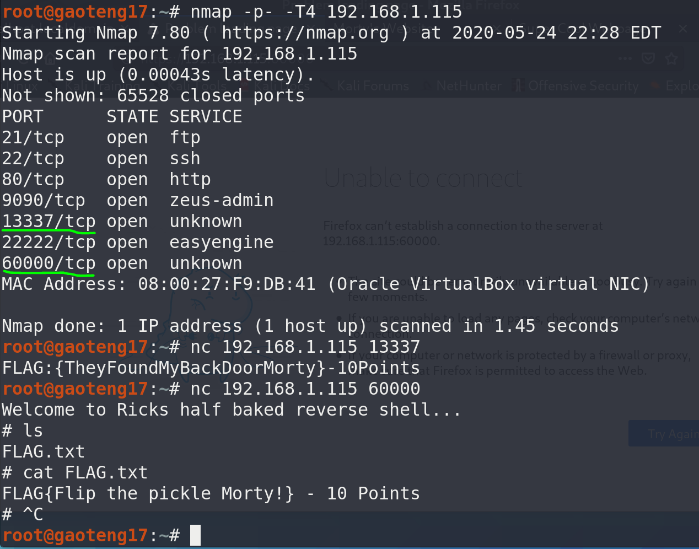

2. `dirb`挖掘`9090`端口web信息：

``` bash
dirb https://192.168.1.115:9090/
```

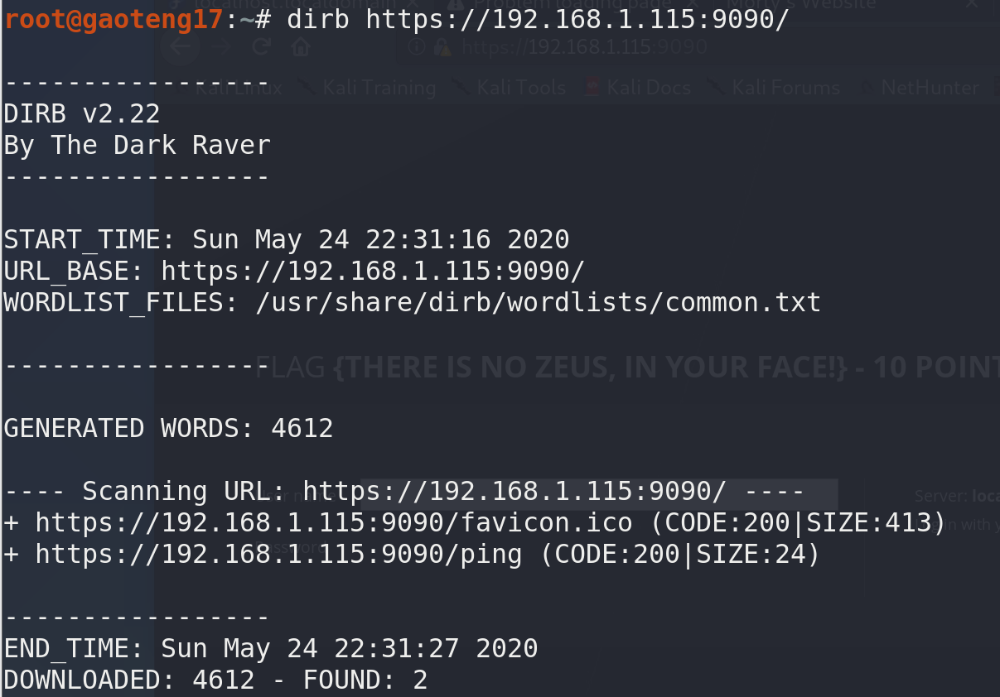

3. 访问`9090`端口的web服务，获得flag：

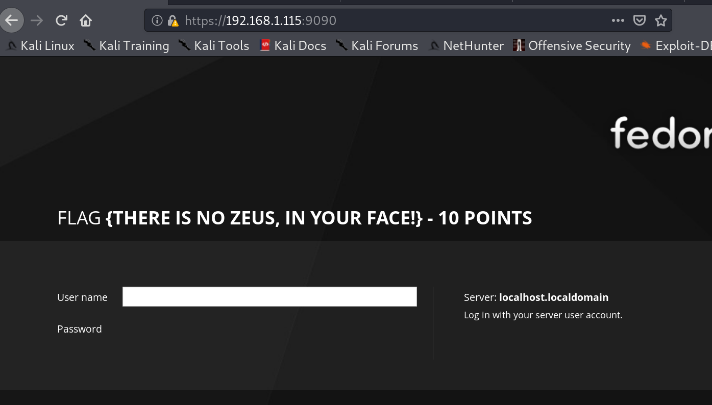

4. `dirb`挖掘`80`端口web信息，两个敏感信息：

``` bash
dirb http://192.168.1.115/
```

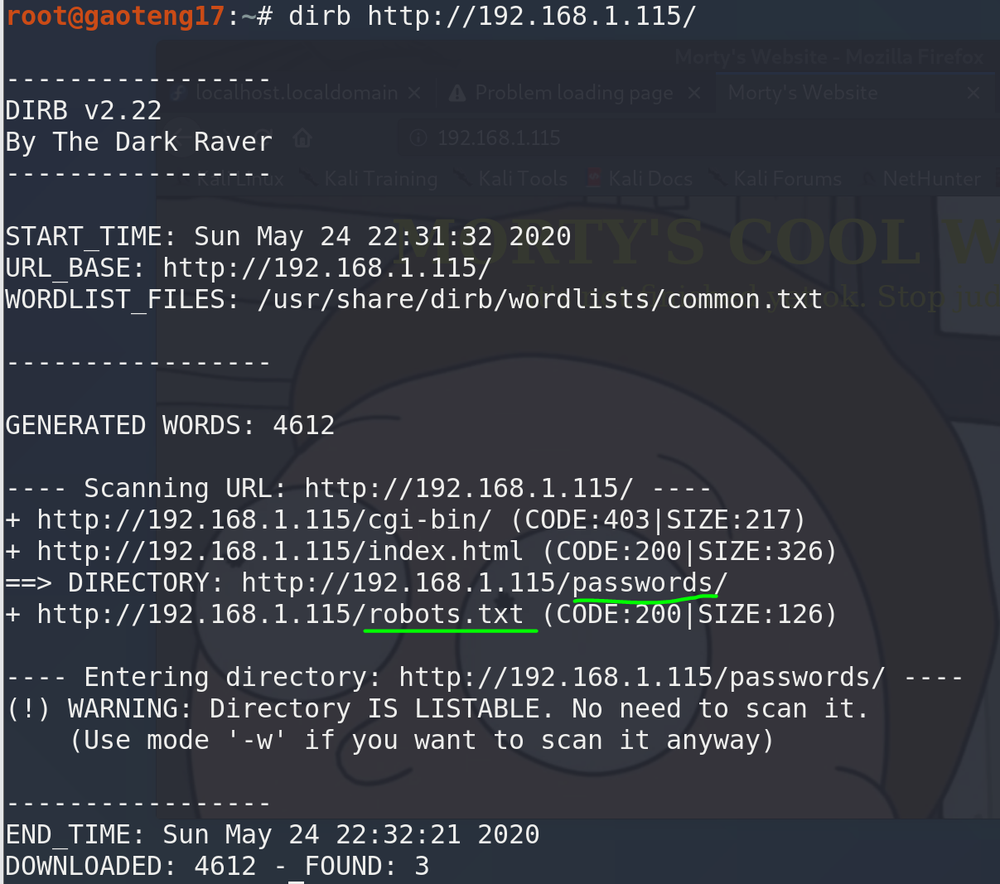

5. 访问`/passwords`目录，找到两个文件：

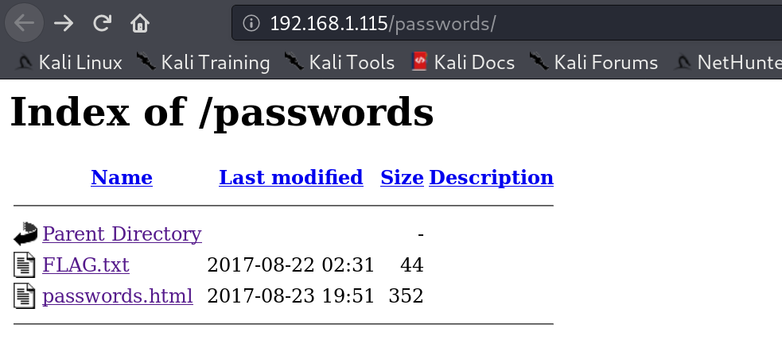

6. 打开第一个flag文件：

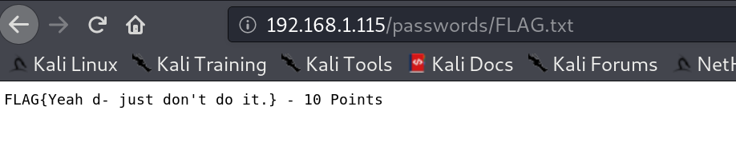

7. 查看第二个网址源码，得到一个密码，留作备用：

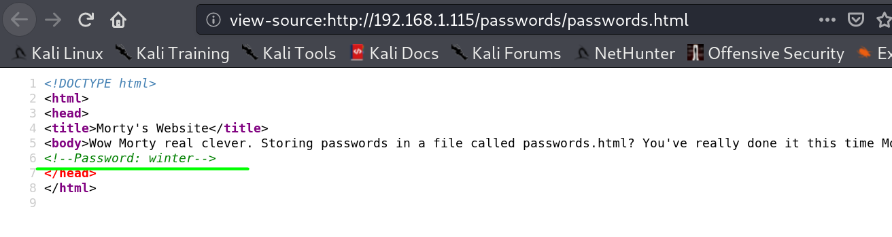

8. 访问`robots.txt`文件，两个敏感目录：

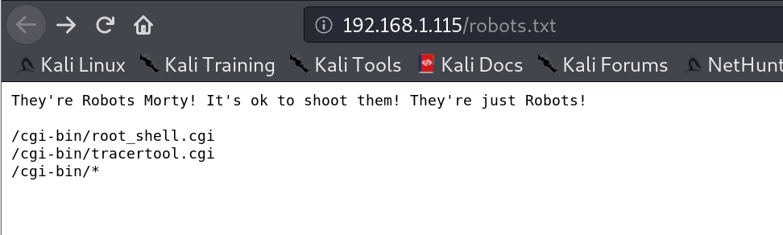

9. 访问第一个`/cgi-bin/root_shell.cgi`，没有有用信息：

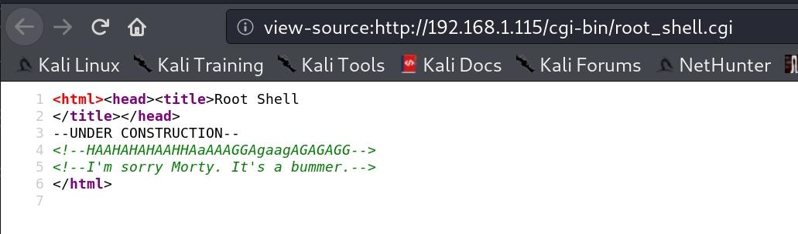

10. 访问第二个`/cgi-bin/tracertool.cgi`，发现是一个tracert工具，可以注入：

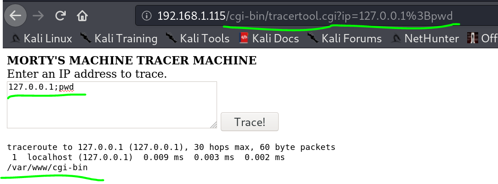

11. 使用`cat`命令探测用户组，发现靶机对`cat`命令进行了屏蔽：

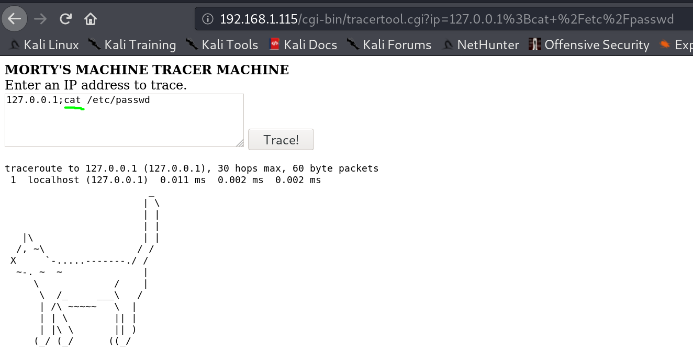

12. 将`cat`换成`more`，成功拿到三个用户名，结合前面密码**winter**，猜测对应用户名**Summer**：

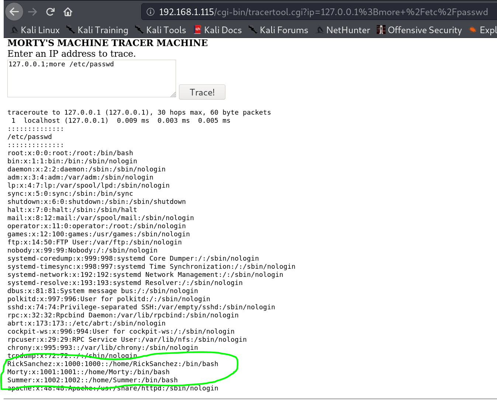

13. 第一步还扫到了21端口，直接访问ftp服务，查看是否可以匿名登录，拿到flag：

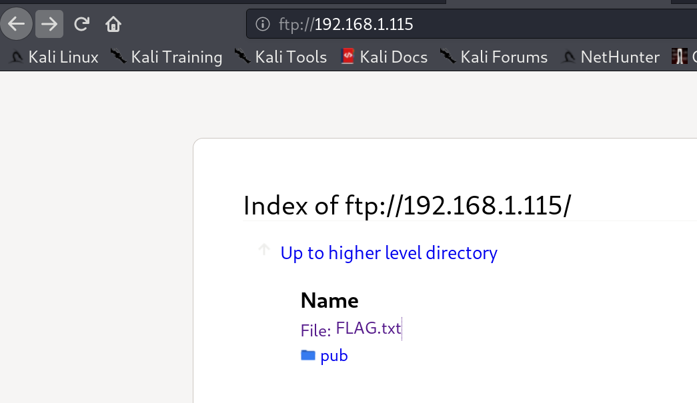

14. ssh登录靶机，发现22口禁用，换用第一步扫到的22222端口，成功登录：

``` bash
ssh -p 22222 Summer@192.168.1.115
```

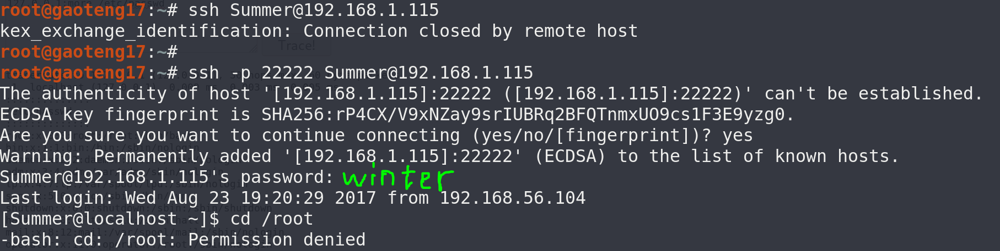

15. 同样`more`代替`cat`，获取flag：

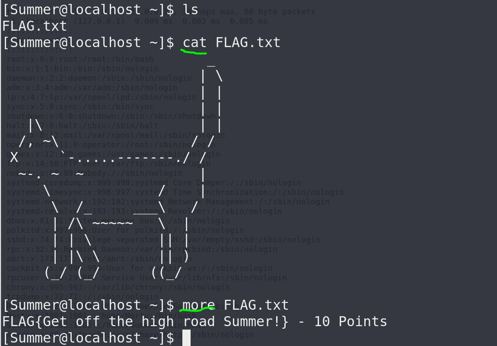

# 参考资料

1. [2020发布 CTF基础入门/CTF教程零基础 渗透测试/web安全/CTF夺旗【整套教程】](https://www.bilibili.com/video/BV1SJ411h7VW)
2. [Linux nc命令 | 菜鸟教程](https://www.runoob.com/linux/linux-comm-nc.html)