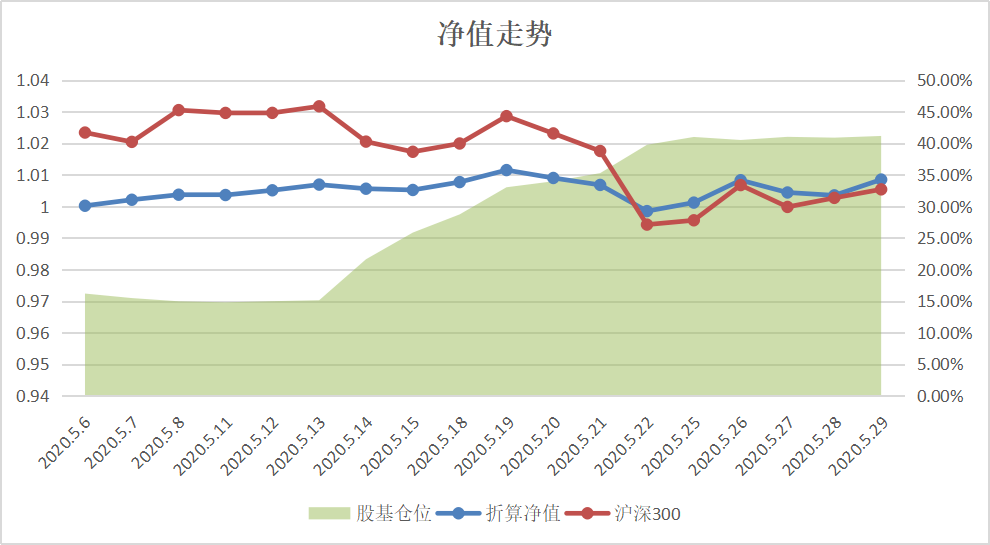
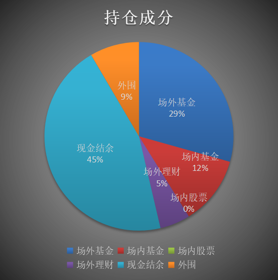
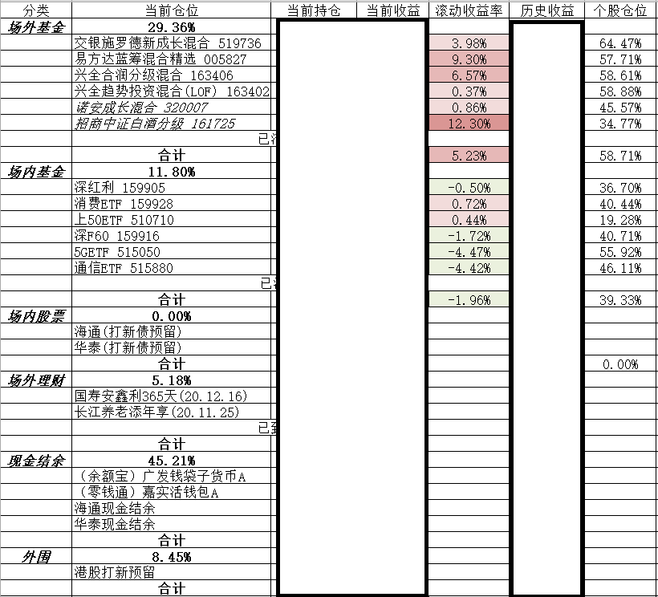
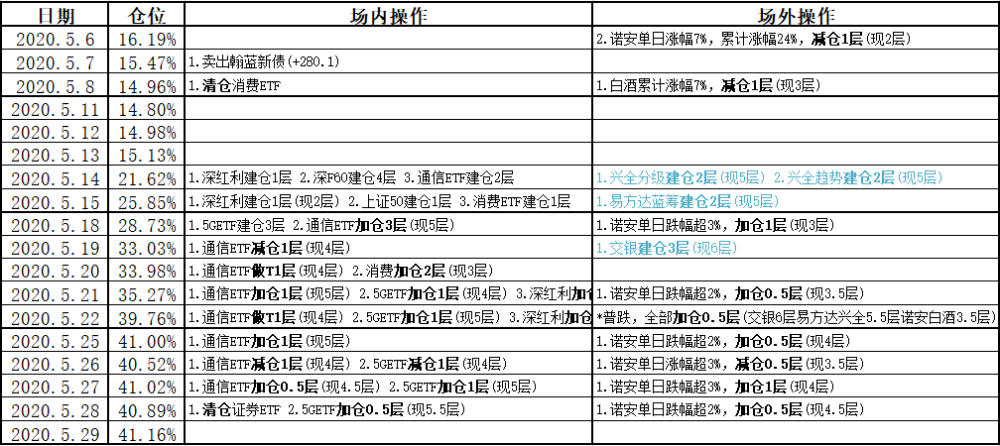

5月份投资记录总结。

本月月中借着回调正式建仓完毕，同时微调细化了策略，感觉最近的操作越来越网格化了。

<!-- more -->

# 本月回报

本月股票/基金仓位平均仓位**28.58%**，期末仓位**41.16%**，当月收益率**0.98%**，最大回撤**1.30%**。

# 持仓情况

本月月中基本建仓完毕，当前仓位接近半仓。

详细持仓情况：

**场内暂定(2020.5)：**
1. 轮动运作，底仓2~4层
2. 跌1%/2%/3%买入，单次0.5/1/2层
3. 涨1%/2%/3%卖出，单次0.5/1/2层
4. 早盘尾盘操作，盘中不操作

**场外暂定(2020.5)：**
1. 半仓(50-75%)运作
2. 每跌5%(单日2%/3%)加仓0.5/1/2/3/4层(最多10层)
3. 每涨7%(单日3%/5%)减仓0.5/1/2/3/4层
4. 主动基金长持(1-2年)，行业指数基金涨跌幅轮动

**最大回撤(2020.5)：**
1. 场内底仓较低，操作灵活，可以接受较大回撤
2. 场外底仓5成，计划按照跌幅加仓4次，最大可接受20%回撤，此时浮亏11.71%

**计划仓位(2020.5)：**
1. 场内股票 上限5%
2. 场内基金 目标15%/上限30%
3. 场外基金 目标30%/上限50%

# 本月操作

上月末考虑到五一长假的不确定性，以及回测历史多次发生收假后暴跌，故清仓场内指数基金，持币过节。结果收假后连涨一周，果然市场是预测不来的，不过也好，踏空总比套牢强，稳妥点总是没错的。

月中出现过下调，借此建仓完毕，期间还触发了一次小幅加仓，我感觉基本大底已定，半仓的情况下能跟得起继续跌。

本月场内持有的指数基金多数开始回调，严格执行策略买入卖出，期间甚至两次高开低走的情况下做了T，总体回撤控制良好，在还有较大加仓空间下基金基本达到年度低位，这种输了时间也不输钱。

另外5月分红月，一个月没有新债发行，本来还希望能降降热度，结果5.27回归的两个新债一波2%和3%的中签率直接打碎我美好的想法。果然这种热度只能靠破发来降，不然以后打新债和打新股一样了，全是摸奖。

本月港股打新估计能降点热度，现在基本大肉中签率极低，能中的都是没保荐没绿鞋的圈钱垃圾股。打了一个月就中了个伊登(一手中签30%)，结果直接腰斩，还好跑得快，赔5个点出局。月底非常热门的移卡更是暗盘破发，再这么搞，还不如all in腾讯呢，打什么新啊。

# 开支总结

本月收入正常，工资无变化，奖金加倍，无额外收入。

本月支出无大额支出，其它日常开销正常。

结余出工资的80%投入资产配置。

# 次月策略

周末不知道特朗普又要来点什么言论了，但是大家都认可他没好话的前提下，相当于市场已经计提了这一部分的风险，况且A股再往下的空间远少于向上的空间。

本月基本建仓完毕的情况下，下个月还是多看少动为妙。

其次还可以优化策略，其中的涨跌幅加减仓指标毕竟都是凭感觉来优化的，有想过利用历史数据来回测，模拟出更恰当的指标，但是一方面市场不是能预测出来的，另一方面这些指标的存在本身是否合理都是一个问题，我准备再多学习总结看看。

# 一些感想

上个月我说到：`越尝试多种投资，越发现专业的事就该交给专业的人，场内做做指数基金高抛低吸赚点小钱就行，关键还是大量场外主动基金，交给专业的管理人，长期持有几年，总比自己瞎jb操作强太多。`这个月总结数据来看，即使天天按照策略操作，持有的场外主动基金收益率也远远超过了持有的场内指数基金。再次验证了`专业的事就该交给专业的人`，自己玩玩就好，不要总把自己想成七亏二平一赚里的一，普通人能当二就不错了。