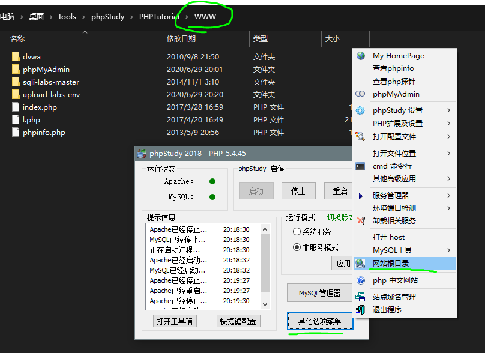
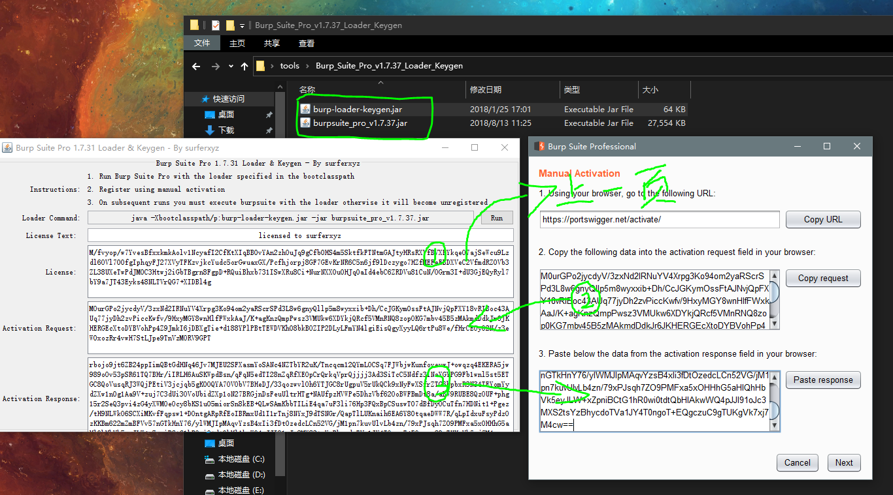
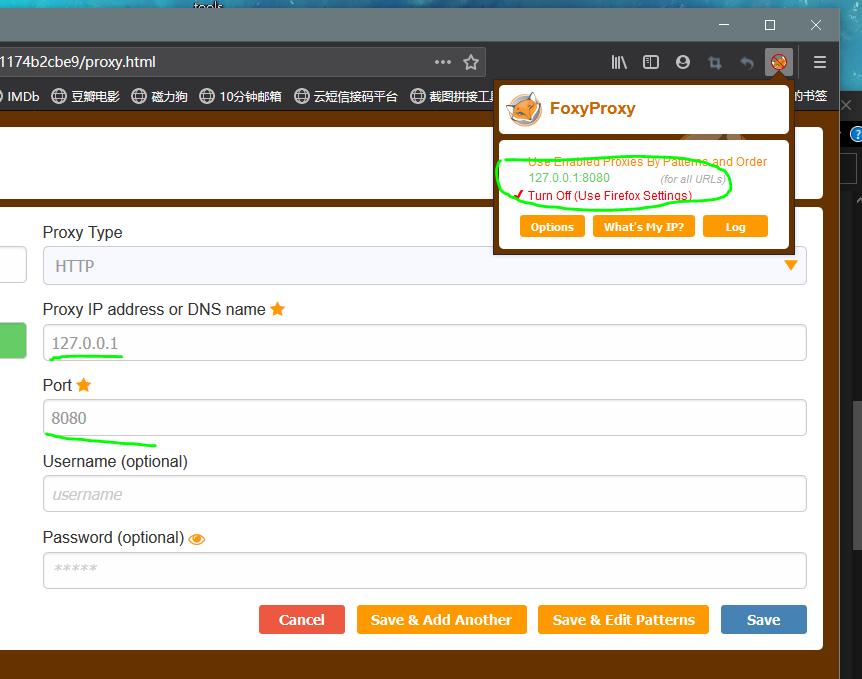
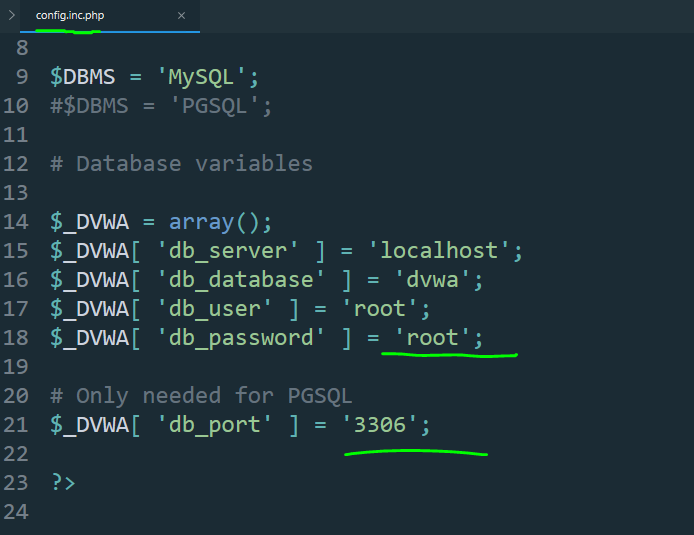
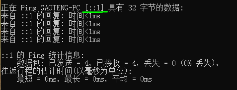
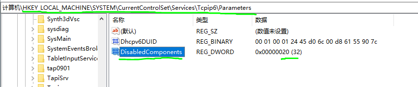
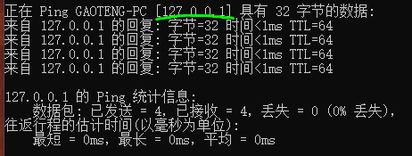

第一天上午开幕式没什么干货。

下午主要是软件的安装和环境搭建与配置，安装了jdk、phpstudy、burpsuite、DVWA。

<!-- more -->

# jdk

官网下载，**选择ver8，太高级的burpsuite不支持。**

一直下一步即可，安装完后添加环境变量：

``` bash
变量名：JAVA_HOME
变量值：电脑上JDK安装的绝对路径

变量名：CLASSPATH
变量值：.;%JAVA_HOME%\lib\dt.jar;%JAVA_HOME%\lib\tools.jar;

修改Path变量:
%JAVA_HOME%\bin
%JAVA_HOME%\jre\bin
```

# phpstudy

官网下载2018版，安装注意别在**包含中文或空格路径**下。

安装完查看网站根目录，这个`\WWW`目录下放练习靶机网站文件就可以本地访问了：



# burpsuite

## 安装

安装好jdk后，解压得到两个文件，一个注册机一个本体。运行注册机，按顺序复制粘贴license即可：



## 配置代理

Firefox附加组件->商店搜索`foxy proxy`，安装完后添加新代理`127.0.0.1:8080`：



切换代理，burpsuite下打开截断，即可截获数据包。

**有可能会因为证书问题导致截获不到数据包，firefox下访问http://burp ，下载右上角的证书，然后导入浏览器即可。**

# DVWA

解压得到网站目录，拖到phpstudy根目录下，编辑`WWW\dvwa\config\config.inc.php`添加密码`root`，修改mysql端口为`3306`（phpstudy默认mysql端口）。



此时访问`127.0.0.1/dvwa`即可，但是`localhost/dvwa`却不行，这是由于DNS将localhost解析成了`::1`这个ipv6地址。

cmd下ping localhost：



cmd打开RegEdit，导航到HKEY_LOCAL_MACHINE \ SYSTEM \ CurrentControlSet \ Services \ tcpip6 \ Parameters， 创建DisabledComponents DWORD注册表值，将其值设置为20（十六进制）：



然后重启电脑，再ping localhost就解析到ipv4了：



此时`localhost/dvwa`也可以访问了。