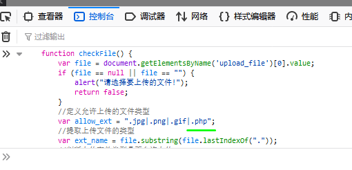
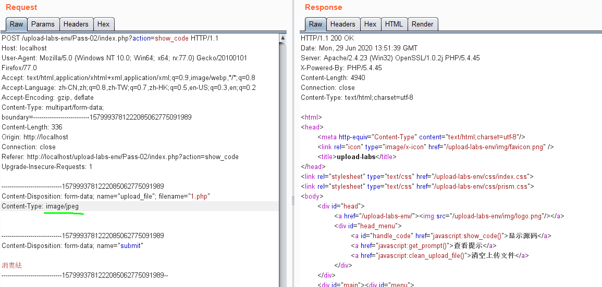
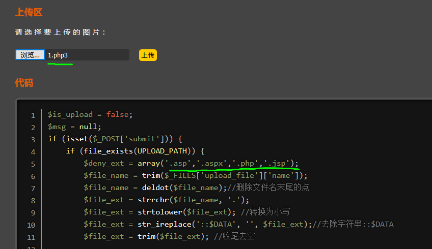

官方README.md：

upload-labs是一个使用php语言编写的，专门收集渗透测试和CTF中遇到的各种上传漏洞的靶场。旨在帮助大家对上传漏洞有一个全面的了解。目前一共20关，每一关都包含着不同上传方式。

本文记录Pass01-04。都是简单的修改后缀、文件类型绕过检测。

<!-- more -->

# Pass01

复制修改前端文件判断js，添加`.php`，控制台再发一次即可：



# Pass02

查看源码只判断文件类型，burpsuite改包`Content-Type`为`image/jpeg`即可：



# Pass03

查看源码过滤了多种php格式，除了`php3`、`phtml`，修改文件后缀即可：



# Pass04

查看源码几乎把所有php格式全过滤了，这里可以先传一个`.htaccess`改变文件扩展名。

.htaccess文件是Apache服务器中的一个配置文件，它负责相关目录下的网页配置.通过htaccess文件，可以实现:网页301重定向、自定义404页面、改变文件扩展名、允许/阻止特定的用户或者目录的访问、禁止目录列表、配置默认文档等功能。

创建一个`.htaccess`将目录下匹配的jpg文件解析为php执行：

``` html
<FilesMatch "jpg">
SetHandler application/x-httpd-php
</FilesMatch>
```

之后上传`.jpg`格式文件即可按照`.php`文件访问。