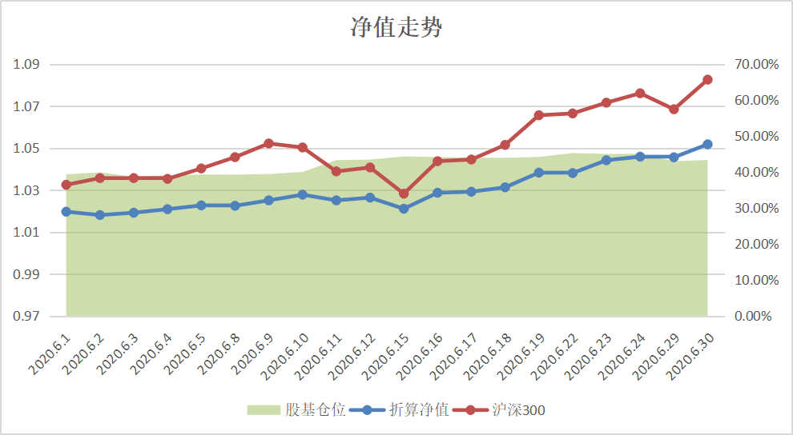
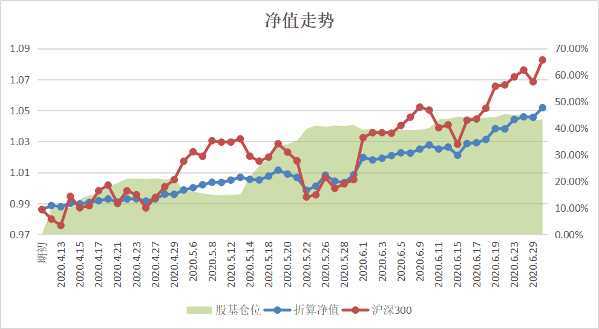
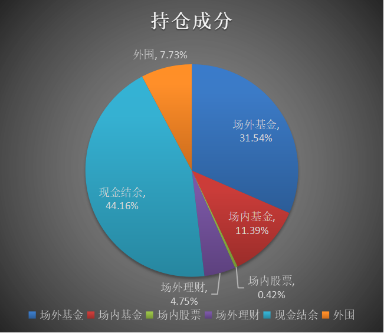
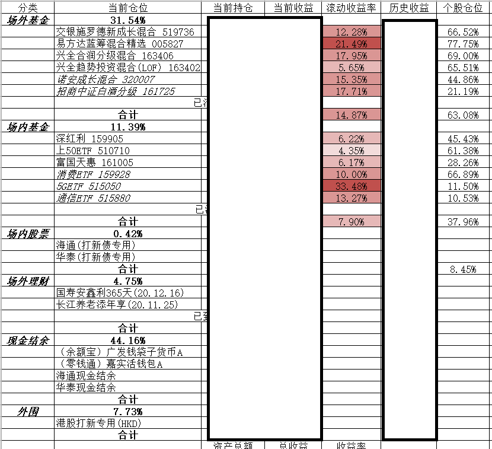
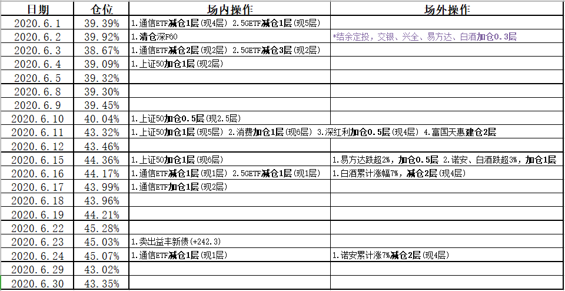

6月份投资记录总结。

本月市场氛围良好，持仓组合运行稳定，除了收入结余转定投，几乎没有操作。

<!-- more -->

# 本月回报

本月股票/基金仓位平均仓位**42.22%**，期末仓位**43.35%**，当月收益率**4.33%**，最大回撤**0.67%**。



本月起加入成立以来收益回报曲线图：



# 持仓情况

当前仓位稳定接近半仓。



详细持仓情况：



**场内暂定(2020.5)：**
1. 轮动运作，底仓2~4层
2. 跌1%/2%/3%买入，单次0.5/1/2层
3. 涨1%/2%/3%卖出，单次0.5/1/2层
4. 早盘尾盘操作，盘中不操作

**场外暂定(2020.6)：**
1. 半仓(50-75%)运作
2. 每跌5%(单日2%/3%)加仓0.5/1/2/3/4层(最多10层)
3. 每涨7%(单日3%/5%)减仓0.5/1/2/3/4层
4. 主动基金长持(1-2年)，行业指数基金涨跌幅轮动
5. 连续无加仓点时单日跌超1%触发结余定投

**最大回撤(2020.5)：**
1. 场内底仓较低，操作灵活，可以接受较大回撤
2. 场外底仓5成，计划按照跌幅加仓4次，最大可接受20%回撤，此时浮亏11.71%

**计划仓位(2020.5)：**
1. 场内股票 上限5%
2. 场内基金 目标15%/上限30%
3. 场外基金 目标30%/上限50%

# 本月操作



本月行情氛围好，科技、芯片、5G、证券等等轮番上涨，一边享受5月高仓位福利，一边适量逐层减仓，踏空不可怕，就怕接盘，没有无限现金流，还是稳点好。

本月场内加入了一只主动基金，朱少醒的富国天惠，考察了一个月，各个角度来看确实好，买入后根本不给加仓机会。

场外除了结余定投，只有在月中有一天踩踏时候按策略对其中几只加仓。另外白酒估值已经到了减仓位了，逐步减仓至目前还剩4层。

本月新债中了两只，上市卖掉了一只，加了一顿鸡腿。还剩一只，应该要下个月上了。

本月港股打新中了一手网易(一手中签率8%)，出掉后算是把手续费和伊登亏损的全都回来了，接下来就随缘打大肉吧，中签当中奖，妖股还是不碰为妙。

# 开支总结

本月收入正常，工资奖金无变化，无额外收入。

本月支出有一项大额支出（显示器），其它日常开销较多（618购置小家电等）。

结余出工资的50%投入资产配置。

# 次月策略

```
5月写的：
其次还可以优化策略，其中的涨跌幅加减仓指标毕竟都是凭感觉来优化的，有想过利用历史数据来回测，模拟出更恰当的指标，但是一方面市场不是能预测出来的，另一方面这些指标的存在本身是否合理都是一个问题，我准备再多学习总结看看。
```

想的挺好，就是太忙，github上star了一个类似的分析项目，根本没空看。而且大家普遍有一种心态，跌的时候才能静下心学习，一涨就浮躁，就学不进去了。这真是一个难克服的人性的弱点啊。

下个月怎么操作没想好，市场也不知道向好还是向坏，但是看着各项统计数据，感觉向好的成分还是要多一点的。目前看不出现大波动的话暂时不动，半仓运作上下都有空间调整仓位。

# 一些感想

如果把指数基金全出掉，都换成主动基金似乎是一个不错的想法。最近我一直在有意降低指数基金的仓位，逐步转到主动基金上，这样可以减少不少操作，更有利于长持，或者说更有利于忘记市场。朱少醒的富国天富，15年15倍，短期从没有哪一次收益爆炸秒天秒地，但是长期来看只有食品饮料指数21倍能跑赢，长持一笔它不香么？投资路漫漫，要学的还很多。