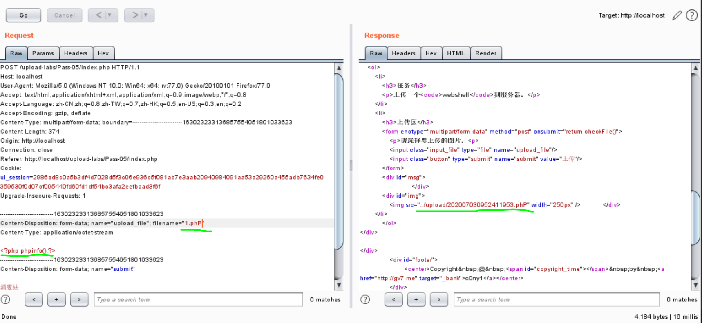
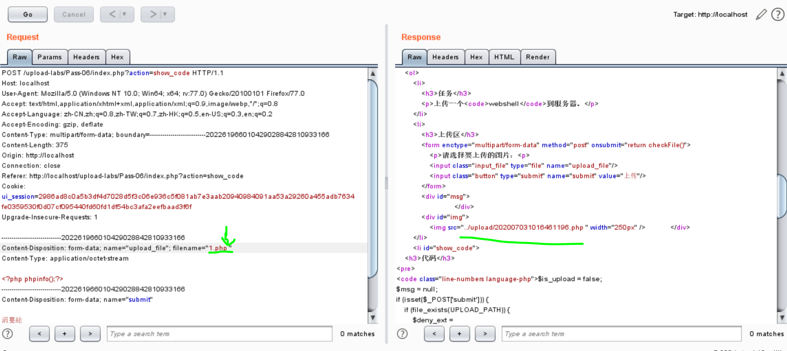
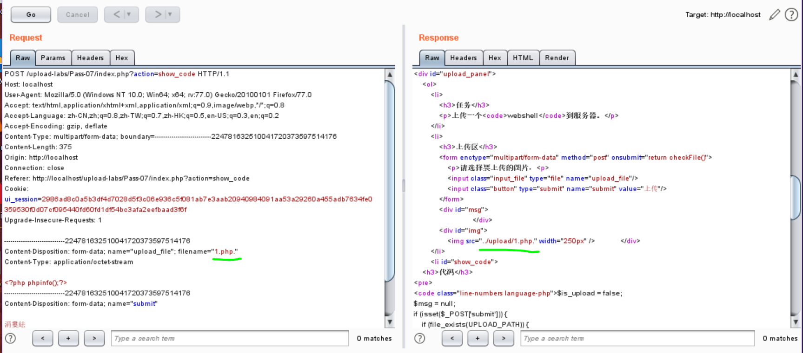
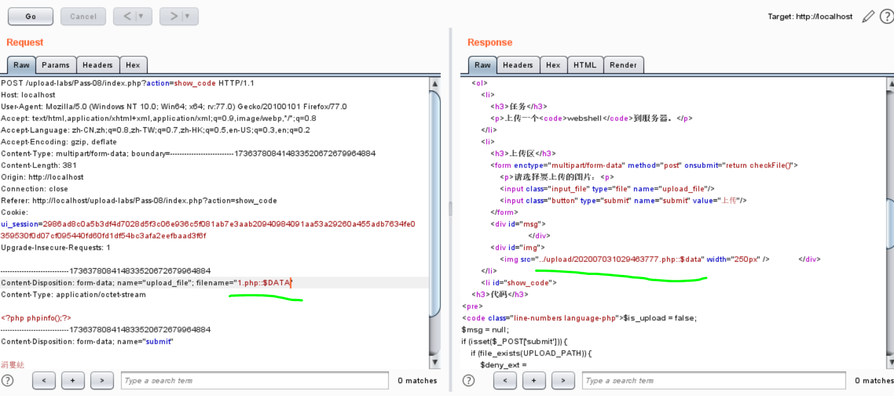
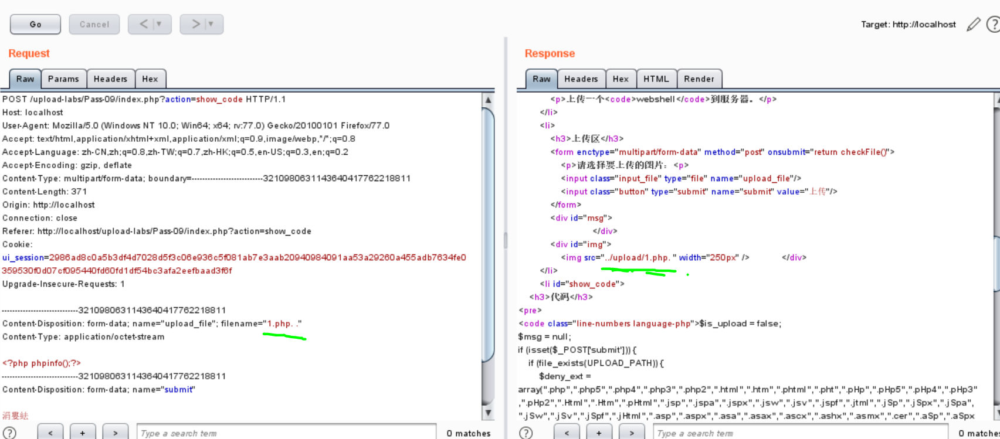
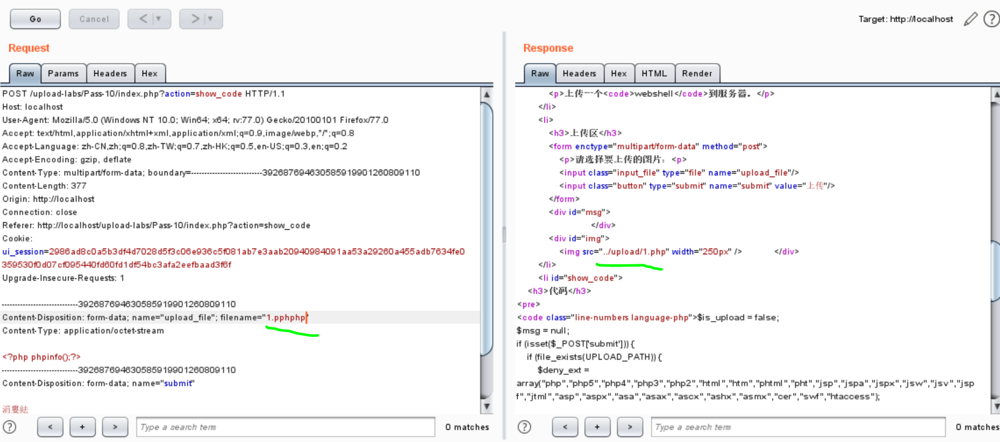
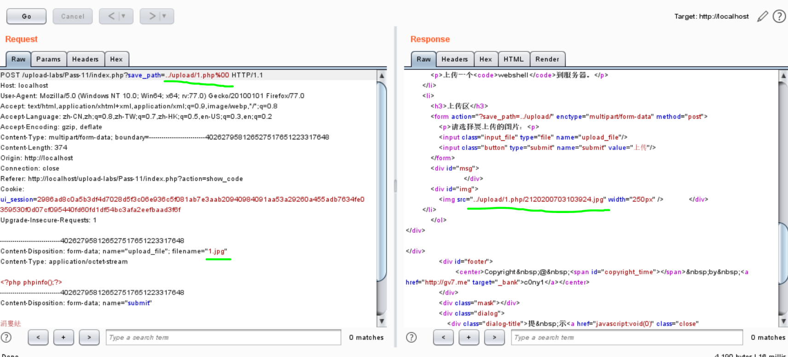
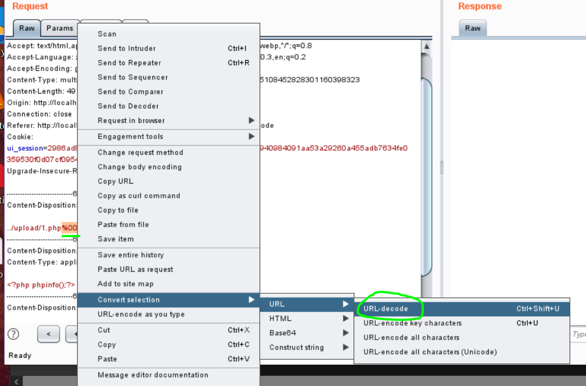
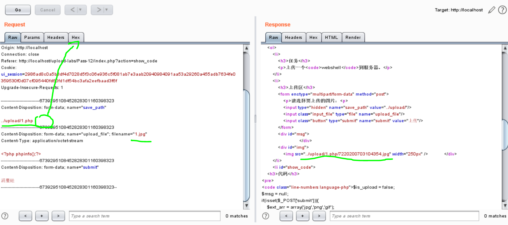

官方README.md：

upload-labs是一个使用php语言编写的，专门收集渗透测试和CTF中遇到的各种上传漏洞的靶场。旨在帮助大家对上传漏洞有一个全面的了解。目前一共20关，每一关都包含着不同上传方式。

本文记录Pass05-12。Pass05-10都是常见的改后缀绕过验证，Pass11-12是两种00截断绕过方式。

<!-- more -->

# Pass05

大小写绕过。`.pHp`、`.Php`、`PHp`啥的都行。

# Pass06

空格绕过，没有对首尾空格过滤，`1.php `即可。

# Pass07

点绕过，没有末尾的点过滤，`1.php.`即可。

# Pass08

`::$DATA`绕过（win），没有对`::$DATA`过滤，`1.php::$DATA`即可。

# Pass09

点空格点过滤，`1.php. .`即可。

# Pass10

双写绕过，`1.phphpp`、`1.pphphp`均可。

# Pass11

GET报文%00截断，修改文件后缀`.jpg`绕过文件后缀检测，修改保存目录为`../upload/1.php%00`，后面加截断使文件保存为`.php`格式。

# Pass12

GET报文0x00截断，修改文件后缀`.jpg`绕过文件后缀检测，修改保存目录为`../upload/1.php%00`，**选中`%00`右键转`URL-Decode`，或者点击`Hex`直接在16进制中修改**，使文件保存为`.php`格式。

