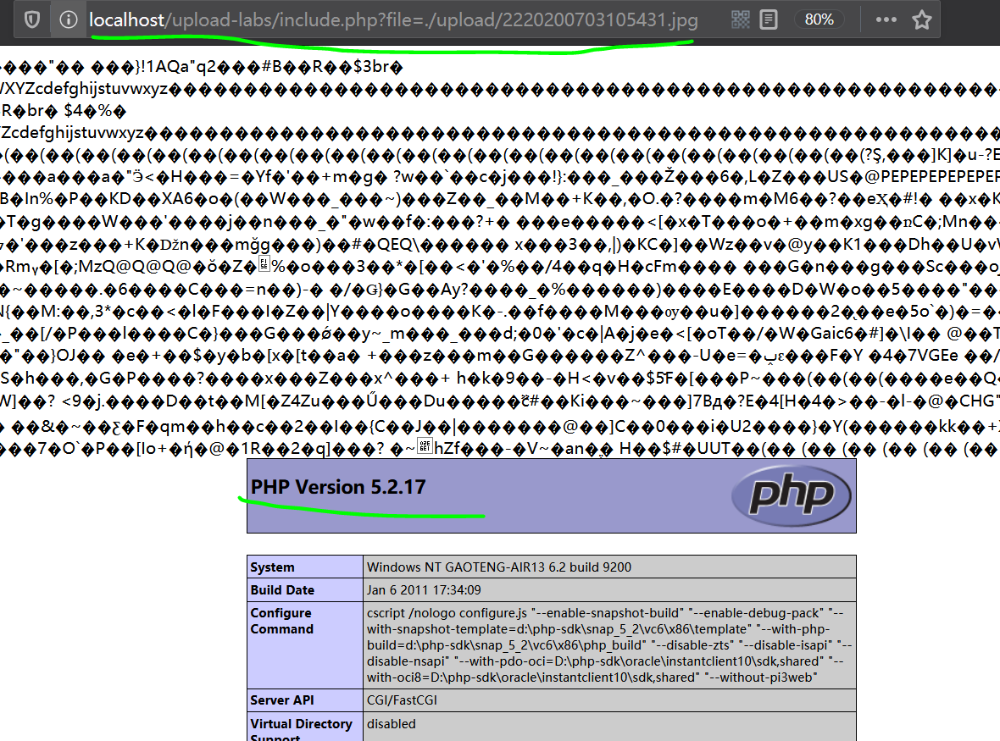
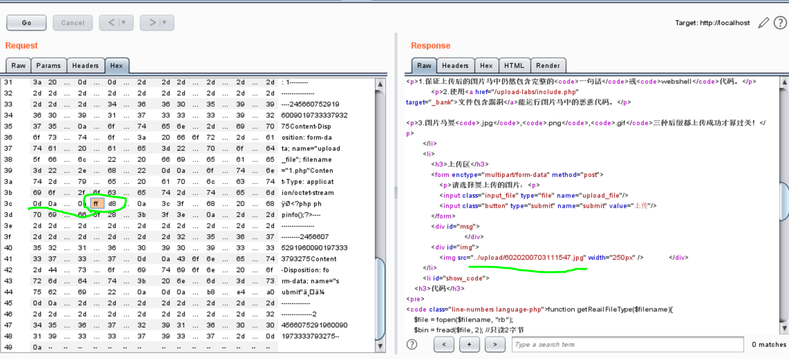
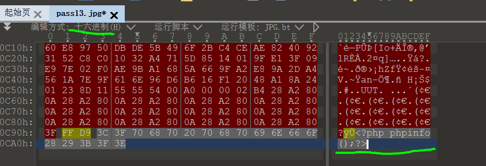

官方README.md：

upload-labs是一个使用php语言编写的，专门收集渗透测试和CTF中遇到的各种上传漏洞的靶场。旨在帮助大家对上传漏洞有一个全面的了解。目前一共20关，每一关都包含着不同上传方式。

本文记录Pass13-16。这四关是图片马专项。

<!-- more -->

# 常见图片文件头

1. JPEG

``` bash
- 文件头标识 (2 bytes): $ff, $d8 (SOI) (JPEG 文件标识) 
- 文件结束标识 (2 bytes): $ff, $d9 (EOI)
```

2. TGA

``` bash
- 未压缩的前5字节    00 00 02 00 00
- RLE压缩的前5字节   00 00 10 00 00
```

3. PNG

``` bash
- 文件头标识 (8 bytes)   89 50 4E 47 0D 0A 1A 0A
```

4. GIF

``` bash
- 文件头标识 (6 bytes)   47 49 46 38 39(37) 61
                        G  I  F  8  9 (7)  a
```

5. BMP

``` bash
- 文件头标识 (2 bytes)   42 4D
                        B  M
```

6. PCX

``` bash
- 文件头标识 (1 bytes)   0A
```

7. TIFF

``` bash
- 文件头标识 (2 bytes)   4D 4D 或 49 49
```

8. ICO

``` bash
- 文件头标识 (8 bytes)   00 00 01 00 01 00 20 20
```

9. CUR

``` bash
- 文件头标识 (8 bytes)   00 00 02 00 01 00 20 20
```

10. IFF

``` bash
- 文件头标识 (4 bytes)   46 4F 52 4D
                        F  O  R  M
```

11. ANI

``` bash
- 文件头标识 (4 bytes)   52 49 46 46
                        R  I  F  F
```

# Pass13

cmd制作图片马：

``` bash
copy 1.jpg/b + 1.php/a pass13.jpg
```

访问`upload-labs/include.php?file=./upload/[new_name].jpg`即可利用文件包含漏洞执行图片中的php文件。



这关是对文件头前两字节进行比对判断文件类型，所以也可以直接上传php文件改文件头前两字节来实现绕过。

这里16进制不太好改，我这样改感觉还行：先在Raw下敲个回车(0d 0a)，再随便输一些字符，位数和要在16进制里改的位数一致，然后切到Hex下直接找(0d 0a)，后面跟着的就是你要修改的内容。

上传php文件，抓包在文件头加`ffd8`，上传成功，可以看到保存成了`.jpg`格式。



`png`、`gif`处理方式类似，不过`gif`文件头是ascii编码，可以直接在Raw里修改。

除了命令行，也可以在010Editor里打开图片，16进制显示，在最后添加文本信息：



# Pass14

本关使用getimagesize()检查是否为图片文件，添加相关位置的信息，或者直接传Pass13的图片马即可。

# Pass15

本关需要开启php_exif模块：

``` php
1.在php.ini文件中找到;extension=php_exif.dll，去掉前面的分号

2.在php.ini文件中找到;extension=php_mbstring.dll，去掉前面的分号，并将此行移动到extension=php_exif.dll之前，使之首先加载*。

3.找到[exif]段，把下面语句的分号去掉。
;exif.encode_unicode = ISO-8859-15
;exif.decode_unicode_motorola = UCS-2BE
;exif.decode_unicode_intel = UCS-2LE
;exif.encode_jis =
;exif.decode_jis_motorola = JIS
;exif.decode_jis_intel = JIS
```

本关使用exif_imagetype()检查是否为图片文件，添加相关位置的信息，或者直接传Pass13的图片马即可。

# Pass16

本关重新渲染了图片，依靠前面的图片马不好使了。

太难了，还是转几个博主的write-up好了：

[付杰博客 - Upload-Labs第Pass-16通关（二次渲染绕过） 详解](https://www.fujieace.com/penetration-test/upload-labs-pass-16.html)

[LandGrey - Upload-labs所有WriteUp ](https://github.com/LandGrey/upload-labs-writeup/)

核心思想是将一个正常显示的图片，上传到服务器。寻找图片被渲染后与原始图片部分对比仍然相同的数据块部分，将Webshell代码插在该部分，然后上传。

具体实现需要自己编写Python程序，人工尝试基本是不可能构造出能绕过渲染函数的图片webshell的。